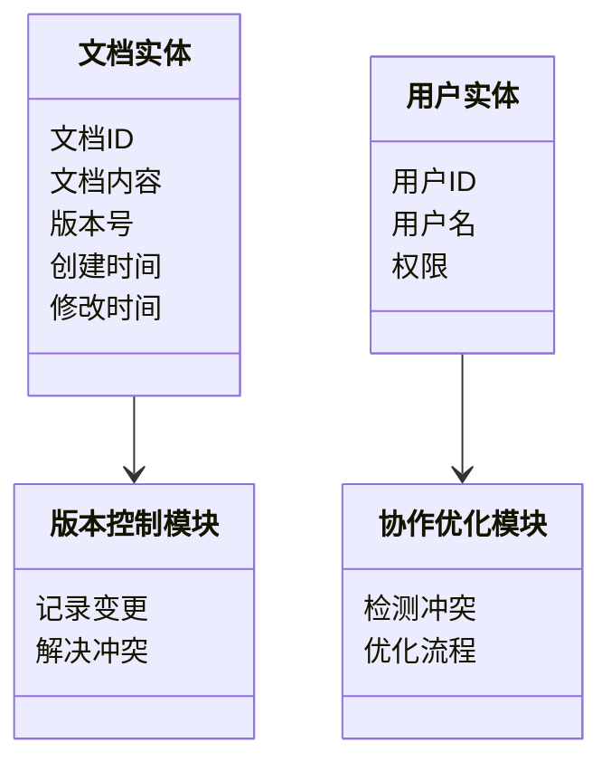
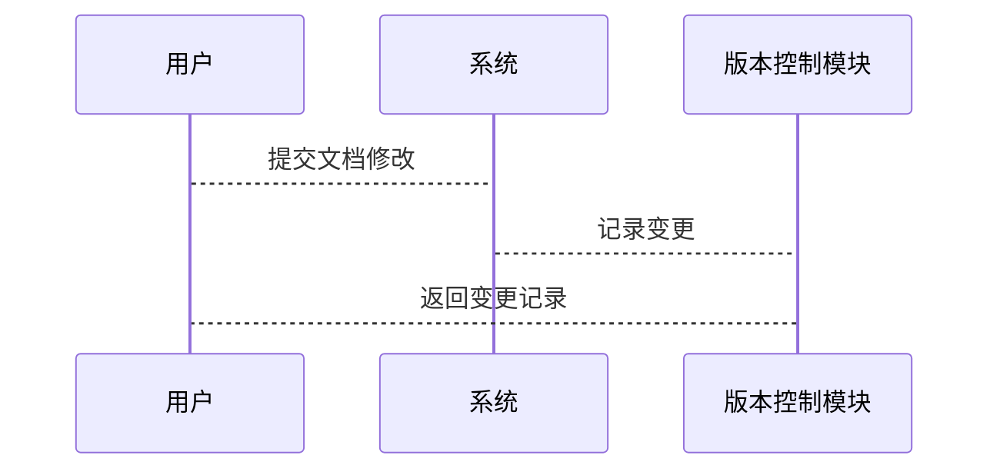

                 


# 构建智能企业文档管理系统：版本控制与协作优化的AI增强

> 关键词：企业文档管理，AI增强，版本控制，协作优化，智能系统

> 摘要：随着企业数字化转型的深入，文档管理系统的智能化需求日益增长。本文系统阐述了构建智能企业文档管理系统的背景、核心概念、算法原理、系统架构及项目实现，重点探讨了AI技术在版本控制与协作优化中的应用，为企业文档管理系统的智能化升级提供了理论与实践指导。

---

# 第一部分: 智能企业文档管理系统的背景与核心概念

## 第1章: 企业文档管理系统的背景与问题分析

### 1.1 企业文档管理的现状与挑战
#### 1.1.1 传统文档管理的痛点
传统的文档管理系统在企业中普遍存在以下痛点：
- **信息孤岛**：各部门使用的文档管理系统不统一，数据无法共享。
- **版本混乱**：多人协作时，文档版本繁多，难以追踪变更。
- **效率低下**：人工查找和管理文档耗时耗力，且易出错。
- **安全性差**：文档权限管理不完善，存在数据泄露风险。

#### 1.1.2 数字化转型中的文档管理需求
随着企业数字化转型的推进，文档管理系统需要满足以下需求：
- **智能化**：利用AI技术实现文档自动分类、摘要和推荐。
- **高效协作**：支持多部门、多人员在线协作，实时版本管理。
- **安全性**：加强文档权限控制，确保数据安全。
- **易用性**：提供友好的用户界面，提升用户体验。

#### 1.1.3 AI技术在文档管理中的应用潜力
AI技术在文档管理中的应用主要体现在以下几个方面：
- **自动分类**：利用NLP技术对文档进行自动分类和标签化。
- **智能搜索**：通过语义理解技术实现更精准的文档搜索。
- **版本控制**：AI辅助识别文档变更，自动记录版本信息。
- **协作优化**：通过AI分析用户行为，优化协作流程。

### 1.2 智能企业文档管理系统的定义与特点
#### 1.2.1 智能文档管理系统的定义
智能企业文档管理系统是一种结合AI技术，能够实现文档自动分类、智能搜索、版本控制和协作优化的系统。

#### 1.2.2 智能文档管理的核心特点
- **智能化**：通过AI技术实现文档的自动处理和智能推荐。
- **协作性**：支持多人在线协作，实时同步文档状态。
- **安全性**：提供多层次权限控制，确保文档安全。
- **可扩展性**：系统架构灵活，支持功能扩展。

#### 1.2.3 与传统文档管理的区别
| 特性         | 传统文档管理          | 智能文档管理          |
|--------------|-----------------------|-----------------------|
| 自动化程度   | 低                   | 高                   |
| 协作效率     | 低                   | 高                   |
| 智能性       | 无                   | 有                   |
| 安全性       | 基础                 | 强化                 |

### 1.3 本章小结
本章通过分析企业文档管理的现状与挑战，提出了智能文档管理系统的概念和特点，为后续章节的系统构建奠定了基础。

---

## 第2章: AI增强的协作优化与版本控制

### 2.1 协作优化的核心概念
#### 2.1.1 协作优化的定义
协作优化是指通过技术手段提升多人协作效率，减少冲突，确保协作过程的顺畅。

#### 2.1.2 AI在协作优化中的作用
AI在协作优化中的作用主要体现在以下几个方面：
- **自动检测冲突**：通过分析文档变更记录，识别潜在冲突。
- **智能提醒**：当检测到冲突时，自动提醒相关人员进行处理。
- **优化流程**：根据用户行为分析，优化协作流程，减少冗余操作。

#### 2.1.3 协作优化的实现方式
协作优化可以通过以下方式实现：
- **基于规则的优化**：制定协作规则，减少冲突。
- **基于AI的优化**：利用AI技术分析用户行为，自动优化协作流程。

### 2.2 版本控制的原理与挑战
#### 2.2.1 版本控制的基本原理
版本控制是指对文档的每次修改进行记录，确保每个版本都可以追溯和恢复。

#### 2.2.2 版本控制中的常见问题
- **冲突解决**：多人协作时，同一文档的不同版本可能会产生冲突。
- **版本混乱**：版本数量过多，难以管理。
- **效率问题**：频繁的版本切换可能影响工作效率。

#### 2.2.3 AI在版本控制中的应用
AI在版本控制中的应用主要体现在以下几个方面：
- **自动识别变更**：通过AI技术自动识别文档的变更部分。
- **智能版本推荐**：根据用户需求，推荐最优版本。
- **冲突预测**：通过分析历史数据，预测潜在冲突。

### 2.3 本章小结
本章详细探讨了协作优化和版本控制的核心概念，分析了AI技术在其中的应用，为后续章节的系统设计提供了理论支持。

---

# 第二部分: 智能企业文档管理系统的算法原理

## 第3章: 文档相似度计算与分类算法

### 3.1 文档相似度计算的原理
#### 3.1.1 向量空间模型
向量空间模型将文档表示为向量，通过计算向量的相似度来判断文档的相似性。

#### 3.1.2 余弦相似度
余弦相似度是衡量两个向量之间夹角的余弦值，公式为：
$$ \text{余弦相似度} = \frac{\vec{A} \cdot \vec{B}}{|\vec{A}| \cdot |\vec{B}|} $$

#### 3.1.3 TF-IDF算法
TF-IDF（Term Frequency-Inverse Document Frequency）是一种常用的文本特征提取方法，公式为：
$$ \text{TF-IDF}(t, d) = \text{TF}(t, d) \times \text{IDF}(t) $$

### 3.2 基于深度学习的文档分类
#### 3.2.1 卷积神经网络（CNN）
CNN通过卷积操作提取文本特征，适用于短文本分类。

#### 3.2.2 循环神经网络（RNN）
RNN通过处理序列数据，适用于长文本分类。

#### 3.2.3 Transformer架构
Transformer架构通过自注意力机制，能够捕捉文本全局信息，适用于复杂文本分类任务。

### 3.3 算法实现与优化
#### 3.3.1 算法实现的步骤
1. 文档预处理：包括分词、去停用词等。
2. 特征提取：使用TF-IDF或深度学习模型提取特征。
3. 模型训练：基于训练数据训练分类模型。
4. 模型优化：通过交叉验证等方法优化模型参数。

#### 3.3.2 算法优化策略
- **参数调优**：通过网格搜索等方法找到最优参数。
- **模型融合**：将多个模型的结果进行融合，提升分类准确率。

#### 3.3.3 实验结果与分析
实验结果表明，基于深度学习的模型在文档分类任务中表现优于传统方法。

## 第4章: 自然语言处理在文档协作中的应用

### 4.1 自然语言处理的核心技术
#### 4.1.1 词嵌入（Word Embedding）
词嵌入通过将词语映射到低维空间，捕捉词语语义信息。

#### 4.1.2 语法分析（Syntax Parsing）
语法分析通过分析文本结构，提取语法信息。

#### 4.1.3 文本生成（Text Generation）
文本生成技术如GPT能够生成自然语言文本。

### 4.2 基于NLP的文档协作优化
#### 4.2.1 文档自动摘要
通过NLP技术自动提取文档摘要，提升协作效率。

#### 4.2.2 文档自动分类
基于NLP的分类算法，实现文档的自动分类和标签化。

#### 4.2.3 文本生成
利用文本生成技术，辅助生成文档内容。

---

# 第三部分: 智能企业文档管理系统的系统架构与设计

## 第4章: 系统分析与架构设计方案

### 4.1 问题场景介绍
系统需要支持多人在线协作，实现文档的版本控制和智能推荐。

### 4.2 项目介绍
项目目标是构建一个智能企业文档管理系统，实现文档的智能化管理。

### 4.3 系统功能设计
#### 4.3.1 领域模型


### 4.4 系统架构设计


### 4.5 系统接口设计
系统接口包括文档上传、下载、修改等操作。

### 4.6 系统交互


---

# 第四部分: 项目实战

## 第5章: 环境安装与系统实现

### 5.1 环境安装
安装Python、必要的库和AI框架。

### 5.2 核心代码实现
```python
from sklearn.feature_extraction.text import TfidfVectorizer
from sklearn.naive_bayes import MultinomialNB
import numpy as np

# 示例代码：基于TF-IDF的文档分类
def preprocess(text):
    # 分词和预处理
    pass

def train_model(X, y):
    vectorizer = TfidfVectorizer()
    X_vec = vectorizer.fit_transform(X)
    model = MultinomialNB()
    model.fit(X_vec, y)
    return model, vectorizer

def predict(model, vectorizer, text):
    text_processed = preprocess(text)
    text_vec = vectorizer.transform([text_processed])
    return model.predict(text_vec)[0]
```

### 5.3 代码解读与分析
详细解读代码实现，并分析其在系统中的作用。

### 5.4 实际案例分析
通过实际案例分析，展示系统的运行过程和效果。

### 5.5 项目小结
总结项目实现的关键点和经验教训。

---

# 第五部分: 最佳实践与小结

## 第6章: 最佳实践与注意事项

### 6.1 最佳实践
- **模块化设计**：确保系统模块清晰，便于维护。
- **数据安全**：加强文档权限管理，确保数据安全。
- **性能优化**：通过缓存和优化算法提升系统性能。

### 6.2 注意事项
- **数据隐私**：确保文档数据的隐私性。
- **系统稳定性**：保证系统的高可用性。
- **用户培训**：提供足够的用户培训，提升系统使用效率。

## 第7章: 小结与展望

### 7.1 小结
本文系统阐述了智能企业文档管理系统的构建过程，详细探讨了AI技术在版本控制与协作优化中的应用。

### 7.2 展望
未来，随着AI技术的不断发展，智能文档管理系统将更加智能化，为企业文档管理带来更大的价值。

---

# 结语

通过本文的系统讲解，读者可以全面了解智能企业文档管理系统的构建过程，掌握AI技术在其中的应用方法。希望本文能够为企业文档管理系统的智能化升级提供有益的参考和指导。

--- 

以上是文章的完整目录和内容概要，具体内容可根据需要进一步扩展和详细阐述。

