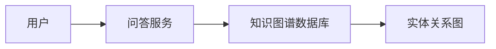

                 


# 构建智能企业知识管理平台：动态知识图谱与智能问答系统

## 关键词：
智能知识管理、动态知识图谱、智能问答系统、企业信息化、自然语言处理

## 摘要：
本文将深入探讨如何构建智能企业知识管理平台，重点分析动态知识图谱与智能问答系统的结合与实现。通过系统化的背景介绍、核心概念解析、算法原理阐述、系统架构设计、项目实战指导以及最佳实践总结，为读者提供一个全面的技术视角，帮助企业在信息化建设中实现高效的知识管理与智能问答功能。

---

# 第1章: 知识管理平台的背景与需求

## 1.1 企业知识管理的重要性
企业知识管理是提升企业竞争力的关键因素之一，它涵盖了企业内部知识的采集、整理、存储、共享与应用。通过有效的知识管理，企业可以快速响应市场需求，优化决策流程，提升员工效率。

### 1.1.1 知识管理的核心目标
- **知识资产化**：将隐性知识显性化，形成可复用的知识资产。
- **知识共享化**：打破信息孤岛，实现跨部门的知识共享。
- **知识动态化**：实时更新知识库，确保信息的准确性和时效性。

### 1.1.2 动态知识图谱与智能问答系统的优势
动态知识图谱能够实时更新知识库，而智能问答系统则能够通过自然语言处理技术，快速响应用户的复杂查询，提升用户体验。

## 1.2 问题背景与需求分析
传统的知识管理平台存在以下问题：
- 知识孤岛现象严重，部门间信息难以共享。
- 知识更新不及时，难以应对快速变化的业务需求。
- 问答系统功能单一，无法支持复杂语义的理解。

### 1.2.1 动态知识图谱的需求场景
- **实时更新**：支持知识库的动态更新，确保信息的准确性。
- **多源异构数据整合**：能够处理来自不同数据源的结构化、半结构化和非结构化数据。

### 1.2.2 智能问答系统的应用价值
- **提升用户体验**：通过自然语言处理技术，提供更智能化的问答服务。
- **降低沟通成本**：自动化回答常见问题，减少人工干预。

## 1.3 问题解决与边界
### 1.3.1 动态知识图谱的构建方法
- **知识抽取**：从文本中提取实体、关系和属性。
- **知识存储**：使用图数据库存储实体关系，支持动态更新。

### 1.3.2 智能问答系统的实现路径
- **需求分析**：明确用户需求，设计问答系统功能。
- **算法选择**：选择合适的自然语言处理算法，如BERT、GPT等。

## 1.4 核心概念与组成要素
### 1.4.1 知识图谱的核心要素
- 实体：知识图谱中的基本单元，代表具体的人、事、物。
- 关系：描述实体之间的联系，如“属于”、“构成”等。
- 属性：描述实体的特征，如“名称”、“类型”等。

### 1.4.2 智能问答系统的关键组件
- **自然语言理解（NLU）**：理解用户的问题意图。
- **知识库查询**：基于用户问题在知识库中进行检索。
- **答案生成**：根据检索结果生成自然语言答案。

### 1.4.3 平台的整体架构组成
- **数据层**：包括知识图谱数据库和问答系统数据库。
- **服务层**：包括知识抽取、关系抽取、问答服务等功能。
- **应用层**：提供用户界面，实现与用户的交互。

---

# 第2章: 动态知识图谱的原理与实现

## 2.1 知识图谱的构建原理
### 2.1.1 知识抽取与表示
- **分词**：将文本分割成词语。
- **实体识别**：识别文本中的实体，如“张三”、“公司”等。
- **关系抽取**：识别实体之间的关系，如“张三是公司的CEO”。

### 2.1.2 实体识别与关系抽取
- **实体识别**：使用命名实体识别（NER）技术，识别文本中的实体。
- **关系抽取**：通过模式匹配或深度学习模型，识别实体之间的关系。

### 2.1.3 知识图谱的动态更新机制
- **增量更新**：当新增数据时，只更新新增部分。
- **全量更新**：定期对整个知识图谱进行更新。

## 2.2 动态知识图谱的属性特征对比
### 2.2.1 静态知识图谱与动态知识图谱的对比
| 属性 | 静态知识图谱 | 动态知识图谱 |
|------|-------------|-------------|
| 数据更新 | 一次性构建 | 支持实时更新 |
| 适用场景 | 数据稳定 | 数据动态变化 |

### 2.2.2 动态知识图谱的更新频率与触发条件
- **更新频率**：可以根据业务需求设置 hourly/daily/weekly 更新。
- **触发条件**：当数据发生变化时，自动触发更新。

### 2.2.3 动态知识图谱的存储与管理特点
- **图数据库**：使用图数据库（如Neo4j）存储实体关系。
- **版本控制**：支持知识图谱的版本管理，便于回溯和恢复。

## 2.3 实体关系图的 Mermaid 架构


---

# 第3章: 智能问答系统的算法原理

## 3.1 智能问答系统的算法流程
### 3.1.1 基于规则的问答系统
- **规则匹配**：根据预设的规则匹配用户问题，返回对应答案。

### 3.1.2 基于检索的问答系统
- **向量空间模型**：将用户问题和候选答案映射到向量空间，计算相似度。

### 3.1.3 基于生成的问答系统
- **序列到序列模型**：使用生成模型（如Transformer）生成答案。

## 3.2 算法实现的数学模型
### 3.2.1 基于向量空间模型的相似度计算
$$ \text{相似度} = \frac{\vec{q} \cdot \vec{a}}{|\vec{q}| \cdot |\vec{a}|} $$

### 3.2.2 基于概率的问答模型
$$ P(\text{答案}|Q) = \prod_{i=1}^{n} P(w_i|\text{上下文}) $$

---

# 第4章: 系统架构与设计方案

## 4.1 系统架构设计
### 4.1.1 系统功能模块
- **知识抽取模块**：从文本中提取实体、关系和属性。
- **知识存储模块**：存储知识图谱数据。
- **问答服务模块**：处理用户查询并返回答案。

### 4.1.2 系统架构图


## 4.2 系统功能设计
### 4.2.1 知识抽取与管理
- **文本预处理**：包括分词、去停用词等。
- **知识存储**：使用图数据库存储实体关系。

### 4.2.2 问答服务实现
- **问题解析**：解析用户问题，提取关键词。
- **知识检索**：在知识图谱中检索相关答案。
- **结果生成**：根据检索结果生成自然语言回答。

---

# 第5章: 项目实战与案例分析

## 5.1 环境安装与配置
### 5.1.1 安装Python环境
```bash
python -m pip install --upgrade pip
pip install neo4j
pip install transformers
```

## 5.2 核心代码实现
### 5.2.1 知识抽取代码
```python
from transformers import pipeline

ner = pipeline("ner")
text = "张三是公司的CEO"
result = ner(text)
```

### 5.2.2 问答系统代码
```python
from transformers import pipeline

qa = pipeline("question-answering")
context = "张三是公司的CEO"
question = "谁是公司的CEO?"
result = qa(question=question, context=context)
```

## 5.3 案例分析与解读
### 5.3.1 实际应用场景
- **企业内部问答**：员工可以通过问答系统快速获取公司相关信息。
- **客户服务**：客户可以通过问答系统获取产品信息和解决方案。

## 5.4 项目小结
通过本章的实战，读者可以了解如何在实际项目中应用动态知识图谱与智能问答系统，提升企业的知识管理水平。

---

# 第6章: 最佳实践与总结

## 6.1 最佳实践 tips
### 6.1.1 知识图谱的构建
- 定期更新知识图谱，确保数据的准确性。
- 使用高效的图数据库，提升查询效率。

### 6.1.2 问答系统的优化
- 提高自然语言处理模型的准确率。
- 优化问答系统的响应速度。

## 6.2 小结
本文详细介绍了智能企业知识管理平台的构建过程，从动态知识图谱的构建到智能问答系统的实现，为读者提供了系统化的解决方案。

## 6.3 注意事项
- 确保数据的安全性，防止数据泄露。
- 定期维护系统，确保其稳定运行。

## 6.4 拓展阅读
- 推荐阅读《图数据挖掘与知识图谱》、《自然语言处理实战》等相关书籍，深入理解知识图谱和问答系统的实现细节。

---

通过本文的学习，读者可以掌握智能企业知识管理平台的核心技术，为企业信息化建设提供有力支持。

