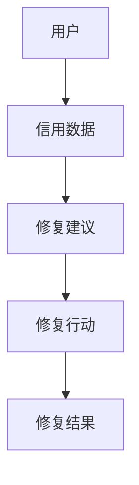
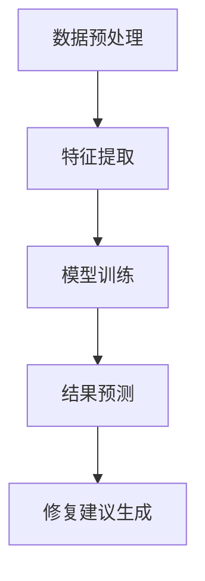
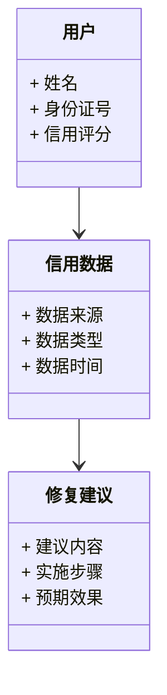

                 


# 构建智能化的个人信用修复助手系统

## 关键词：个人信用修复、人工智能、系统架构、算法原理、数据安全

## 摘要：  
在数字化时代，个人信用修复已成为一项重要的任务。本文从背景、核心概念、算法原理到系统架构、项目实战等方面，全面解析如何构建一个智能化的个人信用修复助手系统。通过结合机器学习、深度学习等技术，提出了一套高效的解决方案，并给出了实际案例分析和代码实现。文章最后总结了最佳实践和注意事项，为读者提供实用的指导。

---

# 第一部分: 背景与核心概念

## 第1章: 个人信用修复的背景与问题

### 1.1 信用修复的背景介绍

#### 1.1.1 信用体系的重要性  
信用体系是现代社会经济活动的基础，直接影响个人和企业的融资能力、交易信任度以及社会认可度。随着数字经济的快速发展，信用记录的重要性日益凸显。

#### 1.1.2 个人信用修复的必要性  
由于经济波动、个人失误或恶意行为，许多人可能会出现信用污点。修复信用记录不仅是个人经济活动的需要，也是维护个人声誉的重要手段。

#### 1.1.3 数字化时代的信用修复挑战  
在数字化时代，信用数据的复杂性和多样性增加，传统的信用修复方法已难以满足需求。智能化的信用修复助手系统能够通过大数据分析和人工智能技术，帮助用户快速、精准地修复信用记录。

---

### 1.2 个人信用修复的问题描述

#### 1.2.1 传统信用修复的痛点  
传统信用修复过程繁琐、效率低，且缺乏个性化建议。用户往往需要手动查询信用报告、分析问题原因、制定修复计划，耗时且难以保证效果。

#### 1.2.2 智能化信用修复的需求  
智能化信用修复助手能够通过自动化分析、个性化建议和实时监控，帮助用户高效解决问题，同时降低人为错误的风险。

#### 1.2.3 信用修复中的关键问题  
- 数据来源多样且复杂，需要整合和分析。  
- 需要精准的信用评估模型。  
- 如何确保数据安全和隐私保护。

---

### 1.3 智能化信用修复助手的解决方案

#### 1.3.1 问题解决思路  
通过大数据分析和人工智能技术，构建一个智能化的信用修复助手系统，实现信用数据的自动采集、分析和修复建议的自动生成。

#### 1.3.2 边界与外延  
系统边界包括信用数据的采集、分析和修复建议的生成；外延则涉及信用修复的实际执行和效果监控。

#### 1.3.3 核心要素组成  
- 数据采集模块：从多个数据源获取信用信息。  
- 数据分析模块：利用机器学习算法进行信用评估。  
- 修复建议模块：基于分析结果生成个性化修复方案。  
- 实时监控模块：跟踪修复进展并提供反馈。

---

## 第2章: 个人信用修复助手的核心概念

### 2.1 系统架构原理

#### 2.1.1 系统整体架构  
系统采用模块化设计，主要包括数据采集模块、数据分析模块、修复建议模块和实时监控模块。

#### 2.1.2 各模块功能概述  
- 数据采集模块：负责从多个数据源（如银行、信用 bureau）获取信用数据。  
- 数据分析模块：利用机器学习算法对信用数据进行评估。  
- 修复建议模块：基于分析结果生成修复建议。  
- 实时监控模块：跟踪修复进展并提供反馈。

#### 2.1.3 系统的核心要素  
- 数据来源的多样性与准确性。  
- 算法的高效性和准确性。  
- 修复建议的个性化与可操作性。

---

### 2.2 核心概念对比表

#### 2.2.1 数据源对比  
| 数据源类型 | 描述 | 优缺点 |  
|------------|------|--------|  
| 银行数据 | 用户的信贷记录 | 数据全面，但可能不完整 |  
| 信用 bureau 数据 | 第三方信用报告 | 数据权威，但获取成本高 |  
| 社交数据 | 社交平台上的信用行为 | 数据丰富，但难以量化 |

#### 2.2.2 算法对比  
| 算法类型 | 描述 | 适用场景 |  
|----------|------|----------|  
| 机器学习 | 基于历史数据训练模型 | 信用评估与预测 |  
| 深度学习 | 基于神经网络的非线性建模 | 复杂信用行为分析 |  
| 决策树 | 基于特征的树状决策 | 个性化修复建议 |

#### 2.2.3 系统性能对比  
| 系统性能指标 | 描述 | 对比结果 |  
|--------------|------|----------|  
| 响应时间 | 系统处理单个请求的时间 | 智能化系统 < 传统系统 |  
| 准确率 | 系统修复建议的准确性 | 智能化系统 > 传统系统 |  
| 可扩展性 | 系统处理数据量的能力 | 智能化系统 > 传统系统 |

---

### 2.3 实体关系图



---

# 第二部分: 算法原理与数学模型

## 第3章: 信用评估与修复算法

### 3.1 信用评估模型

#### 3.1.1 机器学习模型  
- 线性回归：用于预测信用评分。  
- 支持向量机（SVM）：用于分类信用风险。  

#### 3.1.2 深度学习模型  
- 神经网络：用于复杂信用行为的建模。  
- 长短期记忆网络（LSTM）：用于时间序列信用数据的分析。  

#### 3.1.3 混合模型  
- 集成学习：通过组合多种算法提升模型性能。  

---

### 3.2 算法流程图



---

### 3.3 数学模型与公式

#### 3.3.1 线性回归模型  
$$ y = \beta_0 + \beta_1x + \epsilon $$  

#### 3.3.2 逻辑回归模型  
$$ P(y=1|x) = \frac{1}{1 + e^{-\beta x}} $$  

#### 3.3.3 决策树模型  
$$ entropy = -\sum p_i \log p_i $$  

---

## 第4章: 系统分析与架构设计

### 4.1 系统功能设计

#### 4.1.1 数据采集模块  
- 从多个数据源获取信用数据。  
- 数据清洗和预处理。  

#### 4.1.2 特征提取模块  
- 从信用数据中提取关键特征。  
- 特征工程优化。  

#### 4.1.3 模型训练模块  
- 使用机器学习算法训练信用评估模型。  
- 模型优化与调参。  

#### 4.1.4 修复建议模块  
- 根据模型预测结果生成修复建议。  
- 提供个性化修复方案。  

---

### 4.2 系统架构设计

#### 4.2.1 系统整体架构  


#### 4.2.2 系统功能模块类图  


---

## 第5章: 项目实战与代码实现

### 5.1 环境安装

#### 5.1.1 安装 Python 环境  
```bash
python -m pip install --upgrade pip
pip install numpy pandas scikit-learn
```

#### 5.1.2 安装 Jupyter Notebook  
```bash
pip install jupyter
jupyter notebook
```

---

### 5.2 系统核心实现源代码

#### 5.2.1 数据采集模块  
```python
import pandas as pd
import numpy as np

# 数据来源：银行数据
bank_data = pd.read_csv('bank.csv')
# 数据来源：信用 bureau 数据
bureau_data = pd.read_csv('bureau.csv')
# 数据清洗
bank_data.dropna(inplace=True)
bureau_data.dropna(inplace=True)
```

#### 5.2.2 特征提取模块  
```python
from sklearn.feature_extraction import DictVectorizer

# 特征提取
features = bank_data[['income', 'loan_amount', 'credit_score']].to_dict('records')
vectorizer = DictVectorizer()
X = vectorizer.fit_transform(features)
```

#### 5.2.3 模型训练模块  
```python
from sklearn.linear_model import LinearRegression

model = LinearRegression()
model.fit(X, y)
```

#### 5.2.4 修复建议模块  
```python
# 生成修复建议
def generate_recommendations(score):
    if score < 500:
        return "建议提高信用评分"
    else:
        return "信用评分良好，无需修复"
```

---

## 第6章: 最佳实践与小结

### 6.1 最佳实践

#### 6.1.1 数据安全与隐私保护  
- 使用加密技术保护用户数据。  
- 遵守数据隐私法规（如GDPR）。  

#### 6.1.2 系统性能优化  
- 使用分布式计算提升数据处理效率。  
- 优化算法模型降低计算成本。  

#### 6.1.3 持续改进  
- 定期更新模型参数。  
- 收集用户反馈优化系统功能。  

---

### 6.2 小结与展望

本文详细介绍了如何构建智能化的个人信用修复助手系统，从背景、核心概念到算法原理、系统架构，再到项目实战，全面解析了系统的构建过程。未来，随着人工智能技术的不断发展，信用修复助手系统将更加智能化和个性化，为用户提供更高效、更精准的服务。

---

### 6.3 注意事项

- 在实际应用中，需注意数据的准确性和完整性。  
- 系统上线前需进行充分的测试和验证。  
- 确保系统的可扩展性和可维护性。  

---

### 6.4 拓展阅读

- 《机器学习实战》  
- 《深度学习入门：基于Python和Keras》  
- 《系统架构设计：复杂系统的构建与管理》  

---

# 结语

通过本文的分析和讲解，读者可以深入了解智能化个人信用修复助手系统的构建过程，并掌握其实现的关键技术。希望本文能为相关领域的从业者提供有价值的参考和启发。

