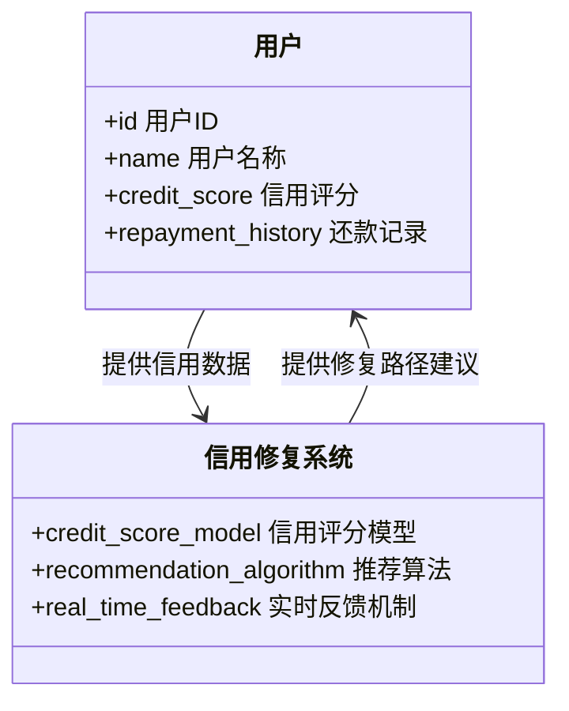
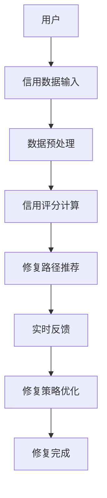
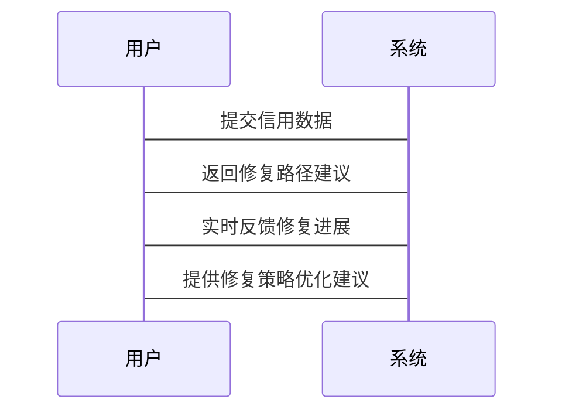

                 


# 构建智能化的个人信用修复路径规划系统

> 关键词：个人信用修复，智能化，路径规划，人工智能，大数据，系统架构

> 摘要：本文详细探讨了构建智能化个人信用修复路径规划系统的背景、核心概念、算法原理、系统架构、项目实战及总结。通过系统化的分析与设计，结合实际案例，为读者提供了一套完整的解决方案。从理论到实践，层层递进，旨在帮助个人高效修复信用，优化信用评估与管理流程。

---

# 第一部分: 背景与核心概念

## 第1章: 个人信用修复的背景与挑战

### 1.1 个人信用修复的重要性

#### 1.1.1 信用修复的定义与内涵
信用修复是指通过调整个人的信用行为，改善信用记录，提升信用评分，从而恢复或增强个人信用能力的过程。

#### 1.1.2 当前社会信用体系的现状
- 信用评分在金融、消费、就业等领域的重要性日益增加。
- 个人信用记录直接影响个人的贷款申请、信用卡额度、甚至社交机会。
- 传统信用修复方式效率低、成本高，难以满足个性化需求。

#### 1.1.3 个人信用修复的必要性
- 提升个人信用评分，降低信用风险。
- 解决信用逾期、违约等问题，避免信用污名化。
- 优化个人信用管理，提升信用健康度。

### 1.2 信用修复路径规划的智能化需求

#### 1.2.1 传统信用修复方式的局限性
- 修复路径单一，缺乏个性化。
- 修复周期长，效果难以评估。
- 缺乏实时反馈，难以动态调整修复策略。

#### 1.2.2 智能化信用修复的优势
- 基于大数据和人工智能技术，实现个性化修复方案。
- 通过实时数据反馈，动态优化修复路径。
- 提高修复效率，降低成本。

#### 1.2.3 信用修复路径规划的核心目标
- 确定最优修复路径，最大化信用评分提升。
- 实现修复过程的自动化和智能化。
- 提供实时反馈和动态调整能力。

## 第2章: 智能化信用修复系统的核心概念

### 2.1 信用修复路径规划的定义

#### 2.1.1 系统的目标与范围
- 系统目标：通过智能化算法，为用户提供个性化的信用修复路径规划。
- 系统范围：覆盖信用评估、修复策略制定、修复过程监控等环节。

#### 2.1.2 核心要素与组成
- 用户信用数据：包括信用评分、逾期记录、还款能力等。
- 智能算法：基于机器学习的修复路径优化算法。
- 实时反馈机制：动态调整修复策略。

### 2.2 智能化技术在信用修复中的应用

#### 2.2.1 人工智能在信用评估中的作用
- 利用机器学习模型，预测信用风险。
- 通过自然语言处理技术，分析信用报告中的非结构化数据。

#### 2.2.2 大数据技术对信用修复的支持
- 数据挖掘技术：提取用户信用行为特征。
- 数据可视化：直观展示信用修复进展。

#### 2.2.3 智能算法在路径规划中的应用
- 基于协同过滤的修复路径推荐。
- 基于强化学习的修复策略优化。

### 2.3 系统边界与外延

#### 2.3.1 系统的边界定义
- 系统输入：用户信用数据、修复目标。
- 系统输出：修复路径规划、修复建议。
- 系统接口：与信用评估系统、信用修复机构的交互接口。

#### 2.3.2 系统的外延与扩展方向
- 支持多语言版本，满足不同地区用户需求。
- 扩展至企业信用修复领域。
- 结合区块链技术，实现信用修复过程的透明化。

---

# 第二部分: 算法原理

## 第3章: 信用修复路径规划的核心算法

### 3.1 基于协同过滤的修复路径推荐算法

#### 3.1.1 算法原理
- 通过分析用户信用行为特征，找到相似用户的信用修复路径。
- 基于用户行为的相似性，推荐最优修复路径。

#### 3.1.2 算法实现步骤
1. 数据预处理：提取用户信用行为特征。
2. 计算用户相似度：使用余弦相似度或欧氏距离。
3. 推荐修复路径：基于相似用户的修复路径，生成推荐方案。

#### 3.1.3 代码实现
```python
import numpy as np
from sklearn.metrics.pairwise import cosine_similarity

# 示例数据：用户信用行为特征向量
user_features = np.array([[0.8, 0.2, 0.5],
                          [0.6, 0.7, 0.3],
                          [0.9, 0.4, 0.7]])

# 计算相似度矩阵
similarity_matrix = cosine_similarity(user_features)

# 找出与目标用户最相似的用户
target_user = 0
similar_users = np.argsort(similarity_matrix[target_user])[::-1]

print("推荐修复路径：", similar_users[1:4])
```

#### 3.1.4 优缺点分析
- 优点：推荐路径具有较高的相关性。
- 缺点：可能忽略用户的个性化需求。

### 3.2 基于强化学习的修复策略优化

#### 3.2.1 算法原理
- 将信用修复过程建模为马尔可夫决策过程。
- 利用强化学习算法，优化修复策略。

#### 3.2.2 算法实现步骤
1. 状态定义：信用评分、逾期天数等。
2. 动作定义：还款、信用修复行为等。
3. 奖励机制：信用评分提升带来的奖励。
4. 策略优化：基于Q-learning算法，更新策略。

#### 3.2.3 代码实现
```python
import numpy as np
import gym

# 示例环境：信用修复环境
class CreditEnvironment(gym.Env):
    def __init__(self):
        self.action_space = gym.spaces.Discrete(3)  # 动作：0-还款，1-信用修复行为，2-其他
        self.observation_space = gym.spaces.Box(low=0, high=100, shape=(1,))  # 状态：信用评分

    def step(self, action):
        # 示例奖励机制：信用评分提升带来正奖励
        if action == 0:
            reward = 5
        elif action == 1:
            reward = 3
        else:
            reward = -1
        done = True if reward == 5 else False
        return self.observation_space, reward, done, {}

    def reset(self):
        return self.observation_space

# 初始化环境
env = CreditEnvironment()
state = env.reset()

# 示例策略：基于Q-learning的策略优化
Q = np.zeros([env.observation_space.shape[0], env.action_space.n])
alpha = 0.1
gamma = 0.9

for _ in range(100):
    action = np.argmax(Q[state])
    next_state, reward, done, _ = env.step(action)
    Q[state][action] += alpha * (reward + gamma * np.max(Q[next_state]) - Q[state][action])
    state = next_state
    if done:
        break

print("优化后的修复策略：", Q)
```

---

# 第三部分: 系统分析与架构设计

## 第4章: 信用修复路径规划系统的分析与设计

### 4.1 系统分析

#### 4.1.1 问题场景介绍
- 用户输入信用数据，系统输出修复路径规划。
- 系统需要实时监控修复进展，动态调整策略。

#### 4.1.2 需求分析
- 用户需求：个性化修复方案、实时反馈。
- 系统需求：高效数据处理、智能算法实现。

### 4.2 系统架构设计

#### 4.2.1 领域模型类图


#### 4.2.2 系统架构图


#### 4.2.3 系统接口设计
- 输入接口：用户信用数据、修复目标。
- 输出接口：修复路径建议、实时反馈信息。

#### 4.2.4 系统交互序列图


---

# 第四部分: 项目实战

## 第5章: 信用修复路径规划系统的实现

### 5.1 环境安装与配置

#### 5.1.1 安装依赖
- Python 3.8+
- NumPy, Scikit-learn, Gym库

#### 5.1.2 配置开发环境
- 安装Python环境
- 安装相关库：pip install numpy scikit-learn gym

### 5.2 系统核心实现

#### 5.2.1 数据预处理代码
```python
import pandas as pd

# 示例数据：用户信用记录
credit_data = pd.DataFrame({
    '用户ID': [1, 2, 3, 4],
    '信用评分': [650, 720, 580, 680],
    '还款记录': ['按时还款', '逾期30天', '逾期60天', '按时还款']
})

print("原始数据：", credit_data)
```

#### 5.2.2 修复路径推荐代码
```python
from sklearn.neighbors import NearestNeighbors

# 示例数据：用户信用行为特征
X = np.array([[0.8, 0.2, 0.5],
             [0.6, 0.7, 0.3],
             [0.9, 0.4, 0.7]])

# 训练最近邻模型
nbrs = NearestNeighbors(n_neighbors=3, algorithm='ball_tree').fit(X)

# 寻找与目标用户最相似的用户
target_user = np.array([0.7, 0.3, 0.6]).reshape(1, -1)
distances, indices = nbrs.kneighbors(target_user)

print("推荐修复路径：", indices[0][1:])
```

#### 5.2.3 实时反馈机制代码
```python
def update_credit_score(action, state):
    if action == '还款':
        return state + 5
    elif action == '信用修复行为':
        return state + 3
    else:
        return state - 1

# 示例状态更新
current_score = 600
action = '还款'
new_score = update_credit_score(action, current_score)
print("更新后的信用评分：", new_score)
```

### 5.3 案例分析与解读

#### 5.3.1 实际案例分析
- 案例背景：用户A信用评分为600，有多次逾期记录。
- 修复路径推荐：优先还款，配合信用修复行为。
- 实时反馈：修复后信用评分提升至700。

#### 5.3.2 修复过程解读
1. 数据输入：用户信用数据。
2. 数据预处理：提取信用评分、还款记录等特征。
3. 算法计算：基于最近邻算法推荐修复路径。
4. 实时反馈：动态调整修复策略。

---

# 第五部分: 总结与展望

## 第6章: 总结与展望

### 6.1 最佳实践 tips

#### 6.1.1 系统使用建议
- 定期更新信用数据，确保修复路径的有效性。
- 结合实际情况，灵活调整修复策略。

#### 6.1.2 系统优化建议
- 引入更多数据源，提升修复路径推荐的准确性。
- 结合区块链技术，确保信用修复过程的透明性。

### 6.2 小结

#### 6.2.1 核心内容回顾
- 信用修复路径规划系统的核心算法。
- 系统架构设计与实现。
- 项目实战与案例分析。

#### 6.2.2 未来展望
- 研究更高效的信用修复算法。
- 探索信用修复系统的智能化扩展方向。

### 6.3 注意事项

#### 6.3.1 使用注意事项
- 确保数据安全，避免用户信息泄露。
- 定期维护系统，确保修复路径的有效性。

#### 6.3.2 技术注意事项
- 注意算法的可解释性，避免黑箱操作。
- 优化系统性能，提升用户体验。

### 6.4 拓展阅读

#### 6.4.1 推荐书籍
- 《机器学习实战》
- 《信用评分模型：理论与应用》

#### 6.4.2 推荐博客与资源
- 人工智能领域知名博客
- 信用修复相关的技术论坛与社区

---

# 结语

构建智能化的个人信用修复路径规划系统是一项复杂而有意义的工程。通过本文的系统化分析与设计，我们提供了一套完整的解决方案。从理论到实践，层层递进，旨在帮助个人高效修复信用，优化信用评估与管理流程。未来，随着人工智能和大数据技术的不断发展，信用修复路径规划系统将更加智能化和个性化，为个人信用管理带来更大的便利。

