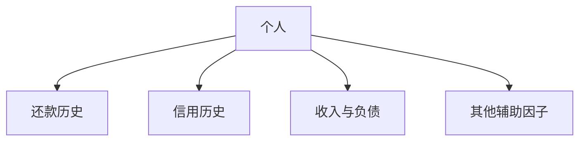
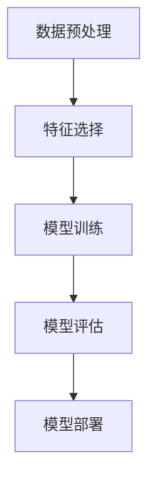
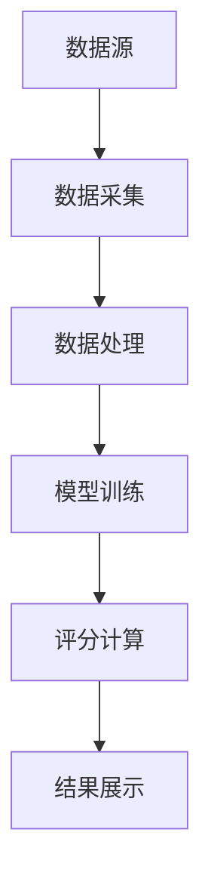

                 


# {{构建智能化的个人信用分数影响因子分析器}}

> 关键词：个人信用评分，影响因子，智能化分析，机器学习，信用风险

> 摘要：本文深入探讨了如何构建一个智能化的个人信用分数影响因子分析器，通过分析影响个人信用评分的核心因子，结合机器学习算法，提供了一个系统化的解决方案。文章从背景介绍、核心概念、算法原理、系统架构到项目实战，全面阐述了构建智能化分析器的各个方面。

---

# {{构建智能化的个人信用分数影响因子分析器}}

## 第1章: 个人信用评分的基本概念

### 1.1 信用评分的定义与作用
- 信用评分是衡量个人信用风险的重要指标，广泛应用于金融、信贷等领域。
- 信用评分高的个人更容易获得贷款，且利率较低；反之则可能被拒贷或面临高利率。

### 1.2 影响个人信用评分的主要因子
- 还款历史：按时还款记录是最重要的影响因子。
- 信用历史：包括信用报告的长度和是否有不良记录。
- 收入与负债：收入稳定且负债低的人信用评分较高。
- 其他辅助因子：如就业情况、居住稳定性等。

### 1.3 传统信用评分模型的局限性
- 传统模型通常基于简单的线性回归，难以捕捉复杂的非线性关系。
- 数据维度有限，难以充分利用大数据的优势。

---

## 第2章: 个人信用评分影响因子的分类与特征

### 2.1 影响因子的分类
- **还款历史**：包括按时还款、逾期还款等记录。
- **信用历史**：信用报告的详细历史，包括信用额度、使用情况等。
- **收入与负债**：收入水平、负债情况及债务偿还能力。
- **其他辅助因子**：如年龄、职业、居住稳定性等。

### 2.2 因子特征对比
| 因子类别 | 特征描述 | 权重 | 数据类型 |
|----------|----------|------|----------|
| 还款历史 | 借款人过去还款记录 | 高 | 数值型 |
| 信用历史 | 借款人信用报告历史 | 中 | 数值型 |
| 收入与负债 | 借款人收入与负债情况 | 高 | 数值型 |
| 其他辅助因子 | 就业情况、居住稳定性 | 低 | 数值型/分类型 |

### 2.3 因子关系分析
- **ER实体关系图**：展示各因子之间的关系。



---

## 第3章: 机器学习算法在信用评分中的应用

### 3.1 算法选择与原理
- **逻辑回归**：常用于分类问题，适合预测信用评分等级。
- **决策树**：能够处理非线性关系，适合复杂因子间的相互作用。

### 3.2 算法流程图


### 3.3 算法实现
- **Python代码示例**：

```python
import pandas as pd
from sklearn.linear_model import LogisticRegression
from sklearn.model_selection import train_test_split
from sklearn.metrics import accuracy_score

# 加载数据
data = pd.read_csv('credit_data.csv')

# 特征选择
X = data[['还款历史', '信用历史', '收入与负债', '其他辅助因子']]
y = data['信用评分']

# 数据分割
X_train, X_test, y_train, y_test = train_test_split(X, y, test_size=0.2, random_state=42)

# 模型训练
model = LogisticRegression()
model.fit(X_train, y_train)

# 模型预测
y_pred = model.predict(X_test)

# 模型评估
print("准确率:", accuracy_score(y_test, y_pred))
```

### 3.4 数学公式
- **逻辑回归公式**：
  $$ P(y=1|x) = \frac{1}{1 + e^{-(\beta_0 + \beta_1 x_1 + \beta_2 x_2 + \dots + \beta_n x_n)}} $$

---

## 第4章: 系统架构与设计

### 4.1 系统功能设计
- **数据采集模块**：收集个人信用相关数据。
- **数据处理模块**：清洗、转换和特征工程。
- **模型训练模块**：训练机器学习模型。
- **评分计算模块**：基于模型预测信用评分。
- **结果展示模块**：可视化评分结果及影响因子分析。

### 4.2 系统架构图


### 4.3 接口设计
- **REST API**：提供信用评分查询接口。
  ```http
  GET /api/v1/credit_score?user_id=123
  ```

---

## 第5章: 项目实战与分析

### 5.1 环境搭建
- **安装Python和相关库**：
  ```bash
  pip install pandas scikit-learn matplotlib
  ```

### 5.2 核心代码实现
- **数据处理**：
  ```python
  import pandas as pd
  data = pd.read_csv('credit_data.csv')
  data.head()
  ```

- **模型训练与评估**：
  ```python
  from sklearn.metrics import classification_report
  print(classification_report(y_test, y_pred))
  ```

### 5.3 实际案例分析
- **案例背景**：某用户信用数据，预测其信用评分。
- **数据分析**：通过特征重要性分析，找出主要影响因子。

---

## 第6章: 最佳实践与小结

### 6.1 小结
- 本文详细介绍了构建智能化个人信用评分影响因子分析器的过程，从理论到实践，帮助读者掌握相关知识。

### 6.2 注意事项
- 数据隐私保护至关重要，需遵守相关法律法规。
- 模型需定期更新，以适应数据分布的变化。

### 6.3 拓展阅读
- 《机器学习实战》
- 《信用评分模型开发与应用》

---

# 结语
通过本文的学习，读者可以系统地了解如何构建智能化的个人信用评分影响因子分析器，掌握从数据采集到模型部署的全过程。

