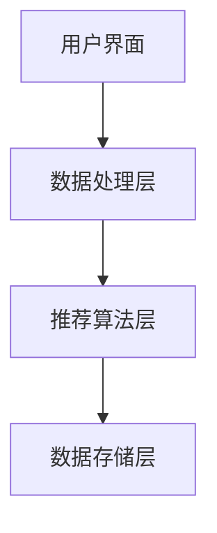

                 


# 《构建智能化的个人信用卡使用优化助手》

## 关键词：信用卡优化，人工智能，推荐系统，机器学习，系统架构

## 摘要：  
本文旨在探讨如何构建一个智能化的个人信用卡使用优化助手，通过数据分析、机器学习和推荐系统等技术手段，帮助用户优化信用卡使用策略，提升财务管理效率。文章从背景与概述、核心概念、算法原理、系统架构、项目实战、优化与部署等多方面进行详细阐述，为读者提供一个全面的技术解决方案。

---

# 第1章: 背景与概述

## 1.1 问题背景

### 1.1.1 信用卡使用中的常见问题
- **问题1**: 信用卡账单管理复杂，难以追踪消费记录。
- **问题2**: 消费决策缺乏数据支持，容易超支或产生高额利息。
- **问题3**: 信用卡优惠信息繁多，难以筛选最优选择。

### 1.1.2 优化信用卡使用的必要性
- **目标**: 提高财务管理效率，降低不必要的费用支出。
- **意义**: 帮助用户更好地规划消费，提升信用评分，避免债务风险。

### 1.1.3 智能化助手的核心目标
- 提供个性化的消费建议。
- 自动化管理信用卡账单。
- 实时监控信用评分变化。

---

## 1.2 信用卡使用优化的现状

### 1.2.1 当前信用卡使用中存在的痛点
- **信息不对称**: 用户难以快速获取最优支付方式。
- **手动管理**: 现有工具缺乏智能化，依赖用户手动输入数据。
- **缺乏预测功能**: 无法预测未来的消费风险。

### 1.2.2 传统优化方法的局限性
- **手动记录**: �易出错，效率低。
- **单一规则**: 优化策略缺乏灵活性。
- **数据孤岛**: 无法整合多张信用卡的数据。

### 1.2.3 智能化优化的潜力与趋势
- **潜力**: 利用AI技术实现自动化、智能化的优化策略。
- **趋势**: 随着大数据和AI技术的发展，智能化优化将成为主流。

---

## 1.3 本章小结
本章通过分析信用卡使用中存在的问题，明确了构建智能化优化助手的必要性和目标，为后续的技术实现奠定了基础。

---

# 第2章: 智能化助手的核心概念

## 2.1 核心概念定义

### 2.1.1 个人信用卡使用优化助手的定义
- **定义**: 一个基于AI和大数据分析的系统，通过分析用户的消费行为和信用数据，提供个性化的信用卡使用建议。

### 2.1.2 智能化助手的功能模块划分
- **模块1**: 数据采集与处理模块。
- **模块2**: 消费推荐模块。
- **模块3**: 风险预警模块。
- **模块4**: 账单管理模块。

---

## 2.2 核心概念的属性特征对比

### 2.2.1 功能模块对比表格

| 功能模块            | 输入数据       | 输出结果           | 核心算法         |
|---------------------|----------------|--------------------|------------------|
| 消费推荐模块        | 消费记录、优惠信息 | 推荐的消费方式     | 协同过滤、混合推荐 |
| 风险预警模块        | 信用评分、消费记录 | 风险预警信息       | 时间序列分析    |
| 账单管理模块        | 账单数据       | 最优还款计划       | 线性规划          |

### 2.2.2 核心概念的ER实体关系图

```mermaid
erd
    user信用卡持有者 --|> 使用记录: 用户ID
    使用记录 --|> 消费分类: 消费类型
    消费分类 --|> 优惠信息: 优惠类型
```

---

## 2.3 本章小结
通过定义智能化助手的核心概念，并对其功能模块和属性进行对比分析，为后续的技术实现提供了理论基础。

---

# 第3章: 算法原理与数学模型

## 3.1 推荐算法原理

### 3.1.1 协同过滤算法

#### 3.1.1.1 基于用户的协同过滤
- **原理**: 根据用户的消费记录相似度，推荐相似用户的消费行为。
- **流程图**: 
  ```mermaid
  graph TD
      UserA -->相似度计算--> UserB
      UserB -->推荐消费行为--> UserA
  ```

#### 3.1.1.2 基于物品的协同过滤
- **原理**: 根据用户消费物品的相似性进行推荐。
- **流程图**: 
  ```mermaid
  graph TD
      ItemA -->相似度计算--> ItemB
      User -->推荐ItemB--> User
  ```

### 3.1.2 基于内容的推荐算法

#### 3.1.2.1 文本挖掘技术
- **原理**: 通过分析商品描述或用户评论，提取关键词进行推荐。
- **流程图**: 
  ```mermaid
  graph TD
      文本数据 -->特征提取--> 关键词
      关键词 -->生成推荐--> 用户
  ```

### 3.1.3 混合推荐算法

#### 3.1.3.1 组合推荐
- **原理**: 综合基于用户和基于内容的推荐结果，生成最终的推荐列表。
- **流程图**: 
  ```mermaid
  graph TD
      User -->基于用户的推荐--> List1
      User -->基于内容的推荐--> List2
      组合算法 -->生成最终推荐列表--> User
  ```

---

## 3.2 数学模型与公式

### 3.2.1 协同过滤算法的相似度计算公式

#### 欧几里得相似度
$$ \text{相似度} = \sqrt{\sum_{i=1}^{n}(x_i - y_i)^2} $$

#### 余弦相似度
$$ \text{相似度} = \frac{\sum_{i=1}^{n}x_i y_i}{\sqrt{\sum_{i=1}^{n}x_i^2} \cdot \sqrt{\sum_{i=1}^{n}y_i^2}} $$

### 3.2.2 混合推荐算法的权重分配公式

$$ \text{最终推荐} = \alpha \cdot \text{基于用户的推荐} + (1-\alpha) \cdot \text{基于内容的推荐} $$

---

## 3.3 本章小结
通过分析推荐算法的原理和数学模型，为后续的系统实现提供了理论支持和技术基础。

---

# 第4章: 系统分析与架构设计

## 4.1 问题场景介绍

### 4.1.1 用户需求分析
- **需求1**: 实时监控信用卡账单。
- **需求2**: 自动推荐最优消费方式。
- **需求3**: 提供风险预警。

### 4.1.2 系统功能描述
- **功能1**: 数据采集与处理。
- **功能2**: 消费推荐。
- **功能3**: 风险预警。
- **功能4**: 账单管理。

---

## 4.2 系统架构设计

### 4.2.1 分层架构设计



### 4.2.2 关键接口设计
- **接口1**: 数据采集接口。
- **接口2**: 推荐结果接口。
- **接口3**: 风险预警接口。

---

## 4.3 本章小结
通过系统分析与架构设计，明确了系统的各个功能模块和接口关系，为后续的系统实现奠定了基础。

---

# 第5章: 项目实战

## 5.1 环境安装与数据集准备

### 5.1.1 环境安装
- **Python**: 3.8及以上版本。
- **Pandas**: 数据处理库。
- **Scikit-learn**: 机器学习库。

### 5.1.2 数据集准备
- 数据来源: 信用卡账单数据、消费记录数据。
- 数据格式: CSV格式，包含用户ID、消费金额、消费时间等字段。

---

## 5.2 系统核心实现

### 5.2.1 数据预处理
```python
import pandas as pd

# 加载数据
data = pd.read_csv('credit_card_data.csv')

# 数据清洗
data.dropna(inplace=True)
data = data[~data.duplicated()]
```

### 5.2.2 模型训练
```python
from sklearn.model_selection import train_test_split
from sklearn.metrics.pairwise import cosine_similarity

# 数据分割
X_train, X_test = train_test_split(data, test_size=0.2)

# 模型训练
similarity_matrix = cosine_similarity(X_train)
```

### 5.2.3 结果可视化
```python
import matplotlib.pyplot as plt

plt.hist(similarity_matrix, bins=10)
plt.title('Similarity Distribution')
plt.show()
```

---

## 5.3 本章小结
通过项目实战，详细展示了如何利用Python和机器学习库实现信用卡使用优化助手的核心功能。

---

# 第6章: 优化与部署

## 6.1 模型优化

### 6.1.1 超参数优化
- 使用网格搜索优化协同过滤算法的参数。

### 6.1.2 模型集成
- 结合基于用户的协同过滤和基于内容的推荐算法，提升推荐准确率。

---

## 6.2 系统部署方案

### 6.2.1 服务器部署
- 使用Docker容器化部署。

### 6.2.2 接口调用
- 提供RESTful API接口，供前端调用。

---

## 6.3 本章小结
通过模型优化和系统部署，确保了系统的高效运行和良好的用户体验。

---

# 第7章: 总结与展望

## 7.1 本章总结
本文详细探讨了如何构建智能化的个人信用卡使用优化助手，涵盖了背景分析、核心概念、算法原理、系统架构、项目实战和优化部署等多个方面。

## 7.2 未来展望
随着人工智能技术的不断发展，未来的信用卡优化助手将更加智能化和个性化，能够实时分析用户的财务状况，提供更加精准的消费建议。

---

## 参考文献
（此处列出相关参考文献）

---

## 致谢
感谢读者的支持与关注！

--- 

希望这篇文章能为您提供有价值的参考和启发！

