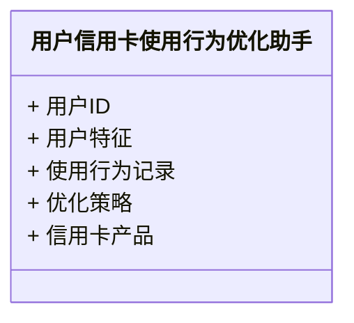
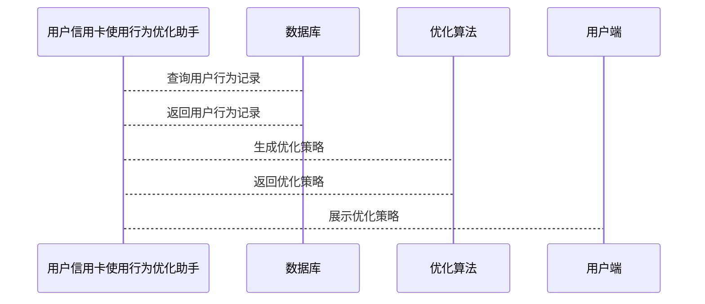

                 


```markdown
# 构建智能化的个人信用卡使用行为优化助手

> 关键词：信用卡优化、人工智能、用户行为分析、数据挖掘、机器学习

> 摘要：本文将从背景、核心概念、算法原理、系统架构设计、项目实战等多方面详细阐述如何构建一个智能化的个人信用卡使用行为优化助手。通过分析信用卡使用行为的多维度特征，结合人工智能技术，提出优化策略生成的方法，并通过实际案例展示优化助手的实际应用价值。文章内容丰富，逻辑清晰，适合技术开发者和对人工智能优化工具感兴趣的读者阅读。

---

# 第一部分: 背景介绍

## 第1章: 问题背景

### 1.1 信用卡使用中的常见问题
- **问题1**：信用卡用户往往难以全面了解自己的消费行为，容易超支或产生高额利息。
- **问题2**：信用卡产品种类繁多，用户难以选择最适合自己的信用卡。
- **问题3**：传统信用卡推荐方式缺乏个性化，难以满足用户的多样化需求。

### 1.2 智能化优化的必要性
- **数据驱动的个性化服务**：通过分析用户的消费行为，提供个性化的信用卡使用建议。
- **实时监控与预警**：利用人工智能技术实时监控用户的消费行为，及时预警潜在风险。
- **提升用户体验**：通过智能化优化，帮助用户更合理地管理信用卡使用，降低财务风险。

### 1.3 个人信用卡使用行为的复杂性
- **多维度特征**：消费金额、消费频率、消费场景、还款习惯等多维度特征。
- **动态变化**：用户的消费行为会受到时间、环境、经济状况等多种因素的影响。
- **数据量大**：信用卡使用行为涉及大量数据，需要高效的数据处理和分析能力。

---

## 第2章: 问题描述

### 2.1 信用卡使用行为的多维度分析
- **消费金额**：不同用户的消费金额差异显著，需要根据用户的收入水平和消费习惯制定个性化策略。
- **消费频率**：高频消费用户可能更适合高额度信用卡，低频消费用户则需要更谨慎的使用策略。
- **消费场景**：线上支付、线下消费、分期付款等不同场景对信用卡使用策略的要求不同。

### 2.2 用户需求与行为的关联性
- **需求分析**：用户的核心需求是降低财务风险、优化消费计划、提升信用评分。
- **行为分析**：用户的实际行为可能与需求存在偏差，需要通过数据挖掘技术发现行为特征。

### 2.3 数据驱动的优化路径
- **数据采集**：收集用户的消费记录、信用评分、还款记录等数据。
- **特征提取**：从原始数据中提取有意义的特征，如消费金额、消费频率、消费场景等。
- **模型训练**：基于特征数据，训练机器学习模型，预测用户的消费行为并生成优化策略。

---

## 第3章: 问题解决

### 3.1 AI技术在信用卡优化中的应用
- **机器学习**：用于用户行为分析和消费预测。
- **数据挖掘**：用于从海量数据中提取有价值的信息。
- **自然语言处理**：用于分析用户的反馈和需求。

### 3.2 智能化助手的核心功能
- **消费预测**：基于历史数据，预测未来的消费行为。
- **策略生成**：根据预测结果，生成个性化的优化策略。
- **实时监控**：实时跟踪用户的消费行为，及时预警潜在风险。

### 3.3 用户行为分析与预测
- **数据分析方法**：描述性分析、预测性分析、诊断性分析。
- **行为预测模型**：时间序列模型、决策树模型、随机森林模型。

---

## 第4章: 边界与外延

### 4.1 信用卡使用行为的边界定义
- **数据范围**：仅限于信用卡相关数据。
- **用户范围**：仅限于个人用户。
- **场景范围**：仅限于信用卡使用场景。

### 4.2 助手功能的适用范围
- **功能边界**：仅限于优化信用卡使用行为。
- **用户边界**：仅限于信用卡用户。
- **数据边界**：仅限于信用卡相关数据。

### 4.3 边界外延的潜在扩展
- **功能扩展**：扩展到其他金融产品，如储蓄卡、理财账户等。
- **用户扩展**：扩展到企业用户或团体用户。
- **数据扩展**：扩展到更多的金融相关数据。

---

## 第5章: 概念结构与核心要素

### 5.1 核心概念的组成
- **用户特征**：用户的基本信息、消费习惯、信用评分。
- **行为特征**：消费金额、消费频率、消费场景。
- **产品特征**：信用卡种类、优惠政策、积分规则。

### 5.2 概念之间的关系
- **用户特征与行为特征**：用户特征影响行为特征。
- **行为特征与产品特征**：行为特征影响产品选择。
- **产品特征与优化策略**：产品特征影响优化策略。

### 5.3 核心要素的特征分析
- **用户特征**：年龄、职业、收入水平。
- **行为特征**：消费金额、消费频率、消费场景。
- **产品特征**：信用卡种类、优惠政策、积分规则。

---

## 第6章: ER实体关系图

```mermaid
erDiagram
    user信用卡用户 {
        用户ID
        用户特征
        使用行为
    }
   信用卡产品 {
        产品ID
        产品特征
        优惠政策
    }
    使用行为记录 {
        行为ID
        行为类型
        时间戳
    }
    优化策略 {
        策略ID
        策略类型
        策略内容
    }
    user信用卡用户 --> 使用行为记录 : 产生
    user信用卡用户 --> 优化策略 : 应用
    信用卡产品 --> 使用行为记录 : 影响
```

---

# 第二部分: 核心概念与联系

## 第4章: 核心概念原理

### 4.1 AI驱动的用户行为分析
- **机器学习模型**：用于分析用户的消费行为。
- **数据挖掘技术**：用于提取用户行为特征。
- **优化策略生成**：基于行为分析结果生成优化策略。

### 4.2 数据挖掘与特征提取
- **数据清洗**：去除无效数据，处理缺失值。
- **特征提取**：从原始数据中提取有意义的特征。
- **特征选择**：选择对预测结果影响最大的特征。

### 4.3 优化策略的生成机制
- **策略生成方法**：基于机器学习模型的预测结果生成优化策略。
- **策略调整机制**：根据用户反馈动态调整优化策略。
- **策略执行方式**：通过智能提醒或自动化方式执行优化策略。

---

## 第5章: 概念属性特征对比

### 5.1 行为特征与优化策略的对比
| 行为特征       | 优化策略       |
|----------------|----------------|
| 消费金额       | 调整信用额度     |
| 消费频率       | 调整信用额度     |
| 消费场景       | 改变消费习惯     |

### 5.2 不同信用卡产品的特征分析
| 信用卡产品       | 特征描述       |
|------------------|----------------|
| 高额度信用卡     | 适合高消费用户   |
| 低额度信用卡     | 适合低消费用户   |
| 积分信用卡       | 适合注重积分用户   |

### 5.3 用户需求与行为的关联性
| 用户需求         | 关联行为         |
|------------------|------------------|
| 降低财务风险     | 合理安排消费计划   |
| 提升信用评分     | 按时还款         |
| 获取优惠         | 使用优惠活动       |

---

## 第6章: ER实体关系图

```mermaid
erDiagram
    user信用卡用户 {
        用户ID
        用户特征
        使用行为
    }
   信用卡产品 {
        产品ID
        产品特征
        优惠政策
    }
    使用行为记录 {
        行为ID
        行为类型
        时间戳
    }
    优化策略 {
        策略ID
        策略类型
        策略内容
    }
    user信用卡用户 --> 使用行为记录 : 产生
    user信用卡用户 --> 优化策略 : 应用
    信用卡产品 --> 使用行为记录 : 影响
```

---

# 第三部分: 算法原理讲解

## 第5章: 算法原理概述

### 5.1 用户行为分析的核心算法
- **决策树算法**：用于分类用户行为类型。
- **随机森林算法**：用于预测用户的消费行为。
- **时间序列分析**：用于分析用户的消费趋势。

### 5.2 优化策略生成的算法选择
- **基于机器学习的策略生成**：使用随机森林算法生成优化策略。
- **基于规则的策略生成**：根据预设规则生成优化策略。
- **基于反馈的策略生成**：根据用户反馈动态调整优化策略。

### 5.3 算法实现步骤
1. 数据清洗与特征提取
2. 模型训练与验证
3. 策略生成与优化

---

## 第6章: 算法实现代码

```python
import pandas as pd
from sklearn.ensemble import RandomForestClassifier
from sklearn.metrics import accuracy_score

# 数据加载
data = pd.read_csv('credit_card.csv')

# 特征提取
features = ['消费金额', '消费频率', '消费场景']
target = '行为类型'

# 数据分割
X = data[features]
y = data[target]

# 模型训练
model = RandomForestClassifier()
model.fit(X, y)

# 模型预测
y_pred = model.predict(X)

# 模型评估
print(accuracy_score(y, y_pred))
```

---

## 第7章: 算法原理的数学模型

### 7.1 随机森林算法的数学模型
$$
\text{随机森林} = \{ \text{决策树}_i | i = 1, 2, \dots, n \}
$$

### 7.2 决策树算法的数学模型
$$
\text{信息增益} = \text{熵}(D) - \sum_{v} \text{熵}(D_v)
$$

---

## 第8章: 算法实现的注意事项

### 8.1 数据预处理
- **数据清洗**：处理缺失值、异常值。
- **特征工程**：提取有意义的特征，进行特征缩放。

### 8.2 模型调优
- **参数调优**：调整模型参数，提升模型性能。
- **交叉验证**：使用交叉验证评估模型性能。

### 8.3 模型部署
- **API接口设计**：设计RESTful API接口。
- **前端交互设计**：设计用户友好的交互界面。

---

# 第四部分: 系统分析与架构设计

## 第9章: 系统分析

### 9.1 问题场景介绍
- **场景描述**：用户使用信用卡进行消费，系统实时监控用户的消费行为，生成优化策略。
- **用户角色**：信用卡用户、系统管理员。
- **系统功能**：数据采集、行为分析、策略生成、结果展示。

---

## 第10章: 系统架构设计

### 10.1 系统功能设计


### 10.2 系统架构设计
```mermaid
archiDiagram
    component 用户端 {
        包含 用户信用卡使用行为优化助手
    }
    component 服务端 {
        包含 数据库
        包含 优化算法
    }
    用户端 --> 服务端 : 请求优化策略
    服务端 --> 用户端 : 返回优化策略
```

### 10.3 系统接口设计
- **API接口**：RESTful API，支持GET、POST请求。
- **数据接口**：数据库连接接口，支持数据的增删改查操作。

### 10.4 系统交互设计


---

## 第11章: 系统实现

### 11.1 环境安装
- **Python环境**：安装Python 3.8及以上版本。
- **依赖库安装**：安装pandas、scikit-learn、flask等库。

### 11.2 核心代码实现
```python
from flask import Flask, request, jsonify

app = Flask(__name__)

@app.route('/optimize', methods=['POST'])
def optimize():
    data = request.json
    # 数据处理逻辑
    return jsonify({'status': 'success', 'message': '优化策略生成成功'})

if __name__ == '__main__':
    app.run(debug=True)
```

---

## 第12章: 系统优化与调优

### 12.1 系统优化
- **性能优化**：优化算法运行效率，减少响应时间。
- **数据优化**：优化数据存储结构，提升查询效率。

### 12.2 系统调优
- **参数调优**：调整模型参数，提升预测准确率。
- **资源调优**：优化服务器资源使用，提升系统稳定性。

---

# 第五部分: 项目实战

## 第13章: 项目实战

### 13.1 环境安装
- **安装Python**：Python 3.8及以上版本。
- **安装依赖库**：安装pandas、scikit-learn、flask等库。

### 13.2 核心代码实现
```python
import pandas as pd
from sklearn.ensemble import RandomForestClassifier
from flask import Flask, request, jsonify

app = Flask(__name__)

@app.route('/optimize', methods=['POST'])
def optimize():
    data = request.json
    # 数据处理逻辑
    return jsonify({'status': 'success', 'message': '优化策略生成成功'})

if __name__ == '__main__':
    app.run(debug=True)
```

---

## 第14章: 实际案例分析

### 14.1 案例背景
- **用户特征**：用户A，月收入5000元，高频消费用户。
- **消费行为**：每月消费金额为8000元，主要消费场景为餐饮和购物。

### 14.2 数据分析
- **消费金额**：用户消费金额高于收入，存在超支风险。
- **消费频率**：消费频率较高，需要优化消费习惯。

### 14.3 优化策略
- **调整信用额度**：降低信用额度，避免超支。
- **消费提醒**：设置消费提醒，帮助用户合理安排消费计划。

---

## 第15章: 项目小结

### 15.1 核心成果
- **智能化优化助手**：实现用户信用卡使用行为的智能化优化。
- **数据驱动的个性化服务**：提供个性化的优化策略。

### 15.2 经验总结
- **数据的重要性**：高质量的数据是优化策略生成的基础。
- **算法的选择**：选择合适的算法可以显著提升优化效果。
- **系统的稳定性**：系统的稳定运行是优化助手成功的关键。

---

# 第六部分: 总结与展望

## 第16章: 总结

### 16.1 核心内容回顾
- **背景介绍**：信用卡使用行为优化的必要性。
- **核心概念**：用户行为分析、优化策略生成。
- **算法原理**：随机森林算法、时间序列分析。
- **系统架构**：用户端、服务端、数据库。

### 16.2 实践价值
- **理论价值**：为信用卡优化提供理论依据。
- **实践价值**：为用户提供实际可行的优化策略。

---

## 第17章: 展望

### 17.1 拓展方向
- **功能扩展**：扩展到其他金融产品，如储蓄卡、理财账户等。
- **用户扩展**：扩展到企业用户或团体用户。
- **数据扩展**：扩展到更多的金融相关数据。

### 17.2 技术进步
- **算法优化**：研究更高效的机器学习算法。
- **数据挖掘**：探索更先进的数据挖掘技术。
- **系统优化**：提升系统的运行效率和稳定性。

---

## 第18章: 最佳实践 tips

### 18.1 数据隐私保护
- **数据加密**：保护用户的隐私数据。
- **访问控制**：限制数据访问权限。

### 18.2 模型可解释性
- **模型解释**：帮助用户理解优化策略的生成过程。
- **可视化展示**：通过可视化工具展示数据和结果。

### 18.3 系统维护
- **定期更新**：定期更新模型和数据。
- **故障排查**：及时发现并解决问题。

---

## 第19章: 拓展阅读

### 19.1 推荐书籍
- 《机器学习实战》
- 《数据挖掘导论》

### 19.2 在线资源
- [机器学习教程](https://www.machinelearning mastery.com)
- [数据挖掘资源](https://www.data挖掘.com)

---

# 结语

通过本文的详细阐述，我们了解了如何构建智能化的个人信用卡使用行为优化助手，从背景介绍、核心概念、算法原理、系统架构设计到项目实战，全面涵盖了构建这一助手的各个方面。希望本文的内容能够为读者提供有价值的参考，帮助读者更好地理解和应用这一技术。
```

