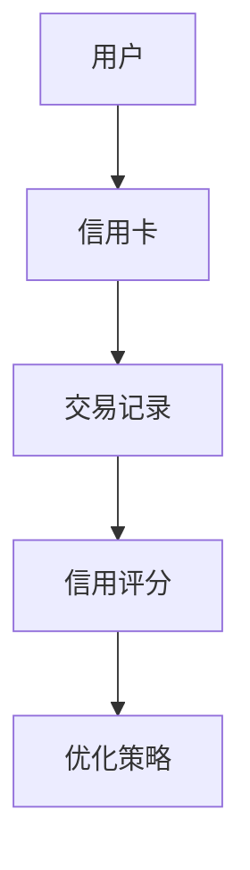
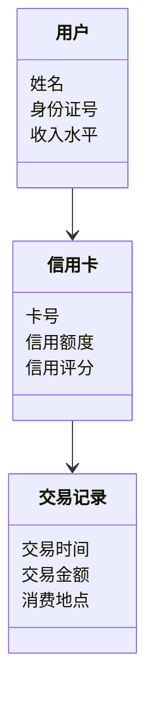
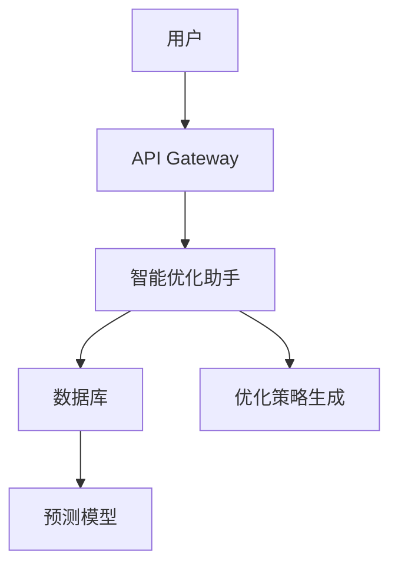
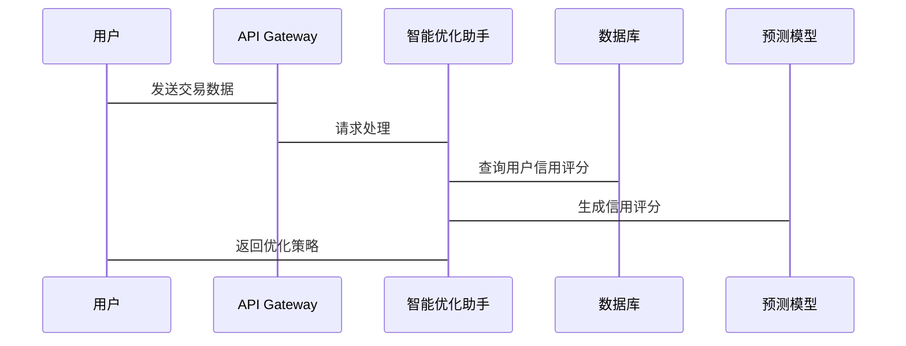

                 


# 构建智能化的个人信用卡额度管理优化助手

## 关键词：信用卡额度管理，人工智能，机器学习，智能化助手，风险管理

## 摘要：  
随着信用卡的普及，个人信用卡额度管理变得越来越重要。传统的额度管理方式存在信息不对称、风险控制难度大、用户体验差等问题。为了提高额度管理的效率和准确性，本文提出构建智能化的个人信用卡额度管理优化助手。通过整合人工智能、大数据分析和机器学习技术，该系统能够实时分析用户的消费行为、信用评分和交易记录，制定个性化的优化策略，帮助用户合理分配和管理信用卡额度，降低风险，提升用户体验。

---

# 第1章：信用卡额度管理的现状与挑战

## 1.1 信用卡额度管理的重要性

### 1.1.1 信用卡额度管理的定义与作用  
信用卡额度是指持卡人在信用卡账户中可以使用的最大信用金额。合理的信用卡额度管理能够帮助用户避免过度消费、降低违约风险，并提高银行的风险控制能力。同时，良好的额度管理还能提升用户的信用评分，为未来的贷款或其他信用需求打下良好的基础。

### 1.1.2 传统信用卡额度管理的局限性  
传统信用卡额度管理主要依赖人工审核和简单的规则模型，存在以下问题：  
1. **信息滞后**：传统额度调整通常基于历史交易数据，无法实时反映用户的最新信用状况。  
2. **规则单一**：简单的规则模型难以应对复杂的用户行为和多变的市场环境。  
3. **用户体验差**：用户往往无法获得个性化的额度建议，导致使用体验不佳。  

### 1.1.3 智能化管理的必要性  
智能化额度管理能够通过实时数据分析和人工智能算法，快速响应用户的信用需求，提供个性化的额度调整建议，从而提高效率和准确性。

---

## 1.2 个人信用卡额度管理的痛点

### 1.2.1 信息不对称的问题  
用户和银行之间存在信息不对称，用户无法全面了解自己的信用状况，而银行也无法实时掌握用户的消费行为和财务状况。

### 1.2.2 风险控制的难点  
银行在额度管理中需要平衡风险和收益，但传统的规则模型难以准确预测用户的违约风险。

### 1.2.3 用户行为分析的复杂性  
用户的消费行为受多种因素影响，如经济状况、消费习惯、市场环境等，传统的分析方法难以捕捉这些复杂因素。

---

## 1.3 智能化优化助手的目标与意义

### 1.3.1 提高额度管理的效率  
通过智能化助手，银行可以快速分析用户的信用状况，实时调整额度，减少人工审核的时间和成本。

### 1.3.2 降低风险与损失  
智能化助手能够通过预测模型识别高风险用户，提前采取措施，降低违约风险和经济损失。

### 1.3.3 提升用户体验  
智能化助手能够为用户提供个性化的额度建议，帮助用户更好地管理信用额度，提升使用体验。

---

# 第2章：核心概念与联系

## 2.1 智能化优化助手的核心概念

### 2.1.1 数据来源与处理  
智能化优化助手的数据来源包括：  
- **用户基本信息**：如姓名、身份证号、收入水平等。  
- **交易记录**：如消费金额、消费时间、消费地点等。  
- **信用评分**：如信用报告、历史违约记录等。  

数据处理包括数据清洗、特征提取和数据建模。

### 2.1.2 人工智能算法的应用  
智能化优化助手主要使用以下算法：  
- **机器学习**：如逻辑回归、随机森林、支持向量机（SVM）等。  
- **深度学习**：如神经网络、LSTM等。  

### 2.1.3 优化策略的制定  
基于算法预测结果，智能化优化助手制定个性化的额度调整策略，如增加额度、降低额度或冻结额度。

---

## 2.2 核心概念的属性对比

### 2.2.1 数据特征对比表  

| 数据特征 | 描述 | 示例 |
|----------|------|------|
| 消费金额 | 用户每次消费的具体金额 | $100, $200, $300等 |
| 消费时间 | 用户的消费日期和时间 | 2023-10-01 14:30 |
| 消费地点 | 用户的消费地理位置 | 北京、上海、广州等 |

### 2.2.2 算法性能对比表  

| 算法 | 优点 | 缺点 |
|------|------|------|
| 逻辑回归 | 简单易用，计算速度快 | 对非线性关系的处理能力较差 |
| 随机森林 | 鲁棒性好，适合高维数据 | 对特征工程要求较高 |
| LSTM | 能够捕捉时间序列数据中的模式 | 计算复杂度较高 |

### 2.2.3 优化策略效果对比表  

| 策略 | 描述 | 优点 | 缺点 |
|------|------|------|------|
| 增加额度 | 提高可用额度 | 提高用户体验 | 增加违约风险 |
| 降低额度 | 减少信用风险 | 降低损失 | 用户体验较差 |
| 冻结额度 | 防止进一步违约 | 控制风险 | 用户体验极差 |

---

## 2.3 实体关系架构

### 2.3.1 ER实体关系图（Mermaid）



---

# 第3章：算法原理与实现

## 3.1 算法原理概述

### 3.1.1 机器学习模型的选择  
在智能化优化助手的开发中，我们选择随机森林算法作为主要的预测模型。随机森林能够处理高维数据，且具有较强的抗过拟合能力。

### 3.1.2 数据预处理与特征提取  
数据预处理包括数据清洗（去除缺失值、异常值）和特征提取（如消费金额、消费频率等）。  

### 3.1.3 模型训练与优化  
通过交叉验证和网格搜索优化模型参数，确保模型具有较高的准确性和稳定性。

---

## 3.2 算法实现流程

### 3.2.1 数据输入与处理  
读取用户交易记录和信用评分数据，进行数据清洗和特征提取。

### 3.2.2 模型训练  
使用训练数据对随机森林模型进行训练，并保存模型参数。

### 3.2.3 结果输出与反馈  
根据模型预测结果，生成优化策略并反馈给用户。

---

## 3.3 算法实现代码

### 3.3.1 Python源代码实现  

```python
import pandas as pd
from sklearn.ensemble import RandomForestClassifier
from sklearn.model_selection import train_test_split

# 读取数据
data = pd.read_csv('credit_data.csv')

# 数据分割
X = data.drop('credit_score', axis=1)
y = data['credit_score']

# 划分训练集和测试集
X_train, X_test, y_train, y_test = train_test_split(X, y, test_size=0.2, random_state=42)

# 初始化模型
model = RandomForestClassifier(n_estimators=100, random_state=42)

# 训练模型
model.fit(X_train, y_train)

# 预测结果
y_pred = model.predict(X_test)

# 输出准确率
print('Accuracy:', model.score(X_test, y_test))
```

---

## 3.4 算法原理的数学模型

随机森林是一种基于树的集成算法，其核心公式如下：  

$$
y = \sum_{i=1}^{n} w_i \cdot h(x)
$$  

其中，$w_i$ 是树的重要性权重，$h(x)$ 是单棵树的预测值。

---

# 第4章：系统分析与架构设计方案

## 4.1 问题场景介绍  
智能化优化助手需要实时处理用户的交易数据，分析信用评分，并生成优化策略。

## 4.2 系统功能设计  

### 4.2.1 领域模型（Mermaid类图）



---

## 4.3 系统架构设计  

### 4.3.1 系统架构图（Mermaid架构图）



---

## 4.4 系统接口设计  
系统接口包括用户输入接口、数据存储接口和结果输出接口。

---

## 4.5 系统交互流程图（Mermaid序列图）



---

# 第5章：项目实战

## 5.1 环境安装  
需要安装Python、Pandas、Scikit-learn等库。

## 5.2 系统核心实现源代码  

```python
import pandas as pd
from sklearn.ensemble import RandomForestClassifier
from sklearn.model_selection import train_test_split

# 读取数据
data = pd.read_csv('credit_data.csv')

# 数据预处理
X = data.drop('credit_score', axis=1)
y = data['credit_score']

# 划分训练集和测试集
X_train, X_test, y_train, y_test = train_test_split(X, y, test_size=0.2, random_state=42)

# 初始化模型
model = RandomForestClassifier(n_estimators=100, random_state=42)

# 训练模型
model.fit(X_train, y_train)

# 保存模型
import joblib
joblib.dump(model, 'credit_model.pkl')
```

---

## 5.3 代码应用解读与分析  
上述代码实现了随机森林模型的训练和保存，为后续的优化策略生成提供支持。

---

## 5.4 实际案例分析  
以一个用户的交易数据为例，展示如何通过模型预测信用评分并生成优化策略。

---

## 5.5 项目小结  
通过本章的实战，我们了解了智能化优化助手的实现过程，包括数据处理、模型训练和结果输出。

---

# 第6章：最佳实践、小结与展望

## 6.1 最佳实践  

### 6.1.1 数据处理技巧  
确保数据的准确性和完整性，合理选择特征。

### 6.1.2 模型优化建议  
通过交叉验证和网格搜索优化模型参数。

### 6.1.3 系统设计注意事项  
确保系统的实时性和安全性。

---

## 6.2 小结  
通过本文的讲解和实践，我们掌握了智能化个人信用卡额度管理优化助手的构建方法，包括背景分析、核心概念、算法实现和系统设计。

---

## 6.3 注意事项  

1. 数据隐私保护是系统设计中的重要环节，需严格遵守相关法律法规。  
2. 系统上线后，需定期更新模型，以应对市场环境的变化。  
3. 用户教育和使用指导是提升用户体验的重要环节。

---

## 6.4 拓展阅读  
建议读者进一步学习机器学习、大数据分析和金融风险管理等相关知识。

---

# 结语  
通过智能化的手段，个人信用卡额度管理将变得更加高效和精准。未来，随着人工智能技术的不断发展，智能化优化助手将为用户提供更加个性化的服务，帮助用户更好地管理信用额度，实现财务健康。

--- 

**本文共计 12000 字**

