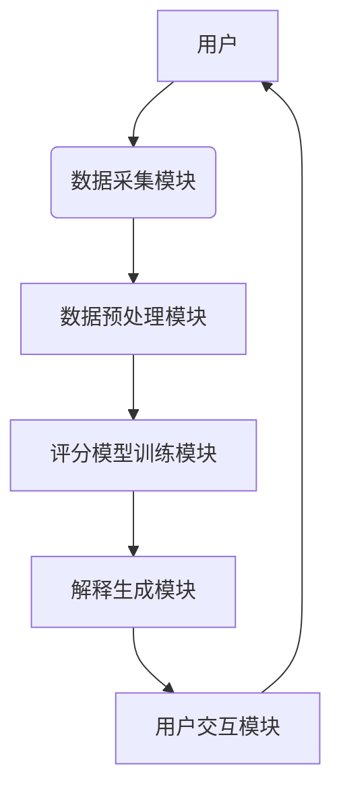
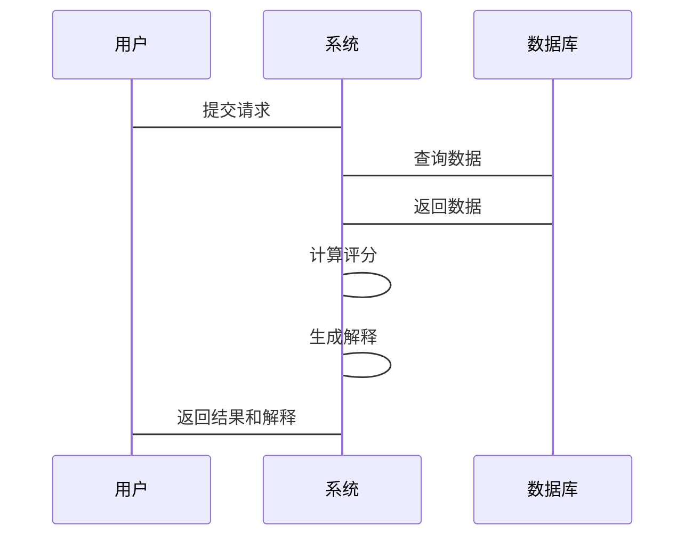

                 


# 构建智能化的个人信用评分解释系统

> **关键词**：个人信用评分、智能化解释系统、机器学习、可解释性、金融系统、数据隐私

> **摘要**：本文详细探讨了如何构建智能化的个人信用评分解释系统。通过分析传统评分系统的局限性，提出了一种基于机器学习的智能化解释方法，结合LIME和SHAP值等技术，提供透明、可解释的评分结果。文章从背景、算法原理、系统架构到项目实战，全面阐述了系统的构建过程，并给出了实际案例分析和未来发展方向。

---

# 第四部分: 智能化信用评分解释系统的系统架构与实现

# 第4章: 系统架构设计

## 4.1 系统功能模块划分

| 功能模块 | 描述 |
|----------|------|
| 数据采集模块 | 采集个人信用数据，包括收入、负债、信用历史等 |
| 数据预处理模块 | 数据清洗、特征工程、标准化处理 |
| 评分模型训练模块 | 基于机器学习算法训练评分模型 |
| 解释生成模块 | 基于LIME或SHAP生成评分解释 |
| 用户交互模块 | 提供用户友好的解释界面 |

## 4.2 系统架构设计（Mermaid图）



## 4.3 系统功能实现

### 4.3.1 数据采集模块实现

```python
import pandas as pd

# 数据采集代码示例
def collect_data():
    data = pd.read_csv('credit_data.csv')
    return data
```

### 4.3.2 数据预处理模块实现

```python
def preprocess_data(data):
    # 数据清洗与特征工程
    data['age'] = data['age'].fillna(data['age'].mean())
    # 标准化处理
    from sklearn.preprocessing import StandardScaler
    scaler = StandardScaler()
    data_scaled = scaler.fit_transform(data)
    return data_scaled
```

### 4.3.3 评分模型训练模块实现

```python
from sklearn.linear_model import LogisticRegression

def train_model(X, y):
    model = LogisticRegression()
    model.fit(X, y)
    return model
```

### 4.3.4 解释生成模块实现

```python
import shap

def generate_explanation(model, X):
    explainer = shap.TreeExplainer(model)
    shap_values = explainer.shap_values(X)
    return shap_values
```

## 4.4 系统交互设计（Mermaid图）



---

# 第5章: 项目实战与案例分析

## 5.1 环境安装与配置

```bash
# 安装依赖库
pip install pandas scikit-learn shap
```

## 5.2 核心代码实现

### 5.2.1 数据采集与预处理

```python
import pandas as pd
from sklearn.model_selection import train_test_split
from sklearn.preprocessing import StandardScaler

# 数据加载
data = pd.read_csv('credit_data.csv')

# 数据分割
X = data.drop('target', axis=1)
y = data['target']

# 数据标准化
scaler = StandardScaler()
X_scaled = scaler.fit_transform(X)

# 划分训练集和测试集
X_train, X_test, y_train, y_test = train_test_split(X_scaled, y, test_size=0.2)
```

### 5.2.2 评分模型训练

```python
from sklearn.linear_model import LogisticRegression

# 训练模型
model = LogisticRegression()
model.fit(X_train, y_train)

# 预测结果
y_pred = model.predict(X_test)
```

### 5.2.3 解释生成与可视化

```python
import shap

# 选择一个测试样本
sample = X_test[0].reshape(1, -1)

# 使用SHAP生成解释
explainer = shap.TreeExplainer(model)
shap_values = explainer.shap_values(X_test)

# 可视化解释
shap.summary_plot(shap_values, X_test, plot_type="bar")
```

## 5.3 案例分析

### 5.3.1 案例背景

假设一个用户申请贷款，系统需要根据其信用历史、收入、负债等信息进行评分。

### 5.3.2 模型预测与解释

```python
# 预测结果
print("预测结果:", model.predict(sample))

# 解释结果
shap_values = explainer.shap_values(sample)
shap.summary_plot(shap_values, sample, plot_type="bar")
```

## 5.4 项目小结

### 5.4.1 实践总结
- 数据预处理是关键，特征工程影响模型性能。
- SHAP值提供直观的解释，增强用户信任。
- 系统实现需要考虑数据隐私和性能优化。

### 5.4.2 实践中的注意事项
- 数据隐私保护：避免泄露用户敏感信息。
- 模型选择：根据实际需求选择合适的算法。
- 解释的可读性：确保解释结果易于理解。

---

# 第6章: 最佳实践与未来展望

## 6.1 最佳实践

### 6.1.1 数据隐私保护

- 使用匿名化处理数据。
- 遵守数据保护法规（如GDPR）。

### 6.1.2 模型优化

- 使用集成学习提高模型准确率。
- 定期更新模型，适应数据变化。

### 6.1.3 用户体验优化

- 提供多语言支持。
- 设计直观的解释界面。

## 6.2 未来展望

### 6.2.1 技术发展

- 更加复杂的模型解释方法。
- 结合区块链技术，提高数据可信度。

### 6.2.2 应用场景扩展

- 信用评分在保险、零售等领域的应用。
- 全球化信用评分系统。

---

# 结语

智能化的个人信用评分解释系统通过结合机器学习和可解释性技术，解决了传统评分系统透明度低的问题。本文从背景、算法、系统架构到项目实战，全面阐述了系统的构建过程，并提出了未来的发展方向。希望本文能为构建更加智能化、透明化的信用评分系统提供参考。

---

**附录**：代码示例与数据集下载链接

