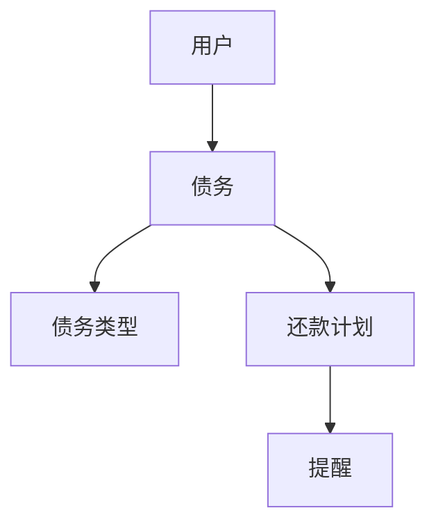
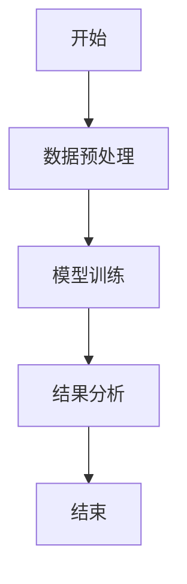
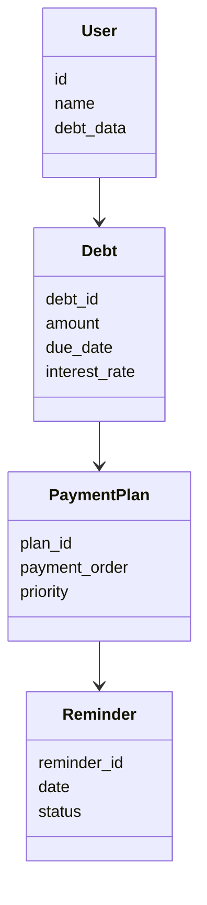
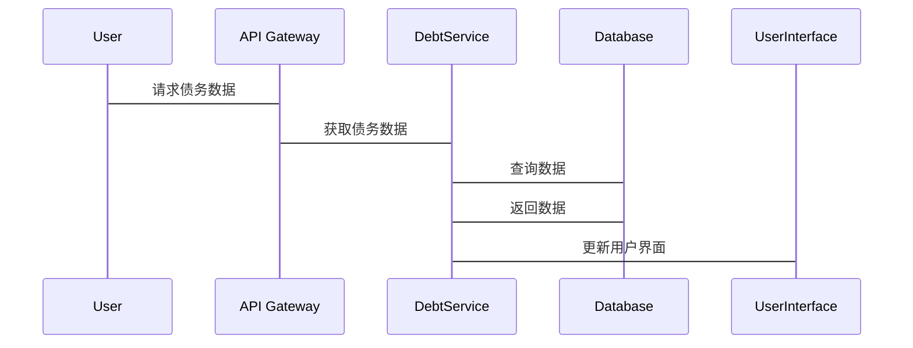

                 


# 智能化个人债务管理助手

## 关键词
- 智能化债务管理
- 人工智能
- 个人财务
- 债务优化
- 数据分析

## 摘要
本文将详细探讨如何构建一个智能化的个人债务管理助手，通过结合人工智能和大数据分析技术，帮助用户有效管理债务。文章将从背景介绍、核心概念、算法原理、系统架构设计、项目实战等方面进行深入分析，并通过实际案例展示如何实现这一系统。

---

# 第1章 智能化个人债务管理助手的背景介绍

## 1.1 个人债务管理的背景与问题背景

### 1.1.1 个人债务管理的基本概念
个人债务管理是指对个人名下的所有债务进行跟踪、分析和优化的过程，旨在帮助用户按时还款、降低利息支出，并逐步实现债务自由。常见的债务类型包括信用卡欠款、个人贷款、账单分期等。

### 1.1.2 当前个人债务管理的主要挑战
- **信息分散**：用户的债务可能分布在不同的金融机构，数据分散，难以集中管理。
- **还款压力大**：面对多笔债务，用户难以合理分配还款资金，可能导致逾期或高额利息。
- **缺乏智能化工具**：传统债务管理方式依赖手动记录和计算，效率低且容易出错。

### 1.1.3 智能化技术在债务管理中的作用
通过引入人工智能、大数据分析等技术，智能化债务管理助手可以实时跟踪债务状态、自动化提醒还款、优化还款计划，从而提高管理效率并降低债务风险。

## 1.2 问题描述与目标设定

### 1.2.1 债务管理中的常见问题
- 用户忘记还款日期，导致逾期。
- 多笔债务的还款优先级不明确，影响整体债务优化。
- 缺乏个性化的还款建议，难以满足不同用户的财务需求。

### 1.2.2 智能化债务管理助手的目标
- 提供实时债务跟踪和提醒功能。
- 自动计算最优还款顺序，降低利息支出。
- 提供个性化的财务分析和优化建议。

### 1.2.3 边界与外延
- **边界**：仅专注于个人债务管理，不涉及企业债务或其他财务领域。
- **外延**：可扩展至信用评分提升、财务预算规划等更广泛的应用场景。

## 1.3 核心概念与系统结构

### 1.3.1 系统的核心要素
- **债务数据采集**：从不同金融机构获取债务信息。
- **智能算法**：用于债务优先级排序和还款计划优化。
- **用户交互**：提供直观的界面和个性化的建议。

### 1.3.2 系统的输入与输出
- **输入**：用户的债务数据、财务状况、还款偏好。
- **输出**：还款计划、财务分析报告、提醒信息。

### 1.3.3 系统的功能模块划分
1. 数据采集模块
2. 数据处理模块
3. 智能算法模块
4. 用户交互模块

## 1.4 本章小结
本章通过介绍个人债务管理的背景、挑战及智能化技术的作用，明确了构建智能化个人债务管理助手的目标和核心要素。

---

# 第2章 智能化个人债务管理助手的核心概念与联系

## 2.1 核心概念的原理分析

### 2.1.1 数据采集与处理
- 数据来源：信用卡账单、银行贷款记录、分期账单等。
- 数据清洗：去除重复数据、处理缺失值。
- 数据结构化：将非结构化数据转换为结构化数据，便于后续分析。

### 2.1.2 智能算法的应用
- **机器学习**：用于预测还款风险、优化还款顺序。
- **规则引擎**：根据用户的财务状况制定还款策略。

### 2.1.3 用户交互设计
- 提醒功能：基于还款日期设置提醒。
- 可视化分析：通过图表展示债务分布、还款进度。

## 2.2 核心概念的属性特征对比

### 2.2.1 数据特征对比表

| 特征       | 信用卡欠款 | 个人贷款 | 账单分期 |
|------------|------------|-----------|----------|
| 还款期限     | 短期       | 中长期    | 短期      |
| 利率         | 高         | 中         | 中         |
| 最小还款额   | 较低       | 较高       | 较低       |

### 2.2.2 算法特征对比表

| 算法类型   | 优点                 | 缺点                 |
|------------|----------------------|----------------------|
| 随机森林     | 高准确性             | 对特征工程依赖较高   |
| K近邻算法     | 简单易实现           | 计算复杂度较高       |

### 2.2.3 用户需求特征对比表

| 用户需求     | 高风险用户 | 中风险用户 | 低风险用户 |
|--------------|------------|------------|------------|
| 还款提醒频率   | 高         | 中         | 低         |
| 还款优化需求   | 高         | 中         | 低         |

## 2.3 ER实体关系图架构



## 2.4 本章小结
本章通过对比分析，明确了智能化个人债务管理助手的核心概念及其在数据、算法和用户需求方面的特征。

---

# 第3章 智能化个人债务管理助手的算法原理

## 3.1 算法原理概述

### 3.1.1 数据预处理
- 清洗数据：去除异常值、填补缺失值。
- 标准化：将数据归一化处理，便于模型训练。

### 3.1.2 模型训练
- **目标**：预测还款风险、优化还款顺序。
- **算法选择**：随机森林、K近邻算法。

### 3.1.3 结果分析
- 模型评估：通过准确率、召回率等指标评估模型性能。
- 结果可视化：生成图表展示模型预测结果。

## 3.2 算法流程图



## 3.3 算法实现代码

```python
import pandas as pd
from sklearn.ensemble import RandomForestClassifier
from sklearn.metrics import accuracy_score

# 数据加载与预处理
data = pd.read_csv('debt_data.csv')
X = data.drop('label', axis=1)
y = data['label']

# 模型训练
model = RandomForestClassifier()
model.fit(X, y)

# 模型评估
y_pred = model.predict(X)
print("准确率：", accuracy_score(y, y_pred))
```

## 3.4 数学模型与公式

### 3.4.1 随机森林算法
随机森林是一种基于树的集成学习算法，其数学模型如下：
$$
y = \text{sign}(\sum_{i=1}^{n} \text{tree}_i(x))
$$

### 3.4.2 K近邻算法
K近邻算法的数学模型如下：
$$
y = \text{mode}(\{y_1, y_2, ..., y_k\})
$$
其中，$k$ 是用户指定的最近邻数量。

## 3.5 本章小结
本章详细介绍了智能化个人债务管理助手的算法原理，包括数据预处理、模型训练及结果分析，并通过代码和数学公式展示了实现过程。

---

# 第4章 系统分析与架构设计方案

## 4.1 问题场景介绍
用户希望构建一个能够实时跟踪债务、自动化提醒还款、优化还款计划的智能化助手。

## 4.2 项目介绍
本项目旨在通过智能化技术，帮助用户高效管理债务，降低还款压力。

## 4.3 系统功能设计

### 4.3.1 领域模型类图



## 4.4 系统架构设计

### 4.4.1 架构图

```mermaid
graph LR
    User[用户] --> API Gateway[API网关]
    API Gateway --> DebtService[债务服务]
    DebtService --> Database[数据库]
    Database --> ModelTraining[模型训练]
    ModelTraining --> DebtAnalyzer[债务分析]
    DebtAnalyzer --> UserInterface[用户界面]
```

## 4.5 系统接口设计
- **API接口**：提供RESTful接口，供用户调用债务管理功能。
- **数据接口**：与金融机构系统对接，获取债务数据。

## 4.6 系统交互流程



## 4.7 本章小结
本章通过系统架构设计和接口设计，明确了智能化个人债务管理助手的技术实现路径。

---

# 第5章 项目实战

## 5.1 环境安装
- 安装Python、Jupyter Notebook、Pandas、Scikit-learn。

```bash
pip install python python-notebook pandas scikit-learn
```

## 5.2 系统核心实现源代码

### 5.2.1 数据采集与处理

```python
import pandas as pd
import requests

# 数据采集
def fetch_debt_data():
    response = requests.get('https://api.example.com/debt')
    data = response.json()
    df = pd.DataFrame(data)
    return df

# 数据处理
def preprocess_data(df):
    df.dropna(inplace=True)
    df['amount'] = df['amount'].astype(float)
    return df

debt_data = fetch_debt_data()
debt_data = preprocess_data(debt_data)
```

### 5.2.2 模型训练与预测

```python
from sklearn.ensemble import RandomForestClassifier
from sklearn.model_selection import train_test_split

# 数据分割
X = debt_data.drop('label', axis=1)
y = debt_data['label']
X_train, X_test, y_train, y_test = train_test_split(X, y, test_size=0.2)

# 模型训练
model = RandomForestClassifier()
model.fit(X_train, y_train)

# 模型预测
y_pred = model.predict(X_test)
print("准确率：", accuracy_score(y_test, y_pred))
```

### 5.2.3 用户交互界面

```python
from flask import Flask, render_template, request

app = Flask(__name__)

@app.route('/')
def index():
    return render_template('index.html')

if __name__ == '__main__':
    app.run(debug=True)
```

## 5.3 实际案例分析
通过一个实际案例，展示如何使用智能化债务管理助手优化还款计划。

---

# 第6章 最佳实践与总结

## 6.1 最佳实践 tips
- 定期备份数据，确保系统安全性。
- 根据用户反馈不断优化系统功能。

## 6.2 小结
本章总结了构建智能化个人债务管理助手的关键点和注意事项。

## 6.3 注意事项
- 数据隐私保护是系统设计的重要部分。
- 系统需要定期更新，以应对新的债务管理需求。

## 6.4 拓展阅读
- 《Python机器学习实战》
- 《数据驱动的个人财务管理》

---

# 结语
智能化个人债务管理助手的构建，不仅需要扎实的技术基础，还需要对用户需求有深刻的理解。通过本文的详细讲解，读者可以掌握从背景分析到系统实现的全过程，为实际应用提供参考。

--- 

以上是《构建智能化的个人债务管理助手》的技术博客文章大纲和内容概览。

