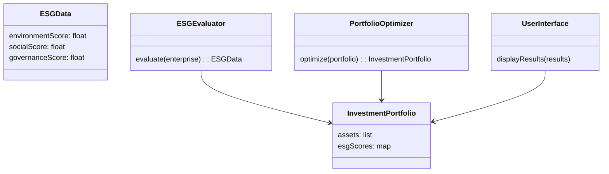
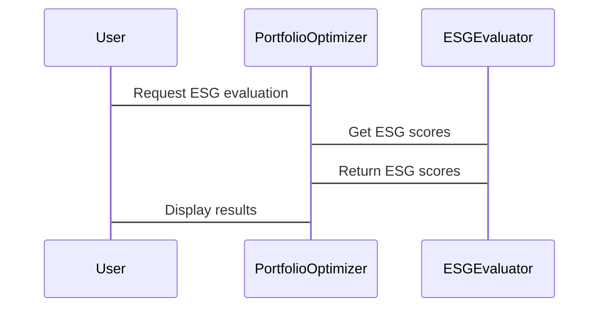

                 


# 构建智能化的个人投资组合ESG因素评估工具

## 关键词：智能化投资组合、ESG评估、机器学习、系统架构、Python实现

## 摘要：本文旨在探讨如何利用人工智能技术构建智能化的个人投资组合ESG因素评估工具。通过分析ESG的核心概念、算法原理、系统架构设计以及实际项目实现，提供一套从理论到实践的解决方案，帮助投资者更好地进行ESG因素评估，优化投资组合。

---

# 第一部分: 智能化个人投资组合与ESG因素概述

## 第1章: 智能化个人投资组合与ESG因素概述

### 1.1 ESG投资的背景与重要性

#### 1.1.1 ESG投资的定义与内涵
ESG（Environmental, Social, Governance）投资是指在投资决策中考虑环境、社会和公司治理三个方面的因素。ESG投资不仅仅是关注企业的财务表现，更关注企业对环境的影响、社会责任履行情况以及公司治理的透明度。

- 环境（E）：关注企业对环境的影响，包括碳排放、能源使用效率、资源利用等。
- 社会（S）：关注企业对社会的贡献，包括员工权益、社区参与、产品安全等。
- 治理（G）：关注企业的治理结构，包括董事会构成、高管薪酬、股东权利等。

#### 1.1.2 ESG投资的背景与发展趋势
随着全球对可持续发展和绿色金融的关注增加，ESG投资逐渐成为主流。投资者越来越关注企业是否具备长期的可持续发展能力，而不仅仅是短期的财务回报。ESG投资不仅有助于减少投资风险，还能带来更高的长期收益。

#### 1.1.3 ESG投资对个人投资组合的影响
在传统的投资组合中，投资者主要关注资产的收益和风险。而ESG投资通过引入环境、社会和治理因素，可以帮助投资者筛选出更具可持续性的企业，降低投资组合的风险，同时提升长期收益。

### 1.2 智能化投资组合的定义与特点

#### 1.2.1 智能化投资组合的概念
智能化投资组合是指利用人工智能和大数据技术，根据市场动态、投资者风险偏好和ESG评分等多维度因素，自动优化投资组合配置。

#### 1.2.2 智能化投资组合的核心优势
- **自动化**：通过算法自动调整投资组合，无需人工干预。
- **数据驱动**：利用大数据分析企业ESG表现，提供更精准的投资决策。
- **实时性**：能够实时跟踪市场变化和企业动态，快速调整投资策略。

#### 1.2.3 智能化投资组合与传统投资组合的区别
- 传统投资组合主要依赖人工分析和固定模型，而智能化投资组合利用AI技术实现动态调整。
- 传统投资组合关注财务指标，而智能化投资组合还考虑ESG因素。

### 1.3 本章小结
本章介绍了ESG投资的背景、内涵及其对个人投资组合的影响，还详细阐述了智能化投资组合的定义和特点，为后续的ESG因素评估奠定了基础。

---

## 第2章: ESG因素的核心概念与联系

### 2.1 ESG因素的定义与分类

#### 2.1.1 环境（E）因素
环境因素关注企业在环境保护方面的表现，包括：
- **碳排放**：企业生产过程中产生的温室气体排放量。
- **能源使用效率**：企业是否采用高效能源利用技术。
- **资源利用**：企业是否合理利用自然资源，减少浪费。

#### 2.1.2 社会（S）因素
社会因素关注企业在社会责任方面的表现，包括：
- **员工权益**：员工的工资、福利、工作条件等。
- **社区参与**：企业是否积极参与社区公益活动。
- **产品安全**：产品是否符合安全标准，是否存在安全隐患。

#### 2.1.3 治理（G）因素
治理因素关注企业的治理结构，包括：
- **董事会构成**：董事会是否多元化，是否有独立董事。
- **高管薪酬**：高管的薪酬是否合理，是否与公司绩效挂钩。
- **股东权利**：股东是否拥有足够的权利参与公司治理。

### 2.2 ESG因素之间的关系与影响

#### 2.2.1 E、S、G之间的相互作用
- **环境与社会**：企业对环境的保护可以提升社会形象，增强社会责任感。
- **环境与治理**：良好的公司治理可以促进企业更好地履行环境责任。
- **社会与治理**：企业履行社会责任可以提升治理透明度，增强股东信任。

#### 2.2.2 ESG因素对投资组合价值的影响
通过分析企业的ESG表现，投资者可以更好地评估企业的长期风险和收益，从而优化投资组合配置。

#### 2.2.3 ESG评分的计算方法
ESG评分是根据企业在环境、社会和治理三个方面的表现综合计算得出的。评分通常采用标准化的指标，通过加权计算得出最终评分。

### 2.3 本章小结
本章详细阐述了ESG因素的核心概念及其相互关系，为后续的ESG评分计算和算法实现奠定了理论基础。

---

## 第3章: ESG因素评估的算法原理

### 3.1 ESG评分计算的数学模型

#### 3.1.1 线性回归模型
线性回归模型是一种常用的回归分析方法，适用于预测连续型变量。

$$ y = \beta_0 + \beta_1 x_1 + \beta_2 x_2 + \cdots + \beta_n x_n + \epsilon $$

其中，$y$是目标变量（ESG评分），$x_i$是自变量（环境、社会、治理因素），$\beta_i$是回归系数，$\epsilon$是误差项。

#### 3.1.2 随机森林模型
随机森林是一种基于决策树的集成学习方法，适用于处理高维数据和非线性关系。

### 3.2 算法原理的详细讲解

#### 3.2.1 线性回归模型

##### 3.2.1.1 数据预处理
- 数据清洗：处理缺失值、异常值。
- 特征标准化：对特征进行标准化处理，确保模型收敛。

##### 3.2.1.2 模型训练
- 选择合适的特征。
- 确定回归系数。

##### 3.2.1.3 模型预测
- 根据训练好的模型，预测新的数据点的ESG评分。

##### 3.2.1.4 模型评估
- 使用均方误差（MSE）和R²系数评估模型性能。

#### 3.2.2 随机森林模型

##### 3.2.2.1 数据预处理
- 同样需要进行数据清洗和特征标准化。

##### 3.2.2.2 模型训练
- 构建多棵决策树。
- 对决策树进行投票或平均，得到最终预测结果。

##### 3.2.2.3 模型预测
- 使用集成的决策树进行预测。

##### 3.2.2.4 模型评估
- 使用准确率、召回率等指标评估模型性能。

### 3.3 本章小结
本章详细介绍了ESG评分计算的数学模型和算法原理，包括线性回归和随机森林模型的实现步骤和评估方法。

---

## 第4章: 系统分析与架构设计方案

### 4.1 问题场景介绍
- 投资者需要一个智能化的工具，根据ESG评分优化投资组合配置。
- 系统需要实时获取企业的ESG数据，分析企业的ESG表现。

### 4.2 项目介绍
- 项目目标：构建智能化的个人投资组合ESG因素评估工具。
- 项目范围：支持多维度的ESG数据分析，提供个性化的投资建议。

### 4.3 系统功能设计

#### 4.3.1 领域模型（Mermaid类图）


#### 4.3.2 系统架构设计（Mermaid架构图）


### 4.4 系统接口设计
- 数据接口：与ESG数据源对接，获取企业ESG数据。
- 用户接口：提供友好的用户界面，展示ESG评分和投资建议。

### 4.5 系统交互设计（Mermaid序列图）


### 4.6 本章小结
本章详细设计了系统的功能模块和架构，为后续的系统实现奠定了基础。

---

## 第5章: 项目实战

### 5.1 环境安装

#### 5.1.1 安装Python
```bash
python --version
pip install --upgrade pip
```

#### 5.1.2 安装依赖库
```bash
pip install numpy pandas scikit-learn matplotlib
```

### 5.2 系统核心实现源代码

#### 5.2.1 ESG评分计算
```python
import pandas as pd
from sklearn.linear_model import LinearRegression
from sklearn.ensemble import RandomForestRegressor

# 数据预处理
data = pd.read_csv('esg_data.csv')
data.dropna(inplace=True)

# 特征工程
features = ['environment', 'social', 'governance']
target = 'esg_score'

# 训练模型
lr_model = LinearRegression()
lr_model.fit(data[features], data[target])

rf_model = RandomForestRegressor(n_estimators=100, random_state=42)
rf_model.fit(data[features], data[target])

# 模型预测
new_data = pd.DataFrame({'environment': [0.8], 'social': [0.7], 'governance': [0.6]})
print("Linear Regression预测结果:", lr_model.predict(new_data))
print("Random Forest预测结果:", rf_model.predict(new_data))
```

#### 5.2.2 投资组合优化
```python
import numpy as np
from scipy.optimize import minimize

# 定义优化目标函数
def portfolio_variance(weights, covariance_matrix):
    return (weights.T @ covariance_matrix @ weights).item()

# 定义约束条件
def portfolio_optimization(weights, covariance_matrix, return_vector, risk_aversion=0.01):
    return (risk_aversion * portfolio_variance(weights, covariance_matrix)) - (weights.T @ return_vector).item()

# 约束条件
constraints = {'type': 'eq', 'fun': lambda w: np.sum(w) - 1}

# 初始权重
initial_weights = np.array([0.3, 0.3, 0.4])

# 优化
result = minimize(portfolio_optimization, initial_weights, args=(covariance_matrix, return_vector), constraints=constraints)

print("最优权重:", result.x)
```

### 5.3 实际案例分析
假设我们有三个企业A、B、C，分别计算它们的ESG评分，并优化投资组合配置。

#### 5.3.1 案例分析
- 企业A：环境=0.8，社会=0.7，治理=0.6
- 企业B：环境=0.7，社会=0.8，治理=0.5
- 企业C：环境=0.6，社会=0.6，治理=0.7

通过模型计算，得出最优的投资组合配置。

### 5.4 本章小结
本章通过实际案例展示了如何利用Python代码实现ESG评分计算和投资组合优化，为读者提供了实用的参考。

---

## 第6章: 最佳实践与总结

### 6.1 小结
- 本文详细介绍了构建智能化的个人投资组合ESG因素评估工具的方法和步骤。
- 通过理论分析和实际案例，展示了如何利用机器学习算法优化投资组合配置。

### 6.2 注意事项
- 数据来源的可靠性对模型性能影响较大，需选择权威的ESG数据源。
- 模型的可解释性需要进一步提升，以便投资者更好地理解和应用。

### 6.3 拓展阅读
- 《机器学习实战》：深入理解机器学习算法的实现和应用。
- 《投资学原理》：学习投资组合优化的理论基础。

### 6.4 本章小结
本文通过详细分析和实际案例，展示了如何利用人工智能技术构建智能化的个人投资组合ESG因素评估工具，为投资者提供了新的思路和方法。

---

## 附录: 更多资源与工具

### 附录A: Python库与工具
- **Pandas**：数据处理
- **Scikit-learn**：机器学习算法
- **Matplotlib**：数据可视化

### 附录B: 数据来源
- **ESG数据源**：如MSCI、S&P Dow Jones等。

---

通过以上步骤，您可以系统地构建智能化的个人投资组合ESG因素评估工具，帮助投资者更好地进行ESG因素评估，优化投资组合配置。

