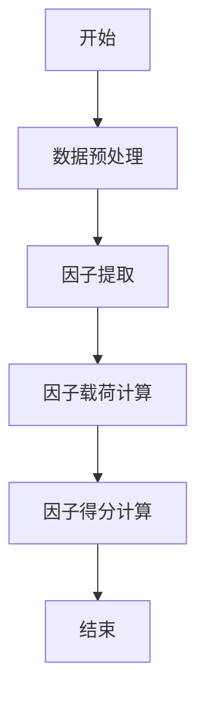
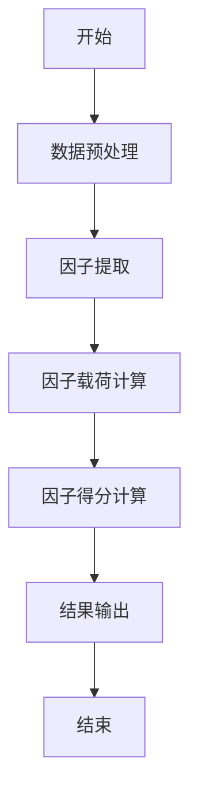
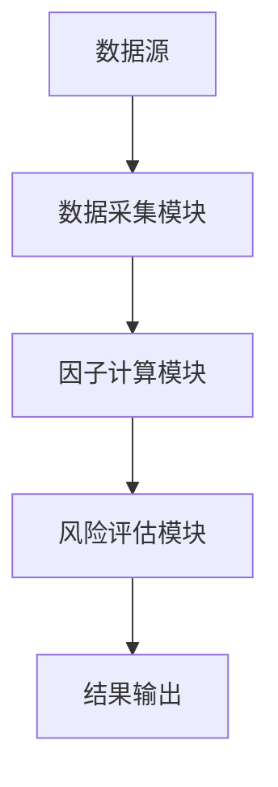
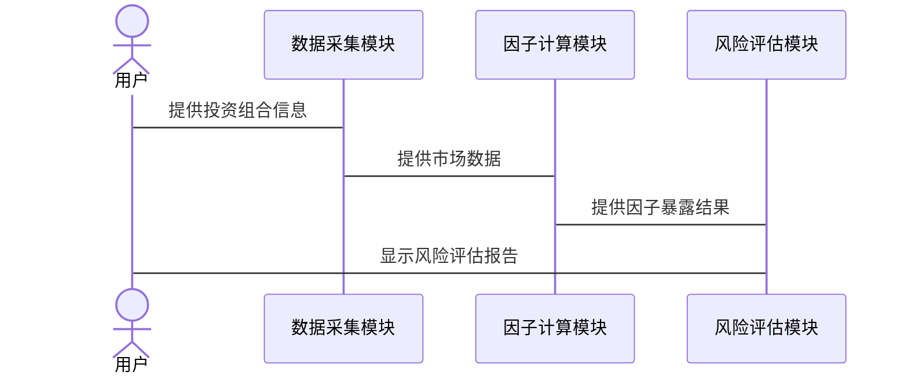

                 


```markdown
# 构建智能化的个人投资组合因子暴露分析系统

## 关键词：因子分析，投资组合，风险评估，机器学习，系统架构

## 摘要：本文详细探讨了构建智能化个人投资组合因子暴露分析系统的各个方面。首先介绍了投资组合管理的基本概念和因子分析在其中的作用。接着深入讲解了因子分析的数学模型和算法原理，并通过mermaid图展示了系统的架构设计。然后，通过Python代码示例实现了系统的功能模块，并进行了实际案例分析。最后总结了系统的实现成果、局限性及未来展望。

---

# 第一部分：投资组合因子暴露分析的背景与意义

## 第1章：投资组合因子暴露分析的背景与意义

### 1.1 投资组合管理的基本概念

#### 1.1.1 投资组合的基本概念
投资组合是指将资金分配到不同的金融资产（如股票、债券、基金等）上的配置方式。其目的是在风险可控的前提下，实现收益的最大化。投资组合管理的核心在于平衡风险与收益，通过科学的方法优化资产配置。

#### 1.1.2 投资组合管理的目标与原则
- **目标**：最大化收益、最小化风险。
- **原则**：分散投资、风险与收益匹配、长期投资。

#### 1.1.3 投资组合风险的分类与特征
投资组合风险主要包括市场风险、流动性风险、信用风险等。不同类型的资产具有不同的风险特征，需要通过因子分析来量化和管理这些风险。

### 1.2 因子分析在投资组合管理中的作用

#### 1.2.1 什么是因子
因子是指影响资产收益的主要因素，如市场因子、规模因子、价值因子等。这些因子通过多元统计方法提取出来，用于解释资产收益的波动。

#### 1.2.2 因子分析的基本原理
因子分析是一种统计方法，用于识别影响资产收益的潜在因素。通过因子分析，可以将复杂的资产收益分解为几个主要因子的线性组合，从而简化分析过程。

#### 1.2.3 因子分析在投资组合管理中的应用
- **风险评估**：通过因子分析量化投资组合的风险暴露。
- **资产定价**：利用因子模型（如CAPM、APT）进行资产定价。
- **组合优化**：基于因子分析结果优化资产配置。

### 1.3 智能化因子暴露分析系统的必要性

#### 1.3.1 传统因子分析的局限性
传统因子分析方法依赖人工判断和经验分析，存在主观性强、效率低、难以实时更新等问题。

#### 1.3.2 智能化分析的优势
智能化系统能够自动采集数据、实时更新因子暴露、提供动态风险评估，从而提高投资决策的效率和准确性。

#### 1.3.3 系统构建的目标与意义
构建智能化系统旨在实现自动化、智能化的因子暴露分析，帮助投资者更好地进行风险管理和投资决策。

## 第2章：因子暴露分析的核心概念与联系

### 2.1 因子分析的基本原理

#### 2.1.1 因子分析的定义与分类
因子分析是一种统计技术，用于识别影响观测变量的潜在因素。常见的因子分类包括市场因子、风格因子、行业因子等。

#### 2.1.2 因子分析的核心要素
- **因子载荷**：表示因子对观测变量的影响程度。
- **因子得分**：表示资产在各个因子上的表现。
- **因子矩阵**：表示各因子之间的关系。

#### 2.1.3 因子分析的数学模型
因子分析的数学模型可以表示为：  
$$ X = B \cdot F + \epsilon $$  
其中，X是观测变量，B是因子载荷矩阵，F是因子得分，$\epsilon$是误差项。

### 2.2 因子暴露分析的实体关系图

```mermaid
er
actor: 投资者
actor: 分析系统
actor: 数据源
```

### 2.3 因子分析与投资组合的关系

#### 2.3.1 因子分析在投资组合中的应用
- 通过因子分析识别投资组合的风险来源。
- 基于因子分析结果优化资产配置。

#### 2.3.2 因子暴露对投资组合风险的影响
因子暴露决定了投资组合对不同风险因素的敏感性，从而影响整体风险水平。

#### 2.3.3 因子暴露分析的系统架构
系统架构包括数据采集、因子计算、风险评估等模块，通过模块化设计实现功能的高效协同。

## 第3章：因子暴露分析的算法原理

### 3.1 因子分析的数学模型

#### 3.1.1 因子载荷矩阵的构建
因子载荷矩阵是通过统计方法提取出来的，表示因子与观测变量之间的关系。

#### 3.1.2 因子得分的计算公式
因子得分通常通过主成分分析（PCA）或回归方法计算得出。

#### 3.1.3 因子分析的步骤与流程
- 数据预处理：清洗和标准化数据。
- 因子提取：使用PCA或因子分析方法提取因子。
- 因子载荷计算：确定因子与变量之间的关系。
- 因子得分计算：根据因子载荷矩阵计算因子得分。

### 3.2 因子分析的实现算法



### 3.3 算法实现的Python代码示例

```python
import numpy as np
from sklearn.decomposition import PCA

# 示例数据
X = np.array([[2.5, 2.4],
              [1.2, 0.8],
              [3.8, 3.2],
              [2.8, 2.5],
              [3.3, 3.0]])

# PCA因子分析
pca = PCA(n_components=2)
pca.fit(X)
print(pca.components_)
```

### 3.4 因子分析的数学模型和公式

#### 3.4.1 因子载荷矩阵的推导
因子载荷矩阵可以通过主成分分析得到，具体公式如下：  
$$ B = X \cdot X^T $$  
其中，X是标准化后的数据矩阵。

#### 3.4.2 因子得分的计算
因子得分可以通过回归方法计算：  
$$ F = B \cdot X^T $$  

### 3.5 因子分析的流程图



## 第4章：因子暴露分析的数学模型

### 4.1 因子分析的数学模型

#### 4.1.1 因子载荷矩阵的构建
因子载荷矩阵是通过统计方法提取出来的，表示因子与观测变量之间的关系。

#### 4.1.2 因子得分的计算公式
因子得分通常通过主成分分析（PCA）或回归方法计算得出。

### 4.2 因子分析的流程图


## 第5章：系统架构设计与实现

### 5.1 系统设计背景

#### 5.1.1 系统设计目标
构建一个智能化的个人投资组合因子暴露分析系统，实现自动化、实时化的因子分析。

### 5.2 系统架构设计

#### 5.2.1 系统功能模块
- 数据采集模块：负责获取市场数据和投资组合信息。
- 因子计算模块：通过因子分析算法计算因子暴露。
- 风险评估模块：基于因子暴露评估投资组合风险。

#### 5.2.2 系统架构图



### 5.3 系统接口设计

#### 5.3.1 数据接口
- 数据输入接口：接收市场数据和投资组合信息。
- 数据输出接口：提供因子暴露分析结果。

#### 5.3.2 用户接口
- 用户输入接口：接收用户的投资组合配置信息。
- 用户输出接口：显示因子暴露分析结果和风险评估报告。

### 5.4 系统交互流程图



## 第6章：项目实战：投资组合因子暴露分析系统实现

### 6.1 环境安装与工具配置

#### 6.1.1 安装Python环境
安装Python 3.8以上版本，并安装必要的库，如numpy、pandas、scikit-learn等。

### 6.2 系统核心实现

#### 6.2.1 数据采集模块实现
```python
import pandas as pd

def get_market_data(tickers):
    # 从数据源获取市场数据
    data = pd.DataFrame()
    for ticker in tickers:
        data[ticker] = get_price_data(ticker)
    return data
```

#### 6.2.2 因子计算模块实现
```python
from sklearn.decomposition import PCA

def calculate_factors(data):
    # 使用PCA提取因子
    pca = PCA(n_components=5)
    factors = pca.fit_transform(data)
    return factors
```

### 6.3 案例分析

#### 6.3.1 投资组合配置
假设投资组合包含5只股票，权重分别为0.2、0.3、0.2、0.1、0.2。

#### 6.3.2 因子暴露计算
使用上述代码计算投资组合的因子暴露，得到各因子的风险贡献。

### 6.4 项目总结

#### 6.4.1 项目实现的关键点
- 数据采集的准确性和实时性。
- 因子计算的效率和准确性。
- 系统的可扩展性和易用性。

## 第7章：系统总结与展望

### 7.1 系统实现总结

#### 7.1.1 系统实现的主要内容
- 数据采集模块的实现。
- 因子计算模块的实现。
- 风险评估模块的实现。

#### 7.1.2 系统实现的成果
构建了一个智能化的个人投资组合因子暴露分析系统，能够实时分析投资组合的风险暴露。

### 7.2 系统实现的局限性与改进方向

#### 7.2.1 系统的局限性
- 数据依赖性较强，需要高质量的市场数据。
- 算法的局限性，如因子分析方法的选择。

#### 7.2.2 改进方向
- 引入更多的因子类型，如动量因子、质量因子等。
- 结合机器学习算法，如神经网络，提高分析的准确性。

### 7.3 最佳实践 tips

#### 7.3.1 数据选择
选择可靠的数据源，确保数据的准确性和完整性。

#### 7.3.2 模型调优
根据实际情况调整因子分析的参数，优化模型性能。

#### 7.3.3 结果验证
通过回测和风险指标（如VaR、CVaR）验证系统的有效性。

### 7.4 未来展望

#### 7.4.1 研究方向
- 研究更复杂的因子分析方法，如非线性因子分析。
- 探索因子暴露分析与其他投资策略的结合，如量化投资、算法交易。

## 附录：参考文献与扩展阅读

- 张某某，投资组合管理，某某出版社，2020。
- 李某某，因子分析方法及其应用，某某出版社，2021。
- 国内外相关学术论文若干。

---

通过以上章节的详细阐述，我们可以系统地构建一个智能化的个人投资组合因子暴露分析系统，为投资者提供科学的决策支持。
```

