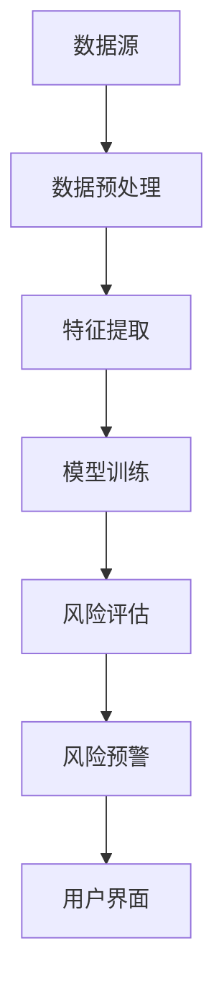

                 


# 构建智能化的个人投资组合尾部风险评估系统

## 关键词：
- 尾部风险
- 投资组合
- 机器学习
- 系统架构
- 风险评估

## 摘要：
本文旨在探讨如何利用机器学习和大数据技术构建智能化的个人投资组合尾部风险评估系统。通过对尾部风险的定义、特征及传统评估方法的分析，提出基于概率模型和时间序列分析的创新解决方案。结合系统架构设计和项目实战，详细阐述了从理论到实践的完整流程，为投资者提供高效、精准的风险管理工具。

---

## 第一部分: 智能化个人投资组合尾部风险评估系统概述

### 第1章: 尾部风险的基本概念与重要性

#### 1.1 尾部风险的定义与特征

**尾部风险**是指在投资组合中，发生概率极低但影响极大的事件所引发的潜在损失。与传统风险评估不同，尾部风险关注的是“黑天鹅”事件或“灰犀牛”事件，这些事件往往超出历史数据的分布范围，导致投资组合出现重大损失。

**尾部风险的特征**包括：
1. **低概率性**：发生概率极小，但影响巨大。
2. **不可预测性**：传统统计模型难以捕捉。
3. **高破坏性**：一旦发生，可能导致投资组合的严重损失。

#### 1.2 尾部风险的重要性

在现代投资中，尾部风险的重要性体现在以下几个方面：
1. **保护投资组合**：通过识别和管理尾部风险，可以降低投资组合在极端情况下的损失。
2. **优化资产配置**：了解尾部风险可以帮助投资者更好地进行资产配置，避免过度集中风险。
3. **提升风险管理能力**：智能化的尾部风险评估系统能够实时监控市场动态，提供及时的风险预警。

### 第2章: 传统投资组合风险评估方法

#### 2.1 传统风险评估方法概述

传统的投资组合风险评估方法主要包括：
1. **马科维茨均值-方差模型**：通过优化资产配置，最小化投资组合的波动性。
2. **风险中性定价模型**：基于市场中性假设，评估资产的潜在风险。
3. **历史波动率法**：通过历史数据计算资产的波动性，作为风险衡量指标。

#### 2.2 传统方法的局限性

1. **无法捕捉极端事件**：传统方法假设市场符合正态分布，忽视了“黑天鹅”事件的可能性。
2. **对尾部风险的忽视**：传统方法主要关注平均情况下的风险，而忽视了极端情况下的潜在损失。
3. **方法的静态性和简化性**：传统方法通常基于静态假设，难以适应市场动态变化。

### 第3章: 智能化尾部风险评估的必要性

#### 3.1 数据驱动的优势

随着大数据技术的发展，数据驱动的方法在金融领域的优势日益显著：
1. **精准性**：通过海量数据的分析，能够更准确地识别潜在风险。
2. **实时性**：智能化系统可以实时监控市场动态，及时发现潜在风险。
3. **动态性**：数据驱动的方法能够捕捉市场的动态变化，提供更及时的风险评估。

#### 3.2 人工智能在金融领域的应用

人工智能技术在金融领域的应用主要体现在以下几个方面：
1. **机器学习**：用于预测市场趋势和识别潜在风险。
2. **深度学习**：用于分析复杂的数据模式和非线性关系。
3. **自然语言处理**：用于分析市场情绪和新闻影响。

#### 3.3 智能化尾部风险评估的核心价值

1. **提高风险预测的准确性**：通过机器学习算法，能够更准确地识别尾部风险。
2. **实现风险的动态监控**：智能化系统可以实时监控市场动态，提供及时的风险预警。
3. **优化投资组合的稳定性**：通过尾部风险的识别和管理，可以显著降低投资组合的波动性。

---

## 第二部分: 尾部风险评估的机器学习算法

### 第4章: 机器学习在尾部风险评估中的应用

#### 4.1 机器学习算法的分类与选择

在尾部风险评估中，常用的机器学习算法包括：
1. **监督学习**：如支持向量机（SVM）、随机森林（Random Forest）。
2. **非监督学习**：如聚类分析。
3. **强化学习**：用于动态环境下的风险决策。

#### 4.2 常用算法介绍

1. **支持向量机（SVM）**：适用于分类问题，能够处理非线性数据。
2. **随机森林（Random Forest）**：适用于特征较多的情况，具有较强的鲁棒性。
3. **神经网络（Neural Networks）**：适用于复杂非线性关系的建模。

### 第5章: 基于概率模型的尾部风险预测

#### 5.1 概率分布与尾部风险

1. **正态分布**：传统风险评估假设市场符合正态分布，但忽视了尾部风险。
2. **幂律分布**：更适合描述“黑天鹅”事件，具有“肥尾”特征。
3. **压缩分布**：通过压缩数据分布，识别潜在的极端事件。

#### 5.2 基于概率模型的算法实现

1. **朴素贝叶斯模型**：用于分类问题，基于概率假设进行风险预测。
2. **高斯混合模型**：适用于聚类分析，识别潜在风险区域。
3. **马尔可夫链蒙特卡洛方法**：用于模拟极端事件的概率分布。

### 第6章: 时间序列分析与尾部风险预测

#### 6.1 时间序列分析的基本概念

时间序列分析是一种基于历史数据预测未来趋势的方法，常用于金融市场的波动性分析。

#### 6.2 时间序列分析在尾部风险中的应用

1. **ARIMA模型**：用于预测市场的短期波动。
2. **GARCH模型**：用于捕捉市场的波动性变化。
3. **LSTM网络**：适用于长期依赖关系的建模，能够捕捉市场的复杂动态。

---

## 第三部分: 系统架构设计与实现

### 第7章: 系统架构设计

#### 7.1 系统模块设计

1. **数据采集模块**：负责收集市场数据和新闻信息。
2. **风险评估模块**：基于机器学习算法，评估投资组合的尾部风险。
3. **风险预警模块**：提供实时风险预警和决策建议。
4. **用户界面模块**：为用户提供直观的风险评估结果和可视化界面。

#### 7.2 系统架构图



#### 7.3 系统接口设计

系统接口主要分为数据接口和用户接口，数据接口用于与数据源对接，用户接口用于与用户交互。

### 第8章: 项目实战

#### 8.1 环境安装

1. 安装Python环境：推荐使用Anaconda。
2. 安装相关库：如pandas、numpy、scikit-learn、keras等。

#### 8.2 核心代码实现

```python
import numpy as np
import pandas as pd
from sklearn.model_selection import train_test_split
from sklearn.ensemble import RandomForestClassifier
from sklearn.metrics import accuracy_score

# 加载数据
data = pd.read_csv('investment_data.csv')
X = data.drop('label', axis=1)
y = data['label']

# 数据分割
X_train, X_test, y_train, y_test = train_test_split(X, y, test_size=0.2, random_state=42)

# 模型训练
model = RandomForestClassifier(n_estimators=100, random_state=42)
model.fit(X_train, y_train)

# 模型预测
y_pred = model.predict(X_test)

# 模型评估
print("准确率:", accuracy_score(y_test, y_pred))
```

#### 8.3 案例分析

通过实际案例分析，验证模型的准确性和实用性。例如，使用历史数据训练模型，并预测未来一段时间内的尾部风险。

---

## 第四部分: 总结与展望

### 第9章: 总结与展望

#### 9.1 系统总结

智能化的个人投资组合尾部风险评估系统通过结合机器学习和大数据技术，能够有效识别和管理尾部风险，为投资者提供更精准的风险管理工具。

#### 9.2 未来展望

未来，随着人工智能技术的不断发展，尾部风险评估系统将更加智能化和个性化。可能的发展方向包括：
1. 更加复杂的风险模型。
2. 实时监控和动态调整。
3. 多维度数据分析。

### 第10章: 最佳实践与小结

#### 10.1 最佳实践

1. **数据质量**：确保数据的准确性和完整性。
2. **模型选择**：根据实际情况选择合适的算法。
3. **持续优化**：定期更新模型和数据，确保系统的有效性。

#### 10.2 小结

通过本文的介绍，读者可以了解到如何利用机器学习技术构建智能化的尾部风险评估系统。从理论到实践，完整地展示了系统的设计与实现过程，为投资者提供了有效的风险管理工具。

---

以上是《构建智能化的个人投资组合尾部风险评估系统》的完整内容，希望对您有所帮助！

