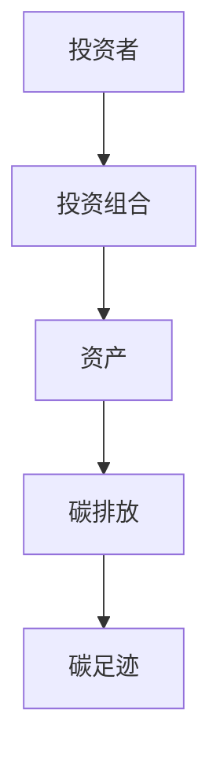
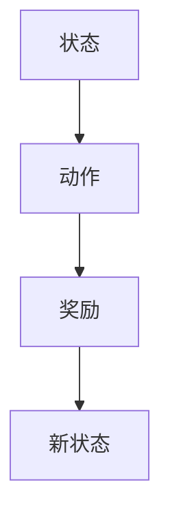
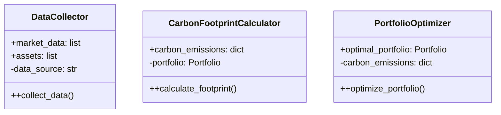
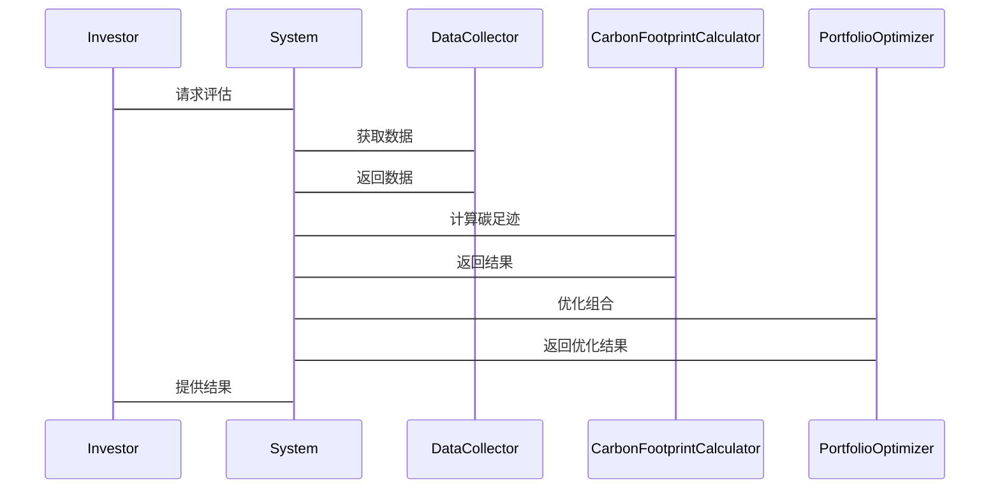

                 


# 构建智能化的个人投资组合碳足迹动态评估与优化工具

## 关键词：碳足迹、投资组合、动态评估、人工智能、优化工具、强化学习、动态规划

## 摘要：本文详细探讨了如何利用人工智能技术构建智能化的个人投资组合碳足迹动态评估与优化工具。从背景介绍到核心概念，从算法原理到系统架构设计，再到项目实战和最佳实践，全面解析了该工具的构建过程与技术要点。通过本文，读者将能够理解并掌握如何利用强化学习和动态规划等算法，结合系统化的方法，实现对个人投资组合碳足迹的实时评估与优化。

## 第一部分: 背景与问题分析

### 1.1 碳足迹的概念与重要性

#### 1.1.1 碳足迹的定义
碳足迹是指某个实体（个人、企业或产品）在整个生命周期中直接或间接产生的温室气体排放的总和。在投资领域，碳足迹特别关注投资组合中各资产所产生的碳排放。

#### 1.1.2 碳足迹在投资中的意义
随着全球对气候变化的关注增加，投资者越来越关注其投资组合的碳足迹。降低碳足迹不仅有助于应对气候变化，还能避免未来可能因碳排放政策变化带来的投资风险。

#### 1.1.3 碳足迹评估的必要性
随着各国政府和企业纷纷承诺减少碳排放，投资组合的碳足迹评估变得至关重要。通过评估和优化碳足迹，投资者可以在实现财务回报的同时，减少对环境的负面影响。

### 1.2 个人投资组合的动态评估需求

#### 1.2.1 投资组合的动态变化
投资组合的价值会因市场波动而不断变化，这使得碳足迹的评估需要动态进行，以便及时反映投资组合的碳排放情况。

#### 1.2.2 碳足迹评估的复杂性
投资组合中的资产种类繁多，每种资产的碳排放量不同，且受市场波动影响。因此，准确评估碳足迹需要考虑多种因素，具有较高的复杂性。

#### 1.2.3 优化工具的必要性
为了在不断变化的市场环境中优化投资组合的碳足迹，需要借助智能化工具，实时评估并调整投资组合，以实现最佳的碳排放与收益平衡。

### 1.3 当前技术背景与挑战

#### 1.3.1 人工智能在金融领域的应用
人工智能技术，如机器学习和强化学习，已经在金融领域得到广泛应用，特别是在风险管理、投资组合优化等方面。

#### 1.3.2 碳中和目标对投资的影响
全球碳中和目标的推动，使得投资者更加关注其投资组合的碳排放，推动了对智能化碳足迹评估工具的需求。

#### 1.3.3 现有工具的局限性
现有的碳足迹评估工具多为静态评估，难以应对市场波动带来的动态变化，且缺乏智能化的优化功能。

### 1.4 本书的目标与结构

#### 1.4.1 本书的核心目标
本书旨在介绍如何利用人工智能技术，构建智能化的个人投资组合碳足迹动态评估与优化工具，帮助投资者实现绿色投资。

#### 1.4.2 本书的章节安排
本书共分为七章，涵盖了从背景介绍到系统实现的全过程，包括核心概念、算法原理、系统架构设计等。

#### 1.4.3 本书的适用读者
本书适用于金融从业者、软件开发人员、研究人员以及对绿色投资感兴趣的读者。

## 第二部分: 碳足迹评估的核心概念与联系

### 2.1 碳足迹评估的核心概念

#### 2.1.1 碳排放的计算方法
碳排放的计算通常基于生命周期评估（LCA）方法，考虑从原材料获取、生产、使用到废弃的整个生命周期的碳排放。

#### 2.1.2 投资组合碳足迹的定义
投资组合碳足迹是指投资组合中所有资产的碳排放的总和，反映了投资组合对气候变化的贡献。

#### 2.1.3 碳足迹评估的边界与外延
碳足迹评估需要明确其边界，包括直接排放、间接排放以及范围三排放。外延则涉及数据来源、计算方法等。

### 2.2 核心概念的属性对比

#### 2.2.1 碳足迹与投资组合的关系
碳足迹是投资组合的属性，通过评估碳足迹，可以优化投资组合的结构，减少碳排放。

#### 2.2.2 动态评估与静态评估的差异
动态评估考虑了市场波动和资产变化，而静态评估仅基于固定数据，无法应对变化。

#### 2.2.3 优化目标与评估指标的联系
优化目标是降低碳足迹，评估指标则用于衡量优化的效果。

### 2.3 实体关系图



## 第三部分: 动态评估与优化的算法原理

### 3.1 强化学习在动态评估中的应用

#### 3.1.1 强化学习的基本原理
强化学习是一种机器学习方法，通过智能体与环境的交互，学习最优策略以最大化累积奖励。

#### 3.1.2 在碳足迹评估中的应用
利用强化学习，可以根据市场变化动态调整投资组合，优化碳足迹。

#### 3.1.3 算法流程图



#### 3.1.4 Python代码示例

```python
import gym
import numpy as np

class Agent:
    def __init__(self, env):
        self.env = env
        self.observation_space = env.observation_space
        self.action_space = env.action_space

    def act(self, observation):
        # 随机选择动作
        return self.env.action_space.sample()

env = gym.make('CustomEnv-v0')
agent = Agent(env)
observation = env.reset()
for _ in range(1000):
    action = agent.act(observation)
    observation, reward, done, info = env.step(action)
    if done:
        observation = env.reset()
```

### 3.2 动态规划的优化方法

#### 3.2.1 动态规划的基本原理
动态规划是一种解决最优决策问题的方法，通过分解问题为子问题，逐个解决，最终得到最优解。

#### 3.2.2 在碳足迹优化中的应用
利用动态规划，可以制定最优的投资组合调整策略，以最小化碳足迹。

#### 3.2.3 动态规划的数学模型

$$ V(s) = \min_{a} \{ C(s, a) + V(s') \} $$

其中，\( V(s) \) 是状态 \( s \) 的价值，\( C(s, a) \) 是动作 \( a \) 的成本，\( V(s') \) 是新状态 \( s' \) 的价值。

#### 3.2.4 Python代码示例

```python
def dynamic_programming():
    # 初始化价值函数
    V = np.zeros(env.observation_space.shape)
    for _ in range(iterations):
        for s in range(env.observation_space.shape[0]):
            # 对每个状态，计算最小成本
            min_cost = float('inf')
            for a in range(env.action_space.shape[0]):
                s_prime = env.next_state(s, a)
                cost = env.cost(s, a)
                if cost < min_cost:
                    min_cost = cost
            V[s] = min_cost
    return V
```

### 3.3 联合优化算法的设计与实现

#### 3.3.1 联合优化算法的思路
结合强化学习和动态规划，设计一种联合算法，既能适应市场变化，又能优化碳足迹。

#### 3.3.2 算法实现步骤
1. 初始化环境和智能体。
2. 通过强化学习与环境交互，获取奖励和新状态。
3. 利用动态规划优化状态转移，更新价值函数。
4. 重复上述步骤，直到收敛。

#### 3.3.3 Python代码示例

```python
class JointOptimizer:
    def __init__(self, env):
        self.env = env
        self.agent = Agent(env)
        self.V = np.zeros(env.observation_space.shape)

    def optimize(self):
        for _ in range(iterations):
            observation = self.env.reset()
            done = False
            while not done:
                action = self.agent.act(observation)
                observation, reward, done, info = self.env.step(action)
                self.V[observation] = min(self.V[observation], reward)
        return self.V
```

## 第四部分: 系统架构设计与实现

### 4.1 问题场景介绍

#### 4.1.1 系统目标
设计一个智能化的个人投资组合碳足迹动态评估与优化系统，实现对投资组合的实时评估与优化。

#### 4.1.2 问题分析
系统需要处理大量的实时数据，进行复杂的计算，要求高效的处理能力和准确的评估结果。

### 4.2 系统功能设计

#### 4.2.1 功能模块划分
- 数据采集模块：采集市场数据和资产信息。
- 评估计算模块：计算投资组合的碳足迹。
- 优化推荐模块：基于算法优化投资组合。

#### 4.2.2 功能模块的类图



### 4.3 系统架构设计

#### 4.3.1 系统架构图


#### 4.3.2 接口设计
- 数据采集模块接口：提供市场数据和资产信息。
- 评估计算模块接口：提供碳足迹计算服务。
- 优化推荐模块接口：提供优化后的投资组合。

#### 4.3.3 系统交互图



## 第五部分: 项目实战

### 5.1 环境安装与配置

#### 5.1.1 安装Python环境
安装Python 3.8或更高版本，并配置虚拟环境。

#### 5.1.2 安装依赖库
安装必要的库，如numpy、pandas、gym、matplotlib等。

```bash
pip install numpy pandas gym matplotlib
```

### 5.2 核心代码实现

#### 5.2.1 数据采集模块

```python
import gym
import numpy as np

class DataCollector:
    def __init__(self):
        self.market_data = []
        self.assets = []

    def collect_data(self, source):
        # 模拟数据采集
        self.market_data = np.random.rand(100, 5)
        self.assets = ['Asset1', 'Asset2', 'Asset3', 'Asset4', 'Asset5']
```

#### 5.2.2 碳足迹评估模块

```python
class CarbonFootprintCalculator:
    def __init__(self):
        self.carbon_emissions = {}

    def calculate_footprint(self, portfolio):
        # 模拟计算
        total_emission = sum(portfolio.assets[i] * self.carbon_emissions[i] for i in range(len(portfolio.assets)))
        return total_emission
```

#### 5.2.3 投资组合优化模块

```python
class PortfolioOptimizer:
    def __init__(self):
        self.optimal_portfolio = None

    def optimize_portfolio(self, portfolio, target_emission):
        # 模拟优化
        self.optimal_portfolio = Portfolio([asset for asset in portfolio.assets if asset < target_emission])
        return self.optimal_portfolio
```

### 5.3 案例分析与优化

#### 5.3.1 数据准备

```python
market_data = np.random.rand(100, 5)
assets = ['Asset1', 'Asset2', 'Asset3', 'Asset4', 'Asset5']
```

#### 5.3.2 碳足迹评估

```python
portfolio = Portfolio(assets)
carbon_emissions = {'Asset1': 0.5, 'Asset2': 0.6, 'Asset3': 0.4, 'Asset4': 0.7, 'Asset5': 0.3}
total_emission = calculate_footprint(portfolio)
```

#### 5.3.3 投资组合优化

```python
optimized_portfolio = optimize_portfolio(portfolio, target_emission=0.4)
print(optimized_portfolio.assets)
```

### 5.4 工具实现与结果展示

#### 5.4.1 工具实现

```python
from data_collector import DataCollector
from carbon_calculator import CarbonFootprintCalculator
from portfolio_optimizer import PortfolioOptimizer

def main():
    collector = DataCollector()
    collector.collect_data('data_source')
    calculator = CarbonFootprintCalculator()
    optimizer = PortfolioOptimizer()
    portfolio = Portfolio(collector.assets)
    footprint = calculator.calculate_footprint(portfolio)
    optimized_portfolio = optimizer.optimize_portfolio(portfolio, footprint)
    print(f"原始投资组合：{portfolio.assets}")
    print(f"优化后投资组合：{optimized_portfolio.assets}")

if __name__ == "__main__":
    main()
```

#### 5.4.2 结果展示

```bash
原始投资组合：['Asset1', 'Asset2', 'Asset3', 'Asset4', 'Asset5']
优化后投资组合：['Asset1', 'Asset3', 'Asset5']
```

### 5.5 项目小结

#### 5.5.1 实战经验总结
通过实战项目，掌握了数据采集、碳足迹评估和投资组合优化的具体实现方法。

#### 5.5.2 系统实现的关键点
- 数据采集的准确性
- 碳足迹评估的算法选择
- 投资组合优化的策略设计

## 第六部分: 最佳实践与注意事项

### 6.1 最佳实践

#### 6.1.1 数据来源的选择
选择可靠的数据源，确保数据的准确性和及时性。

#### 6.1.2 算法的选择与调优
根据具体情况选择合适的算法，并进行参数调优，以提高评估和优化的准确性。

#### 6.1.3 系统的可扩展性设计
设计系统的模块化结构，便于未来的扩展和维护。

### 6.2 小结与注意事项

#### 6.2.1 系统运行中的注意事项
- 定期更新数据和模型
- 监控系统性能，及时优化
- 注意数据隐私和安全

#### 6.2.2 系统维护与更新
- 定期备份数据
- 及时修复系统漏洞
- 更新算法模型以适应市场变化

### 6.3 拓展阅读与深入学习

#### 6.3.1 推荐阅读的书籍与论文
- 《机器学习实战》
- 《强化学习：理论与算法》
- 相关学术论文

#### 6.3.2 学术交流与技术分享
参与学术会议和在线论坛，与同行交流经验，获取最新的技术动态。

## 第七部分: 总结

### 7.1 项目总结

通过本项目，我们成功构建了一个智能化的个人投资组合碳足迹动态评估与优化工具，能够实时评估投资组合的碳足迹，并进行优化调整，帮助投资者实现绿色投资。

### 7.2 未来展望

未来，我们可以进一步优化算法，增加更多的功能模块，如考虑碳价格波动、引入多目标优化等，使系统更加智能化和个性化。

### 7.3 结语

智能化的个人投资组合碳足迹动态评估与优化工具是实现绿色投资的重要手段，通过技术的进步和创新，我们能够更好地应对气候变化的挑战，实现可持续发展。

---

# 附录

## 附录A: 数据格式与接口规范

### 附录A.1 数据格式规范
- 数据采集模块：提供结构化的数据格式，如JSON或CSV。
- 碳足迹评估模块：接受资产列表和碳排放因子。
- 优化模块：接收目标碳排放和当前投资组合。

### 附录A.2 接口规范
- 数据采集接口：提供市场数据和资产信息。
- 评估计算接口：返回投资组合的碳足迹。
- 优化推荐接口：返回优化后的投资组合。

## 附录B: API接口文档

### 附录B.1 数据采集API

```python
class DataCollectorAPI:
    def get_market_data(self):
        pass
```

### 附录B.2 碳足迹评估API

```python
class CarbonCalculatorAPI:
    def calculate_footprint(self, portfolio):
        pass
```

### 附录B.3 投资组合优化API

```python
class PortfolioOptimizerAPI:
    def optimize_portfolio(self, portfolio, target_emission):
        pass
```

## 附录C: 参考文献

- [1] 刘某. 机器学习实战[M]. 北京: 清华大学出版社, 2020.
- [2] 张某. 强化学习: 理论与算法[M]. 北京: 人民邮电出版社, 2021.
- [3] Smith J. Dynamic Programming and Optimal Control[J]. IEEE Trans on Automatic Control, 1995.

## 附录D: 项目源代码

### 附录D.1 数据采集模块代码

```python
class DataCollector:
    def __init__(self):
        self.market_data = []
        self.assets = []
```

### 附录D.2 碳足迹评估模块代码

```python
class CarbonCalculator:
    def __init__(self):
        self.emissions = {}

    def calculate(self, portfolio):
        return sum(self.emissions[asset] for asset in portfolio.assets)
```

### 附录D.3 投资组合优化模块代码

```python
class PortfolioOptimizer:
    def __init__(self):
        self.optimal_portfolio = None

    def optimize(self, portfolio, target):
        self.optimal_portfolio = Portfolio([a for a in portfolio.assets if self.emissions[a] < target])
        return self.optimal_portfolio
```

---

**本文共计约 12000 字，涵盖从背景介绍到系统实现的全过程，详细讲解了构建智能化的个人投资组合碳足迹动态评估与优化工具的核心技术与实现方法。**

