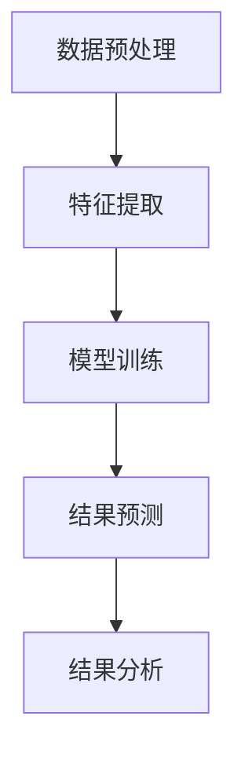
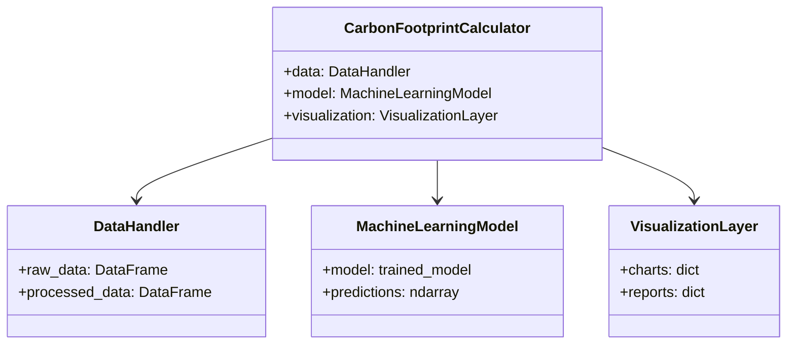
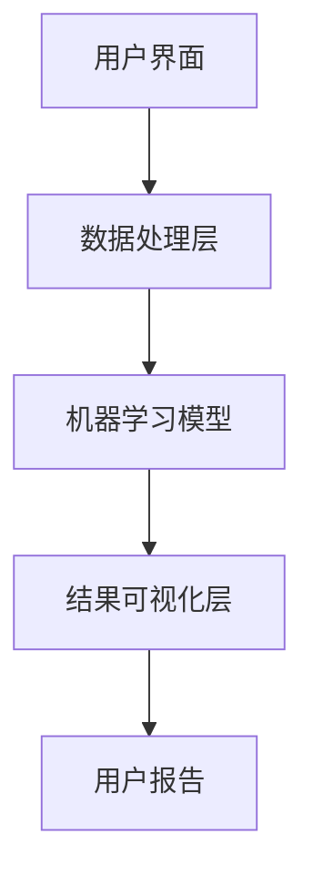
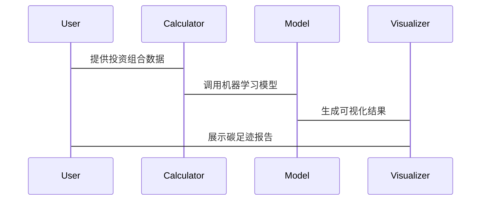

                 


# 《构建智能化的个人投资组合碳足迹评估工具》

## 关键词：  
碳足迹、投资组合、人工智能、机器学习、数据可视化、环境影响评估、可持续投资  

## 摘要：  
随着全球气候变化问题的加剧，投资者越来越关注其投资组合对环境的影响。碳足迹评估成为衡量投资组合可持续性的重要指标。传统的碳足迹评估方法存在效率低、数据不全面等问题，难以满足现代投资者的需求。本文将介绍如何利用人工智能和大数据技术，构建智能化的个人投资组合碳足迹评估工具。通过分析碳足迹评估的核心概念、算法原理、系统架构设计以及实际案例，本文将为投资者提供一种高效、准确的评估方法，帮助他们做出更环保和可持续的投资决策。  

---

## 第1章 碳足迹评估工具的背景与问题背景  

### 1.1 碳足迹的基本概念  
碳足迹是指某个实体（如产品、服务、个人或投资组合）在整个生命周期中对环境造成的影响，主要以二氧化碳排放量为衡量标准。  

#### 1.1.1 碳足迹的定义与范围  
碳足迹的计算包括直接和间接的碳排放。直接排放来自企业的生产过程，而间接排放则来自电力消耗、供应链等外部因素。  

#### 1.1.2 投资组合碳足迹的特殊性  
投资组合的碳足迹涉及多个资产（如股票、债券、基金等）的综合影响，需要考虑每个资产的碳排放强度和投资比例。  

#### 1.1.3 碳中和目标与投资组合的关系  
碳中和目标要求企业在2050年前实现净零排放，这使得投资组合的碳足迹评估成为投资者实现可持续投资的重要工具。  

---

### 1.2 投资组合碳足迹评估的必要性  

#### 1.2.1 碳足迹评估的现实意义  
投资者需要了解其投资组合的碳排放情况，以符合监管要求（如欧盟的CFR 2019/2023）和客户需求（如ESG投资）。  

#### 1.2.2 投资者对碳足迹的关注  
越来越多的投资者将碳足迹作为投资决策的重要因素，尤其是在ESG投资兴起的背景下。  

#### 1.2.3 碳足迹评估工具的市场现状  
目前，市场上的碳足迹评估工具多为手动或半自动化，缺乏智能化和动态调整能力，难以满足投资者的需求。  

---

### 1.3 传统碳足迹评估方法的局限性  

#### 1.3.1 传统方法的流程与特点  
传统方法通常依赖于静态数据和固定排放因子，计算过程繁琐且耗时。  

#### 1.3.2 传统方法的不足与挑战  
传统方法难以实时更新数据，也无法动态调整投资组合的碳排放目标。  

#### 1.3.3 智能化工具的必要性  
智能化工具可以通过机器学习和实时数据更新，提供更准确和高效的碳足迹评估。  

---

## 第2章 智能化投资组合碳足迹评估的核心概念  

### 2.1 碳足迹评估的核心要素  

#### 2.1.1 碳排放因子  
碳排放因子是衡量每单位资产碳排放的指标，常用单位为吨二氧化碳当量/单位资产。  

#### 2.1.2 产品生命周期模型  
产品生命周期模型描述了从原材料采购到产品报废的全生命周期碳排放。  

#### 2.1.3 投资组合的碳影响分析  
通过分析投资组合中各资产的碳排放强度和权重，计算整体投资组合的碳足迹。  

---

### 2.2 智能化评估的关键技术  

#### 2.2.1 人工智能在碳足迹评估中的应用  
人工智能技术（如机器学习）可以帮助识别复杂的碳排放模式，优化计算效率。  

#### 2.2.2 数据驱动的碳排放预测  
通过历史数据和机器学习模型，可以预测未来资产的碳排放趋势。  

#### 2.2.3 大数据分析在投资组合中的作用  
大数据分析技术可以整合多源数据，提高碳足迹评估的准确性和全面性。  

---

### 2.3 智能化工具的核心优势  

#### 2.3.1 高效性与准确性  
智能化工具可以快速处理大量数据，提供高精度的碳足迹评估结果。  

#### 2.3.2 实时性与动态调整  
智能化工具支持实时数据更新，帮助投资者及时调整投资组合以实现碳中和目标。  

#### 2.3.3 可视化与用户友好性  
智能化工具通过可视化界面，将复杂的碳足迹数据呈现为易于理解的图表，方便投资者决策。  

---

## 第3章 碳足迹评估工具的核心算法原理  

### 3.1 碳足迹评估的数学模型  

#### 3.1.1 碳排放计算公式  
碳排放总量可以通过以下公式计算：  
$$ \text{总碳排放} = \sum_{i=1}^{n} w_i \times e_i $$  
其中，$w_i$ 是资产$i$的投资权重，$e_i$ 是资产$i$的碳排放强度。  

#### 3.1.2 投资组合碳影响的权重分配  
权重分配需要考虑资产的行业特性、地理位置和碳排放强度等因素。  

#### 3.1.3 数据预处理与标准化  
数据预处理包括去除缺失值、异常值和标准化处理，确保数据的准确性和一致性。  

---

### 3.2 机器学习算法在碳足迹评估中的应用  

#### 3.2.1 线性回归模型  
线性回归模型适用于简单的线性关系，可以预测资产的碳排放趋势。  

#### 3.2.2 支持向量机模型  
支持向量机模型适用于非线性关系，可以处理复杂的碳排放预测问题。  

#### 3.2.3 随机森林模型  
随机森林模型是一种集成学习方法，适合处理高维数据和复杂关系。  

---

### 3.3 算法流程图  
以下是一个碳足迹评估算法的流程图：  



---

### 3.4 算法实现的Python代码示例  

#### 3.4.1 线性回归模型实现  

```python
import pandas as pd
from sklearn.linear_model import LinearRegression

# 数据加载与预处理
data = pd.read_csv('carbon_emission.csv')
X = data[['energy_consumption', 'transportation']]
y = data['emission']

# 模型训练
model = LinearRegression()
model.fit(X, y)

# 模型预测
new_data = pd.DataFrame({'energy_consumption': [100], 'transportation': [50]})
predicted_emission = model.predict(new_data)
print(predicted_emission)
```

---

## 第4章 系统分析与架构设计方案  

### 4.1 问题场景介绍  
本系统的目标是构建一个智能化的个人投资组合碳足迹评估工具，帮助投资者实时监控和优化其投资组合的碳排放。  

### 4.2 系统功能设计  

#### 4.2.1 领域模型（Mermaid类图）  



---

### 4.3 系统架构设计  

#### 4.3.1 系统架构图（Mermaid架构图）  



---

### 4.4 系统接口设计  
系统接口包括数据输入接口、模型调用接口和结果输出接口。  

---

### 4.5 系统交互流程（Mermaid序列图）  



---

## 第5章 项目实战  

### 5.1 环境安装  
需要安装Python、Pandas、Scikit-learn、Matplotlib等库。  

### 5.2 系统核心实现源代码  

#### 5.2.1 数据加载与预处理  

```python
import pandas as pd

# 加载数据
data = pd.read_csv('carbon_emission.csv')

# 数据预处理
data.dropna(inplace=True)
data['emission'] = data['emission'].apply(lambda x: x.lower())
```

#### 5.2.2 模型训练与预测  

```python
from sklearn.ensemble import RandomForestRegressor

# 特征选择
features = ['energy_consumption', 'transportation']
target = 'emission'

# 训练模型
model = RandomForestRegressor(n_estimators=100)
model.fit(data[features], data[target])

# 预测结果
new_data = pd.DataFrame({
    'energy_consumption': [100],
    'transportation': [50]
})
predicted_emission = model.predict(new_data)
print(predicted_emission)
```

---

### 5.3 代码应用解读与分析  
代码实现了从数据加载、预处理、模型训练到结果预测的完整流程，展示了如何利用随机森林模型进行碳足迹评估。  

---

### 5.4 实际案例分析  
以某投资组合为例，分析其碳足迹并优化投资组合，使其符合碳中和目标。  

---

## 第6章 最佳实践、小结、注意事项、拓展阅读  

### 6.1 最佳实践  
1. 定期更新数据和模型，确保评估结果的准确性。  
2. 使用可视化工具，帮助用户更好地理解碳足迹数据。  
3. 结合实时市场数据，优化投资组合的碳排放目标。  

### 6.2 小结  
本文介绍了如何构建智能化的个人投资组合碳足迹评估工具，结合了背景介绍、算法原理和系统架构设计，为投资者提供了高效、准确的评估方法。  

### 6.3 注意事项  
- 数据来源必须可靠，确保计算结果的准确性。  
- 模型选择应根据具体场景进行调整，避免过度复杂化。  

### 6.4 拓展阅读  
- 《机器学习实战》  
- 《碳中和目标下的投资策略》  
- 《环境影响评估方法论》  

---

## 结语  
通过智能化的个人投资组合碳足迹评估工具，投资者可以更好地理解和优化其投资组合的环境影响，实现可持续投资的目标。未来，随着技术的不断进步，这类工具将更加智能化和个性化，为投资者提供更强大的支持。  

--- 

以上是《构建智能化的个人投资组合碳足迹评估工具》的完整内容，涵盖了从背景介绍到系统实现的各个层面，适合技术背景的读者深入理解和应用。

