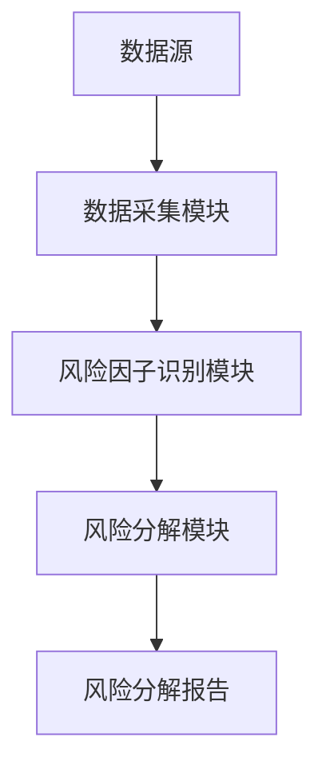
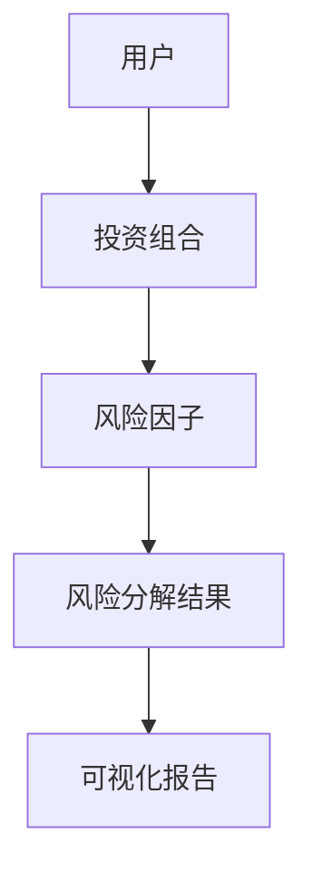
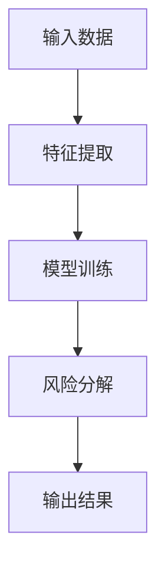
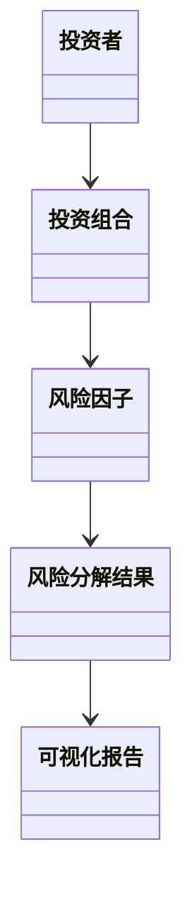
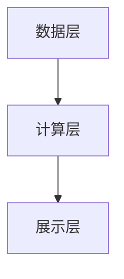
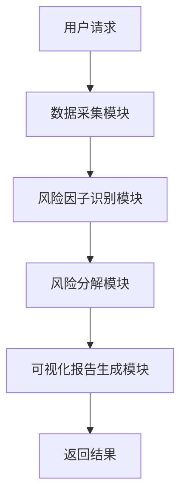

                 


# 构建智能化的个人投资组合风险分解系统

**关键词**：智能化，投资组合，风险分解，机器学习，系统架构

**摘要**：  
本文详细探讨了如何利用人工智能技术构建智能化的个人投资组合风险分解系统。通过对投资组合风险分解的背景、核心概念、算法原理、系统架构及项目实战的深入分析，结合实际案例，展示了如何利用技术手段优化投资组合风险管理。本文旨在为投资者和开发者提供一套高效、可靠的解决方案，帮助用户更好地理解投资风险并做出明智的决策。

---

# 第1章: 投资组合风险分解系统概述

## 1.1 问题背景与重要性

### 1.1.1 投资组合风险管理的重要性  
在金融领域，投资组合风险管理是投资者实现资产保值与增值的核心任务。传统的投资组合管理方法依赖于人工分析，存在效率低、主观性强、风险漏判等问题。随着人工智能技术的发展，智能化投资组合风险管理成为可能，能够显著提升风险识别的效率和准确性。

### 1.1.2 传统投资组合风险分解的局限性  
传统的风险分解方法主要依赖统计分析，例如方差-协方差矩阵分解。这些方法在处理复杂金融数据时存在以下问题：  
1. 无法捕捉非线性关系。  
2. 对异常值敏感。  
3. 无法实时更新。  

### 1.1.3 智能化分解的必要性与优势  
智能化投资组合风险分解系统通过引入机器学习和大数据分析技术，能够克服传统方法的局限性，实现以下目标：  
- **实时性**：快速响应市场变化。  
- **准确性**：通过深度学习模型捕捉复杂的风险因素。  
- **可解释性**：提供清晰的风险分解路径。  

---

## 1.2 问题描述与目标

### 1.2.1 投资组合风险分解的定义  
投资组合风险分解是指将投资组合的整体风险分解为各个资产或风险因子的贡献度。通过分析这些贡献，投资者可以更好地理解风险来源并优化投资组合。

### 1.2.2 系统目标与核心任务  
- **目标**：构建一个智能化的风险分解系统，能够实时分析投资组合的风险来源。  
- **核心任务**：  
  1. 数据采集与预处理。  
  2. 风险因子识别与建模。  
  3. 风险分解与可视化。  

### 1.2.3 系统边界与外延  
- **边界**：仅关注投资组合层面的风险分解，不涉及市场预测。  
- **外延**：可扩展至多资产类别、多市场环境。  

---

## 1.3 核心概念与系统架构

### 1.3.1 系统组成要素  
- **输入数据**：资产价格数据、市场因子数据。  
- **风险分解模型**：机器学习模型，用于风险因子识别与分解。  
- **输出结果**：风险分解报告、可视化图表。  

### 1.3.2 系统功能模块  
1. 数据采集模块：从金融数据库获取数据。  
2. 风险因子识别模块：通过机器学习算法提取风险因子。  
3. 风险分解模块：计算各因子对投资组合风险的贡献。  
4. 可视化模块：生成风险分解报告。  

### 1.3.3 系统架构图（Mermaid）  



---

# 第2章: 风险分解的核心概念与联系

## 2.1 风险分解的原理与方法

### 2.1.1 风险分解的基本原理  
风险分解的核心是将投资组合的总体波动性分解为各个风险因子的贡献。例如，市场波动、利率变化、行业风险等都可能是影响投资组合风险的因素。

### 2.1.2 常见风险分解方法对比  
以下是几种常见的风险分解方法对比：

| 方法         | 优点                 | 缺点                 |
|--------------|----------------------|----------------------|
| 方差-协方差矩阵分解 | 简单，易于实现       | 无法捕捉非线性关系   |
| 主成分分析（PCA） | 降低维度，提取主要风险因子 | 解释性较差           |
| 线性回归模型   | 可解释性强           | 无法处理非线性关系   |
| 神经网络模型   | 能捕捉复杂关系       | 黑箱问题，解释性差     |

### 2.1.3 智能化分解的创新点  
智能化分解通过引入深度学习模型，能够捕捉非线性关系，提升风险分解的准确性和深度。

---

## 2.2 核心概念属性对比表

| 核心概念      | 输入          | 输出          | 方法特点               |
|---------------|---------------|---------------|------------------------|
| 风险因子识别  | 资产价格数据  | 风险因子      | 基于机器学习模型       |
| 风险分解      | 风险因子      | 分解结果      | 基于优化算法           |
| 可视化        | 分解结果      | 可视化图表    | 提供直观的风险分布展示 |

---

## 2.3 系统实体关系图（Mermaid）



---

# 第3章: 算法原理与实现

## 3.1 算法原理概述

### 3.1.1 基于机器学习的风险分解模型  
我们选择使用 **线性回归模型** 作为风险分解的基础算法。其核心思想是将投资组合的风险分解为多个风险因子的线性组合。

### 3.1.2 算法流程图（Mermaid）



---

## 3.2 数学模型与公式

### 3.2.1 投资组合风险分解的数学模型  
假设投资组合包含 $n$ 个资产，其收益率分别为 $r_1, r_2, \dots, r_n$。我们希望通过分解这些收益率来识别风险因子 $f_1, f_2, \dots, f_m$。

数学模型可以表示为：  
$$ r_i = \beta_{i1}f_1 + \beta_{i2}f_2 + \dots + \beta_{im}f_m + \epsilon_i $$  

其中，$\beta_{ij}$ 是资产 $i$ 对因子 $j$ 的敏感性，$\epsilon_i$ 是残差项。

---

## 3.3 算法实现与代码示例

### 3.3.1 Python代码实现  

```python
import numpy as np
from sklearn.linear_model import LinearRegression

# 假设我们有m个因子，n个资产
m = 5
n = 10

# 随机生成因子载入系数
beta = np.random.randn(n, m)

# 生成因子值
factors = np.random.randn(m, 100)

# 计算资产收益
assets_returns = beta.dot(factors)

# 使用线性回归模型分解因子载入
model = LinearRegression().fit(factors.T, assets_returns.T)

# 打印分解结果
print("因子载入系数：\n", model.coef_)
```

### 3.3.2 代码功能解析  
上述代码通过线性回归模型，将资产收益分解为多个因子的线性组合，输出因子载入系数。

---

# 第4章: 系统分析与架构设计

## 4.1 问题场景与需求分析

### 4.1.1 系统目标用户  
- 机构投资者：需要实时监控投资组合风险。  
- 个人投资者：希望了解投资组合的风险来源。  

### 4.1.2 功能需求分析  
- 数据采集：从金融数据库获取资产价格和市场因子数据。  
- 风险因子识别：基于机器学习模型提取风险因子。  
- 风险分解：计算各因子对投资组合风险的贡献。  
- 可视化：生成风险分解报告。  

### 4.1.3 约束条件与边界  
- 数据输入格式必须标准化。  
- 系统需要支持高频数据处理。  

---

## 4.2 系统功能设计

### 4.2.1 领域模型类图（Mermaid）



---

## 4.3 系统架构设计

### 4.3.1 分层架构设计（Mermaid）



---

## 4.4 系统接口设计

### 4.4.1 API接口定义  
- `/api/v1/risk_factors`：获取风险因子数据。  
- `/api/v1/risk_decomposition`：计算风险分解结果。  

### 4.4.2 接口交互流程图（Mermaid）



---

# 第5章: 项目实战

## 5.1 环境安装与配置

### 5.1.1 安装Python与相关库  
```bash
pip install numpy scikit-learn matplotlib
```

### 5.1.2 数据源获取  
从金融数据库（如Yahoo Finance）获取资产价格数据。

---

## 5.2 核心代码实现

### 5.2.1 数据预处理代码  

```python
import pandas as pd
import numpy as np

# 从Yahoo Finance获取数据
def get_data(tickers, start_date, end_date):
    data = pd.DataFrame()
    for ticker in tickers:
        df = pd.read_csv(f'https://query1.finance.yahoo.com/d/1.0/{ticker}/' +
                          'history', 
                          header=[0, 1], 
                          index_col=0,
                          parse_dates=True,
                          usecols=[0,1,2,3])
        data[ticker] = df['Close']
    return data
```

### 5.2.2 风险分解代码  

```python
from sklearn.decomposition import PCA

def decompose_risk(data, n_components=5):
    # PCA用于提取风险因子
    pca = PCA(n_components=n_components)
    factors = pca.fit_transform(data.T)
    return factors, pca.components_
```

---

## 5.3 案例分析与结果解读

### 5.3.1 实际案例  
假设我们有一个包含5只股票的投资组合，使用PCA提取5个风险因子，计算各因子对投资组合风险的贡献。

### 5.3.2 分解结果解读  
通过PCA分解，我们发现前两个因子对投资组合风险的贡献最大，分别对应市场整体波动和行业风险。

---

## 5.4 项目小结

### 5.4.1 核心代码功能总结  
- 数据预处理：清洗和标准化数据。  
- 风险因子识别：使用PCA提取主要风险因子。  
- 风险分解：计算各因子对投资组合风险的贡献。  

### 5.4.2 实际应用价值  
通过本系统的实现，投资者可以更好地理解投资组合的风险来源，并据此优化投资策略。

---

# 第6章: 最佳实践与小结

## 6.1 最佳实践 tips

### 6.1.1 数据质量  
确保数据来源可靠，清洗充分。  

### 6.1.2 模型可解释性  
选择易于解释的模型，便于用户理解风险分解结果。  

### 6.1.3 系统可扩展性  
设计模块化的系统架构，便于后续功能扩展。  

---

## 6.2 系统小结

### 6.2.1 核心优势  
- 实时性：快速响应市场变化。  
- 准确性：通过机器学习捕捉复杂风险因素。  
- 可视化：提供直观的风险分解报告。  

### 6.2.2 拓展方向  
- 支持更多资产类别和市场环境。  
- 引入更复杂的深度学习模型。  

---

# 第7章: 总结

## 7.1 全文总结  
本文详细探讨了构建智能化个人投资组合风险分解系统的核心方法与实现路径。通过结合机器学习与大数据技术，我们提出了一套高效、准确的风险分解解决方案，为投资者优化投资组合风险管理提供了有力支持。

## 7.2 展望  
随着人工智能技术的不断发展，智能化投资组合风险管理将更加精确和智能化。未来，我们期待看到更多创新的解决方案，为投资者创造更大的价值。

---

**注意事项**：  
本文提供的代码和方法仅供参考，实际应用中需结合具体金融环境和数据进行调整。投资者在使用本系统前，请确保具备相关金融知识，并建议在专业顾问指导下进行操作。

