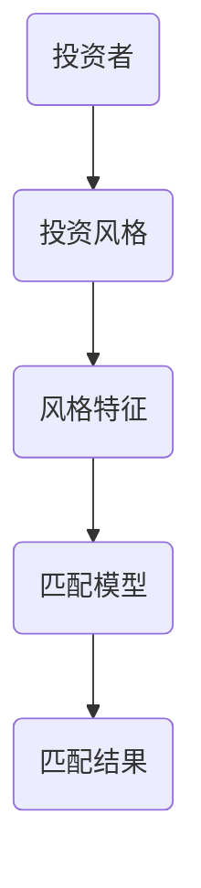
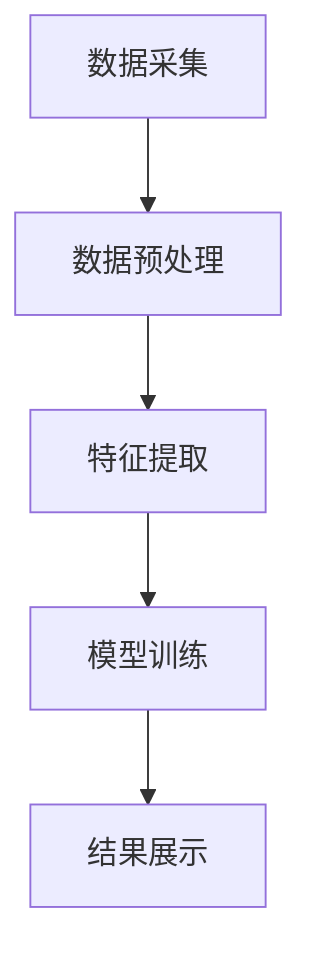

                 

# 构建智能化的个人投资风格分析与匹配系统

> 关键词：个人投资风格分析，智能化匹配，投资行为分析，风格分类，投资决策支持

> 摘要：本文详细探讨了构建智能化个人投资风格分析与匹配系统的各个方面，包括核心概念、算法原理、系统架构、数学模型以及项目实战。文章从背景出发，逐步分析投资风格的多维度特征，介绍匹配算法的实现流程，并通过系统架构设计和项目案例展示如何将理论应用于实际。最终，本文旨在为投资者提供个性化的投资风格匹配方案，帮助他们做出更明智的投资决策。

---

# 第1章: 背景与核心概念

## 1.1 问题背景与必要性

### 1.1.1 投资者行为分析的重要性
在金融市场中，投资者的行为受到多种因素的影响，包括风险偏好、收益预期、投资期限等。分析投资者的行为模式，可以帮助投资者更好地理解自身的需求，从而制定更科学的投资策略。然而，传统的方法往往依赖于主观判断，难以实现个性化和精准化的分析。

### 1.1.2 当前投资风格分析的痛点
- 数据量庞大：投资者的行为数据涉及多种类型，包括交易记录、市场反馈等，数据量大且复杂。
- 方法单一：传统分析方法多依赖统计学，难以捕捉复杂的投资者行为模式。
- 个性化不足：现有的投资风格分类多基于固定框架，难以适应不同投资者的独特需求。

### 1.1.3 智能化投资风格匹配的必要性
随着人工智能技术的发展，智能化分析工具能够更精准地捕捉投资者的风格特征，提供个性化的匹配方案。这不仅可以提升投资效率，还能帮助投资者规避潜在风险。

## 1.2 投资风格分析的核心概念

### 1.2.1 投资风格的定义与分类
投资风格是指投资者在决策过程中表现出的一系列特征，包括风险偏好、收益预期、投资期限等。常见的投资风格分类包括保守型、稳健型、成长型和激进型。

### 1.2.2 不同投资风格的特点与适用场景
- **保守型**：注重本金安全，风险承受能力低，适合风险厌恶型投资者。
- **稳健型**：追求稳定收益，风险承受能力适中，适合中低风险偏好的投资者。
- **成长型**：追求长期资本增值，风险承受能力较高，适合有长期投资目标的投资者。
- **激进型**：追求高收益，风险承受能力高，适合风险偏好高的投资者。

### 1.2.3 投资风格匹配的目标与意义
目标是将投资者的风格特征与适合的投资产品或策略进行匹配，从而实现风险与收益的最优平衡。意义在于帮助投资者做出更科学的投资决策，提升投资效率。

## 1.3 问题描述与解决思路

### 1.3.1 投资者需求分析
投资者需要了解自身投资风格，并找到与之匹配的投资产品或策略。然而，传统方法难以实现个性化的精准匹配。

### 1.3.2 投资风格分析与匹配的流程
1. 数据采集：收集投资者的行为数据，包括交易记录、市场反馈等。
2. 数据预处理：清洗和整理数据，提取有效特征。
3. 风格分析：通过算法识别投资者的风格特征。
4. 风格匹配：将投资者的风格特征与适合的投资策略进行匹配。

### 1.3.3 系统化解决方案的设计思路
- 数据驱动：基于投资者行为数据，构建风格分析模型。
- 算法驱动：采用机器学习算法，实现风格分类与匹配。
- 人机结合：结合人工经验，提升系统的准确性和可靠性。

## 1.4 系统的边界与外延

### 1.4.1 系统功能边界
系统主要功能包括数据采集、风格分析、风格匹配和结果展示。不涉及具体的投资决策执行。

### 1.4.2 系统的输入与输出
- 输入：投资者的行为数据，包括交易记录、市场反馈等。
- 输出：投资者的风格特征和匹配的投资策略。

### 1.4.3 系统与其他模块的交互关系
系统与其他模块的交互主要体现在数据输入和结果输出上，例如与投资决策系统对接。

## 1.5 核心概念结构与要素组成

### 1.5.1 投资风格分析模块
负责分析投资者的行为数据，提取风格特征。

### 1.5.2 风格匹配模块
根据提取的风格特征，匹配适合的投资策略。

### 1.5.3 系统整体架构
由数据采集、风格分析、风格匹配和结果展示四个模块组成。

# 第2章: 投资风格分析与匹配的核心概念

## 2.1 投资风格的多维度分析

### 2.1.1 风险偏好分析
通过分析投资者的交易记录，评估其风险承受能力。例如，频繁交易的投资者风险偏好较高。

### 2.1.2 收益预期分析
通过分析投资者的收益目标，评估其收益预期。例如，长期投资的投资者收益预期较高。

### 2.1.3 投资期限与流动性偏好
通过分析投资者的投资期限，评估其流动性偏好。例如，短期投资者流动性需求较高。

## 2.2 投资者行为分析框架

### 2.2.1 行为数据的采集与处理
数据采集包括交易记录、市场反馈等，数据处理包括清洗和特征提取。

### 2.2.2 行为特征的提取与建模
通过聚类和分类算法，提取投资者的行为特征，并建立风格分析模型。

### 2.2.3 行为分析的可视化
将分析结果可视化，便于投资者理解和决策。

## 2.3 投资风格匹配的理论基础

### 2.3.1 投资组合理论
通过资产配置实现风险与收益的优化平衡。

### 2.3.2 风险收益匹配模型
根据投资者的风格特征，匹配适合的风险收益曲线。

### 2.3.3 投资者效用函数
通过效用函数，量化投资者的偏好，实现风格匹配。

## 2.4 投资风格匹配的实现思路

### 2.4.1 数据预处理与特征提取
对数据进行清洗和特征提取，为后续分析提供基础。

### 2.4.2 风格分类与聚类算法
采用聚类算法，将投资者分为不同的风格类别。

### 2.4.3 风格匹配的优化方法
通过优化算法，提升匹配的准确性和效率。

## 2.5 核心概念的ER实体关系图

# 第3章: 投资风格分析与匹配的算法原理

## 3.1 投资风格分析的算法选择

### 3.1.1 基于聚类的风格分类
使用K-means算法，将投资者分为不同的风格类别。

### 3.1.2 基于决策树的风格识别
通过决策树算法，识别投资者的风格特征。

### 3.1.3 基于深度学习的风格分析
使用神经网络模型，捕捉投资者的复杂行为模式。

## 3.2 投资风格匹配的核心算法

### 3.2.1 基于相似度的匹配算法
通过计算投资者风格特征的相似度，进行匹配。

### 3.2.2 基于回归的风格预测
通过回归模型，预测投资者的风格特征。

### 3.2.3 基于强化学习的投资决策
使用强化学习算法，优化投资策略。

## 3.3 算法实现流程

### 3.3.1 数据预处理
对数据进行清洗和特征提取。

### 3.3.2 特征提取与降维
使用主成分分析等方法，降维特征空间。

### 3.3.3 模型训练与调优
训练分类模型，并进行参数调优。

### 3.3.4 结果解释与可视化
将结果可视化，便于投资者理解和决策。

## 3.4 算法流程图

---

通过以上思考步骤，我们可以逐步构建智能化的个人投资风格分析与匹配系统，帮助投资者做出更科学的投资决策。

