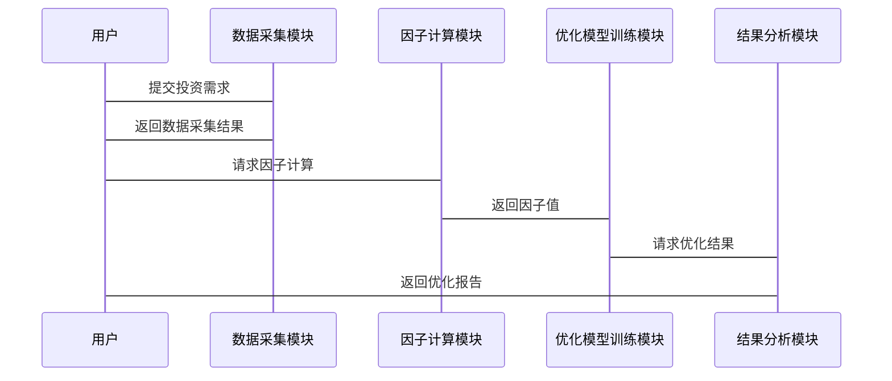

                 


# 构建智能化的个人投资风格因子暴露优化系统

> 关键词：投资风格因子、因子暴露、投资组合优化、机器学习、风险管理

> 摘要：本文旨在探讨如何利用智能化技术构建个人投资风格因子暴露优化系统。通过分析投资风格因子的定义、优化目标，结合机器学习和数学建模方法，提出一种基于多因子模型的优化框架，帮助投资者实现个性化的投资风格调整与风险控制。

---

## 第一部分：智能化投资风格因子暴露优化的背景与概念

### 第1章：投资风格因子暴露的背景与问题背景

#### 1.1 投资风格因子的定义与重要性

- **1.1.1 投资风格的定义**
  - 投资风格是指投资者在选择资产、配置权重时所遵循的特定策略和偏好，反映了投资者的风险承受能力、收益目标和市场看法。
  
- **1.1.2 因子暴露的核心概念**
  - 因子暴露是指投资组合中各个因子的权重分布，反映了组合对不同因子的敏感程度。
  - 例如，一个投资组合可能暴露在市值因子、价值因子、动量因子等多个维度上，每个因子的暴露程度决定了组合对这些因子的敏感性。

- **1.1.3 因子暴露在投资组合管理中的作用**
  - 通过调整因子暴露，投资者可以优化组合的风险收益比，实现个性化的投资目标。
  - 因子暴露可以帮助投资者识别组合的主要风险来源，并进行针对性的风险管理。

#### 1.2 个人投资风格的构建与优化

- **1.2.1 个人投资风格的构成要素**
  - 风险偏好：投资者对风险的容忍程度，影响因子暴露的分布。
  - 收益目标：投资者的收益预期，决定了因子暴露的权重分配。
  - 市场观点：投资者对市场的看法，影响因子的选择和权重调整。

- **1.2.2 投资风格因子暴露的必要性**
  - 传统投资组合优化方法过于依赖历史数据，难以适应市场变化。
  - 通过智能化方法优化因子暴露，可以实现动态调整，提升组合的适应性。

- **1.2.3 优化目标与边界**
  - **优化目标**：最大化收益、最小化风险、匹配投资风格。
  - **边界条件**：因子暴露的总和应为1，单个因子的暴露权重应满足非负约束。

#### 1.3 当前投资风格优化的挑战与机遇

- **1.3.1 传统投资风格优化的局限性**
  - 传统方法依赖历史数据，忽视市场变化。
  - 优化结果缺乏动态调整能力，难以应对复杂市场环境。

- **1.3.2 智能化技术在投资风格优化中的应用前景**
  - 机器学习算法可以捕捉复杂市场特征，优化因子暴露。
  - 大数据分析技术可以提高因子发现的效率和准确性。

- **1.3.3 数据驱动的投资风格优化趋势**
  - 数据驱动的优化方法可以根据市场变化实时调整因子暴露。
  - 结合投资者的个性化需求，实现定制化的投资组合优化。

---

## 第二部分：智能化投资风格因子暴露优化的核心概念与联系

### 第2章：投资风格因子暴露的核心概念

#### 2.1 因子暴露的定义与分类

- **2.1.1 因子暴露的定义**
  - 因子暴露是指投资组合中各个因子的权重分布，反映了组合对不同因子的敏感程度。

- **2.1.2 常见的因子类型**
  - **市值因子（Size）**：反映组合对小盘股或大盘股的偏好。
  - **价值因子（Value）**：反映组合对低市盈率、低市净率股票的偏好。
  - **动量因子（Momentum）**：反映组合对近期价格上涨资产的偏好。
  - **质量因子（Quality）**：反映组合对高盈利、高分红资产的偏好。
  - **流动性因子（Liquidity）**：反映组合对高流动性资产的偏好。

- **2.1.3 因子暴露的量化方法**
  - 通过线性回归模型估计因子暴露。
  - 使用多因子模型分解投资组合的收益来源。

#### 2.2 投资风格优化的数学模型

- **2.2.1 因子暴露的线性回归模型**
  - 回归模型用于估计因子对组合收益的贡献程度。
  - 模型公式：
    $$ R_p = \beta_1 F_1 + \beta_2 F_2 + ... + \beta_n F_n + \epsilon $$
    其中，$R_p$ 是投资组合的收益，$F_i$ 是第i个因子，$\beta_i$ 是因子暴露，$\epsilon$ 是误差项。

- **2.2.2 多因子模型的构建与应用**
  - 多因子模型将多个因子纳入优化框架，综合考虑各因子的贡献。
  - 通过因子权重的优化，实现投资风格的动态调整。

- **2.2.3 因子权重的优化方法**
  - 使用拉格朗日乘数法优化因子权重，满足约束条件。
  - 优化目标：
    $$ \max \text{或} \min \quad R_p = \sum_{i=1}^n w_i F_i $$
    $$ \text{约束条件：} \quad \sum_{i=1}^n w_i = 1, \quad w_i \geq 0 $$

#### 2.3 因子暴露与投资风格的关系

- **2.3.1 因子暴露对投资风格的影响**
  - 不同的因子暴露分布决定了组合的投资风格。
  - 例如，高价值因子暴露的组合倾向于价值投资，高动量因子暴露的组合倾向于趋势投资。

- **2.3.2 不同投资风格的因子暴露特征**
  - **成长型投资**：高成长因子暴露，低价值因子暴露。
  - **价值型投资**：高价值因子暴露，低成长因子暴露。
  - **动量型投资**：高动量因子暴露，低质量因子暴露。

- **2.3.3 因子暴露的动态调整**
  - 根据市场变化和投资者需求，动态调整因子暴露。
  - 例如，市场波动加剧时，增加流动性因子暴露。

---

## 第三部分：智能化投资风格因子暴露优化的系统设计

### 第3章：系统架构与功能设计

#### 3.1 问题场景介绍

- 投资者希望通过智能化系统优化投资风格因子暴露，实现个性化投资目标。
- 系统需要具备数据采集、因子计算、优化模型训练、结果分析等功能。

#### 3.2 系统功能设计

- **3.2.1 数据采集模块**
  - 从多个数据源获取资产价格、财务数据、市场指标等。
  - 数据清洗与预处理，确保数据质量。

- **3.2.2 因子计算模块**
  - 根据预设的因子计算方法，计算各资产的因子值。
  - 例如，计算股票的市值因子、价值因子等。

- **3.2.3 优化模型训练模块**
  - 使用机器学习算法优化因子暴露。
  - 通过历史回测验证模型的有效性。

- **3.2.4 结果分析与报告生成模块**
  - 输出优化后的因子暴露分布。
  - 生成投资组合的风险收益报告。

#### 3.3 系统架构设计

- 使用微服务架构，各模块独立开发和部署。
- **前端界面**：用户可以通过网页或API提交投资需求。
- **后端服务**：包括数据处理、因子计算、优化模型训练等模块。
- **数据库**：存储资产数据、因子值、优化结果等。

#### 3.4 系统接口设计

- **API接口**：
  - 输入：投资者的风险偏好、收益目标、市场观点。
  - 输出：优化后的因子暴露分布、投资组合报告。
- **数据接口**：
  - 数据采集模块与第三方数据源对接。

#### 3.5 系统交互流程图



---

## 第四部分：智能化投资风格因子暴露优化的项目实战

### 第4章：项目实现与案例分析

#### 4.1 项目环境安装

- **工具安装**：
  - Python 3.8+
  - Jupyter Notebook
  - pandas、numpy、scikit-learn、Plotly

- **数据源获取**：
  - 使用Yahoo Finance获取股票数据。
  - 使用Morningstar获取因子数据。

#### 4.2 核心代码实现

- **因子计算代码示例**：
  ```python
  import pandas as pd
  import numpy as np

  # 示例：计算股票的价值因子（低市盈率）
  def compute_value_factor(prices, earnings):
      pe = prices / earnings
      value_factor = 1 / (pe.rank(pct=True) + 1e-9)
      return value_factor

  prices = pd.DataFrame({'AAPL': [100, 105, 110], 'GOOGL': [150, 155, 160]})
  earnings = pd.DataFrame({'AAPL': [10, 12, 15], 'GOOGL': [20, 22, 25]})
  value_factor = compute_value_factor(prices, earnings)
  print(value_factor)
  ```

- **优化模型训练代码示例**：
  ```python
  from sklearn.linear_model import LinearRegression
  import pandas as pd

  # 示例：基于线性回归的因子暴露优化
  X = pd.DataFrame({'F1': [0.2, 0.3, 0.5], 'F2': [0.4, 0.3, 0.2]})
  y = [0.1, 0.2, 0.3]
  model = LinearRegression()
  model.fit(X, y)
  print(model.coef_)
  ```

#### 4.3 实际案例分析

- **案例背景**：
  - 投资者希望通过优化因子暴露，构建一个低风险、高收益的投资组合。
- **优化过程**：
  - 数据采集：获取过去5年的股票数据。
  - 因子计算：计算市值因子、价值因子、动量因子。
  - 模型训练：使用机器学习算法优化因子暴露。
  - 结果分析：生成优化后的因子暴露分布和投资组合报告。

#### 4.4 代码解读与分析

- **因子计算模块**：
  - 计算各资产的因子值，为优化提供输入数据。
- **优化模型训练模块**：
  - 使用机器学习算法优化因子暴露，确保满足投资目标。
- **结果分析模块**：
  - 输出优化后的因子暴露分布和投资组合报告。

---

## 第五部分：总结与展望

### 第5章：最佳实践、总结与展望

#### 5.1 最佳实践

- **数据质量的重要性**：
  - 确保数据的完整性和准确性，避免因数据问题导致的优化偏差。
- **模型的可解释性**：
  - 选择可解释性较强的优化方法，便于投资者理解和调整。
- **动态优化**：
  - 根据市场变化和投资者需求，定期调整因子暴露。

#### 5.2 总结

- 本文提出了一种基于多因子模型的智能化投资风格因子暴露优化系统。
- 通过机器学习和数学建模方法，实现了个性化的投资风格优化。
- 系统设计涵盖了数据采集、因子计算、优化模型训练、结果分析等关键环节。

#### 5.3 展望

- **动态因子调整**：
  - 结合市场实时数据，实现因子暴露的动态优化。
- **多目标优化**：
  - 在优化过程中考虑多个目标，如收益、风险、流动性等。
- **个性化投资服务**：
  - 根据投资者的个性化需求，提供定制化的投资风格优化服务。

---

## 第六部分：附录与拓展阅读

### 附录A：常用投资风格因子列表

| 因子名称 | 因子描述 | 示例计算公式 |
|----------|----------|--------------|
| 市值因子 | 反映资产的规模特征 | $Size = \ln(\text{市值})$ |
| 价值因子 | 反映资产的估值水平 | $Value = \frac{\text{市盈率}}{\text{行业平均市盈率}}$ |
| 动量因子 | 反映资产的价格动量效应 | $Momentum = \frac{\text{过去12个月的收益}}{\text{标准差}}$ |
| 质量因子 | 反映资产的盈利能力 | $Quality = \frac{\text{ROE}}{\text{行业平均ROE}}$ |

### 附录B：相关技术术语解释

- **因子模型**：用于分解资产收益的统计模型，通常包括多个因子。
- **因子权重**：因子在组合中的权重，决定了组合对因子的敏感程度。
- **多因子优化**：同时考虑多个因子的优化方法，能够捕捉更多市场信息。

---

通过以上内容，我们详细探讨了构建智能化个人投资风格因子暴露优化系统的各个方面，从背景概念到系统设计，再到项目实战，为投资者提供了理论支持和实践指导。未来，随着技术的不断进步，智能化投资风格优化系统将更加个性化和动态化，为投资者实现更优的投资组合提供有力支持。

