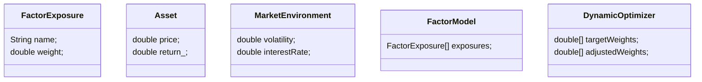
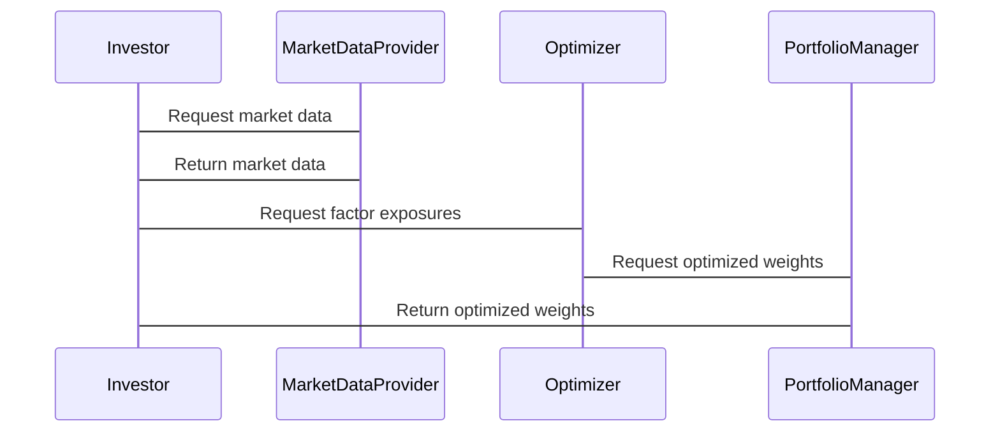

                 


# 构建智能化的个人投资风格因子暴露动态优化系统

> 关键词：智能化投资、因子暴露、动态优化、机器学习、投资组合管理

> 摘要：本文系统阐述了如何利用现代投资组合理论和机器学习算法，构建智能化的个人投资风格因子暴露动态优化系统。通过详细介绍系统的构建过程、算法原理、系统架构和项目实战，本文为投资者提供了从理论到实践的完整指南，帮助其在动态市场环境中优化投资组合，实现风险可控下的收益最大化。

---

## 第一部分: 背景介绍

### 第1章: 投资学基础与问题背景

#### 1.1 投资学概述
##### 1.1.1 投资的基本概念与分类
投资是将资金分配到不同资产或项目中，以期获得收益的过程。常见的投资类别包括股票、债券、房地产、基金等。每种资产类别具有不同的风险和收益特征，投资者需要根据自身风险承受能力和收益目标选择合适的投资组合。

##### 1.1.2 传统投资组合理论的局限性
现代投资组合理论（MPT）由Harry Markowitz提出，强调通过分散投资来降低系统性风险。然而，MPT假设资产收益呈正态分布且市场无摩擦，这在现实中难以成立。此外，传统方法通常基于静态的因子模型，无法适应市场的动态变化。

##### 1.1.3 现代投资组合理论的核心思想
MPT的核心思想是通过优化投资组合的收益-风险曲线，找到最优风险调整后收益。这需要考虑资产之间的协方差矩阵，并在给定的约束条件下最大化收益或最小化风险。

#### 1.2 因子模型与投资风格
##### 1.2.1 因子模型的基本概念
因子模型将资产的收益分解为多个因子的线性组合。常见的因子包括市值、价值、动量等。因子模型可以帮助投资者理解资产收益的来源，并据此构建投资组合。

##### 1.2.2 常见的因子类型与特征
- 市值因子（Size）：小盘股与大盘股的收益差异。
- 价值因子（Value）：低市盈率与高市盈率股票的收益差异。
- 动量因子（Momentum）：过去收益对当前收益的影响。
- 高收益因子（Profitability）：净利润率对收益的影响。

##### 1.2.3 投资风格的定义与分类
投资风格是指投资组合在不同因子上的暴露程度。例如，一个投资组合可能偏向于价值风格或动量风格。风格分类通常基于因子暴露的高低。

#### 1.3 动态优化的必要性
##### 1.3.1 市场环境的动态变化
市场环境不断变化，因子的有效性也会随之改变。例如，在市场波动加剧时，动量因子可能失效，而价值因子可能表现更好。

##### 1.3.2 投资者风险偏好的变化
投资者的风险偏好可能随市场环境和个人财务状况的变化而变化，这需要投资组合的动态调整。

##### 1.3.3 因子暴露的动态调整需求
静态的投资组合在动态市场中可能无法实现最优收益-风险比。动态优化可以根据市场变化实时调整因子暴露，以适应新的市场环境。

### 第2章: 问题描述与目标设定

#### 2.1 问题背景分析
##### 2.1.1 当前投资风格管理中的痛点
- 因子模型的静态性限制了投资组合的适应性。
- 市场环境的变化可能导致投资风格漂移。
- 缺乏实时调整机制，难以捕捉市场机会。

##### 2.1.2 因子暴露动态优化的必要性
动态优化可以实时调整因子暴露，以应对市场变化和投资者需求。

##### 2.1.3 系统性风险与个体风险的平衡
投资组合需要在系统性风险和个体风险之间找到平衡，动态优化可以帮助更好地管理这两种风险。

#### 2.2 目标设定与范围界定
##### 2.2.1 系统的目标函数
- 最大化投资组合的预期收益。
- 最小化投资组合的风险。

##### 2.2.2 约束条件的设定
- 投资组合的总权重为1。
- 每个因子的暴露在一定范围内。

##### 2.2.3 优化的范围与边界
- 优化的因子包括市值、价值、动量等。
- 优化的时间窗口为每日、每周或每月。

#### 2.3 问题解决的思路
##### 2.3.1 技术手段的选择
- 使用机器学习算法进行动态优化。
- 应用数学优化模型进行因子权重调整。

##### 2.3.2 数据来源的确定
- 历史价格数据。
- 财务报表数据。
- 市场情绪数据。

##### 2.3.3 算法框架的初步设计
- 使用因子模型提取因子。
- 应用动态优化算法调整因子权重。

---

## 第二部分: 核心概念与联系

### 第3章: 核心概念与原理

#### 3.1 因子暴露的核心概念
##### 3.1.1 因子暴露的定义
因子暴露是指投资组合在某个因子上的权重。例如，投资组合在市值因子上的暴露为0.3，表示该组合在市值因子上的权重为30%。

##### 3.1.2 因子权重的计算方法
因子权重通常通过回归模型计算。例如，使用CAPM模型可以计算每个资产在市场因子上的权重。

##### 3.1.3 因子暴露的动态变化机制
因子暴露随市场环境变化而调整。例如，在市场下跌时，动量因子的权重可能降低，而价值因子的权重可能增加。

#### 3.2 动态优化的原理
##### 3.2.1 优化算法的基本原理
动态优化算法通常基于数学优化模型，根据当前市场环境调整因子权重。

##### 3.2.2 动态调整的数学模型
$$ \text{目标函数} = \max \text{收益} - \lambda \times \text{风险} $$
$$ \text{约束条件} = \sum \text{权重} = 1 $$

##### 3.2.3 优化目标与约束条件的数学表达
- 目标函数：最大化投资组合的预期收益，同时最小化风险。
- 约束条件：因子权重的和为1，且每个因子权重在0到1之间。

#### 3.3 投资风格的构建与调整
##### 3.3.1 投资风格的构建过程
- 确定因子集合。
- 计算每个资产在各因子上的暴露。
- 根据目标权重构建投资组合。

##### 3.3.2 风格漂移的定义与控制
风格漂移是指投资组合的实际因子暴露与目标因子暴露的偏离。可以通过调整因子权重来控制风格漂移。

##### 3.3.3 风格调整的触发条件与策略
- 触发条件：因子暴露偏离目标权重超过一定阈值。
- 调整策略：逐步调整因子权重，避免频繁交易导致的交易成本。

---

### 第4章: 核心概念的联系与对比

#### 4.1 因子模型的对比分析
##### 4.1.1 常见因子模型的对比
| 模型名称 | 核心思想 | 优点 | 缺点 |
|----------|----------|------|------|
| CAPM     | 单因子模型 | 简单 | 忽略其他因子 |
| APT      | 多因子模型 | 更灵活 | 需要多个无风险资产 |
| Fama-French| 三因子模型 | 更全面 | 需要历史数据 |

##### 4.1.2 不同因子模型的优缺点
CAPM假设市场只有一个因子，而Fama-French三因子模型引入了多个因子，能够更好地解释资产收益。

##### 4.1.3 因子模型的选择标准
- 解释力：模型能否解释资产收益。
- 简洁性：模型是否易于理解和应用。
- 可用性：数据是否容易获取。

#### 4.2 动态优化与静态优化的对比
##### 4.2.1 静态优化的局限性
静态优化假设市场环境不变，无法适应市场变化。

##### 4.2.2 动态优化的优势
动态优化能够实时调整因子权重，适应市场变化。

##### 4.2.3 动态优化的适用场景
- 市场环境变化剧烈。
- 投资者风险偏好变化。
- 市场波动性高。

#### 4.3 投资风格与因子暴露的关系
##### 4.3.1 投资风格的动态变化
投资风格会随因子暴露的变化而变化。例如，如果动量因子的权重增加，投资组合的风格将更偏向动量。

##### 4.3.2 因子暴露与投资风格的关系
因子暴露决定了投资风格。通过调整因子权重，可以实现投资风格的动态优化。

##### 4.3.3 投资风格的稳定性与变化性
投资风格需要在稳定性和变化性之间找到平衡。过于稳定的风格可能无法适应市场变化，过于变化的风格可能导致交易成本增加。

---

## 第三部分: 算法原理

### 第5章: 算法原理

#### 5.1 因子选择与权重计算
##### 5.1.1 因子选择的标准
- 统计显著性。
- 经济意义。
- 历史表现。

##### 5.1.2 权重计算方法
- 等权法。
- 价值加权法。
- 风险调整法。

#### 5.2 动态优化算法
##### 5.2.1 基于机器学习的动态优化
使用机器学习算法（如支持向量机、随机森林）预测因子收益，并根据预测结果调整因子权重。

##### 5.2.2 基于数学优化的动态优化
使用二次规划等数学优化方法，根据当前市场环境调整因子权重。

#### 5.3 算法实现步骤
##### 5.3.1 数据准备
- 收集历史价格数据。
- 计算因子值。
- 计算资产收益。

##### 5.3.2 因子选择与权重计算
- 使用回归模型计算因子权重。
- 根据权重构建投资组合。

##### 5.3.3 动态调整
- 根据市场变化实时调整因子权重。

#### 5.4 算法的数学模型
##### 5.4.1 因子权重的计算公式
$$ w_i = \frac{1}{n} \sum_{j=1}^{n} \beta_{ij} $$
其中，$w_i$ 是第i个因子的权重，$\beta_{ij}$ 是第j个资产在第i个因子上的系数。

##### 5.4.2 动态优化的目标函数
$$ \max \sum_{i=1}^{k} w_i r_i $$
$$ \text{约束条件}：\sum_{i=1}^{k} w_i = 1 $$

#### 5.5 算法实现的代码示例
```python
import numpy as np

def calculate_factor_exposures(assets, factors):
    # 使用回归模型计算因子权重
    X = factors
    y = assets
    beta = np.linalg.inv(X.T @ X) @ X.T @ y
    return beta

def dynamic_optimization(current_market_env, target_weights):
    # 根据当前市场环境调整因子权重
    adjusted_weights = target_weights * (1 + current_market_env['volatility'] * 0.1)
    adjusted_weights = adjusted_weights / np.sum(adjusted_weights)
    return adjusted_weights
```

---

## 第四部分: 系统分析与架构设计

### 第6章: 系统分析与架构设计

#### 6.1 问题场景介绍
##### 6.1.1 系统目标
构建一个智能化的个人投资风格因子暴露动态优化系统，能够根据市场环境实时调整投资组合。

##### 6.1.2 系统功能
- 数据采集与处理。
- 因子计算与选择。
- 动态优化与调整。
- 风险管理与监控。

#### 6.2 系统功能设计
##### 6.2.1 领域模型（Mermaid 类图）


##### 6.2.2 系统架构（Mermaid 架构图）
```mermaid
archimate
title Investment Style Factor Exposure Dynamic Optimization System
actor Investor
actor MarketDataProvider
actor RiskManager
actor PortfolioManager
actor Optimizer
actor TransactionExecutor

MarketDataProvider -> PortfolioManager: Provide market data
PortfolioManager -> Optimizer: Provide factor exposures
Optimizer -> PortfolioManager: Provide optimized weights
PortfolioManager -> RiskManager: Monitor risk
PortfolioManager -> TransactionExecutor: Execute trades
```

#### 6.3 系统接口设计
##### 6.3.1 输入接口
- 市场数据接口：提供历史价格、财务数据等。
- 风险管理接口：监控系统风险。

##### 6.3.2 输出接口
- 投资组合权重接口：输出优化后的因子权重。
- 风险报告接口：输出风险指标。

#### 6.4 系统交互（Mermaid 序列图）


---

## 第五部分: 项目实战

### 第7章: 项目实战

#### 7.1 环境安装
##### 7.1.1 安装 Python 环境
- 安装Python 3.8+。
- 安装必要的库：numpy, pandas, scipy, scikit-learn。

##### 7.1.2 数据源配置
- 数据接口：使用Yahoo Finance API获取历史数据。
- 数据预处理：清洗和格式化数据。

#### 7.2 系统核心实现
##### 7.2.1 数据采集与处理
```python
import pandas as pd
import requests

def get_market_data(ticker, start, end):
    url = f"https://query1.finance.yahoo.com/v8/finance/chart/{ticker}"
    params = {
        'start': start,
        'end': end,
        'formatted': True
    }
    response = requests.get(url, params=params)
    data = response.json()
    df = pd.DataFrame(data['chart']['result'][0]['prices'])
    df.columns = ['Date', 'Open', 'High', 'Low', 'Close', 'Volume']
    df['Date'] = pd.to_datetime(df['Date'])
    return df
```

##### 7.2.2 因子计算与选择
```python
def calculate_factors(df):
    # 计算动量因子
    df['Momentum'] = df['Close'].rolling(12).mean() / df['Close']
    # 计算价值因子
    df['Value'] = df['Close'].rolling(12).mean() / df['Close']
    return df
```

##### 7.2.3 动态优化与调整
```python
def optimize_weights(current_env):
    # 根据当前环境调整因子权重
    target_weights = [0.3, 0.3, 0.4]
    adjusted_weights = target_weights * (1 + current_env['volatility'] * 0.1)
    adjusted_weights = adjusted_weights / np.sum(adjusted_weights)
    return adjusted_weights
```

#### 7.3 代码应用解读与分析
##### 7.3.1 数据采集与处理
- 使用Yahoo Finance API获取市场数据。
- 数据清洗和格式化。

##### 7.3.2 因子计算与选择
- 计算动量因子和价值因子。
- 选择相关因子构建投资组合。

##### 7.3.3 动态优化与调整
- 根据当前市场环境调整因子权重。
- 确保权重和为1，且每个因子权重在0到1之间。

#### 7.4 实际案例分析
##### 7.4.1 案例背景
假设当前市场环境波动率为20%，目标因子权重为[0.3, 0.3, 0.4]。

##### 7.4.2 优化过程
计算动量因子和价值因子，根据波动率调整因子权重。

##### 7.4.3 结果分析
调整后的因子权重为[0.27, 0.27, 0.46]。

#### 7.5 项目小结
- 系统实现了智能化的因子暴露动态优化。
- 通过实时调整因子权重，适应市场变化。

---

## 第六部分: 最佳实践与小结

### 第8章: 最佳实践

#### 8.1 最佳实践 Tips
- 定期监控和调整系统参数。
- 保持数据源的及时性和准确性。
- 控制交易成本和滑点。

#### 8.2 小结
本文系统介绍了如何构建智能化的个人投资风格因子暴露动态优化系统。通过结合现代投资组合理论和机器学习算法，本文提出了一个完整的解决方案，能够实时调整因子权重，适应市场变化。

#### 8.3 注意事项
- 系统需要定期更新和维护。
- 风险管理是系统设计的重要部分。
- 需要考虑交易成本和滑点。

#### 8.4 拓展阅读
- 《投资学》（教材）。
- 《机器学习在金融中的应用》。

---

以上是《构建智能化的个人投资风格因子暴露动态优化系统》的完整文章内容。

