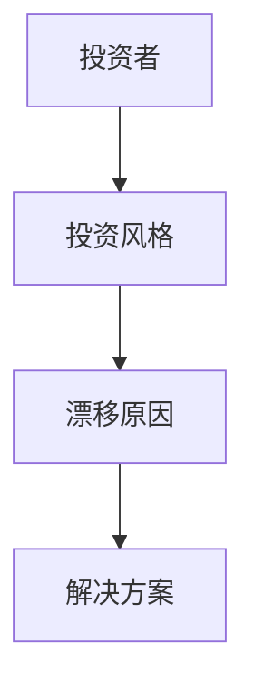
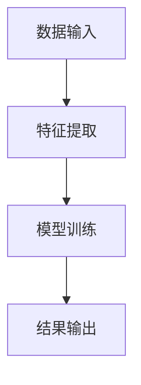
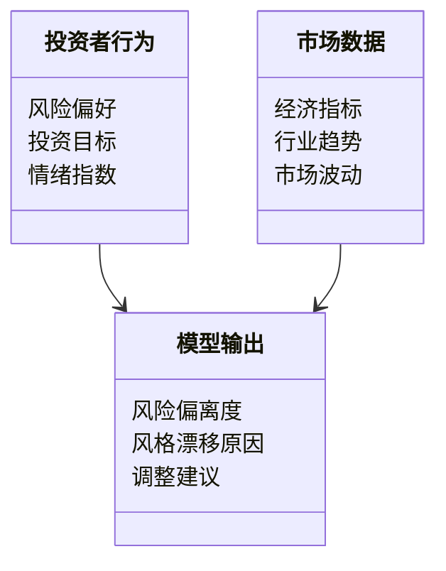
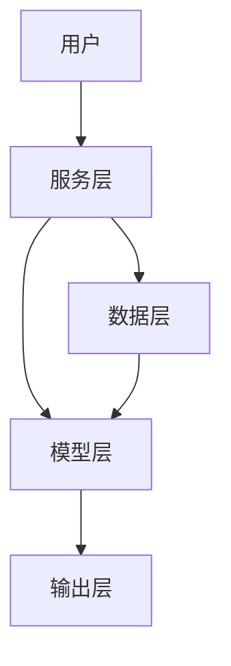

                 


# 构建智能化的个人投资风格漂移原因分析系统

## 关键词：
- 投资风格漂移、原因分析、智能化系统、机器学习、数据挖掘

## 摘要：
本文详细探讨了构建智能化的个人投资风格漂移原因分析系统的各个方面。从投资风格漂移的背景和问题分析入手，结合核心概念、算法原理、系统架构设计和项目实战，全面解析了如何通过智能化技术准确识别和分析投资风格漂移的原因。文章内容丰富，结构清晰，旨在为投资者和相关技术人士提供实用的理论和实践指导。

---

## 第1章: 个人投资风格漂移的背景与问题分析

### 1.1 投资风格漂移的定义与核心概念

#### 1.1.1 投资风格漂移的定义
投资风格漂移是指投资者在实际操作中，由于市场变化、个人风险偏好调整或其他外部因素的影响，导致其实际投资组合偏离最初设定的投资策略或风格的现象。

#### 1.1.2 投资风格漂移的核心要素
1. **市场环境**：宏观经济环境、行业趋势、市场波动等。
2. **投资者行为**：投资者的风险偏好、认知偏差、情绪波动等。
3. **投资策略**：初始设定的投资目标、资产配置、风险承受能力等。

#### 1.1.3 投资风格漂移的分类与特征
- **短期漂移**：由于市场波动或突发事件导致的短期偏离。
- **长期漂移**：由于投资者风险偏好或市场环境的长期变化导致的持续偏离。

---

### 1.2 投资风格漂移的背景与问题背景

#### 1.2.1 当前投资市场的复杂性
近年来，全球金融市场波动加剧，投资者面临的不确定性增加，投资风格漂移现象日益普遍。

#### 1.2.2 投资者行为的变化趋势
- 投资者行为受到情绪、市场环境和社会舆论的影响，呈现出非理性特征。
- 不同投资者的风险偏好和投资目标存在显著差异。

#### 1.2.3 投资风格漂移对企业与个人的影响
- 对个人投资者：可能导致投资收益下降，投资目标无法实现。
- 对机构投资者：可能引发投资策略调整成本增加，影响长期投资绩效。

---

### 1.3 问题描述与解决思路

#### 1.3.1 投资风格漂移的主要问题
- 风险偏好与投资目标不匹配。
- 市场波动与投资者情绪的双重影响。
- 缺乏有效的监控和预警机制。

#### 1.3.2 现有解决方案的局限性
- 传统方法依赖主观判断，缺乏数据支持。
- 缺乏实时监控和动态调整能力。

#### 1.3.3 基于智能化的解决思路
- 引入机器学习和数据挖掘技术，构建智能化分析系统。
- 实时监控投资者行为和市场环境，动态调整投资策略。

---

## 第2章: 投资风格漂移原因分析的核心概念与联系

### 2.1 核心概念原理

#### 2.1.1 投资风格漂移的原因分类
- **外部因素**：市场波动、经济政策变化等。
- **内部因素**：投资者情绪、风险偏好变化等。

#### 2.1.2 智能化分析的关键技术
- 数据挖掘：从海量数据中提取有用信息。
- 机器学习：通过模型识别漂移原因。
- 自然语言处理：分析投资者行为中的情绪因素。

---

### 2.2 概念属性特征对比表格

| 漂移原因 | 内部因素 | 外部因素 | 技术支撑 |
|---------|----------|----------|----------|
| 类型     | 情绪波动 | 市场波动 | 数据挖掘 |
| 影响     | 非理性决策 | 资产配置变化 | 机器学习 |
| 解决方案 | 风险管理 | 资产再平衡 | 智能监控 |

---

### 2.3 ER实体关系图架构



---

## 第3章: 智能化分析算法原理

### 3.1 算法原理概述

#### 3.1.1 聚类分析
- 将投资者行为数据进行聚类，识别出不同风格的投资者群体。
- 使用K-means算法，根据特征相似性进行分群。

#### 3.1.2 回归分析
- 通过回归模型，分析漂移原因与投资收益之间的关系。
- 示例公式：
$$ y = \beta_0 + \beta_1x_1 + \beta_2x_2 + \epsilon $$

#### 3.1.3 时间序列分析
- 分析投资风格漂移的时间特征，识别周期性或趋势性变化。

---

### 3.2 算法流程图



---

### 3.3 算法数学模型与公式

#### 3.3.1 聚类分析公式
$$ d(x_i, x_j) = \sqrt{\sum_{k=1}^{n}(x_{ik} - x_{jk})^2} $$

---

## 第4章: 系统分析与架构设计

### 4.1 系统功能设计

#### 4.1.1 功能模块
- 数据采集模块：采集投资者行为数据和市场数据。
- 特征提取模块：提取关键特征变量。
- 模型训练模块：构建机器学习模型。
- 结果展示模块：可视化分析结果。

#### 4.1.2 领域模型



---

### 4.2 系统架构设计



---

## 第5章: 项目实战

### 5.1 环境安装

```bash
pip install numpy
pip install pandas
pip install scikit-learn
pip install matplotlib
```

---

### 5.2 核心实现代码

```python
import numpy as np
import pandas as pd
from sklearn.cluster import KMeans
from sklearn.metrics import silhouette_score

# 示例数据
data = pd.DataFrame({
    'feature1': np.random.randn(100),
    'feature2': np.random.randn(100)
})

# 聚类分析
kmeans = KMeans(n_clusters=3, random_state=42)
clusters = kmeans.fit_predict(data)

# 评估聚类效果
score = silhouette_score(data, clusters)
print(f"Silhouette Score: {score}")
```

---

## 第6章: 最佳实践与总结

### 6.1 最佳实践 tips
- 数据质量是关键，确保数据的完整性和准确性。
- 模型选择要结合实际业务需求，避免过度复杂化。

### 6.2 小结
本文通过系统化的分析，构建了一个智能化的个人投资风格漂移原因分析系统，为投资者提供了科学的分析工具和决策支持。

### 6.3 注意事项
- 模型需要定期更新，以适应市场变化。
- 注意保护投资者隐私，确保数据安全。

### 6.4 拓展阅读
- 《机器学习在金融领域的应用》
- 《数据挖掘与投资组合管理》

---

以上为完整的技术博客文章框架，确保内容详实、逻辑清晰，为读者提供全面的理论和实践指导。

