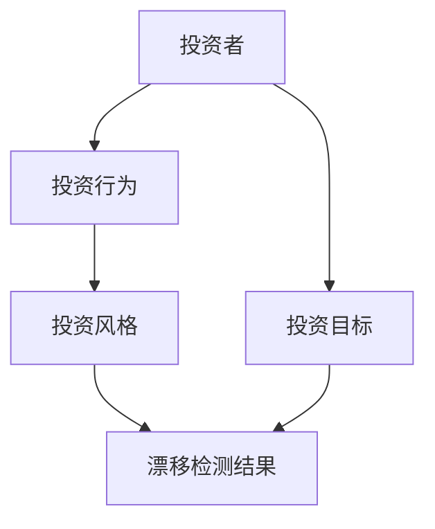
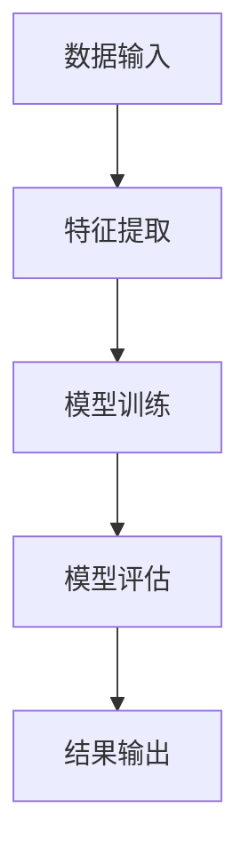
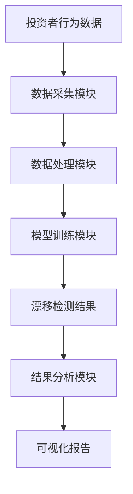

                 


# 构建智能化的个人投资风格漂移检测系统

## 关键词：投资风格漂移，智能化检测，机器学习，数据特征提取，系统架构设计

## 摘要：  
投资风格漂移是指投资者的实际投资行为偏离其初始设定的投资风格的现象。本文旨在构建一个智能化的个人投资风格漂移检测系统，通过数据分析和机器学习技术，实现对投资风格漂移的自动检测和预警。文章从背景、概念、算法原理、系统架构设计、项目实战到最佳实践等方面进行详细阐述，提供了一套完整的解决方案。

---

# 第1章: 投资风格漂移检测的背景与问题

## 1.1 投资风格漂移的定义与背景

### 1.1.1 投资风格的基本概念  
投资风格是指投资者在选择资产、配置资金时所遵循的一套相对稳定的投资策略和偏好。常见的投资风格包括成长型、价值型、趋势型等。  

### 1.1.2 投资风格漂移的定义  
投资风格漂移是指投资者的实际投资行为（如资产配置、交易频率等）与其初始设定的投资风格出现显著偏离的现象。  

### 1.1.3 投资风格漂移的背景与挑战  
- 随着市场环境的变化（如经济周期、政策变化等），投资者的实际行为可能偏离其初始风格。  
- 传统的方法（如定期手工审查）效率低、成本高，难以及时发现漂移现象。  
- 智能化检测可以通过大数据分析和机器学习技术，实时监控并预警投资风格漂移。

---

## 1.2 投资风格漂移检测的核心问题

### 1.2.1 数据获取与处理的难点  
- 数据来源多样（如交易记录、市场数据等），需要进行清洗和预处理。  
- 数据特征提取需要考虑时间序列、资产配置等多个维度。  

### 1.2.2 模型选择与优化的挑战  
- 需要选择适合的投资风格漂移检测算法（如随机森林、支持向量机等）。  
- 模型的泛化能力需要通过交叉验证和超参数优化来提升。  

### 1.2.3 结果解释与应用的复杂性  
- 检测结果需要结合市场环境和投资者行为进行解释。  
- 如何将检测结果应用于投资策略调整是实际应用中的难点。

---

## 1.3 智能化检测的优势与技术路线

### 1.3.1 智能化检测的核心优势  
- 高效性：通过自动化技术快速处理大量数据。  
- 准确性：利用机器学习算法提高检测的准确性。  
- 实时性：可以实时监控投资行为，及时发现漂移现象。  

### 1.3.2 技术路线的总体框架  
1. 数据采集与预处理：获取投资者的投资行为数据并进行清洗。  
2. 特征提取：从数据中提取反映投资风格的特征。  
3. 模型训练：选择合适的算法训练漂移检测模型。  
4. 模型评估与优化：通过验证数据评估模型性能并进行调优。  
5. 系统实现：将模型部署到实际应用中，并进行结果分析与可视化。  

---

# 第2章: 核心概念与系统架构

## 2.1 投资风格漂移检测的核心概念

### 2.1.1 投资风格漂移的特征  
| 特征维度 | 描述 |
|----------|------|
| 资产配置 | 资产类型和比例的变化 |
| 交易频率 | 交易次数和时机的变化 |
| 风险偏好 | 风险资产的持有比例变化 |
| 市场敏感性 | 对市场波动的反应程度 |

### 2.1.2 数据特征与模型特征的对比  
- 数据特征：反映投资者行为的具体指标（如交易频率、资产配置比例）。  
- 模型特征：用于区分不同投资风格的特征（如趋势特征、波动性特征）。  

### 2.1.3 系统架构的组成要素  
- 数据采集模块：负责获取投资者行为数据。  
- 数据处理模块：对数据进行清洗、特征提取和标准化。  
- 模型训练模块：基于特征数据训练漂移检测模型。  
- 结果分析模块：对模型输出的结果进行解释和应用。  

---

## 2.2 投资风格漂移检测的ER实体关系图



---

## 2.3 系统架构设计

### 2.3.1 领域模型的类图


---

## 2.4 系统架构的总体设计

### 2.4.1 数据采集模块
- 负责从数据库或其他数据源获取投资者的行为数据。  
- 示例代码（Python）：
  ```python
  import pandas as pd
  data = pd.read_csv('investment_data.csv')
  ```

### 2.4.2 数据处理模块
- 对数据进行清洗、特征提取和标准化处理。  
- 示例代码：
  ```python
  from sklearn.preprocessing import StandardScaler
  scaler = StandardScaler()
  data_scaled = scaler.fit_transform(data_features)
  ```

### 2.4.3 模型训练模块
- 使用机器学习算法（如随机森林）训练漂移检测模型。  
- 示例代码：
  ```python
  from sklearn.ensemble import RandomForestClassifier
  model = RandomForestClassifier(n_estimators=100, random_state=42)
  model.fit(X_train, y_train)
  ```

### 2.4.4 结果分析模块
- 对模型输出的结果进行解释和可视化。  
- 示例代码：
  ```python
  import matplotlib.pyplot as plt
  plt.bar(range(len(importances)), importances)
  plt.xticks(range(len(importances)), features)
  plt.show()
  ```

---

# 第3章: 投资风格漂移检测的算法原理

## 3.1 特征提取与数据预处理

### 3.1.1 投资行为数据的特征提取
- 提取资产配置、交易频率等特征。  
- 示例代码：
  ```python
  features = data[['asset Allocation', 'transaction Frequency', 'risk Preference']]
  ```

### 3.1.2 数据标准化与归一化处理
- 使用标准化方法处理特征数据。  
- 示例代码：
  ```python
  from sklearn.preprocessing import StandardScaler
  scaler = StandardScaler()
  features_scaled = scaler.fit_transform(features)
  ```

### 3.1.3 数据分窗与滑动窗口技术
- 使用滑动窗口技术提取时间序列特征。  
- 示例代码：
  ```python
  window_size = 30
  for i in range(window_size, len(data)):
      window = data[i-window_size:i]
      # 提取特征并进行分析
  ```

---

## 3.2 模型选择与训练

### 3.2.1 常用算法对比
- 随机森林、支持向量机（SVM）、K-近邻（KNN）等算法的对比与选择。  

### 3.2.2 算法流程图



---

## 3.3 模型评估与优化

### 3.3.1 评估指标
- 准确率、召回率、F1值等指标的计算与对比。  
- 示例代码：
  ```python
  from sklearn.metrics import classification_report
  print(classification_report(y_true, y_pred))
  ```

### 3.3.2 超参数优化与调参
- 使用网格搜索（Grid Search）优化模型参数。  
- 示例代码：
  ```python
  from sklearn.model_selection import GridSearchCV
  param_grid = {'n_estimators': [100, 200], 'max_depth': [None, 10]}
  grid_search = GridSearchCV(RandomForestClassifier(), param_grid, cv=5)
  grid_search.fit(X_train, y_train)
  ```

---

# 第4章: 系统分析与架构设计

## 4.1 系统功能需求分析

### 4.1.1 数据采集与管理
- 从数据库或其他数据源获取投资者行为数据。  
- 数据清洗与预处理。

### 4.1.2 模型训练与部署
- 在训练数据上训练漂移检测模型。  
- 将模型部署到实际应用中。

### 4.1.3 结果可视化与报告生成
- 可视化检测结果并生成报告。  
- 示例代码：
  ```python
  import matplotlib.pyplot as plt
  plt.bar(range(len(importances)), importances)
  plt.xticks(range(len(importances)), features)
  plt.show()
  ```

---

## 4.2 系统架构设计

### 4.2.1 系统架构的总体设计
- 分层架构设计，包括数据层、计算层和应用层。  

### 4.2.2 系统架构的详细设计
- 数据层：存储投资者行为数据和特征数据。  
- 计算层：执行特征提取、模型训练和评估。  
- 应用层：提供用户界面，展示检测结果和生成报告。  

---

## 4.3 系统接口设计

### 4.3.1 系统接口的定义
- 数据接口：与数据源的交互接口。  
- 模型接口：与机器学习模型的交互接口。  

### 4.3.2 接口交互流程
- 数据采集模块通过接口获取数据。  
- 模型训练模块通过接口调用模型。  

---

## 4.4 系统交互流程图



---

# 第5章: 项目实战

## 5.1 项目环境与工具安装

### 5.1.1 环境配置
- 安装Python、Jupyter Notebook、Pandas、Scikit-learn等工具。  

### 5.1.2 数据集准备
- 下载或生成投资者行为数据集。  

---

## 5.2 核心代码实现

### 5.2.1 数据预处理代码
```python
import pandas as pd
from sklearn.preprocessing import StandardScaler

# 读取数据
data = pd.read_csv('investment_data.csv')

# 提取特征
features = data[['asset Allocation', 'transaction Frequency', 'risk Preference']]
labels = data['drift_label']

# 标准化处理
scaler = StandardScaler()
features_scaled = scaler.fit_transform(features)
```

### 5.2.2 模型训练代码
```python
from sklearn.ensemble import RandomForestClassifier
from sklearn.model_selection import train_test_split

# 划分训练集和验证集
X_train, X_val, y_train, y_val = train_test_split(features_scaled, labels, test_size=0.2, random_state=42)

# 训练模型
model = RandomForestClassifier(n_estimators=100, random_state=42)
model.fit(X_train, y_train)

# 验证模型
score = model.score(X_val, y_val)
print(f'模型准确率：{score}')
```

---

## 5.3 实际案例分析

### 5.3.1 数据分析与特征提取
- 对实际案例中的数据进行分析，提取关键特征。  

### 5.3.2 模型应用与结果解读
- 使用训练好的模型对实际案例数据进行预测，解读结果。  

---

## 5.4 代码解读与优化

### 5.4.1 代码优化
- 调整模型参数，优化模型性能。  

### 5.4.2 代码解读
- 详细解释每一步代码的作用和实现原理。  

---

## 5.5 项目小结

### 5.5.1 项目实现的关键点
- 数据预处理与特征提取。  
- 模型选择与优化。  

### 5.5.2 项目的局限性
- 数据获取的难度。  
- 模型解释性的不足。  

---

# 第6章: 最佳实践、小结与展望

## 6.1 最佳实践

### 6.1.1 数据质量管理
- 确保数据的完整性和准确性。  

### 6.1.2 模型调优与解释
- 使用特征重要性分析解释模型结果。  

### 6.1.3 系统优化建议
- 使用分布式计算优化系统的性能。  

---

## 6.2 小结

### 6.2.1 系统实现的总结
- 系统实现了从数据采集到结果分析的完整流程。  

### 6.2.2 关键技术的总结
- 特征提取与数据预处理。  
- 机器学习算法的选择与优化。  

---

## 6.3 展望与注意事项

### 6.3.1 展望
- 研究更先进的算法（如深度学习）提升检测精度。  
- 探索实时监控的投资风格漂移检测系统。  

### 6.3.2 注意事项
- 数据隐私与安全问题。  
- 模型的可解释性与实际应用的结合。  

---

## 6.4 拓展阅读

### 6.4.1 推荐书籍
- 《机器学习实战》  
- 《数据驱动的投资组合管理》  

### 6.4.2 推荐论文
- "Detecting Style Drift in Portfolio Management"  
- "Machine Learning for Financial Applications"  

---

通过以上详细的设计与实现，我们构建了一个智能化的个人投资风格漂移检测系统，能够有效地帮助投资者识别和管理投资风格的变化，为投资决策提供有力支持。

