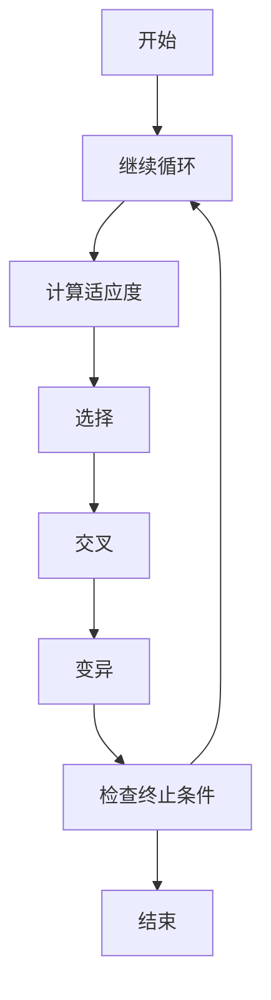
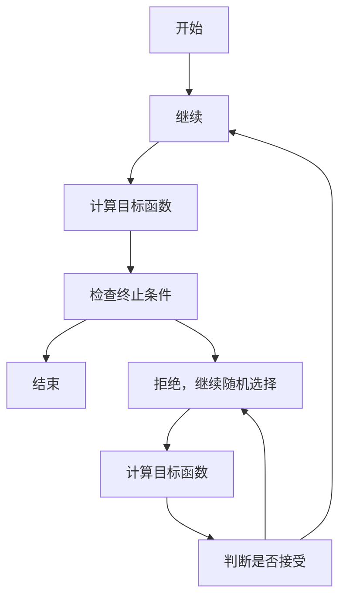
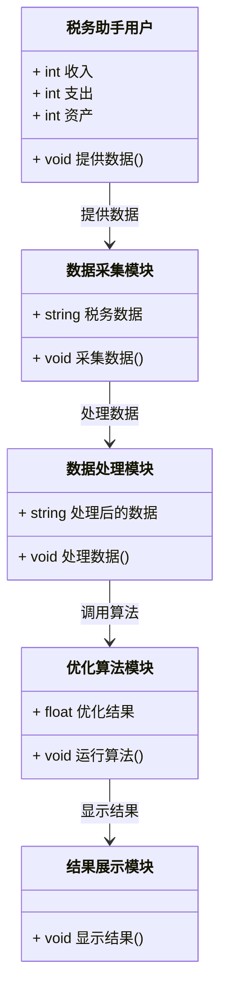
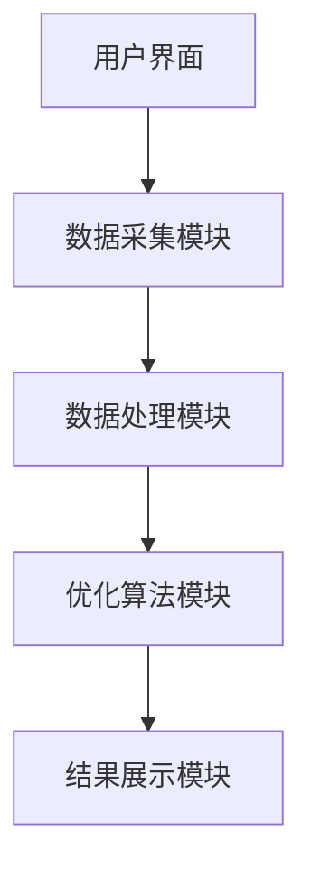

                 


# 构建智能化的个人税务筹划优化助手

## 关键词
智能化，税务筹划，优化助手，算法原理，系统架构

## 摘要
本文将详细介绍如何构建一个智能化的个人税务筹划优化助手。通过分析税务筹划的核心概念、优化算法、系统架构以及项目实战，我们将探讨如何利用人工智能和大数据技术提升个人税务管理效率。文章内容涵盖背景介绍、核心概念解析、算法实现、系统设计以及项目实践，旨在为读者提供一个全面的技术指导。

## 第一部分：背景介绍

### 第1章：智能化税务筹划助手的背景与意义

#### 1.1 税务筹划的基本概念
税务筹划是指通过合法手段优化税务结构，减少税负的过程。对于个人而言，这包括收入分配、投资选择和税务申报等多个方面。

#### 1.2 智能化税务筹划助手的必要性
传统税务筹划依赖人工计算和经验判断，效率低且容易出错。智能化助手通过算法优化和大数据分析，能够提高效率和准确性。

#### 1.3 技术背景与发展趋势
随着人工智能和大数据技术的发展，智能化税务工具逐渐成为可能。这些技术能够处理复杂的数据关系，提供个性化的优化方案。

## 第二部分：核心概念与联系

### 第2章：智能化税务筹划助手的核心概念

#### 2.1 核心概念解析
- **税务数据的采集与处理**：包括收入、支出、资产等数据的收集和预处理。
- **税务规则的自动化应用**：基于税法规定，建立规则引擎，自动计算税款。

#### 2.2 功能模块与技术基础
- **数据采集模块**：负责收集用户税务数据。
- **规则引擎模块**：基于税法建立规则，进行自动计算。
- **优化算法模块**：使用遗传算法或模拟退火算法进行优化。

#### 2.3 实体关系图与流程图
```mermaid
er
actor 税务助手用户
sequence 包含以下步骤：
    税务助手用户 -> 数据采集模块: 提供税务数据
    数据采集模块 -> 数据处理模块: 处理并验证数据
    数据处理模块 -> 优化算法模块: 调用优化算法进行计算
    优化算法模块 -> 结果展示模块: 返回优化结果
    结果展示模块 -> 税务助手用户: 显示优化方案
```

## 第三部分：算法原理讲解

### 第3章：优化算法的核心原理

#### 3.1 遗传算法在税务优化中的应用
遗传算法是一种模拟生物进化过程的优化算法，适用于解决复杂的组合优化问题。



代码示例：
```python
def calculate_fitness(tax_plan):
    # 计算税款
    tax = calculate_tax(tax_plan)
    return -tax  # 最小化问题

def genetic_algorithmntax_plan):
    population = initialize_population()
    best = None
    for _ in range(max_iterations):
        for individual in population:
            fitness = calculate_fitness(individual)
            if best is None or fitness < best.fitness:
                best = individual
        if termination_condition_met():
            break
        population = evolve_population(population)
    return best
```

#### 3.2 模拟退火算法的实现
模拟退火算法适用于解决全局优化问题，能够跳出局部最优。



代码示例：
```python
def simulated_annealingntax_plan):
    current = initial_solution()
    best = current
    temperature = initial_temp
    while temperature > 0:
        neighbor = get_neighbor(current)
        delta = calculate_delta(current, neighbor)
        if delta < 0 or probability(delta, temperature):
            current = neighbor
            if calculate_fitness(current) < calculate_fitness(best):
                best = current
        temperature *= cooling_rate
    return best
```

## 第四部分：系统分析与架构设计

### 第4章：系统分析与架构设计

#### 4.1 问题场景分析
用户输入税务数据，系统进行处理和优化，输出最优方案。

#### 4.2 系统功能设计


#### 4.3 系统架构设计


## 第五部分：项目实战

### 第5章：项目实战与实现

#### 5.1 环境搭建与工具安装
- **开发环境**：Python 3.8+
- **依赖库**：pandas, numpy, scikit-learn

#### 5.2 核心实现
```python
import pandas as pd
from sklearn.model_selection import train_test_split

def main():
    # 数据加载
    data = pd.read_csv('tax_data.csv')
    # 数据预处理
    X = data.drop('tax', axis=1)
    y = data['tax']
    # 划分训练集和测试集
    X_train, X_test, y_train, y_test = train_test_split(X, y, test_size=0.2)
    # 训练模型
    model = train_model(X_train, y_train)
    # 评估模型
    evaluate_model(model, X_test, y_test)

if __name__ == "__main__":
    main()
```

#### 5.3 代码解读
- 数据加载：使用pandas读取CSV文件。
- 数据预处理：去除无关特征，划分训练集和测试集。
- 模型训练：使用机器学习算法训练优化模型。
- 模型评估：评估模型性能，调整参数。

## 第六部分：总结与展望

### 第6章：总结与展望

#### 6.1 项目总结
- 介绍了智能化税务助手的背景、核心概念、算法原理和系统架构。
- 通过项目实战展示了如何实现一个优化助手。

#### 6.2 未来展望
- 结合更多数据源，提高优化精度。
- 引入机器学习技术，提升预测能力。

#### 6.3 最佳实践 Tips
- 数据隐私保护：确保用户数据的安全。
- 算法优化：定期更新算法，提升性能。
- 合规性：遵守税法，确保建议的合法性。

## 附录

### 附录A：数据格式说明
- 输入数据：CSV格式，包含收入、支出等字段。
- 输出结果：JSON格式，包含优化建议。

### 附录B：接口文档
- API接口：提供RESTful API，供其他系统调用。

### 附录C：参考文献
- 包括相关书籍和论文，提供详细引用信息。

通过以上详细的内容，您可以逐步构建一个智能化的个人税务筹划优化助手，利用技术手段提高税务管理效率。

