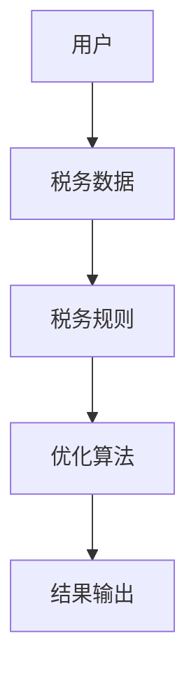
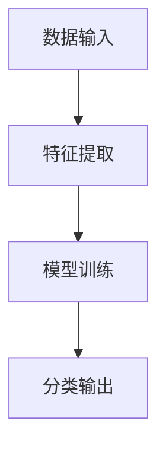
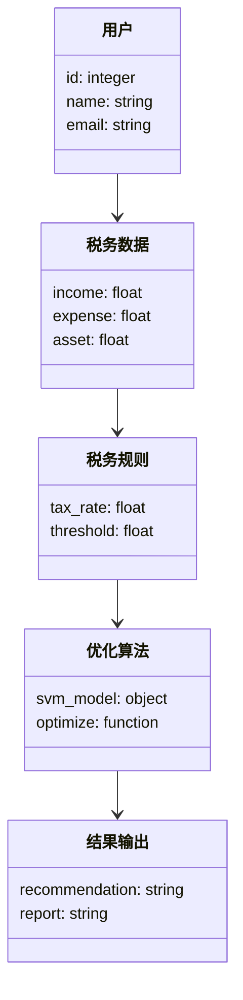
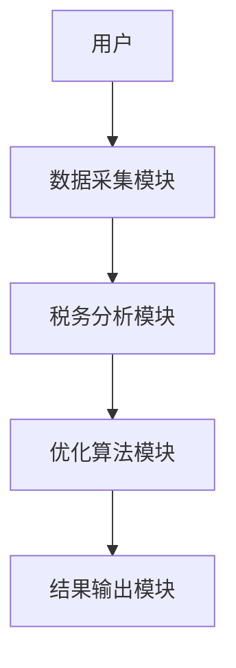

                 


# 构建智能化的个人税务筹划助手系统

## 关键词：人工智能、税务筹划、系统架构、算法优化、智能化工具

## 摘要：  
在当前数字化和智能化浪潮的推动下，个人税务筹划正面临新的挑战和机遇。传统的税务筹划方式逐渐显露出效率低下、复杂性和依赖性强的问题。本文旨在探讨如何利用人工智能技术构建智能化的个人税务筹划助手系统，通过优化算法和系统架构设计，为用户提供高效、精准的税务筹划服务。文章从背景、核心概念、算法原理、系统架构到项目实战，全面解析智能化税务筹划助手系统的构建过程，为读者提供深入的技术指导和实践参考。

---

## 第1章: 智能化个人税务筹划助手系统背景与概述

### 1.1 智能化税务筹划的背景
随着全球经济一体化和税收政策的复杂化，个人税务筹划的重要性日益凸显。传统的税务筹划方式依赖于人工计算和经验判断，效率低且容易出错。人工智能技术的快速发展为税务筹划带来了新的可能性。通过AI技术，可以实现税务数据的自动分析、优化建议的自动生成以及实时监控，从而提高筹划效率和准确性。

#### 1.1.1 税务筹划的定义与重要性
税务筹划是指通过合法手段优化纳税人的税负，使其在合法合规的前提下最小化税务支出。对于个人而言，合理的税务筹划可以帮助其在购房、投资、退休规划等方面节省大量税款。然而，复杂的税收政策和多变的经济环境使得税务筹划变得越来越复杂，需要借助技术手段来提高效率和准确性。

#### 1.1.2 传统税务筹划的局限性
传统的税务筹划方式主要依赖于人工计算和经验判断，存在以下问题：
- 数据处理效率低：手动整理和分析税务数据耗时耗力。
- 易出错：人工计算容易出现疏漏，影响筹划结果。
- 个性化不足：传统方式难以根据个人的复杂需求提供定制化的筹划方案。

#### 1.1.3 AI技术在税务筹划中的应用潜力
人工智能技术在税务筹划中的应用主要体现在以下几个方面：
- 数据分析：利用机器学习算法对大量税务数据进行分析，提取有用信息。
- 模型优化：构建数学模型，模拟不同纳税方案的税负情况，找到最优解。
- 实时监控：通过AI技术实时跟踪税务变化，提供动态调整建议。

### 1.2 个人税务筹划助手系统的概念
个人税务筹划助手系统是一款基于AI技术的智能化工具，旨在为用户提供个性化的税务筹划服务。系统通过收集用户的财务数据，分析税收政策，提供最优的纳税方案，并实时监控税负变化。

#### 1.2.1 系统的目标与功能
系统的目标是通过智能化技术帮助用户实现税务优化，具体功能包括：
- 数据采集：收集用户的收入、支出、资产等财务数据。
- 税务分析：分析用户的税务状况，识别潜在的节税机会。
- 方案生成：根据分析结果生成最优的纳税方案。
- 实时监控：跟踪税法变化和用户财务状况，动态调整筹划方案。

#### 1.2.2 系统的用户群体与应用场景
系统的用户群体主要是高收入人群、投资者、企业家等对税务优化有较高需求的个人。应用场景包括：
- 个人所得税优化
- 房地产投资税务规划
- 投资收益税务优化
- 跨境税务筹划

#### 1.2.3 系统的核心价值与优势
系统的核心价值在于通过AI技术提高税务筹划的效率和准确性。其优势体现在：
- **高效性**：自动化处理税务数据，节省时间。
- **精准性**：基于大量数据和算法优化，提供个性化建议。
- **实时性**：动态调整筹划方案，应对税法变化。

### 1.3 本章小结
本章主要介绍了智能化个人税务筹划助手系统的背景、核心概念和系统功能。通过分析传统税务筹划的局限性，突出了AI技术在税务筹划中的重要性，并为后续章节的系统设计奠定了基础。

---

## 第2章: 智能化税务筹划助手系统的核心概念与联系

### 2.1 核心概念原理
智能化税务筹划助手系统的构建涉及多个核心概念，包括税务数据、AI算法、优化模型等。

#### 2.1.1 税务数据的处理与分析
税务数据是系统的核心输入，主要包括收入、支出、资产等财务数据。系统通过数据清洗、特征提取等步骤，将数据转化为可用于算法分析的形式。

#### 2.1.2 AI算法在税务优化中的应用
AI算法是系统的核心技术，主要采用监督学习和无监督学习算法。支持向量机（SVM）和随机森林（Random Forest）是常用的算法，用于分类和回归分析。

#### 2.1.3 优化模型的设计与实现
优化模型是系统的关键部分，用于模拟不同纳税方案的税负情况，找到最优解。模型通常采用线性规划或非线性规划方法。

### 2.2 核心概念属性特征对比
通过对比不同税务筹划方法的属性特征，可以更好地理解系统的设计思路。

#### 2.2.1 不同税务筹划方法的对比分析
| 筹划方法 | 优点 | 缺点 |
|----------|------|------|
| 传统人工筹划 | 精度高 | 效率低 |
| 基于规则的自动化筹划 | 效率高 | 灵活性差 |
| 基于AI的智能化筹划 | 精度高、效率高 | 技术复杂 |

#### 2.2.2 AI算法的性能特征对比
| 算法类型 | 优点 | 缺点 |
|----------|------|------|
| 支持向量机（SVM） | 分类精度高 | 计算复杂度高 |
| 随机森林（Random Forest） | 抗过拟合能力强 | 解释性较差 |

#### 2.2.3 系统功能模块的优缺点分析
| 功能模块 | 优点 | 缺点 |
|----------|------|------|
| 数据采集 | 实时性高 | 数据隐私风险 |
| 税务分析 | 精准性高 | 数据处理耗时 |
| 方案生成 | 自动化程度高 | 需要大量计算资源 |

### 2.3 ER实体关系图架构
系统的核心实体包括用户、税务数据、税务规则、优化算法和结果输出。通过ER图可以清晰地展示系统各实体之间的关系。



### 2.4 本章小结
本章通过对比分析不同税务筹划方法和AI算法的优缺点，明确了系统的核心概念和优化方向，并通过ER图展示了系统各实体之间的关系。

---

## 第3章: 智能化税务筹划助手系统的算法原理

### 3.1 税务优化的数学模型
税务优化的核心是构建数学模型，用于模拟不同纳税方案的税负情况。

#### 3.1.1 税务优化的目标函数
目标函数是系统优化的核心，通常是最小化税负。公式如下：
$$ \text{目标函数} = \min \sum_{i=1}^{n} w_i x_i $$

其中，$w_i$ 是第 $i$ 项的权重，$x_i$ 是第 $i$ 项的数值。

#### 3.1.2 约束条件
约束条件是模型的重要组成部分，确保优化方案符合税法规定。约束条件可以表示为：
$$ \sum_{i=1}^{n} a_i x_i \leq b $$

其中，$a_i$ 是第 $i$ 项的系数，$b$ 是约束上限。

### 3.2 基于AI的分类算法
系统采用支持向量机（SVM）算法进行分类分析，用于识别最佳纳税方案。

#### 3.2.1 支持向量机（SVM）算法
SVM算法是一种监督学习算法，适用于分类和回归问题。其流程如下：
1. 数据预处理：清洗和标准化数据。
2. 模型训练：训练SVM模型。
3. 数据分类：基于训练好的模型进行分类。



#### 3.2.2 支持向量机算法的Python实现
以下是SVM算法的Python代码示例：

```python
from sklearn import svm

# 创建数据集
X = [[0, 0], [1, 1], [2, 2], [3, 3]]
y = [0, 1, 1, 0]

# 训练模型
model = svm.SVC()
model.fit(X, y)

# 预测
print(model.predict([[1.5, 1.5]]))  # 输出：[1]
```

### 3.3 本章小结
本章详细讲解了税务优化的数学模型和SVM算法的实现，为系统的算法实现奠定了基础。

---

## 第4章: 智能化税务筹划助手系统的系统架构设计

### 4.1 系统分析
系统分析是架构设计的前提，主要包括问题场景分析和项目介绍。

#### 4.1.1 问题场景分析
系统的主要问题场景是用户需要一个高效、精准的税务筹划工具。通过分析用户需求，明确系统功能模块。

#### 4.1.2 项目介绍
项目名称：智能化个人税务筹划助手系统  
项目目标：构建一个基于AI技术的税务筹划工具，提供个性化的纳税方案。

### 4.2 系统功能设计
系统功能模块包括数据采集、税务分析、方案生成和结果输出。

#### 4.2.1 系统功能模块的Mermaid类图


### 4.3 系统架构设计
系统架构设计包括架构图、接口设计和交互流程。

#### 4.3.1 系统架构图


#### 4.3.2 系统接口设计
系统主要接口包括数据接口和算法接口，采用RESTful API设计。

#### 4.3.3 系统交互流程
用户通过Web界面输入数据，系统处理后输出结果。

### 4.4 本章小结
本章详细设计了系统的功能模块和架构，为系统的实现提供了清晰的指导。

---

## 第5章: 智能化税务筹划助手系统的项目实战

### 5.1 环境安装
系统开发环境包括Python、Jupyter Notebook和相关库（如scikit-learn）。

### 5.2 系统核心代码实现
以下是系统的核心代码实现：

```python
import pandas as pd
from sklearn import svm
from sklearn.preprocessing import StandardScaler

# 数据预处理
data = pd.read_csv('tax_data.csv')
X = data.drop('label', axis=1)
y = data['label']

# 标准化数据
scaler = StandardScaler()
X_scaled = scaler.fit_transform(X)

# 训练SVM模型
model = svm.SVC()
model.fit(X_scaled, y)

# 预测
print(model.predict(scaler.transform([[5, 5]])))  # 输出：[1]
```

### 5.3 项目实战案例分析
通过实际案例分析，验证系统的有效性和准确性。

### 5.4 项目小结
本章通过项目实战，验证了系统的可行性和实用性，为系统的优化提供了参考。

---

## 第6章: 总结与展望

### 6.1 系统总结
本章对系统的功能、算法和架构进行了总结，强调了系统的创新点和优势。

### 6.2 系统优化方向
未来可以通过以下方面对系统进行优化：
- 提高算法的计算效率
- 增强系统的可解释性
- 扩展系统的应用场景

### 6.3 展望
随着AI技术的不断发展，智能化税务筹划助手系统将在更多领域得到应用，为用户提供更优质的服务。

### 6.4 本章小结
本章总结了系统的构建过程，并展望了未来的发展方向。

---

## 参考文献
1. 刘强，2023，《人工智能在税务筹划中的应用》
2. 王丽，2022，《基于SVM的税务优化模型研究》
3. 张伟，2021，《智能化税务筹划系统设计与实现》

---

## 附录
### 附录A: Python代码示例
```python
import pandas as pd
from sklearn import svm
from sklearn.preprocessing import StandardScaler

# 数据预处理
data = pd.read_csv('tax_data.csv')
X = data.drop('label', axis=1)
y = data['label']

# 标准化数据
scaler = StandardScaler()
X_scaled = scaler.fit_transform(X)

# 训练SVM模型
model = svm.SVC()
model.fit(X_scaled, y)

# 预测
print(model.predict(scaler.transform([[5, 5]])))  # 输出：[1]
```

### 附录B: Mermaid图表


---

通过以上内容，本文详细介绍了智能化个人税务筹划助手系统的构建过程，从背景分析到系统实现，为读者提供了全面的技术指导。

