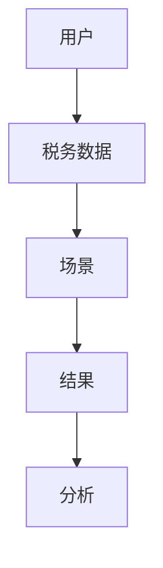
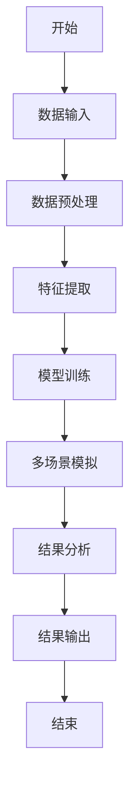
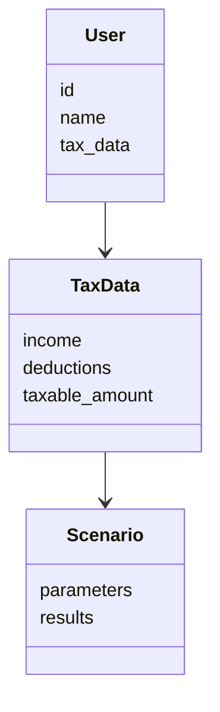
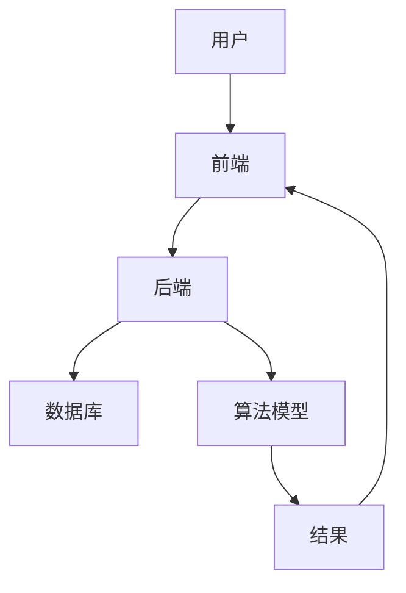

                 


# 《构建智能化的个人税务筹划多场景模拟助手》

---

## 关键词：
- 智能化税务筹划
- 多场景模拟
- 人工智能
- 数据驱动
- 税务优化

---

## 摘要：
本文详细介绍了如何构建一个智能化的个人税务筹划多场景模拟助手。通过结合数据分析、人工智能算法和多场景模拟技术，该助手能够为用户提供个性化的税务优化方案。文章从背景、核心概念、算法原理、系统架构到项目实战，全面阐述了实现这一助手的各个关键环节。通过对数据驱动的税务分析、人工智能算法的应用以及多场景模拟的实现机制的深入探讨，本文为读者提供了从理论到实践的完整指南，帮助用户在复杂多变的税务环境中做出最优决策。

---

## 目录大纲

### 第一部分: 智能化税务筹划助手的背景与核心概念

### 第1章: 个人税务筹划的智能化需求

#### 1.1 税务筹划的背景与挑战
- 1.1.1 个人税务筹划的基本概念
  - 税务筹划的定义与目标
  - 个人税务筹划的核心要素
  - 税务合规性与风险控制
- 1.1.2 当前税务筹划的主要挑战
  - 税法复杂性与变化性
  - 数据分散与信息不全
  - 个性化需求与效率低下
- 1.1.3 智能化税务筹划的需求与目标
  - 提高效率与精准度
  - 实现多场景模拟与优化
  - 支持个性化与动态调整

#### 1.2 多场景模拟助手的核心价值
- 1.2.1 多场景模拟的定义与特点
  - 多场景模拟的含义
  - 场景切换与参数调整
  - 模拟结果的可比性与可解释性
- 1.2.2 智能化助手在税务筹划中的作用
  - 数据分析与趋势预测
  - 智能推荐与优化方案
  - 实时反馈与动态调整
- 1.2.3 多场景模拟助手的边界与外延
  - 辅助决策与最终决策权的分离
  - 功能范围与适用场景的界定

#### 1.3 智能化税务筹划助手的核心要素
- 1.3.1 数据驱动的税务分析
  - 数据采集与处理
  - 数据建模与分析
  - 数据可视化与洞察
- 1.3.2 人工智能在税务模拟中的应用
  - 机器学习与深度学习技术
  - 自然语言处理与知识图谱
  - 预测模型与优化算法
- 1.3.3 多场景模拟的实现机制
  - 场景建模与参数配置
  - 模拟过程与结果分析
  - 多维度结果对比与优化

#### 1.4 本章小结
- 本章总结了智能化税务筹划助手的背景、核心价值与实现要素，为后续章节的深入探讨奠定了基础。

---

### 第2章: 智能化税务筹划助手的核心概念与联系

#### 2.1 核心概念的原理分析
- 2.1.1 数据分析与税务模拟
  - 数据分析在税务模拟中的作用
  - 数据驱动的模拟过程与方法
  - 数据特征与模拟结果的关系
- 2.1.2 人工智能算法在税务模拟中的应用
  - 机器学习算法的适用场景
  - 深度学习技术的优势与局限
  - 自然语言处理在税务文档分析中的应用
- 2.1.3 多场景模拟的实现原理
  - 多场景建模与参数设置
  - 场景之间的关联与影响
  - 模拟结果的综合评估与优化

#### 2.2 核心概念的属性特征对比
- 2.2.1 数据驱动与规则驱动的对比
  - 数据驱动的优点与局限
  - 规则驱动的适用场景与不足
  - 数据驱动与规则驱动的结合
- 2.2.2 单场景模拟与多场景模拟的差异
  - 单场景模拟的局限性
  - 多场景模拟的优势与挑战
  - 场景数量与计算效率的平衡
- 2.2.3 传统税务筹划与智能化税务筹划的对比
  - 传统税务筹划的特点与不足
  - 智能化税务筹划的核心优势
  - 两种方法的结合与互补

#### 2.3 ER实体关系图架构


#### 2.4 本章小结
- 本章通过对比分析与图表展示，明确了智能化税务筹划助手的核心概念及其内在联系，为后续章节的算法实现与系统设计提供了理论基础。

---

### 第3章: 多场景模拟助手的算法原理

#### 3.1 算法原理概述
- 3.1.1 数据预处理与特征提取
  - 数据清洗与标准化
  - 特征选择与降维
  - 时间序列数据的处理
- 3.1.2 税务模拟模型的构建
  - 线性回归与随机森林模型
  - 支持向量机与神经网络模型
  - 混合模型的构建与优化
- 3.1.3 多场景模拟的实现步骤
  - 场景参数化与初始化
  - 模拟过程与结果记录
  - 结果分析与优化建议

#### 3.2 算法流程图


#### 3.3 算法实现代码示例
```python
import pandas as pd
from sklearn.ensemble import RandomForestRegressor
from sklearn.model_selection import train_test_split

# 数据加载
data = pd.read_csv('tax_data.csv')

# 特征与目标变量分离
X = data.drop('tax_amount', axis=1)
y = data['tax_amount']

# 数据分割
X_train, X_test, y_train, y_test = train_test_split(X, y, test_size=0.2, random_state=42)

# 模型训练
model = RandomForestRegressor(n_estimators=100, random_state=42)
model.fit(X_train, y_train)

# 多场景模拟
def simulate_scenario(params):
    # 根据参数生成模拟数据
    simulated_data = pd.DataFrame(params)
    # 预测税额
    predicted_amount = model.predict(simulated_data)
    return predicted_amount[0]

# 示例场景
scenario_params = {
    'income': 100000,
    'deductions': 20000,
    'taxable_amount': 70000
}

result = simulate_scenario(scenario_params)
print(f"预测税额为：{result}")
```

#### 3.4 算法的数学模型与公式
- 3.4.1 随机森林回归模型的数学表达
  - $$ y = \sum_{i=1}^{n} \theta_i x_i $$
  - 其中，$$ \theta_i $$ 是特征 $$ x_i $$ 的权重，$$ n $$ 是特征数量。
- 3.4.2 多场景模拟的参数优化公式
  - 使用交叉验证优化模型参数：
    $$ \text{MSE} = \frac{1}{n} \sum_{i=1}^{n} (y_i - \hat{y}_i)^2 $$
  - 其中，$$ y_i $$ 是真实值，$$ \hat{y}_i $$ 是预测值。

#### 3.5 本章小结
- 本章详细讲解了多场景模拟助手的算法原理，包括数据预处理、模型训练与多场景模拟的实现，并通过代码示例和数学公式加深了对算法的理解。

---

### 第4章: 智能化税务筹划助手的系统分析与架构设计

#### 4.1 系统分析与需求定义
- 4.1.1 问题场景介绍
  - 税务筹划的复杂性与多样性
  - 个性化需求与动态调整
  - 多场景模拟的必要性
- 4.1.2 系统目标与功能
  - 提供多场景模拟功能
  - 实现智能化税务优化
  - 支持用户交互与结果可视化

#### 4.2 系统架构设计
- 4.2.1 领域模型设计

- 4.2.2 系统架构设计


#### 4.3 接口设计与交互
- 4.3.1 API接口定义
  - RESTful API设计
  - 输入与输出格式
  - 接口调用与认证
- 4.3.2 用户交互流程
  - 用户输入参数
  - 系统进行模拟
  - 结果展示与反馈

#### 4.4 本章小结
- 本章通过系统分析与架构设计，明确了智能化税务筹划助手的实现路径，并为后续的项目开发提供了指导。

---

### 第5章: 智能化税务筹划助手的项目实战

#### 5.1 项目环境与工具安装
- 5.1.1 开发环境配置
  - Python版本要求
  - 软件包安装（如pandas、scikit-learn等）
  - 数据库与存储方案
- 5.1.2 环境搭建步骤
  - 安装Python与开发工具
  - 安装必要的库与框架
  - 数据集准备与预处理

#### 5.2 系统核心实现
- 5.2.1 数据预处理与特征工程
  - 数据清洗与标准化
  - 特征选择与建模
  - 模型训练与调优
- 5.2.2 多场景模拟实现
  - 场景参数化与配置
  - 模拟过程与结果记录
  - 结果分析与可视化

#### 5.3 实际案例分析
- 5.3.1 案例背景与数据准备
  - 案例描述
  - 数据来源与处理
  - 场景设定与目标
- 5.3.2 模拟过程与结果展示
  - 不同场景下的税额计算
  - 模拟结果对比与分析
  - 优化建议与实施步骤

#### 5.4 项目总结与经验分享
- 5.4.1 项目成果
  - 系统实现的功能与性能
  - 用户反馈与改进建议
  - 项目中的关键点与难点
- 5.4.2 实践中的注意事项
  - 数据质量与模型准确性
  - 场景覆盖与模拟效果
  - 系统性能与扩展性

#### 5.5 本章小结
- 本章通过实际案例分析与项目实现，展示了智能化税务筹划助手的应用价值，并总结了项目开发中的经验和注意事项。

---

### 第6章: 智能化税务筹划助手的最佳实践与未来展望

#### 6.1 最佳实践
- 6.1.1 数据质量管理
  - 数据清洗与验证
  - 数据来源与可靠性
  - 数据更新与维护
- 6.1.2 模型优化策略
  - 模型调优与参数优化
  - 模型评估与验证
  - 模型迭代与更新
- 6.1.3 系统安全与合规
  - 数据隐私保护
  - 系统安全性与稳定性
  - 合规性与法律风险

#### 6.2 小结与注意事项
- 6.2.1 本章总结
  - 最佳实践的核心内容
  - 实际应用中的关键点
  - 系统维护与优化建议
- 6.2.2 注意事项
  - 数据使用的合法性
  - 系统的可扩展性与可维护性
  - 用户教育与培训

#### 6.3 未来展望
- 6.3.1 技术发展
  - 人工智能技术的进一步应用
  - 大数据分析与实时模拟
  - 区块链技术的潜在应用
- 6.3.2 应用场景扩展
  - 更多行业的应用可能性
  - 全球化税务筹划的挑战与机遇
  - 个性化服务的深度发展

#### 6.4 本章小结
- 本章总结了智能化税务筹划助手的最佳实践，并展望了未来的技术发展与应用场景。

---

### 附录: 智能化税务筹划助手开发参考资料

#### 附录A: 开发工具与库
- Python包管理
  - pip安装与管理
  - 常用开发库（pandas、numpy、scikit-learn等）
- 数据库选择与使用
  - 关系型数据库与非关系型数据库
  - 数据存储与查询优化

#### 附录B: 数据集与样本
- 数据格式与结构
  - CSV文件结构
  - 数据字段说明
  - 数据样本展示
- 数据预处理示例
  - 缺失值处理
  - 异常值处理
  - 数据归一化与标准化

#### 附录C: 参考文献与拓展阅读
- 推荐书籍与论文
  - 《机器学习实战》
  - 《Python机器学习》
  - 《税务筹划实务与案例分析》
- 在线资源与工具
  - 开发文档与教程
  - 在线调试与测试工具
  - 数据可视化与分析工具

---

## 作者简介
作者是一位在人工智能与软件架构领域具有深厚积累的技术专家，拥有丰富的实践经验与写作经验，致力于通过技术分享推动行业进步。

---

## 章节内容概览
1. **背景与核心概念**：从税务筹划的背景、挑战与智能化需求出发，介绍多场景模拟助手的核心价值与实现要素。
2. **核心概念与联系**：通过对比分析与图表展示，明确智能化税务筹划助手的核心概念及其内在联系。
3. **算法原理**：详细讲解数据预处理、特征提取、模型训练与多场景模拟的实现，并通过代码示例和数学公式加深理解。
4. **系统分析与架构设计**：从系统分析到架构设计，明确智能化税务筹划助手的实现路径。
5. **项目实战**：通过实际案例分析与项目实现，展示智能化税务筹划助手的应用价值，并总结开发经验。
6. **最佳实践与未来展望**：总结最佳实践，展望未来的技术发展与应用场景。
7. **附录**：提供开发参考资料，包括工具、数据集与参考文献，方便读者深入研究。

---

通过以上目录大纲，您可以逐步展开每章的内容，撰写一篇结构清晰、内容详实的高质量技术博客文章。

