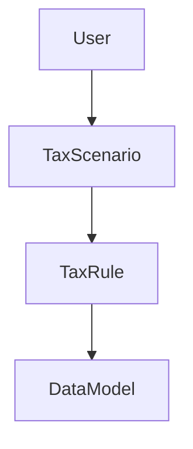
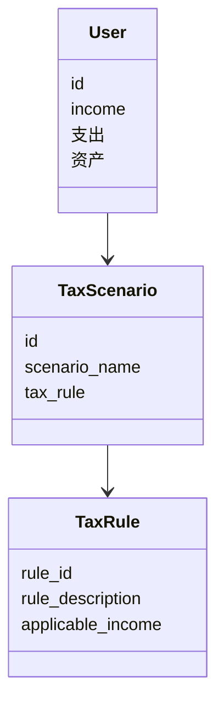
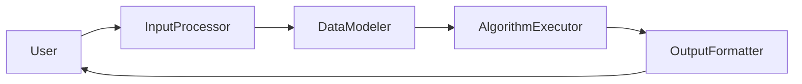
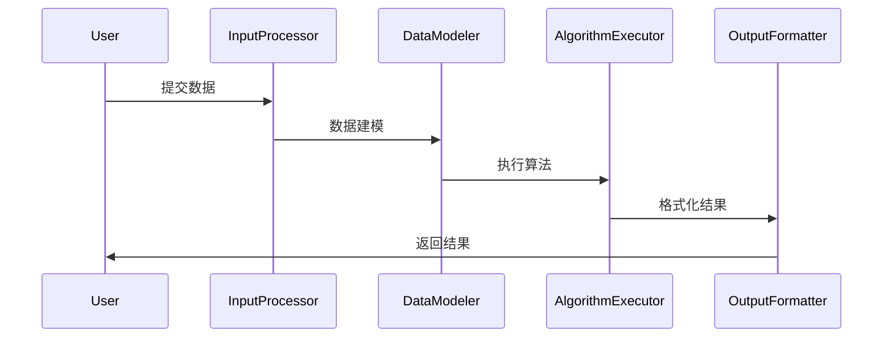

                 


# 构建智能化的个人税务筹划情景模拟助手

> 关键词：税务筹划，人工智能，情景模拟，智能化助手，机器学习

> 摘要：本文探讨如何利用人工智能技术构建智能化的个人税务筹划情景模拟助手，通过分析税务规则、用户需求和数据驱动的优化算法，结合支持向量机和决策树等机器学习模型，构建一个高效的税务筹划系统。文章详细阐述了系统架构设计、算法原理、项目实现和实际案例分析，为读者提供全面的技术指导。

---

# 第1章: 智能化个人税务筹划助手的背景与意义

## 1.1 个人税务筹划的基本概念
### 1.1.1 税务筹划的定义
税务筹划是指通过合理规划和调整个人的收入、支出和资产配置，以最小化税负并实现财务目标的过程。

### 1.1.2 税务筹划的重要性
- 降低个人税负
- 提高财务灵活性
- 避免税务风险

## 1.2 人工智能在税务筹划中的应用背景
### 1.2.1 人工智能技术的发展
- 数据挖掘、机器学习和自然语言处理技术的进步为税务筹划提供了新的可能性。

### 1.2.2 税务筹划中的复杂性与不确定性
- 税务政策的变化
- 个人收入来源多样化
- 税务规则的复杂性

## 1.3 智能化税务筹划助手的意义
### 1.3.1 提高效率
- 自动化处理税务数据，快速生成筹划方案。

### 1.3.2 优化决策
- 基于历史数据和机器学习模型，提供个性化建议。

### 1.3.3 风险控制
- 通过情景模拟预测潜在风险，制定应对策略。

---

# 第2章: 智能化税务筹划助手的核心概念与联系

## 2.1 核心概念原理
### 2.1.1 税务规则与政策分析
- 通过自然语言处理技术提取税务政策的关键信息。

### 2.1.2 用户需求分析与场景模拟
- 基于用户收入、支出和资产数据，模拟不同情景下的税负情况。

### 2.1.3 数据驱动的优化算法
- 使用支持向量机和决策树等算法优化税务筹划方案。

## 2.2 核心概念对比表格
| 对比维度 | 传统税务筹划 | 智能化税务筹划 |
|----------|--------------|----------------|
| 数据来源 | 纸质报表     | 结构化数据       |
| 分析效率 | 低           | 高             |
| 精准度   | 依赖人工经验   | 数据驱动精准     |

## 2.3 ER实体关系图


---

# 第3章: 智能化税务筹划助手的算法原理

## 3.1 支持向量机算法
### 3.1.1 算法原理
- 支持向量机是一种监督学习算法，适用于分类和回归问题。

### 3.1.2 税务场景中的应用
- 对不同收入来源的税后金额进行分类，预测最佳资产配置方案。

### 3.1.3 算法实现
```python
import numpy as np
from sklearn import svm

# 示例数据集
X = np.array([[1, 0], [0, 1], [0, 0], [1, 1]])
y = np.array([1, 1, 0, 0])

# 创建SVM模型
model = svm.SVC()
model.fit(X, y)
```

### 3.1.4 数学模型
$$ \text{优化问题: } \min_{w,b,\xi} \frac{1}{2}||w||^2 + C\sum_{i=1}^n \xi_i $$
$$ \text{约束条件: } y_i(w \cdot x_i + b) \geq 1 - \xi_i $$

## 3.2 决策树算法
### 3.2.1 算法原理
- 决策树通过特征分裂构建树状结构，用于分类和回归。

### 3.2.2 税务场景中的应用
- 分析用户的收入结构，预测最优的税收优惠政策选择。

### 3.2.3 算法实现
```python
from sklearn.tree import DecisionTreeClassifier

# 示例数据集
X = np.array([[1, 0], [0, 1], [0, 0], [1, 1]])
y = np.array([1, 1, 0, 0])

# 创建决策树模型
model = DecisionTreeClassifier()
model.fit(X, y)
```

### 3.2.4 数学模型
$$ \text{信息增益: } \text{Gain}(D, A) = H(D) - H(D|A) $$

---

# 第4章: 智能化税务筹划助手的系统分析与架构设计

## 4.1 系统分析
### 4.1.1 问题场景介绍
- 用户通过输入收入、支出和资产数据，系统生成最优税务筹划方案。

### 4.1.2 项目介绍
- 开发一个基于机器学习的税务筹划助手，支持多场景模拟和优化建议。

## 4.2 系统功能设计
### 4.2.1 领域模型类图


## 4.3 系统架构设计
### 4.3.1 系统架构图


### 4.3.2 接口设计
- 输入接口：API接收用户数据。
- 输出接口：返回优化后的税务筹划方案。

## 4.4 系统交互设计
### 4.4.1 序列图


---

# 第5章: 项目实战

## 5.1 环境安装
### 5.1.1 安装Python和机器学习库
```bash
pip install numpy scikit-learn
```

## 5.2 系统核心实现
### 5.2.1 核心代码
```python
def tax_optimization(user_income, user_expenses):
    # 数据预处理
    data = preprocess(user_income, user_expenses)
    # 模型训练
    model = train_model(data)
    # 情景模拟
    scenarios = generate_scenarios(data)
    # 优化建议
    recommendations = model.predict(scenarios)
    return recommendations
```

### 5.2.2 代码解读
- 数据预处理：清洗和转换用户输入数据。
- 模型训练：基于历史数据训练机器学习模型。
- 情景模拟：生成多种税务筹划方案。
- 优化建议：模型预测最佳方案。

## 5.3 实际案例分析
### 5.3.1 案例背景
- 用户年收入10万元，家庭支出5万元。

### 5.3.2 分析过程
- 数据输入：收入和支出数据。
- 模型分析：生成多种税务筹划方案。
- 优化建议：推荐最优资产配置。

## 5.4 项目小结
- 通过实际案例验证系统的有效性。
- 总结项目实现的关键步骤和注意事项。

---

# 第6章: 最佳实践与总结

## 6.1 总结
### 6.1.1 核心内容回顾
- 税务筹划的重要性
- 人工智能技术的应用
- 算法原理和系统架构

## 6.2 注意事项
### 6.2.1 数据质量
- 确保数据的准确性和完整性。

### 6.2.2 模型选择
- 根据具体场景选择合适的算法。

## 6.3 未来展望
### 6.3.1 技术进步
- 更加复杂的机器学习模型的应用。

### 6.3.2 数据共享与隐私保护
- 数据安全和隐私保护的重要性。

---

# 附录: 工具与资源

## 附录A: 数据集示例
```python
# 示例数据集
X = np.array([[1, 0], [0, 1], [0, 0], [1, 1]])
y = np.array([1, 1, 0, 0])
```

## 附录B: 工具包安装
```bash
pip install numpy scikit-learn
```

---

# 结语

通过本文的详细讲解，读者可以深入了解如何利用人工智能技术构建智能化的个人税务筹划情景模拟助手。从算法原理到系统实现，再到实际案例分析，文章为读者提供了全面的技术指导。希望本文能够为税务筹划领域的智能化发展提供有价值的参考。

