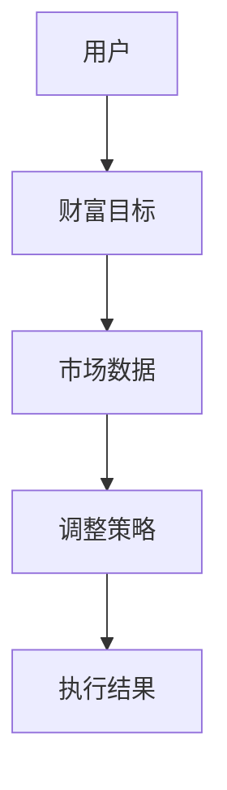
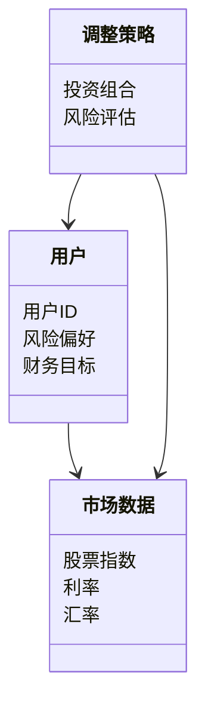
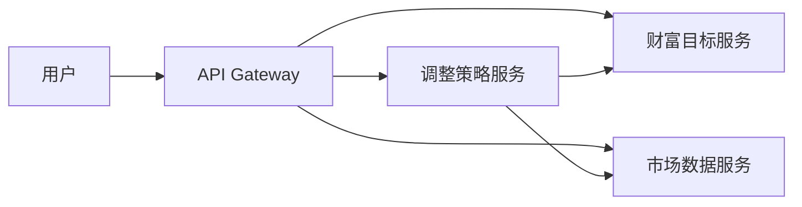
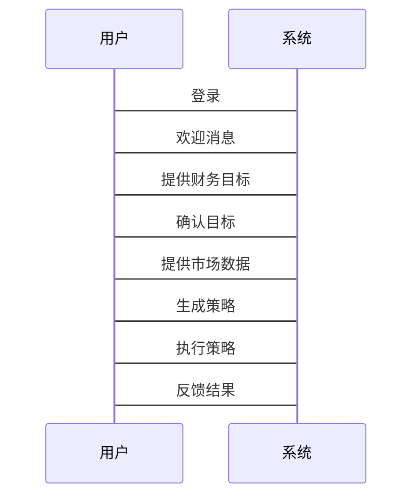

                 


# 构建智能化的个人财富管理目标动态调整助手

## 关键词：人工智能、财富管理、动态调整、预测模型、优化算法

## 摘要：本文探讨了如何利用人工智能和大数据技术构建一个智能化的个人财富管理目标动态调整助手。通过分析传统财富管理的不足，提出了一种基于机器学习和数学建模的方法，实现财富目标的实时预测和动态优化。文章详细介绍了核心算法、系统架构设计、项目实战和最佳实践，为读者提供了从理论到实践的全面指导。

---

## 第一部分：背景与问题分析

### 第1章：背景与问题分析

#### 1.1 智能化财富管理的背景

随着经济全球化和金融市场的复杂化，个人财富管理面临诸多挑战。传统的方法依赖于固定的投资策略和定期的人工调整，难以应对市场波动和个体需求变化。人工智能和大数据技术的兴起为财富管理带来了新的可能性。

#### 1.2 问题背景与描述

个人财富管理的核心目标是实现资产的保值与增值。然而，市场环境的不确定性、个体风险偏好的变化以及经济周期的波动使得财富管理目标需要不断调整。传统的静态管理方法已无法满足现代人的需求。

#### 1.3 核心概念与边界

**动态调整助手**是一种基于人工智能的工具，能够实时分析市场数据和用户需求，提供个性化的财富管理建议。其核心在于动态优化投资组合，以适应市场变化和用户目标的调整。

### 第2章：核心概念与联系

#### 2.1 核心概念原理

动态调整助手通过数据驱动的方法，利用机器学习算法预测市场趋势，并根据用户的风险偏好和财务目标调整投资策略。

#### 2.2 概念属性对比表

| 概念       | 动态性 | 数据依赖性 | 智能性 |
|------------|--------|------------|--------|
| 静态管理    | 低     | 低         | 低     |
| 动态调整助手 | 高     | 高         | 高     |

#### 2.3 ER实体关系图



---

## 第二部分：核心算法与数学模型

### 第3章：核心算法与数学模型

#### 3.1 预测模型

预测模型是动态调整助手的核心，用于预测市场趋势。常用的方法包括时间序列分析和机器学习算法。

**时间序列预测模型：ARIMA**

ARIMA（自回归积分滑动平均模型）是一种广泛应用于时间序列预测的方法。其基本结构如下：

$$ ARIMA(p, d, q) $$

其中，p为自回归阶数，d为差分阶数，q为移动平均阶数。

#### 3.2 需求分析模型

需求分析模型用于确定用户的财务目标和风险偏好。这通常通过用户调查和数据分析来实现。

#### 3.3 优化算法

优化算法用于调整投资组合，以实现最大收益或最小风险。常用的是动态规划和遗传算法。

**动态规划模型**

动态规划是一种解决多阶段决策问题的方法。其基本步骤如下：

1. **状态定义**：定义问题的状态变量。
2. **转移方程**：描述状态之间的转移关系。
3. **目标函数**：定义优化的目标。
4. **边界条件**：设定初始和终止条件。

---

## 第三部分：系统架构与模块设计

### 第4章：系统架构与模块设计

#### 4.1 系统功能设计

系统主要包括数据采集、用户画像、目标设定、策略执行和反馈优化五个模块。

**领域模型类图**



#### 4.2 系统架构设计

系统采用微服务架构，主要包括数据层、业务逻辑层和用户界面层。

**系统架构图**



#### 4.3 系统交互设计

用户与系统的交互流程如下：

1. 用户登录系统。
2. 系统采集用户的基本信息和财务目标。
3. 系统分析市场数据，生成调整策略。
4. 用户查看并确认策略。
5. 系统执行策略并反馈结果。

**交互序列图**



---

## 第四部分：项目实战与代码实现

### 第5章：项目实战与代码实现

#### 5.1 环境搭建

需要安装Python、Jupyter Notebook、Pandas、NumPy、Scikit-learn和Plotly。

#### 5.2 核心功能实现

##### 数据预处理

```python
import pandas as pd
import numpy as np

# 加载数据
data = pd.read_csv('market_data.csv')

# 数据清洗
data.dropna(inplace=True)
data = data[~data['date'].isnull()]
```

##### 模型训练

```python
from sklearn.model_selection import train_test_split
from sklearn.ensemble import RandomForestRegressor

# 划分训练集和测试集
X = data[['feature1', 'feature2']]
y = data['target']
X_train, X_test, y_train, y_test = train_test_split(X, y, test_size=0.2)

# 训练模型
model = RandomForestRegressor()
model.fit(X_train, y_train)
```

##### 策略执行

```python
import datetime

# 获取当前日期
today = datetime.date.today()

# 执行调整策略
def execute_strategy():
    current_date = today.strftime("%Y-%m-%d")
    # 调用API获取市场数据
    # 调整投资组合
    # 执行交易
```

---

## 第五部分：最佳实践与优化

### 第6章：最佳实践与优化

#### 6.1 优化建议

1. **数据更新频率**：定期更新市场数据，确保模型输入的及时性。
2. **模型评估**：定期评估模型性能，根据市场变化调整模型参数。
3. **用户体验**：优化用户界面，提升用户体验。

#### 6.2 注意事项

- 数据隐私保护：确保用户数据的安全性。
- 模型解释性：选择可解释性较强的模型，便于用户理解调整策略。
- 系统稳定性：确保系统的高可用性，避免因技术问题导致策略执行失败。

#### 6.3 拓展阅读

- 《机器学习实战》
- 《时间序列分析：方法与应用》

---

## 第六部分：总结与展望

### 第7章：总结与展望

#### 7.1 总结

本文详细介绍了如何构建智能化的个人财富管理目标动态调整助手，涵盖了背景分析、算法设计、系统架构和项目实战等方面。通过理论与实践相结合，为读者提供了一个完整的解决方案。

#### 7.2 展望

未来，随着人工智能和大数据技术的进一步发展，动态调整助手将更加智能化和个性化。建议进一步研究多模态数据的融合、强化学习的应用以及用户行为分析，以提升系统的智能化水平。

---

以上是《构建智能化的个人财富管理目标动态调整助手》的完整目录大纲和内容概要，涵盖了从理论到实践的各个方面，为读者提供了全面的技术指导。

