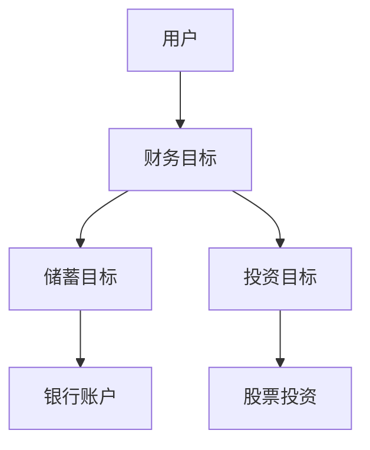
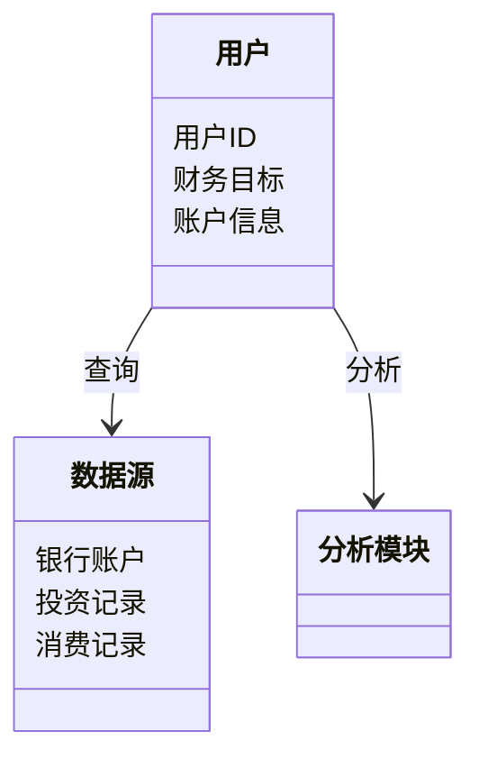
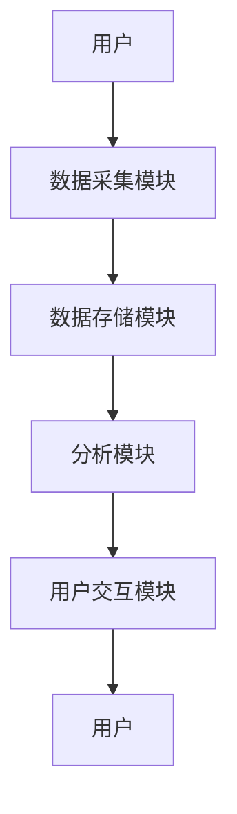
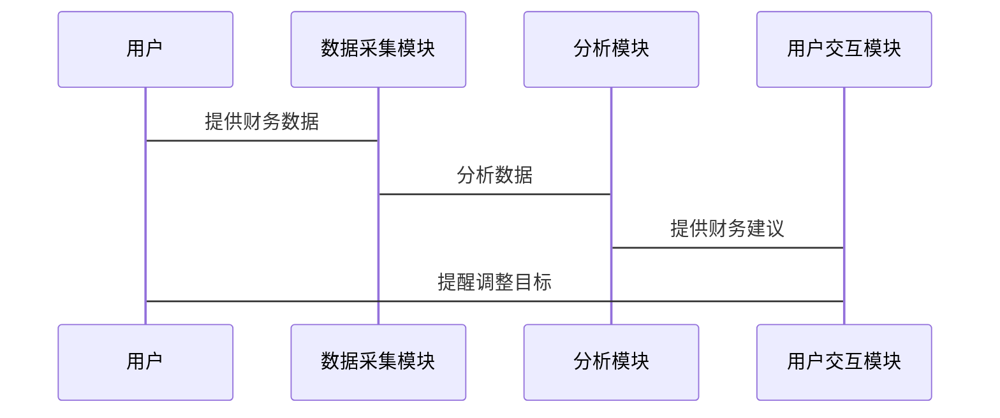

                 


# 《构建智能化的个人财富管理目标跟踪助手》

---

## 关键词：

智能化、个人财富管理、目标跟踪、人工智能、机器学习、知识图谱、自然语言处理

---

## 摘要：

智能化的个人财富管理目标跟踪助手是一种结合人工智能和大数据分析的创新工具，旨在帮助用户实时监控和优化他们的财务目标。本文通过详细的技术分析，从背景介绍、核心概念、算法原理到系统架构、项目实战等多方面展开，深入探讨如何利用知识图谱、自然语言处理和机器学习等技术，构建一个高效、智能的财富管理助手。文章还提供了具体的实现步骤和案例分析，帮助读者全面理解并掌握这一技术的应用。

---

# 第一部分: 智能化个人财富管理助手的背景与需求

# 第1章: 个人财富管理的智能化需求

## 1.1 问题背景与目标

### 1.1.1 传统个人财富管理的痛点

传统财富管理依赖人工记录和定期检查，存在效率低、易遗忘、难以实时跟踪等问题。用户可能因为疏忽而错过重要的财务调整机会，或者无法及时发现潜在的财务风险。

### 1.1.2 智能化管理的必要性

随着人工智能和大数据技术的发展，智能化的财富管理助手能够实时跟踪用户的财务状况，提供个性化的建议，帮助用户更好地实现财务目标。智能化管理不仅提高了效率，还能通过数据分析发现潜在的优化机会。

### 1.1.3 目标跟踪助手的核心价值

目标跟踪助手通过实时数据收集、智能分析和主动提醒，帮助用户持续关注和调整他们的财务目标，避免因疏忽或遗忘而导致的财务问题。

## 1.2 问题描述与解决思路

### 1.2.1 财富管理目标的多样性

用户可能有不同的财务目标，如储蓄、投资、债务管理等，每个目标都有其独特的跟踪方式和优先级。

### 1.2.2 数据分析与行为预测的挑战

需要处理多源异构数据，并通过机器学习模型预测用户的财务行为，以提供精准的建议。

### 1.2.3 AI技术在目标跟踪中的应用

利用自然语言处理理解用户的财务需求，通过知识图谱构建财务知识体系，并结合推荐算法提供个性化的财务建议。

## 1.3 边界与外延

### 1.3.1 功能边界

目标跟踪助手专注于实时数据跟踪和提醒功能，不涉及复杂的财务计算或投资建议。

### 1.3.2 与现有工具的区分

与传统的财务软件不同，目标跟踪助手强调智能化和实时性，能够主动提醒用户调整财务行为。

### 1.3.3 可能的扩展方向

未来可以考虑增加财务预测、投资建议等功能，进一步提升助手的智能化水平。

## 1.4 概念结构与核心要素

### 1.4.1 核心概念框架

目标跟踪助手的核心框架包括数据采集模块、智能分析模块和用户交互模块。

### 1.4.2 核心要素的详细描述

- 数据采集：通过API获取用户的财务数据，如银行流水、投资收益等。
- 智能分析：利用机器学习模型预测用户的财务行为，提供个性化建议。
- 用户交互：通过友好的界面与用户互动，实时提醒用户调整财务目标。

### 1.4.3 框架的可扩展性分析

框架设计具有良好的扩展性，未来可以轻松添加新的功能模块，如税务规划、风险评估等。

## 1.5 本章小结

本章详细介绍了智能化个人财富管理助手的背景、目标和核心要素，为后续的技术实现奠定了基础。

---

# 第二部分: 核心概念与技术原理

# 第2章: 知识图谱与自然语言处理

## 2.1 知识图谱的构建

### 2.1.1 知识图谱的定义与特点

知识图谱是一种将实体及其关系以结构化形式表示的知识库，具有语义丰富、可扩展性强的特点。

### 2.1.2 实体识别与关系抽取

- 实体识别：识别文本中的财务相关实体，如“储蓄目标”、“投资收益”等。
- 关系抽取：识别实体之间的关系，如“投资收益影响储蓄目标”。

### 2.1.3 知识图谱的构建流程

1. 数据收集：从用户提供的财务数据和公共数据源中获取信息。
2. 实体识别：使用NLP技术识别文本中的实体。
3. 关系抽取：通过模式匹配或深度学习模型抽取实体之间的关系。
4. 知识图谱构建：将实体及其关系存储到知识库中。

## 2.2 自然语言处理技术

### 2.2.1 分词与句法分析

- 分词：将用户的输入文本分割成词语，如“我的储蓄目标”分割为“我的”、“储蓄”、“目标”。
- 句法分析：分析句子的语法结构，识别主语、谓语等。

### 2.2.2 情感分析与意图识别

- 情感分析：识别用户对财务目标的情感倾向，如积极、消极或中性。
- 意图识别：识别用户的财务意图，如“查询储蓄进度”、“调整投资计划”等。

### 2.2.3 基于NLP的目标跟踪

通过自然语言处理技术，助手能够理解用户的财务需求，提供个性化的跟踪服务。

## 2.3 机器学习与推荐算法

### 2.3.1 监督学习与无监督学习

- 监督学习：基于标记的数据训练模型，如分类任务。
- 无监督学习：基于未标记的数据进行聚类，发现数据中的潜在模式。

### 2.3.2 基于聚类的目标分组

将用户的财务目标分成不同的类别，如短期目标、中期目标、长期目标。

### 2.3.3 基于协同过滤的推荐

根据用户的财务行为，推荐相关的财务目标跟踪策略。

## 2.4 核心概念联系

### 2.4.1 概念属性对比表

| 概念 | 属性 | 描述 |
|------|------|------|
| 知识图谱 | 实体识别 | 识别文本中的财务实体 |
| 自然语言处理 | 分词 | 将文本分割成词语 |
| 机器学习 | 聚类 | 将财务目标分组 |

### 2.4.2 实体关系图



---

# 第三部分: 算法原理讲解

# 第3章: 推荐算法与实现

## 3.1 推荐算法概述

### 3.1.1 协同过滤推荐

协同过滤是一种基于用户行为相似性推荐算法。

### 3.1.2 基于内容的推荐

基于内容的推荐算法通过分析物品的属性进行推荐。

### 3.1.3 混合推荐

混合推荐结合协同过滤和基于内容的推荐方法，提高推荐的准确性和多样性。

## 3.2 协同过滤算法实现

### 3.2.1 算法流程

1. 数据预处理：收集用户的行为数据。
2. 计算相似度：计算用户之间的相似度。
3. 推荐生成：基于相似用户的偏好进行推荐。

### 3.2.2 Python代码实现

```python
def collaborative_filtering(user_id, data):
    # 计算用户相似度
    user_similarity = {}
    for user in data:
        if user != user_id:
            similarity = 0.8  # 示例中相似度计算
            user_similarity[user] = similarity
    # 推荐生成
    recommendations = sorted(user_similarity.items(), key=lambda x: x[1], reverse=True)
    return recommendations
```

### 3.2.3 算法优缺点

- 优点：简单易实现，推荐结果直观。
- 缺点：数据稀疏性问题，计算复杂度高。

## 3.3 基于聚类的算法实现

### 3.3.1 算法流程

1. 数据预处理：收集和清洗数据。
2. 特征提取：提取用户行为特征。
3. 聚类分析：将用户分成不同的群组。

### 3.3.2 Python代码实现

```python
from sklearn.cluster import KMeans

def kmeans_clustering(data, n_clusters):
    # 特征提取
    features = data[['feature1', 'feature2']]
    # 聚类分析
    kmeans = KMeans(n_clusters=n_clusters)
    kmeans.fit(features)
    return kmeans.labels_
```

### 3.3.3 算法优缺点

- 优点：能够发现数据中的潜在结构。
- 缺点：需要选择合适的聚类数，结果解释性较差。

## 3.4 数学模型与公式

### 3.4.1 协同过滤的数学模型

$$ sim(u, v) = \frac{\sum_{i} (r_{u,i} - \bar{r}_u)(r_{v,i} - \bar{r}_v)}{\sqrt{\sum_{i} (r_{u,i} - \bar{r}_u)^2} \sqrt{\sum_{i} (r_{v,i} - \bar{r}_v)^2}} $$

其中，$r_{u,i}$ 表示用户u对物品i的评分，$\bar{r}_u$表示用户u的平均评分。

### 3.4.2 聚类分析的数学模型

$$ J = \sum_{i=1}^{k} \sum_{j=1}^{n_i} (x_j - c_i)^2 $$

其中，$k$是聚类数，$n_i$是第i个聚类的样本数，$x_j$是样本，$c_i$是第i个聚类的中心。

---

# 第四部分: 系统分析与架构设计方案

# 第4章: 系统架构设计

## 4.1 问题场景介绍

### 4.1.1 系统功能需求

目标跟踪助手需要实现数据采集、智能分析和用户交互三大功能模块。

### 4.1.2 项目介绍

本项目旨在构建一个智能化的财富管理助手，帮助用户实时跟踪和优化他们的财务目标。

## 4.2 系统功能设计

### 4.2.1 领域模型设计



### 4.2.2 系统架构设计



### 4.2.3 接口设计

- 数据采集接口：`GET /api/data`
- 分析接口：`POST /api/analyze`
- 用户交互接口：`GET /api/reminder`

### 4.2.4 交互流程设计



---

# 第五部分: 项目实战

# 第5章: 项目核心实现

## 5.1 环境安装与配置

### 5.1.1 Python环境配置

安装必要的库，如`pandas`, `numpy`, `scikit-learn`, `spaCy`。

```bash
pip install pandas numpy scikit-learn spacy
python -m spacy download en_core_web_sm
```

### 5.1.2 数据集准备

获取用户的财务数据，如银行流水、投资记录等。

## 5.2 核心代码实现

### 5.2.1 数据预处理

```python
import pandas as pd

def preprocess_data(data):
    # 去重
    data = data.drop_duplicates()
    # 填充缺失值
    data = data.fillna(0)
    return data
```

### 5.2.2 模型训练

```python
from sklearn.model import LinearRegression

def train_model(data):
    X = data[['income', 'expenses']]
    y = data['balance']
    model = LinearRegression()
    model.fit(X, y)
    return model
```

### 5.2.3 接口开发

```python
from flask import Flask, request, jsonify

app = Flask(__name__)

@app.route('/api/reminder', methods=['GET'])
def get_reminder():
    user_id = request.args.get('user_id')
    # 获取用户数据
    data = get_user_data(user_id)
    # 分析数据
    reminder = analyze_data(data)
    return jsonify({'reminder': reminder})
```

## 5.3 案例分析与解读

### 5.3.1 数据分析结果

通过模型分析，用户A的投资收益增长缓慢，建议调整投资组合。

### 5.3.2 具体实现解读

详细解释代码实现的每一步，确保读者能够理解并复现。

## 5.4 项目总结

总结项目实现的关键点，强调系统的可扩展性和实用性。

---

# 第六部分: 最佳实践与总结

# 第6章: 最佳实践与总结

## 6.1 最佳实践

### 6.1.1 数据安全

确保用户数据的安全性，采用加密存储和传输。

### 6.1.2 系统优化

定期优化算法，提升系统的运行效率和推荐准确性。

### 6.1.3 用户体验

注重用户界面的设计，提升用户体验。

## 6.2 小结

智能化的财富管理助手通过结合人工智能和大数据技术，能够有效帮助用户实现财务目标。

## 6.3 注意事项

- 定期备份数据，防止数据丢失。
- 及时更新系统，修复潜在的安全漏洞。
- 提供用户反馈渠道，持续改进系统功能。

## 6.4 拓展阅读

建议读者进一步学习机器学习和自然语言处理技术，深入理解其在金融领域的应用。

---

# 结语

通过本文的详细讲解，读者可以系统地了解如何构建智能化的个人财富管理目标跟踪助手。从理论到实践，结合具体的技术实现和案例分析，帮助读者掌握这一技术的核心要点，并能够在实际中灵活应用。

--- 

# END

