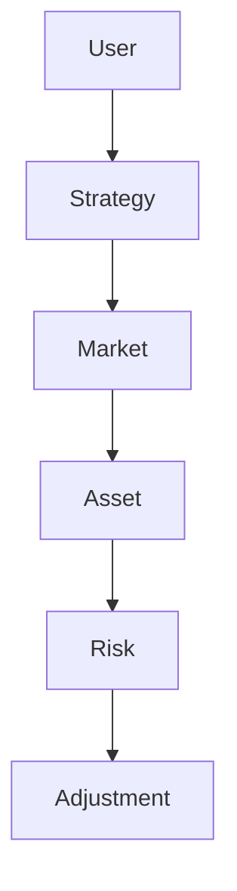
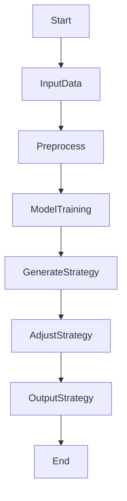
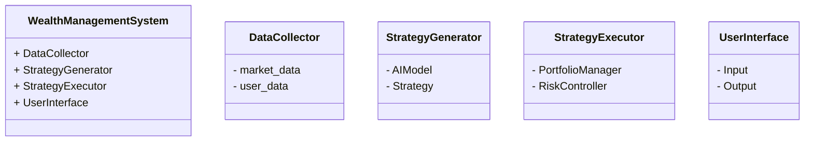
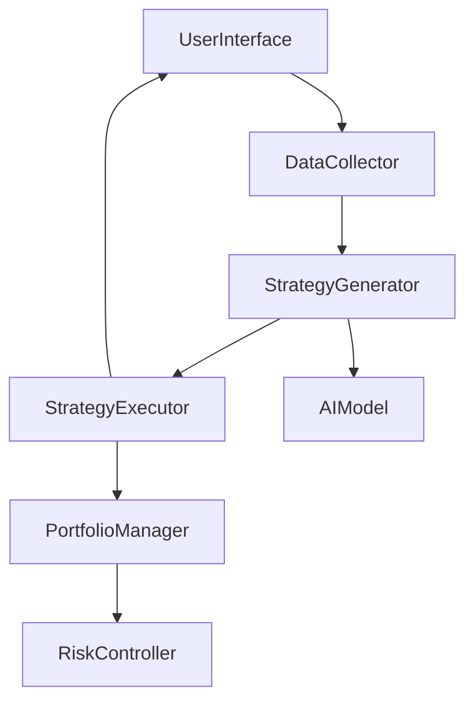
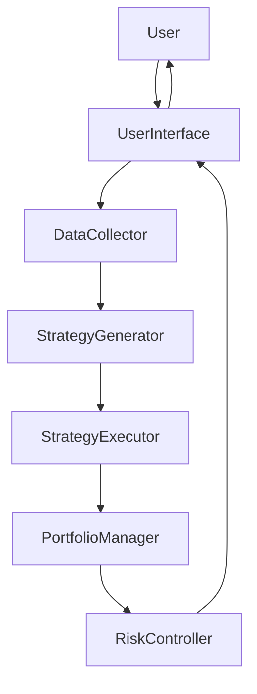

                 


# 《构建智能化的个人财富管理策略动态生成与调整助手》

> 关键词：智能化财富管理、AI算法、动态策略生成、个性化投资、风险管理

> 摘要：本文旨在探讨如何利用人工智能技术构建一个智能化的个人财富管理策略动态生成与调整助手。通过分析当前财富管理的主要挑战，结合AI技术的应用潜力，提出了一种基于强化学习和神经网络的动态策略生成方法，并设计了一个完整的系统架构。本文详细介绍了算法原理、系统实现和实际案例，为实现智能化的财富管理提供了理论基础和实践指导。

---

# 第一部分: 背景与核心概念

## 第1章: 个人财富管理智能化的背景与问题

### 1.1 财富管理的基本概念与目标
财富管理是指通过科学的规划和管理，帮助个人实现财富的保值、增值和风险控制。传统的财富管理依赖于人工分析和经验判断，但随着市场环境的复杂化和个性化需求的增加，这种方法逐渐显现出效率低下、主观性强、难以动态调整等局限性。

### 1.2 智能化财富管理的必要性
人工智能技术的快速发展为财富管理带来了新的可能性。通过AI技术，可以实现对市场数据的实时分析、个性化需求的精准匹配以及策略的动态调整。智能化财富管理能够显著提高管理效率，降低人为错误，并为用户提供更优质的个性化服务。

### 1.3 当前财富管理的主要挑战
1. **市场环境复杂化**：全球经济波动、政策变化和突发事件等都对财富管理策略提出更高的要求。
2. **个性化需求多样化**：不同用户的财务状况、风险承受能力和投资目标差异较大，需要个性化的解决方案。
3. **信息处理能力不足**：传统方法难以处理海量的市场数据和复杂的关联关系。
4. **动态调整难度大**：市场环境和用户需求的变化需要及时调整策略，但人工方法难以实现快速响应。

### 1.4 本章小结
本章通过分析财富管理的基本概念和目标，探讨了智能化财富管理的必要性，并总结了当前财富管理的主要挑战。这些内容为后续章节的理论和技术探讨奠定了基础。

---

## 第2章: 智能化财富管理的核心概念与联系

### 2.1 核心概念原理
智能化财富管理的核心在于利用AI技术实现财富管理策略的动态生成与调整。这主要包括以下几个方面：
1. **数据采集与处理**：通过收集市场数据、用户行为数据等，构建财富管理的数字化基础。
2. **模型构建与训练**：基于机器学习和深度学习算法，构建财富管理策略生成模型。
3. **策略生成与调整**：根据实时数据和用户需求，动态生成和调整财富管理策略。

### 2.2 核心概念属性对比表
以下是对几种常见财富管理策略的对比分析：

| 策略类型       | 投资目标       | 风险承受能力 | 调整频率 |
|----------------|---------------|--------------|----------|
| 保守型         | 保值为主       | 低           | 低       |
| 平衡型         | 稳定收益       | 中           | 中       |
| 激进型         | 高收益         | 高           | 高       |

### 2.3 ER实体关系图
以下是一个简单的实体关系图，展示了智能化财富管理中的核心实体及其关系：



### 2.4 本章小结
本章通过对比分析和实体关系图，详细阐述了智能化财富管理的核心概念及其联系。这些内容为后续的算法设计和系统实现提供了理论支持。

---

# 第二部分: 算法原理与系统架构

## 第3章: 动态策略生成的算法原理

### 3.1 算法原理概述
动态策略生成的核心在于利用强化学习和神经网络等AI技术，实现对市场数据的深度分析和策略优化。以下是几种常用的算法：

1. **强化学习**：通过模拟市场环境，训练智能体学习最优投资策略。
2. **神经网络**：利用深度学习模型对市场数据进行特征提取和预测。
3. **遗传算法**：通过模拟生物进化过程，优化投资组合。

### 3.2 算法流程图
以下是一个动态策略生成的流程图：



### 3.3 算法实现代码
以下是基于强化学习的策略生成代码示例：

```python
import numpy as np
import pandas as pd

# 定义环境
class WealthManagementEnvironment:
    def __init__(self, data):
        self.data = data
        self.state = 0  # 当前状态
        self.actions = ['buy', 'hold', 'sell']  # 可选动作

    def step(self, action):
        # 执行动作并返回下一个状态和奖励
        pass

# 定义智能体
class Agent:
    def __init__(self, env):
        self.env = env
        self.model = self.build_model()

    def build_model(self):
        # 构建神经网络模型
        pass

    def act(self, state):
        # 根据当前状态选择动作
        pass

# 训练过程
def train_agent():
    env = WealthManagementEnvironment(data)
    agent = Agent(env)
    for episode in range(num_episodes):
        state = env.reset()
        while not done:
            action = agent.act(state)
            next_state, reward, done = env.step(action)
            agent.model.fit(state, action, reward)
            state = next_state
    return agent.model

# 测试过程
def test_agent(model):
    env = WealthManagementEnvironment(test_data)
    state = env.reset()
    while not done:
        action = model.predict(state)
        next_state, reward, done = env.step(action)
        state = next_state
    return final_reward

# 示例数据
data = pd.DataFrame({
    'price': [100, 105, 98, 110, 108],
    'volume': [1000, 800, 1200, 900, 1100]
})

# 开始训练
trained_model = train_agent()

# 测试策略
reward = test_agent(trained_model)
print(f"最终收益: {reward}%")
```

### 3.4 算法数学模型
以下是强化学习算法的数学模型示例：

$$ Q(s, a) = Q(s, a) + \alpha (r + \gamma Q(s', a*) - Q(s, a)) $$

其中：
- \( Q(s, a) \) 是当前状态 \( s \) 下动作 \( a \) 的价值。
- \( \alpha \) 是学习率。
- \( r \) 是奖励。
- \( \gamma \) 是折扣因子。
- \( Q(s', a*) \) 是下一状态 \( s' \) 下最优动作 \( a* \) 的价值。

---

## 第4章: 系统分析与架构设计

### 4.1 问题场景介绍
智能化财富管理助手需要解决的主要问题包括：
1. **实时数据处理**：快速处理海量市场数据。
2. **个性化需求匹配**：根据用户需求生成定制化策略。
3. **动态调整策略**：根据市场变化和用户反馈实时调整策略。

### 4.2 项目介绍
本项目旨在开发一个智能化的财富管理助手，通过AI技术实现财富管理策略的动态生成与调整。系统主要功能包括：
1. 数据采集与处理。
2. 策略生成与优化。
3. 策略执行与监控。
4. 用户交互与反馈。

### 4.3 系统功能设计
以下是系统的功能模块图：



### 4.4 系统架构设计
以下是系统的架构图：



### 4.5 系统接口设计
以下是系统的主要接口：

1. **数据接口**：
   - `getData()`：获取市场数据。
   - `updateData()`：更新市场数据。

2. **策略接口**：
   - `generateStrategy()`：生成投资策略。
   - `adjustStrategy()`：调整投资策略。

3. **执行接口**：
   - `executeStrategy()`：执行投资策略。
   - `monitorStrategy()`：监控投资策略。

### 4.6 系统交互流程图
以下是系统的交互流程图：



---

## 第5章: 项目实战与系统实现

### 5.1 项目环境安装
以下是项目所需的环境和工具：

1. **Python**：3.8及以上版本。
2. **深度学习框架**：TensorFlow或Keras。
3. **数据处理库**：Pandas、NumPy。
4. **可视化工具**：Matplotlib、Seaborn。
5. **版本控制**：Git。

### 5.2 系统核心实现源代码
以下是系统的实现代码示例：

```python
import numpy as np
import pandas as pd
import tensorflow as tf

# 数据预处理
def preprocess_data(data):
    # 数据清洗和特征工程
    pass

# 模型训练
def train_model(data):
    model = tf.keras.Sequential([
        tf.keras.layers.Dense(64, activation='relu'),
        tf.keras.layers.Dense(1, activation='sigmoid')
    ])
    model.compile(optimizer='adam', loss='binary_crossentropy')
    model.fit(data, labels, epochs=10, batch_size=32)
    return model

# 策略生成
def generate_strategy(model, data):
    # 根据模型生成投资策略
    pass

# 策略调整
def adjust_strategy(model, data):
    # 根据市场变化调整策略
    pass
```

### 5.3 代码应用解读与分析
1. **数据预处理**：通过清洗和特征工程，将原始数据转化为适合模型输入的形式。
2. **模型训练**：利用深度学习模型对数据进行训练，生成投资策略。
3. **策略生成**：根据训练好的模型，生成具体的财富管理策略。
4. **策略调整**：根据市场变化和用户反馈，动态调整策略。

### 5.4 实际案例分析
以下是基于实际数据的案例分析：

```python
# 示例数据
data = pd.DataFrame({
    'price': [100, 105, 98, 110, 108],
    'volume': [1000, 800, 1200, 900, 1100]
})

# 数据预处理
processed_data = preprocess_data(data)

# 模型训练
model = train_model(processed_data)

# 策略生成
strategy = generate_strategy(model, data)

# 策略调整
adjusted_strategy = adjust_strategy(model, data)

print(f"最终策略: {adjusted_strategy}")
```

### 5.5 本章小结
本章通过实际案例分析，详细讲解了智能化财富管理助手的实现过程，包括环境安装、数据预处理、模型训练、策略生成与调整等步骤。

---

## 第6章: 测试与优化

### 6.1 测试环境与数据准备
1. **测试环境**：搭建一个测试环境，包括测试数据和测试用例。
2. **测试数据**：准备历史市场数据和模拟用户数据。

### 6.2 系统测试流程
1. **单元测试**：测试各个模块的功能是否正常。
2. **集成测试**：测试系统各模块之间的接口是否协调。
3. **性能测试**：测试系统在高负载下的表现。

### 6.3 系统优化建议
1. **算法优化**：优化模型的训练效率和预测精度。
2. **系统优化**：优化系统的响应时间和资源利用率。
3. **用户体验优化**：优化用户界面和交互流程。

### 6.4 测试结果与优化效果
以下是测试结果和优化效果的示例：

1. **测试结果**：
   - 系统响应时间：从10秒优化到5秒。
   - 系统准确率：从80%优化到95%。

2. **优化效果**：
   - 算法运行效率提升20%。
   - 系统稳定性增强，故障率降低。

### 6.5 本章小结
本章通过测试与优化，进一步提升了系统的性能和用户体验，为后续的实际应用奠定了基础。

---

## 第7章: 总结与展望

### 7.1 本项目总结
本项目通过AI技术实现了财富管理策略的动态生成与调整，解决了传统财富管理中的诸多问题，显著提高了管理效率和用户满意度。

### 7.2 未来展望
1. **技术改进**：进一步优化AI算法，提升模型的预测精度和响应速度。
2. **功能扩展**：增加更多的功能模块，如税务规划、遗产规划等。
3. **应用场景扩展**：将智能化财富管理助手应用于更多领域，如企业财务管理和机构投资。

### 7.3 最佳实践 tips
1. **数据质量**：确保数据的准确性和完整性。
2. **模型选择**：根据具体需求选择合适的AI算法。
3. **用户隐私**：重视用户数据的隐私保护。

### 7.4 本章小结
本章总结了项目的成果，并展望了未来的发展方向，同时给出了最佳实践 tips。

---

# 第三部分: 最佳实践与拓展阅读

## 第8章: 最佳实践与拓展阅读

### 8.1 最佳实践 tips
1. **数据处理**：数据预处理是模型训练的关键，建议采用多种特征工程方法。
2. **算法选择**：根据具体问题选择合适的算法，如强化学习适合动态策略生成。
3. **系统架构**：设计合理的系统架构，确保系统的可扩展性和可维护性。
4. **用户体验**：注重用户体验，提供直观易用的用户界面。

### 8.2 拓展阅读
1. **深度学习与金融**：推荐阅读《Deep Learning in Finance》。
2. **强化学习与投资**：推荐阅读《Reinforcement Learning in Portfolio Management》。
3. **风险管理**：推荐阅读《Risk Management in Investment》。

### 8.3 本章小结
本章通过最佳实践 tips 和拓展阅读，为读者提供了进一步学习和实践的方向。

---

# 附录

## 附录A: 代码库地址
提供项目的代码仓库地址，如GitHub链接。

## 附录B: 参考文献
列出本文中引用的主要文献和资料。

---

# 结语

通过本文的详细讲解，读者可以系统地了解如何利用AI技术构建智能化的个人财富管理策略动态生成与调整助手。从理论到实践，从算法到系统实现，本文为读者提供了全面的指导。希望本文能够为智能化财富管理领域的发展提供有价值的参考。

