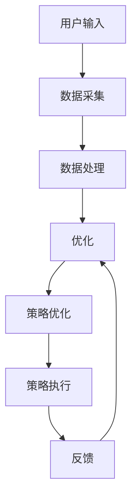
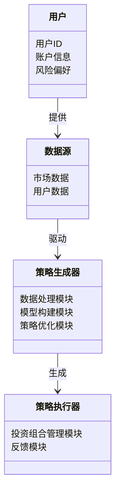
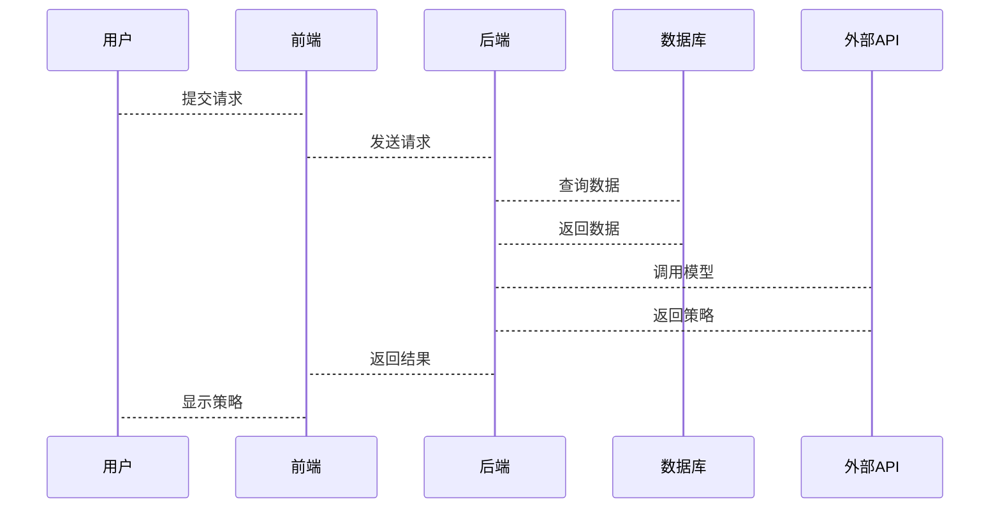

                 


# 构建智能化的个人财富管理策略动态调整助手

## 关键词：人工智能、财富管理、动态调整、策略优化、智能助手

## 摘要：  
随着人工智能技术的飞速发展，个人财富管理领域正经历着前所未有的变革。传统的财富管理方式逐渐暴露出效率低下、策略静态等问题，难以满足现代人对个性化、实时性财富管理的需求。本文将深入探讨如何利用人工智能技术构建一个智能化的个人财富管理策略动态调整助手，通过数据分析、模型构建、算法优化等技术手段，实现财富管理策略的实时动态调整。本文将从背景分析、核心概念、算法原理、系统架构到项目实战等多个维度展开，为读者提供一个全面的技术解决方案。

---

## 第1章: 个人财富管理的智能化需求

### 1.1 传统个人财富管理的局限性  
传统财富管理主要依赖人工分析和经验判断，存在以下问题：  
1. **信息处理能力有限**：面对海量金融数据，人工难以快速分析并制定最优策略。  
2. **策略静态**：传统策略通常是基于历史数据制定的静态方案，难以应对市场波动。  
3. **效率低下**：人工操作耗时耗力，无法实现实时调整和反馈。  

### 1.2 AI技术在财富管理中的应用前景  
人工智能技术在财富管理中的应用前景广阔，具体体现在以下几个方面：  
1. **数据处理能力**：AI能够快速处理海量数据，提取有价值的信息。  
2. **动态调整能力**：通过实时数据分析，AI可以动态优化投资组合和策略。  
3. **个性化服务**：AI可以根据用户的财务状况和风险偏好，提供个性化的财富管理方案。  

### 1.3 动态调整策略的必要性  
动态调整策略是实现智能化财富管理的核心，其必要性体现在以下几点：  
1. **应对市场变化**：金融市场波动频繁，静态策略难以适应变化。  
2. **个性化需求**：不同用户有不同的财务目标和风险承受能力，需要动态调整策略。  
3. **提高效率**：动态调整策略能够快速响应市场变化，提升财富管理效率。  

---

## 第2章: AI驱动的财富管理策略动态调整原理  

### 2.1 AI在财富管理中的核心原理  
AI驱动的财富管理策略动态调整基于以下核心原理：  
1. **数据驱动决策**：通过分析市场数据、用户数据等，生成优化的财富管理策略。  
2. **模型驱动策略生成**：利用机器学习模型预测市场趋势，生成动态调整方案。  
3. **实时反馈与优化**：根据市场反馈和用户反馈，持续优化策略。  

### 2.2 动态调整策略的实现机制  
动态调整策略的实现机制包括以下步骤：  
1. **数据采集与处理**：采集市场数据、用户数据等，进行清洗和预处理。  
2. **策略生成与优化**：基于数据构建模型，生成初始策略，并通过优化算法调整策略。  
3. **策略执行与反馈**：将优化后的策略执行，并根据反馈结果进一步优化。  

### 2.3 核心概念与联系  
#### 2.3.1 ER实体关系图  
```mermaid
er
  actor: 用户
  strategy: 策略
  data: 数据
  action: 动作
  actor --> data: 提供
  data --> strategy: 驱动
  strategy --> action: 生成
```

#### 2.3.2 动态调整策略的流程图  


---

## 第3章: 算法原理与实现  

### 3.1 数据预处理与特征提取  
#### 3.1.1 数据清洗  
- 去除异常值和缺失值。  
#### 3.1.2 特征提取  
- 提取影响投资组合收益的关键特征，如市场收益率、波动率等。  

### 3.2 机器学习模型构建与优化  
#### 3.2.1 回归分析  
- 使用线性回归模型预测市场趋势。  
#### 3.2.2 聚类分析  
- 根据用户特征进行分群，制定个性化策略。  

### 3.3 动态调整策略的实现  
#### 3.3.1 策略生成算法  
$$ \text{收益} = \sum_{i=1}^{n} w_i \cdot r_i $$  
其中，$w_i$ 是资产权重，$r_i$ 是资产收益率。  

#### 3.3.2 策略优化算法  
使用遗传算法优化投资组合权重：  
1. 初始化种群。  
2. 计算适应度。  
3. 选择、交叉、变异。  
4. 重复优化。  

---

## 第4章: 系统分析与架构设计  

### 4.1 问题场景介绍  
用户希望实现一个智能化的财富管理助手，能够实时动态调整投资策略。  

### 4.2 系统功能设计  
#### 4.2.1 领域模型  


### 4.3 系统架构设计  
#### 4.3.1 总体架构图  


### 4.4 接口设计与交互流程图  
#### 4.4.1 API接口设计  
- `/api/v1/strategy/generate`：生成初始策略。  
- `/api/v1/strategy/optimze`：优化策略。  

#### 4.4.2 交互流程图  


---

## 第5章: 项目实战  

### 5.1 环境安装与配置  
1. 安装Python和相关库（如Pandas、Scikit-learn、Plotly）。  
2. 配置数据源（如Yahoo Finance API）。  

### 5.2 核心代码实现  

#### 5.2.1 数据采集与处理  
```python
import pandas as pd
import requests

def get_market_data(ticker):
    url = f"https://api.financial.com/stock/{ticker}"
    response = requests.get(url)
    data = response.json()
    df = pd.DataFrame(data['historical_prices'])
    return df
```

#### 5.2.2 策略生成与优化  
```python
from sklearn.linear_model import LinearRegression

def generate_strategy(data):
    model = LinearRegression()
    model.fit(data[['open', 'high', 'low']], data['close'])
    return model

def optimize_strategy(model, data):
    # 简单的优化逻辑，实际应使用更复杂的算法
    optimized_weights = model.coef_
    return optimized_weights
```

#### 5.2.3 策略执行与反馈  
```python
def execute_strategy(weights, portfolio):
    portfolio_value = sum(weights * portfolio)
    return portfolio_value
```

### 5.3 案例分析与解读  
假设用户有100万元资金，风险偏好为中等，系统会根据市场数据生成初始投资组合，并动态调整权重以应对市场波动。  

---

## 第6章: 最佳实践与总结  

### 6.1 小结  
本文详细介绍了如何利用人工智能技术构建智能化的个人财富管理策略动态调整助手，涵盖了从背景分析到项目实现的全过程。  

### 6.2 注意事项  
1. 数据质量对策略准确性影响重大，需确保数据来源可靠。  
2. 模型优化需结合实际业务需求，避免过度拟合。  

### 6.3 拓展阅读  
1. 《机器学习实战》：了解机器学习的基本原理。  
2. 《Python金融大数据分析》：掌握金融数据分析的技巧。  

---

## 附录：完整代码示例  
```python
# 附录中的代码示例
import pandas as pd
import numpy as np
from sklearn.linear_model import LinearRegression
from sklearn.metrics import mean_squared_error

# 数据采集
def fetch_data(tickers):
    data = pd.DataFrame()
    for ticker in tickers:
        response = requests.get(f"https://api.financial.com/stock/{ticker}")
        json_data = response.json()
        df = pd.DataFrame(json_data['historical_prices'])
        data[ticker] = df['close']
    return data

# 模型训练
def train_model(data):
    X = data.iloc[:, :-1].values
    y = data.iloc[:, -1].values
    model = LinearRegression()
    model.fit(X, y)
    return model

# 策略优化
def optimize_weights(model, data):
    coefficients = model.coef_
    total = np.sum(abs(coefficients))
    normalized_weights = coefficients / total
    return normalized_weights
```

---

通过以上步骤，我们构建了一个智能化的个人财富管理策略动态调整助手，能够根据市场变化和用户需求，实时优化投资策略，帮助用户实现财富的稳健增长。

