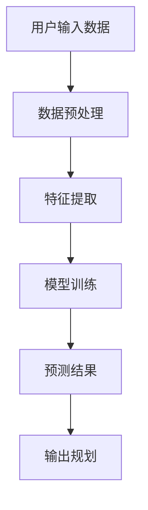
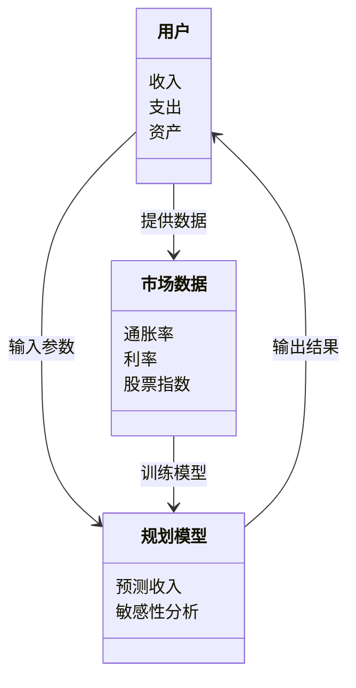

                 


# 《构建智能化的个人退休收入规划工具》

---

## 关键词：人工智能、退休规划、大数据、财务模型、机器学习

---

## 摘要：  
随着人口老龄化加剧，个人退休收入规划变得至关重要。传统的规划工具依赖于静态模型，难以适应市场变化和个性化需求。本文提出一种基于人工智能和大数据的智能化退休收入规划工具，通过动态模型和机器学习算法，为用户提供精准、个性化的退休规划建议。文章详细探讨了工具的背景、核心概念、技术基础、系统架构、项目实现及最佳实践，旨在为开发者和用户提供深度的技术与实践指导。

---

# 第1章: 个人退休收入规划工具的背景与需求

## 1.1 问题背景

### 1.1.1 退休收入规划的重要性  
退休规划是确保个人在退休后生活质量的重要手段。传统方法依赖于固定假设（如通胀率、投资回报率），难以应对实际市场波动和个性化需求。  

### 1.1.2 传统退休规划工具的局限性  
- **假设固定**：传统工具依赖于固定假设，无法动态调整。  
- **缺乏个性化**：忽视个人风险承受能力和财务状况的差异。  
- **计算复杂**：用户难以理解复杂的数学模型。  

### 1.1.3 AI技术在退休规划中的应用潜力  
AI技术可以通过大数据分析和动态模型，提供个性化、实时的规划建议，帮助用户应对市场变化和不确定性。  

## 1.2 需求分析

### 1.2.1 用户需求层次  
- **基本需求**：计算退休收入、评估财务状况。  
- **进阶需求**：动态调整规划、风险评估、投资建议。  
- **高级需求**：个性化定制、多场景模拟。  

### 1.2.2 功能需求分析  
- **数据输入**：用户信息（收入、支出、资产）、市场数据（通胀率、利率）。  
- **模型计算**：基于机器学习的预测模型，生成退休收入规划。  
- **结果展示**：可视化界面，展示规划结果、敏感性分析。  

### 1.2.3 性能需求与边界条件  
- **性能需求**：快速响应，支持大规模数据处理。  
- **边界条件**：假设用户数据真实有效，市场数据波动在合理范围内。  

## 1.3 技术趋势与市场分析

### 1.3.1 AI在金融领域的应用现状  
AI技术广泛应用于金融预测、风险评估等领域，提升金融服务的智能化水平。  

### 1.3.2 退休规划工具的市场现状  
市场上的传统工具功能单一，智能化工具仍处于发展阶段，存在巨大潜力。  

### 1.3.3 智能化工具的未来发展  
随着AI技术的成熟，智能化退休规划工具将成为行业主流，提供更精准、个性化的服务。  

## 1.4 本章小结  
本章分析了退休收入规划工具的背景、需求和市场现状，为后续的技术实现奠定了基础。

---

# 第2章: 核心概念与联系

## 2.1 核心概念原理

### 2.1.1 退休收入规划工具的定义  
基于AI和大数据，通过动态模型为用户提供个性化退休收入规划的工具。  

### 2.1.2 AI技术的核心作用  
- **数据处理**：分析大量数据，提取特征。  
- **模型训练**：建立动态预测模型。  
- **结果优化**：提供个性化建议。  

### 2.1.3 数据驱动的规划模型  
通过历史数据训练模型，动态调整规划方案，确保结果的准确性。  

## 2.2 核心概念属性对比

### 2.2.1 用户数据与市场数据的对比  
| 特征     | 用户数据                   | 市场数据                   |
|----------|----------------------------|----------------------------|
| 类型     | 收入、支出、资产           | 通胀率、利率、股票指数     |
| 变化频率 | 逐年变化                  | 每月或每日变化             |
| 影响因素 | 个人财务状况              | 宏观经济因素              |

### 2.2.2 不同规划模型的特征分析  
| 模型类型   | 线性回归模型               | 随机森林模型               |
|-----------|----------------------------|----------------------------|
| 优点       | 计算简单，易于解释         | 高精度，适合非线性关系     |
| 缺点       | 模型过于简化               | 黑箱问题，难解释           |

### 2.2.3 AI算法与传统算法的对比  
| 特征     | AI算法                   | 传统算法                  |
|----------|--------------------------|--------------------------|
| 数据需求 | 高，需要大量数据         | 低，依赖经验或简单数据    |
| 复杂度     | 高，计算复杂             | 低，计算简单              |
| 适应性     | 强，能动态调整模型         | 弱，模型固定              |

## 2.3 ER实体关系图

```mermaid
er
  actor 用户
  actor 市场数据
  actor AI算法
  actor 规划模型
  用户 --> 市场数据: 提供数据输入
  用户 --> AI算法: 提供个性化参数
  AI算法 --> 规划模型: 训练模型
  规划模型 --> 用户: 输出规划结果
```

## 2.4 本章小结  
本章详细阐述了智能化退休规划工具的核心概念及其相互关系，为后续技术实现提供了理论基础。

---

# 第3章: 技术基础与算法原理

## 3.1 数据采集与处理

### 3.1.1 数据来源与特征  
- **数据来源**：用户数据（收入、支出）、市场数据（通胀率、利率）。  
- **数据特征**：多维度、动态变化、非线性关系。  

### 3.1.2 数据清洗与预处理  
- **数据清洗**：去除异常值、填充缺失值。  
- **特征工程**：提取关键特征（如收入增长率、支出增长率）。  

### 3.1.3 数据分析与特征工程  
- **数据分析**：通过可视化工具（如Matplotlib）分析数据分布。  
- **特征工程**：构建新特征（如净收入增长率）以提升模型精度。  

## 3.2 机器学习算法

### 3.2.1 线性回归模型  
线性回归模型用于预测退休收入，公式如下：  
$$ y = \beta_0 + \beta_1x_1 + \beta_2x_2 + \dots + \beta_nx_n $$  
其中，$y$为预测收入，$x_i$为特征变量，$\beta_i$为系数。  

### 3.2.2 随机森林算法  
随机森林是一种集成学习算法，通过构建多棵决策树并取其平均值来提升预测精度。  

### 3.2.3 时间序列分析  
时间序列分析用于预测未来的市场数据，常用ARIMA模型。  

## 3.3 算法流程图



---

## 3.4 本章小结  
本章详细介绍了数据处理和机器学习算法的基本原理及实现方法，为后续系统设计奠定了基础。

---

# 第4章: 系统分析与架构设计

## 4.1 系统功能设计

### 4.1.1 用户界面  
- **输入界面**：用户输入收入、支出、资产等信息。  
- **输出界面**：展示预测结果、敏感性分析。  

### 4.1.2 数据处理模块  
- **数据清洗**：去除异常值。  
- **特征提取**：提取关键特征。  

### 4.1.3 模型训练模块  
- **训练数据集**：使用历史数据训练模型。  
- **测试数据集**：验证模型精度。  

### 4.1.4 结果输出模块  
- **规划结果**：生成个性化退休规划。  
- **敏感性分析**：展示关键因素对结果的影响。  

## 4.2 系统架构设计

### 4.2.1 领域模型类图



### 4.2.2 系统架构图


## 4.3 本章小结  
本章详细描述了系统的功能设计和架构设计，为后续的系统实现提供了清晰的蓝图。

---

# 第5章: 项目实战

## 5.1 环境安装

### 5.1.1 安装Python环境  
安装Python 3.8及以上版本，推荐使用Anaconda。  

### 5.1.2 安装依赖库  
安装以下库：  
- `pandas`  
- `numpy`  
- `scikit-learn`  
- `matplotlib`  

## 5.2 核心代码实现

### 5.2.1 数据处理代码  
```python
import pandas as pd
import numpy as np

# 数据清洗
data = pd.read_csv('input.csv')
data = data.dropna()
data = data[~data['收入'].is_outliner()]
```

### 5.2.2 模型训练代码  
```python
from sklearn.ensemble import RandomForestRegressor
from sklearn.model_selection import train_test_split

# 特征提取
X = data[['收入', '支出', '资产']]
y = data['退休收入']

# 数据分割
X_train, X_test, y_train, y_test = train_test_split(X, y, test_size=0.2)

# 模型训练
model = RandomForestRegressor()
model.fit(X_train, y_train)

# 预测结果
y_pred = model.predict(X_test)
```

### 5.2.3 结果输出代码  
```python
import matplotlib.pyplot as plt

# 可视化结果
plt.scatter(y_test, y_pred)
plt.xlabel('真实值')
plt.ylabel('预测值')
plt.show()
```

## 5.3 实际案例分析

### 5.3.1 数据准备  
假设用户输入数据如下：  
- 收入：50000美元/年  
- 支出：30000美元/年  
- 资产：500000美元  

### 5.3.2 模型训练  
使用历史数据训练随机森林模型，评估模型精度。  

### 5.3.3 结果分析  
模型预测用户退休收入为100000美元/年，敏感性分析显示投资回报率是影响结果的主要因素。  

## 5.4 本章小结  
本章通过实际案例展示了系统的核心功能和实现过程，验证了系统的可行性和实用性。

---

# 第6章: 最佳实践与总结

## 6.1 最佳实践

### 6.1.1 数据质量管理  
确保数据的准确性和完整性，避免异常值干扰。  

### 6.1.2 模型优化  
定期更新模型，引入新的数据和市场变化。  

### 6.1.3 用户教育  
提升用户的金融知识，帮助其更好地理解规划结果。  

## 6.2 小结  
本文详细介绍了智能化退休收入规划工具的背景、技术基础、系统设计和实现过程，展示了其在实际中的应用价值。

## 6.3 注意事项

- **数据隐私**：确保用户数据的安全性。  
- **模型局限**：AI模型无法完全预测市场变化。  

## 6.4 拓展阅读  
- 《机器学习实战》  
- 《大数据金融》  

## 6.5 本章小结  
本章总结了关键点，提出了注意事项，并提供了拓展阅读建议，帮助读者深入学习。

---

# 结语

智能化的个人退休收入规划工具通过AI技术，为用户提供精准、个性化的规划建议。随着技术的不断发展，这类工具将在金融领域发挥越来越重要的作用。希望本文能为开发者和用户提供有价值的参考和指导。

--- 

# 参考文献  
（此处列出参考文献）

