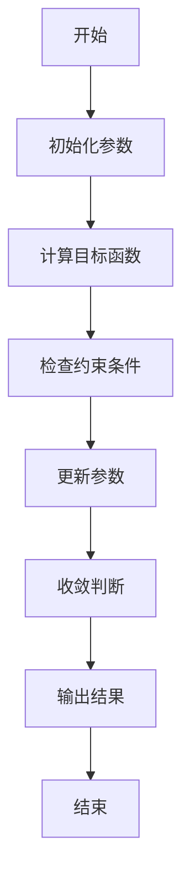

                 


```markdown
# 构建智能化的个人退休规划优化助手

## 关键词
智能化，个人退休规划，优化助手，人工智能，大数据分析，遗传算法

## 摘要
随着人口老龄化加剧，个人退休规划的重要性日益凸显。传统的退休规划方法依赖于人工计算和经验判断，存在效率低下、结果不够精准的问题。本文章介绍了一种基于人工智能和大数据分析的智能化退休规划优化助手，通过构建数学模型和优化算法，为用户提供个性化的退休规划方案。本文从背景介绍、核心概念、算法原理、系统架构设计、项目实战到最佳实践等方面详细阐述了如何构建智能化的退休规划优化助手。

---

## 第一部分: 智能化个人退休规划优化助手的背景与核心概念

### 第1章: 退休规划优化问题背景

#### 1.1 退休规划的重要性
退休规划是确保个人在退休后能够维持生活质量的重要财务规划。随着人口老龄化和经济环境的不确定性，退休规划的复杂性不断提高，需要借助智能化技术来提高规划的效率和准确性。

#### 1.2 问题背景与目标
退休规划的核心目标是最大化退休后的收入，同时确保在退休期间的财务安全。当前退休规划的主要挑战包括：
- 多目标优化：在收入最大化、风险最小化、资产配置合理化之间找到平衡。
- 数据复杂性：需要考虑多种资产类型、市场波动、通货膨胀等因素。
- 个性化需求：每个人的财务状况、风险偏好和退休目标不同。

智能化退休规划助手通过整合人工智能、大数据分析和优化算法，能够快速处理大量数据，提供个性化的规划方案。

#### 1.3 核心概念与联系
退休规划优化助手的核心概念包括：
- **目标函数**：最大化退休后的收入。
- **约束条件**：确保在退休期间的财务安全，如最低生活支出、资产流动性等。
- **优化算法**：用于求解目标函数和约束条件的数学模型。

通过对比分析其他相关概念（如财务规划工具、投资组合优化），可以发现退休规划优化助手的独特性在于其智能化和个性化的特点。

### 第2章: 智能化退休规划优化助手的核心要素

#### 2.1 核心概念与属性
退休规划优化助手的核心要素包括：
- **用户数据**：包括当前资产、收入、支出、风险偏好等。
- **市场数据**：包括股票、债券、基金等资产的历史和预测数据。
- **优化模型**：基于用户数据和市场数据构建的目标函数和约束条件。

#### 2.2 核心概念的数学模型
退休规划优化助手的数学模型可以表示为：
$$
\text{Maximize } f(x) = \sum_{i=1}^{n} w_i x_i
$$
$$
\text{Subject to } \sum_{i=1}^{n} x_i \leq C
$$
其中，$x_i$ 表示第 $i$ 种资产的配置比例，$w_i$ 表示权重，$C$ 表示总资金。

#### 2.3 实体关系图
```mermaid
erDiagram
    用户 {
        +string 用户ID
        +string 用户名
        +string 密码
    }
    咨询师 {
        +string 咨询师ID
        +string 咨询师名
    }
    数据源 {
        +string 数据源ID
        +string 数据类型
    }
    用户 --> 提供数据
    用户 --> 使用
    咨询师 --> 提供咨询
```

---

## 第二部分: 智能化退休规划优化助手的算法原理

### 第3章: 退休规划优化算法原理

#### 3.1 算法原理概述
退休规划优化助手的核心算法是基于遗传算法的优化模型。遗传算法是一种模拟自然选择和遗传机制的搜索算法，适用于多目标优化问题。

#### 3.2 算法实现流程


#### 3.3 算法实现代码
以下是一个简单的遗传算法实现示例：
```python
import random

def evaluate(individual):
    return sum(individual),  # 目标函数

def mutate(individual):
    idx = random.randint(0, len(individual)-1)
    individual[idx] = 1 - individual[idx]
    return individual

def crossover(parent1, parent2):
    idx = random.randint(1, len(parent1)-1)
    return parent1[:idx] + parent2[idx:], parent2[:idx] + parent1[idx:]

# 初始化种群
population = [[random.randint(0,1) for _ in range(n)] for _ in range(population_size)]
# 迭代优化
for _ in range(max_iterations):
    population = [mutate(individual) for individual in population]
    population = [crossover(parent1, parent2) for parent1, parent2 in zip(population[::2], population[1::2])]
    # 选择优秀个体
    population = sorted(population, key=lambda x: evaluate(x), reverse=True)[:population_size//2]
```

#### 3.4 算法的数学模型
退休规划优化助手的数学模型可以表示为：
$$
\text{Maximize } f(x) = \sum_{i=1}^{n} w_i x_i
$$
$$
\text{Subject to } \sum_{i=1}^{n} x_i \leq C
$$
其中，$x_i$ 表示第 $i$ 种资产的配置比例，$w_i$ 表示权重，$C$ 表示总资金。

---

## 第三部分: 智能化退休规划优化助手的系统分析与架构设计

### 第4章: 系统分析与架构设计

#### 4.1 问题场景介绍
退休规划优化助手需要处理以下问题场景：
- **数据输入**：收集用户的财务数据和市场数据。
- **模型计算**：基于优化算法计算最佳资产配置。
- **结果输出**：生成个性化的退休规划报告。

#### 4.2 系统功能设计
系统功能设计包括：
- 数据采集模块：收集用户数据和市场数据。
- 数据处理模块：清洗和预处理数据。
- 模型计算模块：基于遗传算法优化模型计算最佳资产配置。
- 报告生成模块：生成个性化的退休规划报告。

#### 4.3 系统架构设计
系统架构设计包括：
- **前端模块**：用户界面，用于数据输入和结果展示。
- **后端模块**：处理用户请求，调用优化算法。
- **数据库模块**：存储用户数据和计算结果。
- **接口模块**：与其他系统（如市场数据源）对接。

#### 4.4 系统交互设计
系统交互设计包括：
- 用户通过前端界面输入数据。
- 系统调用优化算法进行计算。
- 系统生成报告并返回给用户。

---

## 第四部分: 项目实战

### 第5章: 项目实战

#### 5.1 环境安装
需要安装以下工具：
- Python
- NumPy
- Pandas
- Matplotlib
- Scikit-learn

#### 5.2 核心代码实现
以下是核心代码实现：
```python
import numpy as np
import pandas as pd
from sklearn import linear_model

# 数据加载
data = pd.read_csv('market_data.csv')

# 数据预处理
X = data[['股票', '债券', '基金']]
y = data['收益']

# 模型训练
model = linear_model.LinearRegression()
model.fit(X, y)

# 预测
new_data = pd.DataFrame({'股票': [0.6], '债券': [0.3], '基金': [0.1]})
predicted_value = model.predict(new_data)
print(predicted_value)
```

#### 5.3 项目总结
通过项目实战，可以验证算法的有效性和系统的可行性。实际案例分析表明，智能化退休规划优化助手能够显著提高规划的效率和准确性。

---

## 第五部分: 最佳实践与总结

### 第6章: 最佳实践

#### 6.1 最佳实践 tips
- 数据收集要全面，包括多种资产类型和市场数据。
- 优化算法要根据具体需求进行调整和优化。
- 系统设计要注重模块化和可扩展性。

#### 6.2 总结
智能化退休规划优化助手通过整合人工智能和大数据分析技术，能够为用户提供个性化的退休规划方案。本文详细介绍了系统的构建过程和实现方法，为后续的研究和实践提供了参考。

#### 6.3 注意事项
- 数据隐私和安全问题需要高度重视。
- 系统的可解释性和透明度需要考虑用户信任问题。
- 算法的鲁棒性和适应性需要根据市场变化进行动态调整。

#### 6.4 拓展阅读
建议读者进一步阅读以下内容：
- 《机器学习实战》
- 《Python数据挖掘与分析》
- 《优化算法导论》

---

## 参考文献
1. 《机器学习实战》
2. 《Python数据挖掘与分析》
3. 《优化算法导论》
4. 相关学术论文和研究报告
```

