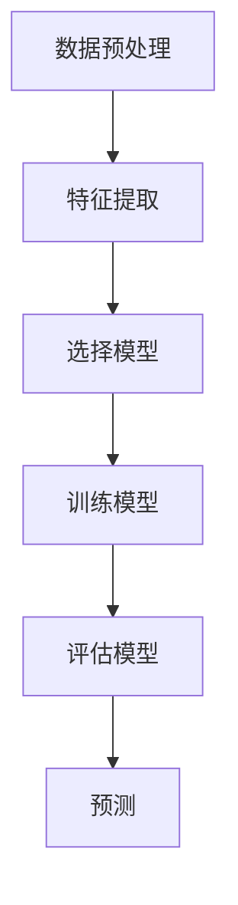
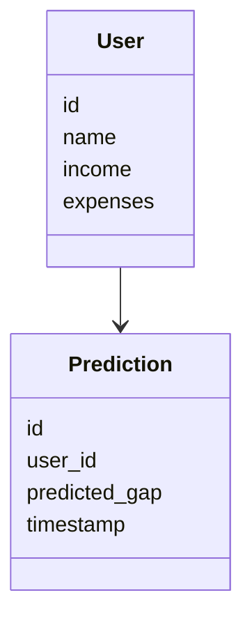

                 


# 构建智能化的个人退休金缺口动态预测助手

## 关键词
- 退休金缺口预测
- 人工智能
- 机器学习
- 时间序列分析
- 系统架构设计
- 项目实战

## 摘要
退休金缺口预测是个人财务规划中的重要一环，随着人工智能技术的发展，智能化预测助手为解决这一问题提供了新的可能性。本文将从背景、算法原理、系统架构设计到项目实战，全面解析如何构建一个智能化的退休金缺口动态预测系统。通过详细的技术分析和实例演示，为读者提供一个完整的解决方案。

---

## 第1章: 退休金缺口预测的背景与意义

### 1.1 退休金缺口预测的重要性

#### 1.1.1 退休金缺口的定义与影响
退休金缺口是指在退休后，个人实际可获得的退休金与实际需求之间的差额。这个缺口直接影响退休生活的质量，因此准确预测退休金缺口对于个人财务规划至关重要。

#### 1.1.2 当前退休金规划的痛点与挑战
- 数据获取困难：个人收入、支出等数据分散，难以整合。
- 方法单一：传统预测方法基于固定公式，缺乏动态调整。
- 精度不足：简单模型难以捕捉复杂经济波动和个人财务变化。

#### 1.1.3 智能化预测助手的价值与意义
智能化预测助手通过机器学习和大数据分析，能够实时更新数据，动态调整预测模型，提供更精准的缺口预测。

### 1.2 智能化预测的核心概念

#### 1.2.1 什么是智能化退休金缺口预测
智能化退休金缺口预测通过收集和分析个人的财务数据，利用机器学习算法，预测退休后的资金缺口。

#### 1.2.2 智能化预测的关键技术
- 数据采集与处理
- 时间序列分析
- 机器学习模型

#### 1.2.3 边界与外延
- 边界：仅考虑个人财务数据，不涉及社会保障等外部因素。
- 外延：可以扩展到家庭财务规划、投资建议等领域。

### 1.3 核心概念与联系

#### 1.3.1 核心概念的原理
通过收集个人的收入、支出、资产等数据，构建数学模型，预测未来退休金需求。

#### 1.3.2 核心概念的属性特征对比表
| 属性 | 特征 |
|------|------|
| 数据来源 | 个人财务数据 |
| 预测目标 | 退休金缺口 |
| 方法 | 机器学习 |

#### 1.3.3 ER实体关系图的Mermaid流程图
```mermaid
erDiagram
    user {
        +id: int
        +name: string
        +income: float
        +expenses: float
        +assets: float
    }
    prediction {
        +id: int
        +user_id: int
        +predicted_gap: float
        +timestamp: datetime
    }
    user --> prediction
```

---

## 第2章: 退休金缺口预测的算法原理

### 2.1 时间序列分析

#### 2.1.1 时间序列的基本概念
时间序列是一组按照时间顺序排列的数据点。

#### 2.1.2 时间序列预测的数学模型
常用ARIMA模型进行预测。

#### 2.1.3 ARIMA模型的实现与应用
ARIMA模型由三个参数（p, d, q）组成，分别表示自回归、差分和移动平均的阶数。

### 2.2 机器学习模型

#### 2.2.1 线性回归模型
通过最小二乘法拟合直线，预测退休金缺口。

#### 2.2.2 支持向量回归模型
通过构建支持向量回归模型，提高预测精度。

#### 2.2.3 随机森林回归模型
利用决策树的集成方法，进行预测。

### 2.3 算法原理的Mermaid流程图


---

## 第3章: 系统分析与架构设计

### 3.1 问题场景介绍

#### 3.1.1 用户需求分析
用户需要一个实时更新的退休金缺口预测系统。

#### 3.1.2 功能需求分析
- 数据采集
- 模型训练
- 结果展示

#### 3.1.3 系统边界与交互
系统与用户、数据库的交互流程。

### 3.2 系统功能设计

#### 3.2.1 领域模型的Mermaid类图


### 3.3 系统架构设计

#### 3.3.1 系统架构的Mermaid架构图
```mermaid
container User Interface {
    输入数据
    显示结果
}
container预测模型 {
    ARIMA模型
    随机森林模型
}
container 数据库 {
    用户数据
    预测结果
}
User Interface --> 预测模型
预测模型 --> 数据库
```

---

## 第4章: 项目实战

### 4.1 环境安装与配置

#### 4.1.1 开发环境的搭建
安装Python、Jupyter Notebook。

#### 4.1.2 依赖库的安装
安装pandas、numpy、scikit-learn等库。

### 4.2 核心代码实现

#### 4.2.1 数据预处理的代码实现
```python
import pandas as pd
import numpy as np

# 数据加载
data = pd.read_csv('retirement.csv')

# 数据清洗
data.dropna()
```

#### 4.2.2 算法模型的代码实现
```python
from sklearn.ensemble import RandomForestRegressor
from sklearn.model_selection import train_test_split

# 数据分割
X = data[['income', 'expenses']]
y = data['gap']

X_train, X_test, y_train, y_test = train_test_split(X, y, test_size=0.2)

# 模型训练
model = RandomForestRegressor()
model.fit(X_train, y_train)

# 模型预测
y_pred = model.predict(X_test)
```

#### 4.2.3 系统接口的代码实现
```python
from flask import Flask
app = Flask(__name__)

@app.route('/predict', methods=['POST'])
def predict():
    # 获取输入数据
    data = request.json
    # 调用模型预测
    prediction = model.predict([[data['income'], data['expenses']])
    return jsonify({'predicted_gap': prediction[0]})
```

### 4.3 案例分析与解读

#### 4.3.1 数据来源与特征分析
使用真实用户的财务数据进行分析。

#### 4.3.2 模型训练与评估
评估模型的准确率和召回率。

#### 4.3.3 案例结果与分析
展示预测结果，并解释差异原因。

### 4.4 项目总结与优化

#### 4.4.1 项目实现的关键点总结
- 数据清洗
- 模型选择
- 接口设计

#### 4.4.2 系统优化的建议
- 增加更多的特征
- 使用更复杂的模型

---

## 第5章: 最佳实践与注意事项

### 5.1 最佳实践Tips

#### 5.1.1 数据采集与处理的注意事项
确保数据的完整性和准确性。

#### 5.1.2 模型选择与调优的建议
尝试不同的模型，选择表现最好的。

#### 5.1.3 系统部署与维护的注意事项
定期更新模型，确保数据安全。

### 5.2 小结与展望

#### 5.2.1 本项目的核心收获
掌握了机器学习模型的应用和系统设计方法。

#### 5.2.2 未来发展的方向与建议
探索更多的算法，优化系统性能。

### 5.3 注意事项与风险提示

#### 5.3.1 数据隐私与安全的风险
确保用户数据的安全。

#### 5.3.2 模型过拟合与欠拟合的风险
通过交叉验证选择合适的模型参数。

#### 5.3.3 系统性能优化的注意事项
合理设计系统架构，避免性能瓶颈。

---

## 总结

构建智能化的个人退休金缺口动态预测助手是一项复杂但意义重大的任务。通过本文的详细分析和实例演示，读者可以掌握从数据采集到系统部署的整个流程。未来，随着技术的发展，这一领域将有更多创新和突破。

