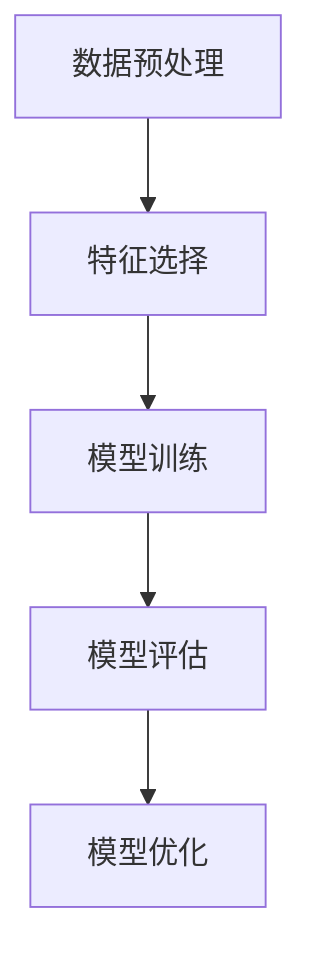

                 


# 构建智能化的企业信用评级系统

## 关键词：
企业信用评级、人工智能、机器学习、系统架构、大数据分析

## 摘要：
企业信用评级系统是评估企业信用状况的重要工具，传统方法存在效率低、覆盖面有限等问题。通过引入人工智能和大数据分析技术，构建智能化的信用评级系统，能够显著提升评估效率和准确性。本文从背景、技术原理、系统架构到项目实战，详细讲解智能化信用评级系统的构建过程，为企业在风险管理、投资决策等方面提供有力支持。

---

## 第一部分: 企业信用评级系统概述

### 第1章: 企业信用评级系统背景与概述

#### 1.1 企业信用评级的重要性
##### 1.1.1 信用评级的定义与作用
信用评级是对企业财务状况、经营能力和偿债能力的综合评估，能够帮助银行、投资者等 stakeholders 降低风险，优化资源配置。

##### 1.1.2 传统信用评级的局限性
传统评级方法依赖人工判断，存在主观性强、效率低、覆盖面有限等问题，难以应对海量数据和复杂场景。

##### 1.1.3 智能化信用评级的优势
利用机器学习和大数据分析，智能化评级系统能够快速处理大量数据，发现潜在风险，提供更精准的评级结果。

#### 1.2 智能化信用评级的背景与趋势
##### 1.2.1 大数据与人工智能的兴起
技术的进步使得处理复杂数据和模式识别成为可能，推动了信用评级领域的智能化转型。

##### 1.2.2 企业信用评级智能化的驱动力
金融机构和企业的风险管理需求日益增长，智能化评级系统成为提升竞争力的关键技术。

##### 1.2.3 智能化信用评级的未来展望
随着技术的不断进步，信用评级系统将更加智能化、自动化，实现实时监控和动态调整。

#### 1.3 本书的核心目标与内容
##### 1.3.1 本书的核心目标
系统介绍智能化企业信用评级系统的构建方法，涵盖技术原理、系统设计和实战案例。

##### 1.3.2 本书的主要内容
从背景知识到技术实现，再到项目实战，全面讲解智能化信用评级系统的构建过程。

##### 1.3.3 本书的结构安排
文章分为多个章节，涵盖背景、核心概念、算法原理、系统架构、项目实战等部分，结构清晰，逻辑连贯。

---

## 第2章: 企业信用评级系统的核心概念与联系

### 2.1 信用评级系统的定义与特点
##### 2.1.1 信用评级系统的定义
企业信用评级系统是基于企业财务数据、市场表现和经营状况，利用人工智能技术进行信用评估的系统。

##### 2.1.2 系统的核心特点
- 数据驱动：依赖大量结构化和非结构化数据进行分析。
- 智能化：利用机器学习算法自动学习和优化模型。
- 实时性：能够实时更新企业信息，提供动态评级结果。

### 2.2 核心概念的属性特征对比
##### 2.2.1 信用评级系统的属性特征
| 特性 | 描述 |
|------|------|
| 数据来源 | 结构化数据（财务报表）和非结构化数据（新闻、社交媒体） |
| 评估指标 | 财务状况、经营能力、市场表现 |
| 模型类型 | 逻辑回归、决策树、支持向量机等 |

##### 2.2.2 各属性特征的对比分析
通过对比不同属性特征的优缺点，选择最适合的特征组合，提升模型的准确性和鲁棒性。

##### 2.2.3 属性特征的表格对比
| 特征 | 优点 | 缺点 |
|------|------|------|
| 财务数据 | 客观性强 | 易受人为操控影响 |
| 市场表现 | 反应速度快 | 易受短期波动影响 |
| 经营能力 | 长期稳定性高 | 需长时间数据积累 |

### 2.3 系统的ER实体关系图
##### 2.3.1 实体关系图的定义
通过ER图展示企业信用评级系统中的实体及其关系。

##### 2.3.2 实体关系图的绘制
```mermaid
erd
entity 企业信息 {
  id
  名称
  注册资本
  经营范围
}
entity 财务数据 {
  id
  收入
  利润
  资产
}
entity 评级结果 {
  id
  评级分数
  评级等级
}
关系 企业信息 --> 财务数据
关系 企业信息 --> 评级结果
```

##### 2.3.3 实体关系图的分析
通过ER图可以清晰地看到企业信息、财务数据和评级结果之间的关联，为后续的数据建模和系统设计提供基础。

---

## 第3章: 企业信用评级系统的算法原理

### 3.1 信用评级的核心算法
##### 3.1.1 逻辑回归算法
逻辑回归是一种经典的分类算法，适用于二分类问题，常用于信用评分。

##### 3.1.2 决策树算法
决策树通过树状结构进行分类，适用于特征较多且复杂的情况。

##### 3.1.3 支持向量机算法
支持向量机在高维空间中寻找最优分割面，适用于小样本和高维数据。

### 3.2 算法的数学模型与公式
##### 3.2.1 逻辑回归的损失函数
$$ L(\theta) = -\sum_{i=1}^{n} [y_i \ln h(x_i) + (1 - y_i) \ln (1 - h(x_i))] $$
其中，$h(x_i) = \frac{1}{1 + e^{-\theta^T x_i}}$。

##### 3.2.2 逻辑回归的优化过程
通过梯度下降法优化损失函数，得到最优参数$\theta$。

### 3.3 算法的流程图


---

## 第4章: 企业信用评级系统的系统架构设计

### 4.1 系统架构的整体设计
##### 4.1.1 系统功能模块
- 数据采集模块：收集企业财务数据和非结构化数据。
- 数据处理模块：清洗和预处理数据。
- 模型训练模块：基于机器学习算法训练评级模型。
- 评级结果模块：输出评级结果并提供可视化界面。

##### 4.1.2 系统架构图


### 4.2 系统的交互流程
##### 4.2.1 用户请求处理
用户提交企业信息，系统开始数据采集和处理。

##### 4.2.2 数据处理与模型训练
数据经过清洗和特征选择后，输入模型进行训练，得到评级结果。

##### 4.2.3 评级结果输出
系统将评级结果返回给用户，并提供可视化分析界面。

---

## 第5章: 企业信用评级系统的项目实战

### 5.1 项目环境安装
##### 5.1.1 安装Python和相关库
```bash
pip install numpy pandas scikit-learn
```

##### 5.1.2 数据集准备
使用公开企业数据集，包括财务数据、市场表现等。

### 5.2 系统核心实现
##### 5.2.1 数据预处理
```python
import pandas as pd
data = pd.read_csv('enterprise_data.csv')
data.dropna(inplace=True)
```

##### 5.2.2 特征选择
```python
from sklearn.feature_selection import SelectKBest
selector = SelectKBest(k=10)
selected_features = selector.fit_transform(data, target)
```

##### 5.2.3 模型训练与评估
```python
from sklearn.model_selection import train_test_split
from sklearn.linear_model import LogisticRegression
X_train, X_test, y_train, y_test = train_test_split(selected_features, target, test_size=0.2)
model = LogisticRegression()
model.fit(X_train, y_train)
print("Accuracy:", model.score(X_test, y_test))
```

##### 5.2.4 模型部署
将训练好的模型部署到生产环境，提供API接口供其他系统调用。

### 5.3 项目总结与优化
##### 5.3.1 项目总结
介绍项目实现的关键步骤和成果，分析系统的优缺点。

##### 5.3.2 系统优化建议
- 提升模型的泛化能力。
- 优化数据采集和处理流程。
- 增强系统的实时性和动态调整能力。

---

## 第6章: 总结与扩展

### 6.1 项目小结
系统地介绍了智能化企业信用评级系统的构建过程，从理论到实践，详细讲解了每个环节的技术细节。

### 6.2 最佳实践 tips
- 数据质量是模型性能的基础，需重视数据清洗和特征选择。
- 模型的可解释性和鲁棒性是实际应用中的重要考量因素。
- 定期更新模型和数据，保持系统的准确性和时效性。

### 6.3 未来展望
随着技术的不断进步，信用评级系统将更加智能化和自动化，未来可能引入联邦学习和边缘计算等技术，进一步提升系统的安全性和效率。

---

## 第7章: 注意事项与拓展阅读

### 7.1 注意事项
- 数据隐私和安全问题需高度重视。
- 模型的解释性和透明度是用户信任的关键。
- 系统的可扩展性和灵活性需在设计阶段充分考虑。

### 7.2 拓展阅读
推荐相关书籍和论文，帮助读者深入学习信用评级和人工智能技术。

---

通过以上详细的内容结构，我们可以系统地构建智能化的企业信用评级系统，为企业风险管理、投资决策提供有力支持。

