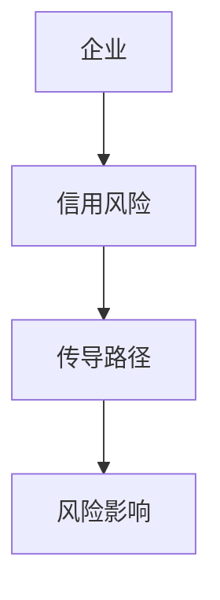
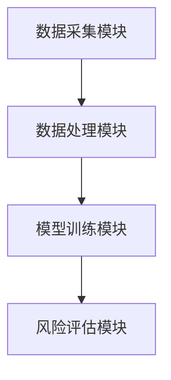

                 


# 构建智能化的企业信用风险传导模型

> 关键词：企业信用风险，风险传导模型，机器学习，深度学习，数学建模，系统架构，风险管理

> 摘要：本文详细探讨了如何构建智能化的企业信用风险传导模型，从背景介绍、核心概念、算法原理、系统架构到项目实战，全面分析了模型构建的各个方面。通过理论与实践相结合的方式，本文为读者提供了从理解信用风险传导机制到实际应用的完整指南。

---

# 正文

## 第1章: 企业信用风险传导模型的背景与意义

### 1.1 信用风险的基本概念

#### 1.1.1 信用风险的定义
信用风险是指企业在债务融资、贷款、赊销等信用活动中，由于交易对手或债务人无法履行其债务义务而导致的损失风险。信用风险是企业在经营过程中面临的主要风险之一，尤其是在全球经济不确定性增加的背景下，信用风险的管理显得尤为重要。

#### 1.1.2 信用风险的分类
信用风险可以分为以下几种类型：
1. **交易对手风险**：由于交易对手无法履行合同义务而产生的风险。
2. **信用评级风险**：由于债务人信用评级下降而导致的风险。
3. **集中度风险**：企业在某单一客户或行业的信用敞口集中度过高，导致风险集中。
4. **市场风险**：由于市场波动导致债务人信用状况恶化的风险。

#### 1.1.3 信用风险对企业的影响
信用风险对企业的影响是多方面的，主要包括：
- 直接经济损失：由于债务人违约导致的直接损失。
- 信誉损失：企业因未能履行债务而影响其市场信誉。
- 资金链断裂：信用风险可能导致企业资金链紧张，影响正常经营。
- 法律风险：违约行为可能导致企业面临法律诉讼和罚款。

### 1.2 企业信用风险传导模型的定义

#### 1.2.1 模型的定义与特点
企业信用风险传导模型是一种用于量化和预测企业信用风险在不同主体、行业或市场之间传导的数学模型。其特点包括：
- **系统性**：模型能够捕捉企业信用风险的系统性特征，包括直接和间接的影响路径。
- **动态性**：模型能够反映信用风险在时间维度上的动态变化。
- **可解释性**：模型的输出结果具有较高的可解释性，便于企业进行风险管理和决策。

#### 1.2.2 模型的构建目标
企业信用风险传导模型的构建目标主要包括：
1. 量化企业信用风险的传导路径和影响程度。
2. 识别信用风险的关键影响因素和敏感性。
3. 提供信用风险的预警和应对策略。

#### 1.2.3 模型的应用场景
企业信用风险传导模型的应用场景包括：
- **企业内部风险管理**：帮助企业识别和评估信用风险，制定风险管理策略。
- **银行和金融机构的风险评估**：用于评估贷款企业或投资项目的信用风险。
- **宏观经济风险预警**：用于预警系统性信用风险，支持宏观政策制定。

### 1.3 企业信用风险传导模型的意义

#### 1.3.1 提升企业风险管理能力
通过构建企业信用风险传导模型，企业可以更好地识别和评估信用风险，从而提升风险管理能力。

#### 1.3.2 优化企业信用评估流程
模型可以帮助企业优化信用评估流程，提高评估的准确性和效率。

#### 1.3.3 促进企业数字化转型
信用风险传导模型的构建和应用，推动企业从传统管理向数字化管理转型，提升企业的竞争力。

### 1.4 本章小结
本章从信用风险的基本概念、企业信用风险传导模型的定义和应用场景等方面进行了介绍，为后续章节的深入分析奠定了基础。

---

## 第2章: 信用风险传导的核心概念与联系

### 2.1 核心概念原理

#### 2.1.1 信用风险的来源
信用风险的来源主要包括以下几个方面：
- **债务人违约**：债务人因各种原因无法履行债务义务。
- **经济周期波动**：经济周期波动可能导致企业信用状况恶化。
- **信息不对称**：信息不对称可能导致信用风险的产生和扩大。

#### 2.1.2 风险传导的路径
风险传导的路径主要包括以下几种：
- **直接传导**：风险直接从债务人传递到债权人。
- **间接传导**：风险通过中间机构或市场传递到其他相关方。
- **系统性传导**：风险在金融系统中广泛传播，形成系统性风险。

#### 2.1.3 模型的输入与输出
模型的输入主要包括以下几类数据：
- **企业基本信息**：包括企业规模、行业、地理位置等。
- **财务数据**：包括资产负债表、利润表、现金流等。
- **信用评级数据**：包括企业信用评级、评级变化等。
- **市场数据**：包括市场波动、利率变化等。

模型的输出主要包括：
- **信用风险的传导路径**：包括直接和间接的传导路径。
- **风险影响程度**：包括不同路径对风险的影响程度。
- **风险预警信号**：包括信用风险的预警指标和触发条件。

### 2.2 核心概念属性特征对比

#### 2.2.1 模型输入特征
模型输入特征包括以下几类：
| 特征类型 | 特征名称 | 特征描述 |
|----------|----------|----------|
| 企业信息 | 企业规模 | 企业的注册资本、员工数量等。 |
| 行业信息 | 行业风险 | 行业的平均违约率、行业周期性等。 |
| 财务数据 | 资产负债率 | 企业的资产负债率。 |
| 现金流 | 自由现金流 | 企业的自由现金流。 |

#### 2.2.2 模型输出特征
模型输出特征包括以下几类：
| 特征类型 | 特征名称 | 特征描述 |
|----------|----------|----------|
| 风险路径 | 传导路径 | 风险从债务人到债权人的具体路径。 |
| 影响程度 | 风险影响程度 | 不同路径对风险的影响程度。 |
| 预警信号 | 预警指标 | 预警信用风险的触发条件和信号。 |

#### 2.2.3 模型性能指标
模型性能指标包括以下几类：
| 指标名称 | 指标描述 |
|----------|----------|
| 准确率 | 模型预测的准确程度。 |
| 召回率 | 模型预测的召回程度。 |
| F1分数 | 模型的综合性能指标。 |
| AUC值 | 模型的区分能力。 |

### 2.3 ER实体关系图架构



上述图展示了企业信用风险传导模型的核心实体关系，包括企业、信用风险、传导路径和风险影响之间的关系。

### 2.4 本章小结
本章从信用风险的核心概念、模型输入输出特征、性能指标等方面进行了详细分析，为后续模型的构建奠定了基础。

---

## 第3章: 信用风险传导机制的建模与分析

### 3.1 风险传导机制的直接与间接路径

#### 3.1.1 直接传导机制
直接传导机制是指风险直接从债务人传递到债权人，例如：
- 企业A因无法偿还贷款，导致银行B的贷款损失。

#### 3.1.2 间接传导机制
间接传导机制是指风险通过中间机构或市场传递到其他相关方，例如：
- 企业A违约导致供应链上的企业B受到影响，进而影响银行C的贷款。

#### 3.1.3 综合传导机制
综合传导机制是指风险通过多种路径和渠道传递到不同相关方，例如：
- 企业A违约影响其供应商企业B，企业B的信用评级下降，进一步影响银行C的贷款。

### 3.2 风险传导模型的构建方法

#### 3.2.1 数据收集与预处理
数据收集与预处理是模型构建的基础，主要包括以下几个步骤：
1. **数据收集**：收集企业基本信息、财务数据、信用评级数据、市场数据等。
2. **数据清洗**：对数据进行清洗，剔除异常值和缺失值。
3. **特征工程**：对数据进行特征提取和处理，例如标准化、归一化等。

#### 3.2.2 模型选择与训练
模型选择与训练是模型构建的核心，主要包括以下几个步骤：
1. **模型选择**：选择适合的机器学习算法，例如线性回归、随机森林、神经网络等。
2. **模型训练**：利用训练数据对模型进行训练，优化模型参数。
3. **模型验证**：利用验证数据对模型进行验证，评估模型的性能。

#### 3.2.3 模型验证与优化
模型验证与优化是模型构建的重要环节，主要包括以下几个步骤：
1. **模型评估**：利用测试数据对模型进行评估，计算模型的准确率、召回率等性能指标。
2. **模型优化**：通过调整模型参数、优化特征选择等方式，进一步提升模型的性能。

### 3.3 风险传导模型的数学表达

#### 3.3.1 线性回归模型
线性回归模型是一种常用的信用风险建模方法，其数学表达式为：
$$ y = \beta_0 + \beta_1x_1 + \beta_2x_2 + \ldots + \beta_nx_n + \epsilon $$
其中，$y$是目标变量（信用风险），$x_i$是自变量（特征变量），$\beta_i$是回归系数，$\epsilon$是误差项。

#### 3.3.2 随机森林模型
随机森林模型是一种基于决策树的集成学习方法，其数学表达式可以表示为多个决策树的组合：
$$ y = \text{sign} \left( \sum_{i=1}^{N} \text{Tree}_i(x) \right) $$
其中，$N$是决策树的数量，$\text{Tree}_i(x)$是第$i$棵决策树的输出。

### 3.4 本章小结
本章从风险传导机制的直接与间接路径、模型构建方法、数学表达等方面进行了详细分析，为后续模型的实现奠定了基础。

---

## 第4章: 企业信用风险传导模型的算法原理

### 4.1 算法选择与比较

#### 4.1.1 传统机器学习算法
传统机器学习算法包括线性回归、逻辑回归、支持向量机（SVM）等。这些算法在信用风险建模中具有一定的应用，但其表现可能受到数据特征和模型复杂度的限制。

#### 4.1.2 深度学习算法
深度学习算法包括神经网络、卷积神经网络（CNN）、循环神经网络（RNN）等。深度学习算法在处理高维、非线性数据时表现优异，但在模型解释性和计算资源方面存在一定的挑战。

#### 4.1.3 算法优缺点分析
| 算法名称 | 优点 | 缺点 |
|----------|------|------|
| 线性回归 | 简单、易于解释 | 无法处理非线性关系 |
| 随机森林 | 高准确率、抗过拟合 | 计算复杂度较高 |
| 神经网络 | 高准确率、处理复杂数据 | 模型解释性较差 |
| 支持向量机 | 高准确率、适合小样本数据 | 不适合高维数据 |

### 4.2 算法原理详细讲解

#### 4.2.1 线性回归算法
线性回归算法通过最小化预测值与实际值之间的平方差之和来优化模型参数。其损失函数为：
$$ L = \frac{1}{2N} \sum_{i=1}^{N} (y_i - \hat{y}_i)^2 $$
其中，$N$是样本数量，$y_i$是实际值，$\hat{y}_i$是预测值。

#### 4.2.2 随机森林算法
随机森林算法是一种基于决策树的集成学习方法，其核心思想是通过随机采样和随机特征选择来构建多棵决策树，并通过投票或加权的方式进行预测。

#### 4.2.3 神经网络算法
神经网络算法通过构建人工神经网络来模拟人脑的神经网络，其核心在于通过多层感知机（MLP）对输入数据进行非线性变换。

### 4.3 本章小结
本章详细介绍了企业信用风险传导模型中常用的算法及其原理，为后续模型的实现提供了理论基础。

---

## 第5章: 企业信用风险传导模型的系统实现

### 5.1 系统架构设计

#### 5.1.1 系统功能设计
系统功能设计包括以下几个方面：
- **数据采集模块**：负责收集企业信用相关数据。
- **数据处理模块**：负责对数据进行清洗、特征提取等处理。
- **模型训练模块**：负责模型的训练和优化。
- **风险评估模块**：负责信用风险的评估和预警。

#### 5.1.2 系统架构图


### 5.2 系统实现细节

#### 5.2.1 数据采集模块
数据采集模块可以通过API接口或其他数据源获取企业信用相关数据，例如：
```python
import requests

response = requests.get('https://api.example.com/credit_data')
data = response.json()
```

#### 5.2.2 数据处理模块
数据处理模块需要对数据进行清洗和特征工程，例如：
```python
from sklearn.preprocessing import StandardScaler

scaler = StandardScaler()
X_scaled = scaler.fit_transform(X)
```

#### 5.2.3 模型训练模块
模型训练模块可以选择随机森林算法进行训练，例如：
```python
from sklearn.ensemble import RandomForestClassifier

model = RandomForestClassifier(n_estimators=100, max_depth=10, random_state=42)
model.fit(X_train, y_train)
```

#### 5.2.4 风险评估模块
风险评估模块可以通过模型预测信用风险，并生成风险报告，例如：
```python
importances = model.feature_importances_
feature_names = ['feature1', 'feature2', 'feature3']
importance_dict = dict(zip(feature_names, importances))
```

### 5.3 本章小结
本章从系统架构设计到具体实现细节，详细介绍了企业信用风险传导模型的系统实现过程。

---

## 第6章: 项目实战与案例分析

### 6.1 项目背景与目标

#### 6.1.1 项目背景
某大型企业集团希望通过构建企业信用风险传导模型，优化其信用风险管理流程，降低信用风险对公司的影响。

#### 6.1.2 项目目标
1. 构建企业信用风险传导模型。
2. 提供信用风险预警和应对策略。
3. 实现模型的可视化展示和报表生成。

### 6.2 项目实施步骤

#### 6.2.1 数据收集与预处理
1. 收集企业基本信息、财务数据、信用评级数据等。
2. 对数据进行清洗和特征工程处理。

#### 6.2.2 模型构建与训练
1. 选择适合的算法进行模型训练。
2. 对模型进行验证和优化。

#### 6.2.3 模型部署与应用
1. 部署模型到生产环境。
2. 提供模型的可视化展示和报表生成功能。

### 6.3 实际案例分析

#### 6.3.1 案例背景
某制造企业因原材料价格上涨导致生产成本增加，面临较大的信用风险。

#### 6.3.2 模型预测结果
模型预测结果显示，该企业的信用风险较高，需要采取相应的风险控制措施。

### 6.4 本章小结
本章通过实际案例分析，展示了企业信用风险传导模型的应用过程和效果，为读者提供了宝贵的实践经验。

---

## 第7章: 总结与展望

### 7.1 本章总结
本文详细探讨了企业信用风险传导模型的构建与应用，从背景介绍、核心概念、算法原理、系统实现到项目实战，全面分析了模型构建的各个方面。

### 7.2 未来展望
未来，随着人工智能和大数据技术的不断发展，企业信用风险传导模型将更加智能化和精准化。同时，模型的应用也将更加广泛，涵盖更多的业务场景和行业领域。

---

## 附录

### 附录A: 数据格式与处理代码
```python
import pandas as pd

# 读取数据
data = pd.read_csv('credit_data.csv')

# 数据清洗
data = data.dropna()
data = data.drop_duplicates()

# 特征工程
from sklearn.preprocessing import LabelEncoder

le = LabelEncoder()
data['industry'] = le.fit_transform(data['industry'])
```

### 附录B: 模型训练代码
```python
from sklearn.ensemble import RandomForestClassifier

# 模型训练
model = RandomForestClassifier(n_estimators=100, max_depth=10, random_state=42)
model.fit(X_train, y_train)

# 模型预测
y_pred = model.predict(X_test)
```

### 附录C: 参考文献
1. 《信用风险管理》
2. 《机器学习实战》
3. 《深度学习》

---

通过以上步骤，您可以逐步构建智能化的企业信用风险传导模型，实现对企业信用风险的有效管理和预警。

