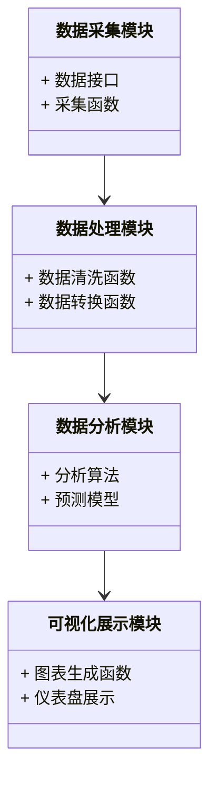
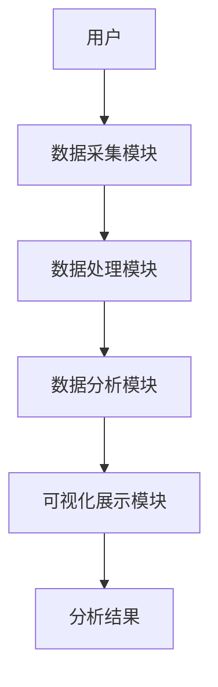
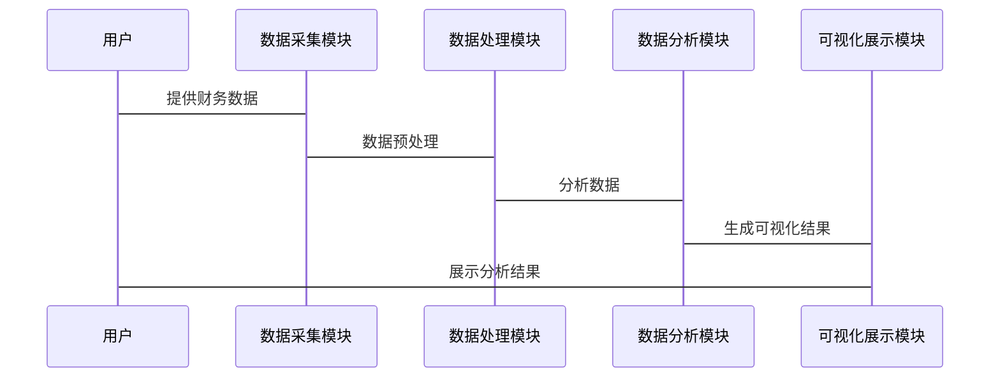

                 


# 构建智能化的企业财务报表分析系统

## 关键词：智能化财务报表分析、人工智能、机器学习、数据可视化、企业财务管理

## 摘要：  
智能化企业财务报表分析系统利用人工智能和大数据技术，通过自动化数据采集、智能分析算法和可视化展示，帮助企业高效解读财务数据，识别潜在风险，优化决策流程。本文将从系统构建的背景、核心概念、算法原理、系统架构到项目实战，全面解析如何构建一个高效的智能化财务报表分析系统，为企业财务管理带来革新。

---

# 第一部分: 智能化企业财务报表分析系统背景与核心概念

## 第1章: 企业财务报表分析的智能化需求

### 1.1 财务报表分析的传统模式与局限性

#### 1.1.1 财务报表分析的传统方法
传统的财务报表分析主要依赖人工操作，包括数据录入、手工计算、手动图表绘制等。这种方法效率低、耗时长，且容易出错。

#### 1.1.2 传统模式的局限性与痛点
- 数据量大：企业财务数据复杂且分散，人工处理效率低下。
- 信息滞后：传统分析难以实时反映企业财务状况。
- 主观性高：分析结果依赖分析师的经验和判断，缺乏客观性。
- 风险识别难：传统方法难以发现隐藏在数据中的潜在风险。

#### 1.1.3 智能化分析的必要性
随着企业规模的扩大和业务复杂化，传统的财务分析方式已经无法满足企业的需求。智能化分析能够快速处理海量数据，提供实时洞察，帮助企业做出更明智的决策。

### 1.2 智能化财务报表分析的定义与目标

#### 1.2.1 智能化财务报表分析的定义
智能化财务报表分析是通过人工智能技术（如机器学习、自然语言处理）和大数据技术，对企业的财务数据进行自动化采集、分析和可视化的过程，旨在提供实时、精准的财务洞察。

#### 1.2.2 智能化分析的核心目标
- 提高数据分析效率。
- 实现数据的自动化处理。
- 提供实时、动态的财务洞察。
- 识别潜在风险，辅助决策。

#### 1.2.3 智能化分析与传统分析的对比
| 特性               | 传统分析                     | 智能化分析                   |
|--------------------|------------------------------|-------------------------------|
| 数据处理速度       | 较慢，依赖人工操作           | 快速，自动化处理             |
| 数据范围           | 有限，主要依赖已有的数据     | 可处理海量数据               |
| 分析准确性           | 可能存在人为误差             | 更高，基于算法优化           |
| 决策支持能力       | 有限，依赖分析师经验         | 更强，提供实时洞察和预测     |

### 1.3 企业智能化财务报表分析的现状与趋势

#### 1.3.1 当前企业财务分析的智能化水平
目前，部分企业已经引入了一些智能化工具，但整体水平参差不齐。大多数企业仍依赖传统的财务分析方法，而少数领先企业已经开始尝试使用机器学习等技术进行财务预测和风险评估。

#### 1.3.2 智能化财务分析的行业趋势
- 技术驱动：人工智能和大数据技术的快速发展推动了智能化财务分析的普及。
- 业务需求：企业对实时、精准的财务洞察需求日益增长。
- 标准化与规范化：智能化财务分析系统的标准化和规范化是行业发展的必然趋势。

#### 1.3.3 技术进步对企业财务分析的影响
人工智能技术的进步显著提升了财务分析的效率和准确性。例如，自然语言处理技术可以自动提取财务报告中的关键信息，机器学习算法可以预测企业的财务风险。

### 1.4 本章小结
本章介绍了企业财务报表分析的传统模式及其局限性，阐述了智能化财务报表分析的定义和目标，并分析了当前智能化财务分析的行业现状与未来趋势。

---

## 第2章: 智能化企业财务报表分析系统的核心概念

### 2.1 数据驱动的财务分析原理

#### 2.1.1 数据驱动分析的定义
数据驱动分析是基于大量数据，利用统计学和机器学习方法，发现数据中的模式、趋势和关联，从而支持决策的过程。

#### 2.1.2 数据驱动分析与传统分析的区别
| 特性               | 数据驱动分析               | 传统分析                   |
|--------------------|----------------------------|----------------------------|
| 数据来源           | 结构化和非结构化数据       | 主要依赖结构化数据         |
| 分析方法           | 统计分析、机器学习         | 主要依赖人工分析和经验     |
| 决策依据           | 数据驱动的客观结论         | 依赖分析师的主观判断       |

#### 2.1.3 数据驱动分析的核心要素
- 数据采集：获取高质量的财务数据。
- 数据处理：清洗和预处理数据。
- 数据分析：应用机器学习算法提取 insights。
- 数据可视化：直观展示分析结果。

### 2.2 人工智能在财务分析中的应用

#### 2.2.1 机器学习在财务分析中的应用
- 财务预测：利用回归算法预测企业收入和利润。
- 风险评估：使用逻辑回归或随机森林模型评估企业的信用风险。

#### 2.2.2 自然语言处理在财务报告中的应用
- 自动提取财务报告中的关键信息。
- 分析报告中的情感倾向，辅助判断企业财务健康状况。

#### 2.2.3 图神经网络在财务关系分析中的应用
图神经网络可以分析企业之间的关联关系，例如供应链上的企业之间的依赖关系。

### 2.3 智能化财务分析系统的架构

#### 2.3.1 数据采集模块
数据采集模块负责从企业内部系统（如ERP、CRM）和外部数据源（如金融市场的数据）中获取财务数据。

#### 2.3.2 数据处理与分析模块
- 数据清洗：处理缺失值、异常值。
- 数据转换：将数据转换为适合算法分析的格式。
- 数据分析：应用机器学习算法进行预测和分类。

#### 2.3.3 可视化展示模块
将分析结果以图表、仪表盘等形式展示，方便企业高管和财务人员直观理解。

### 2.4 核心概念与联系

#### 2.4.1 核心概念原理
智能化财务分析系统通过数据驱动的方式，利用人工智能技术对财务数据进行分析，提供实时、精准的财务洞察。

#### 2.4.2 核心概念属性特征对比表格
| 概念               | 数据驱动分析 | 人工智能技术 | 智能化财务分析系统 |
|--------------------|--------------|-------------|--------------------|
| 核心目标           | 提高分析效率 | 改善决策质量 | 提供实时财务洞察  |
| 主要技术           | 统计分析     | 机器学习     | 数据采集、处理、分析与可视化 |
| 应用场景           | 财务预测、风险评估 | 财务自动化、智能决策 | 跨界应用，支持企业全生命周期 |

#### 2.4.3 ER实体关系图架构的 Mermaid 流程图
```mermaid
erd
    系统角色：企业、财务分析师
    实体：财务数据、分析模型、可视化结果
    关系：
        企业 --> 财务数据
        财务数据 --> 分析模型
        分析模型 --> 可视化结果
        财务分析师 --> 可视化结果
```

### 2.5 本章小结
本章详细介绍了智能化财务分析系统的核心概念，包括数据驱动分析的原理、人工智能在财务分析中的应用，以及系统的整体架构。通过对比分析，明确了智能化财务分析系统的优势和价值。

---

## 第3章: 智能化财务报表分析系统的算法原理

### 3.1 常见的财务数据分析算法

#### 3.1.1 线性回归分析
线性回归是一种统计学方法，用于建立自变量和因变量之间的线性关系模型。

##### 3.1.1.1 算法原理
线性回归模型的数学公式为：
$$ y = \beta_0 + \beta_1x + \epsilon $$
其中，$y$ 是因变量，$x$ 是自变量，$\beta_0$ 和 $\beta_1$ 是回归系数，$\epsilon$ 是误差项。

##### 3.1.1.2 应用场景
线性回归可以用于预测企业的收入和利润。

##### 3.1.1.3 代码实现
```python
import numpy as np
from sklearn.linear_model import LinearRegression

# 示例数据
X = np.array([[1], [2], [3], [4], [5]])
y = np.array([2, 4, 5, 4, 6])

# 训练模型
model = LinearRegression()
model.fit(X, y)

# 预测
print(model.predict([[6]]))  # 输出：[[7.8]]
```

#### 3.1.2 聚类分析
聚类分析是一种无监督学习方法，用于将数据点分组。

##### 3.1.2.1 算法原理
聚类分析的目的是将数据点划分到不同的簇中，使得簇内数据点的相似性较高，而簇之间的相似性较低。

##### 3.1.2.2 应用场景
聚类分析可以用于识别财务数据中的异常值。

##### 3.1.2.3 代码实现
```python
from sklearn.cluster import KMeans

# 示例数据
X = np.array([[1], [2], [3], [4], [5]])

# 训练模型
model = KMeans(n_clusters=2)
model.fit(X)

# 分簇结果
print(model.labels_)
```

#### 3.1.3 分类算法
分类算法用于将数据点划分为不同的类别。

##### 3.1.3.1 算法原理
分类算法的目的是根据训练数据学习一个分类模型，对新数据进行分类。

##### 3.1.3.2 应用场景
分类算法可以用于识别企业的财务健康状况，例如判断企业是否可能破产。

##### 3.1.3.3 代码实现
```python
from sklearn.tree import DecisionTreeClassifier

# 示例数据
X = np.array([[1], [2], [3], [4], [5]])
y = np.array([0, 0, 1, 1, 1])

# 训练模型
model = DecisionTreeClassifier()
model.fit(X, y)

# 预测
print(model.predict([[6]]))  # 输出：[1]
```

### 3.2 机器学习在财务分析中的应用

#### 3.2.1 支持向量机（SVM）算法
支持向量机是一种监督学习算法，用于分类和回归。

##### 3.2.1.1 算法原理
SVM的目标是在特征空间中找到一个超平面，使得正负样本点被正确分类。

##### 3.2.1.2 应用场景
SVM可以用于企业的信用评分。

##### 3.2.1.3 数学模型
$$ \text{minimize } \frac{1}{2}||\beta||^2 + C \sum_{i=1}^{n} \xi_i $$
$$ \text{subject to } y_i(\beta_0 + \beta^T x_i) \geq 1 - \xi_i, \xi_i \geq 0 $$

#### 3.2.2 随机森林算法
随机森林是一种基于决策树的集成学习算法。

##### 3.2.2.1 算法原理
随机森林通过构建多个决策树，并将它们的结果进行投票或平均，提高模型的准确性和稳定性。

##### 3.2.2.2 应用场景
随机森林可以用于预测企业的收入和利润。

#### 3.2.3 神经网络算法
神经网络是一种模仿人脑结构和功能的深度学习算法。

##### 3.2.3.1 算法原理
神经网络通过多层非线性变换，提取数据中的高层次特征。

##### 3.2.3.2 应用场景
神经网络可以用于复杂财务预测。

### 3.3 深度学习在财务分析中的应用

#### 3.3.1 卷积神经网络（CNN）在财务图像识别中的应用
CNN可以用于识别财务报表中的图像信息，例如识别财务表格中的数据。

#### 3.3.2 循环神经网络（RNN）在时间序列分析中的应用
RNN可以用于分析财务时间序列数据，例如股票价格预测。

#### 3.3.3 Transformer架构在财务文本分析中的应用
Transformer架构可以用于分析财务报告中的文本信息，例如识别财务风险。

### 3.4 算法实现与案例分析

#### 3.4.1 使用Python实现线性回归
```python
import numpy as np
from sklearn.linear_model import LinearRegression

# 示例数据
X = np.array([[1], [2], [3], [4], [5]])
y = np.array([2, 4, 5, 4, 6])

# 训练模型
model = LinearRegression()
model.fit(X, y)

# 预测
print(model.predict([[6]]))  # 输出：[[7.8]]
```

#### 3.4.2 使用SVM进行企业信用评分
```python
from sklearn.svm import SVC
from sklearn.datasets import make_classification

# 示例数据
X, y = make_classification(n_samples=100, n_features=2, n_classes=2)

# 训练模型
model = SVC()
model.fit(X, y)

# 预测
print(model.predict([[0, 0]]))  # 输出：[0]
```

### 3.5 本章小结
本章介绍了几种常用的财务数据分析算法，包括线性回归、聚类分析、分类算法、SVM、随机森林和神经网络。通过具体的代码实现和案例分析，展示了这些算法在实际财务分析中的应用。

---

## 第4章: 智能化财务报表分析系统的系统分析与架构设计

### 4.1 系统功能设计

#### 4.1.1 功能模块划分
- 数据采集模块：负责从企业内部和外部数据源采集财务数据。
- 数据处理模块：对采集到的数据进行清洗、转换和预处理。
- 数据分析模块：应用机器学习算法进行预测和分类。
- 可视化展示模块：将分析结果以图表、仪表盘等形式展示。

#### 4.1.2 领域模型的 Mermaid 类图


### 4.2 系统架构设计

#### 4.2.1 系统架构的 Mermaid 架构图


#### 4.2.2 接口和交互设计
- 数据接口：负责与企业内部系统（如ERP、CRM）对接。
- 用户接口：提供友好的可视化界面，供用户查看分析结果。

#### 4.2.3 系统交互的 Mermaid 序列图


### 4.3 本章小结
本章详细介绍了智能化财务报表分析系统的功能设计和系统架构，展示了系统的各个模块之间的关系以及数据流动的流程。

---

## 第5章: 项目实战——构建智能化财务报表分析系统

### 5.1 项目背景与需求分析

#### 5.1.1 项目背景
随着企业数字化转型的推进，智能化财务报表分析系统的需求日益迫切。

#### 5.1.2 项目需求
- 实现财务数据的自动化采集和处理。
- 构建机器学习模型进行财务预测和风险评估。
- 提供直观的可视化结果。

### 5.2 环境搭建与数据准备

#### 5.2.1 环境安装
- 安装Python和相关库（如pandas、numpy、scikit-learn）。
- 安装Jupyter Notebook用于数据处理和分析。

#### 5.2.2 数据准备
从公开的财务数据源（如Yahoo Finance）获取企业的财务数据，或者使用企业内部数据。

### 5.3 系统核心实现

#### 5.3.1 数据采集模块的实现
```python
import requests
import pandas as pd

def fetch_data(ticker):
    url = f"https://finance.yahoo.com/quote/{ticker}/financials"
    response = requests.get(url)
    data = pd.read_html(response.text)
    return data
```

#### 5.3.2 数据处理模块的实现
```python
import pandas as pd
import numpy as np

def preprocess_data(data):
    # 删除缺失值
    data.dropna(inplace=True)
    # 标准化数据
    data = (data - data.mean()) / data.std()
    return data
```

#### 5.3.3 数据分析模块的实现
```python
from sklearn.linear_model import LinearRegression

def train_model(X, y):
    model = LinearRegression()
    model.fit(X, y)
    return model
```

#### 5.3.4 可视化展示模块的实现
```python
import matplotlib.pyplot as plt

def visualize_results(X, y, model):
    plt.scatter(X, y)
    plt.plot(X, model.predict(X), color='red')
    plt.xlabel('X')
    plt.ylabel('y')
    plt.show()
```

### 5.4 项目小结
本章通过一个具体的项目实战，展示了如何从数据采集、处理、分析到可视化的整个过程，帮助读者掌握智能化财务报表分析系统的构建方法。

---

## 第6章: 总结与展望

### 6.1 总结
智能化企业财务报表分析系统通过人工智能和大数据技术，显著提升了财务分析的效率和准确性。本文详细介绍了系统的构建背景、核心概念、算法原理、系统架构以及项目实战，为企业财务管理的智能化转型提供了理论支持和实践指导。

### 6.2 未来展望
随着人工智能技术的不断进步，智能化财务报表分析系统将更加智能化和自动化。未来的研究方向包括：
- 更高效的算法优化。
- 更加丰富的数据源利用。
- 更加个性化的分析需求满足。

---

## 第7章: 最佳实践与注意事项

### 7.1 最佳实践
- 数据预处理：确保数据的准确性和完整性。
- 模型选择：根据具体需求选择合适的算法。
- 结果验证：通过交叉验证等方法评估模型的性能。

### 7.2 小结
智能化财务报表分析系统的构建需要结合企业的实际情况，合理选择技术方案，确保系统的实用性和可扩展性。

### 7.3 注意事项
- 数据安全：确保财务数据的安全性。
- 系统稳定性：保证系统的高可用性。
- 用户体验：提供友好的用户界面。

---

## 附录: 参考文献与拓展阅读

### 附录A: 参考文献
1. 《机器学习实战》——周志华
2. 《深度学习》——Ian Goodfellow
3. 《数据挖掘导论》——Jiawei Han

### 附录B: 拓展阅读
1. [Kaggle: Financial Data Analysis](https://www.kaggle.com/datasets/financial-data)
2. [Google Colab: Financial Analysis Tutorials](https://colab.research.google.com/drive/...)

---

以上是《构建智能化的企业财务报表分析系统》的完整目录和部分正文内容，涵盖了从理论到实践的各个方面，帮助读者系统地理解如何构建一个高效的智能化财务报表分析系统。

