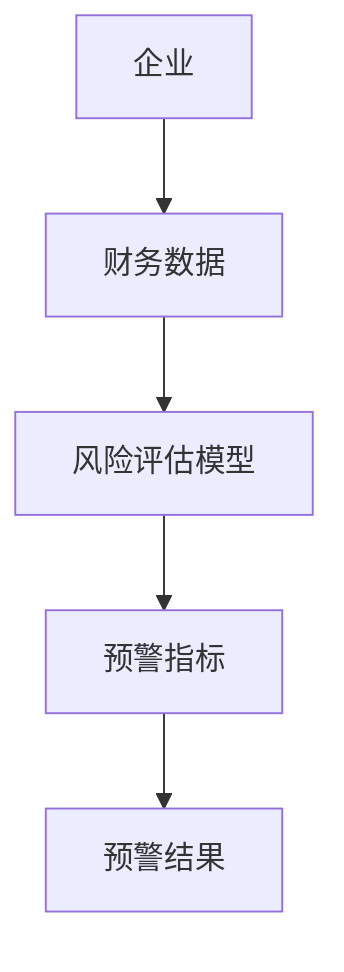
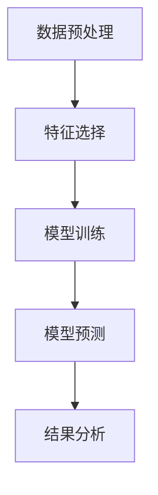
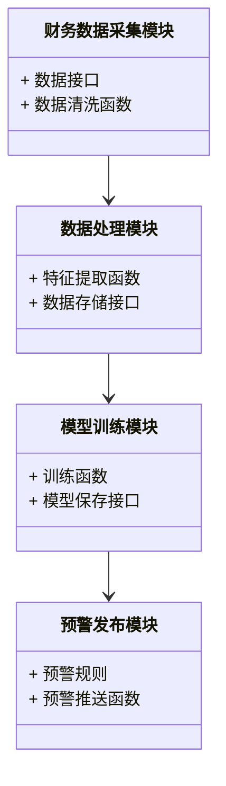

                 


# 构建智能化的企业财务风险预警系统

## 关键词：企业财务、风险预警、人工智能、大数据、机器学习

## 摘要：  
本文详细探讨了构建智能化企业财务风险预警系统的各个方面。从背景和重要性入手，分析了财务风险的主要类型及其对企业的潜在影响。接着，介绍了系统的核心概念与技术原理，包括数据特征、风险评估模型及预警指标体系。详细阐述了基于机器学习的算法实现，如逻辑回归、随机森林和神经网络的原理与流程。通过系统架构设计和项目实战，展示了如何将理论应用于实际。最后，总结了构建智能化财务风险预警系统的最佳实践和未来发展方向。

---

# 第一部分: 企业财务风险预警系统概述

## 第1章: 财务风险预警系统背景与意义

### 1.1 财务风险预警的定义与重要性

#### 1.1.1 财务风险的定义  
财务风险是指企业在经营过程中由于内外部环境变化而导致财务状况恶化、无法偿还债务或遭受经济损失的可能性。  

#### 1.1.2 财务风险预警的必要性  
企业财务风险预警系统能够提前识别潜在的财务问题，帮助企业及时采取措施，避免或减少损失。  

#### 1.1.3 智能化预警系统的优势  
智能化预警系统通过大数据和人工智能技术，能够实时分析财务数据，提高预警的准确性和及时性。

---

### 1.2 企业财务风险的主要类型

#### 1.2.1 财务流动性风险  
企业无法及时获得足够资金来偿还债务或满足日常经营需求的风险。  

#### 1.2.2 财务偿债风险  
企业在债务到期时无法按时偿还债务的风险。  

#### 1.2.3 财务运营风险  
企业在日常运营中因管理不善或外部环境变化导致的财务风险。

---

### 1.3 财务风险预警系统的功能与目标

#### 1.3.1 系统的主要功能  
- 数据采集与处理  
- 风险评估与分析  
- 预警信息的生成与推送  
- 报告与可视化  

#### 1.3.2 系统的目标与价值  
- 提高企业财务风险管理能力  
- 降低财务风险对企业的影响  
- 优化企业的财务决策。

---

### 1.4 智能化预警系统的演变

#### 1.4.1 传统财务分析的局限性  
传统财务分析方法依赖人工判断，存在主观性强、效率低、覆盖面窄等问题。  

#### 1.4.2 AI与大数据技术的应用  
人工智能和大数据技术的引入，使得财务风险预警系统更加智能化、自动化和高效。  

#### 1.4.3 智能化预警系统的构建思路  
结合大数据和人工智能技术，构建一个实时、动态、精准的财务风险预警系统。

---

## 第2章: 财务风险预警的核心概念与联系

### 2.1 核心概念与原理

#### 2.1.1 数据来源与特征  
财务数据包括财务报表、现金流、应收账款、应付账款等。数据特征包括相关性、时序性、波动性等。  

#### 2.1.2 风险评估模型  
基于机器学习的模型，如逻辑回归、随机森林等，用于评估企业的财务风险。  

#### 2.1.3 预警指标体系  
包括流动性指标（如速动比率）、偿债能力指标（如资产负债率）和运营效率指标（如存货周转率）。

---

### 2.2 核心概念对比分析

#### 2.2.1 数据特征对比  
| 数据特征 | 传统方法 | 智能化方法 |
|----------|----------|------------|
| 数据来源 | 单一数据源 | 多数据源（财务、运营、市场等） |
| 数据处理 | 人工处理 | 自动化处理 |
| 数据维度 | 少维度 | 高维度 |

#### 2.2.2 模型性能对比  
| 模型类型 | 传统模型 | 智能化模型 |
|----------|----------|------------|
| 精度 | 较低 | 高 |
| 训练时间 | 长 | 较短 |
| 解释性 | 高 | 较低 |

#### 2.2.3 预警指标对比  
| 指标类型 | 传统指标 | 智能化指标 |
|----------|----------|------------|
| 流动性 | 速动比率 | 综合流动风险指数 |
| 偿债能力 | 资产负债率 | 综合偿债风险指数 |
| 运营效率 | 存货周转率 | 综合运营风险指数 |

---

### 2.3 实体关系架构图



---

## 第3章: 智能化预警系统的算法原理

### 3.1 机器学习算法概述

#### 3.1.1 监督学习  
用于分类问题，如财务风险分类（高风险/低风险）。  

#### 3.1.2 非监督学习  
用于聚类问题，如财务数据的异常检测。  

#### 3.1.3 深度学习  
用于复杂的非线性关系建模，如LSTM网络用于时间序列分析。

---

### 3.2 常用算法实现

#### 3.2.1 逻辑回归模型  
用于二分类问题，如判断企业是否会发生财务危机。  

**数学模型**：  
$$ P(y=1|x) = \frac{1}{1 + e^{-(\beta_0 + \beta_1x_1 + \cdots + \beta_nx_n)}} $$  

#### 3.2.2 随机森林模型  
基于决策树的集成学习方法，适合处理高维数据。  

#### 3.2.3 神经网络模型  
用于复杂的非线性关系建模，如多层感知机（MLP）和长短期记忆网络（LSTM）。  

---

### 3.3 算法流程图



---

## 第4章: 系统架构设计与实现

### 4.1 系统架构设计

#### 4.1.1 系统功能模块  
- 数据采集模块：收集财务数据。  
- 数据处理模块：清洗和特征提取。  
- 模型训练模块：训练风险评估模型。  
- 预警发布模块：生成并推送预警信息。  

#### 4.1.2 系统架构图  



---

## 第5章: 项目实战与实现

### 5.1 项目环境搭建

#### 5.1.1 安装必要的库  
- Python：`pip install numpy pandas scikit-learn`  
- 数据可视化工具：`pip install matplotlib seaborn`  

### 5.2 数据预处理

#### 5.2.1 数据清洗  
处理缺失值和异常值。  

#### 5.2.2 特征选择  
选择对企业财务风险影响较大的特征，如速动比率、资产负债率等。  

### 5.3 模型训练

#### 5.3.1 逻辑回归模型实现  

```python
from sklearn.linear_model import LogisticRegression
from sklearn.metrics import accuracy_score

# 训练模型
model = LogisticRegression()
model.fit(X_train, y_train)

# 预测
y_pred = model.predict(X_test)
print("准确率:", accuracy_score(y_test, y_pred))
```

---

## 第6章: 最佳实践与总结

### 6.1 最佳实践

#### 6.1.1 数据预处理注意事项  
- 数据清洗：处理缺失值、异常值。  
- 特征工程：选择相关性高的特征，避免维度灾难。  

#### 6.1.2 模型调优技巧  
- 调参：使用网格搜索优化模型参数。  
- 交叉验证：评估模型的泛化能力。  

#### 6.1.3 实时监控建议  
- 实时数据采集：确保数据的实时性。  
- 模型更新：定期重新训练模型，保持模型性能。  

---

### 6.2 总结与展望

智能化企业财务风险预警系统的构建，结合了大数据和人工智能技术，能够显著提高风险识别和预警的效率。未来，随着技术的进步，系统将更加智能化、自动化，并在企业风险管理中发挥更大的作用。

---

通过以上内容，我们详细探讨了构建智能化企业财务风险预警系统的各个方面，从理论到实践，从设计到实现，为企业的财务风险管理提供了有力的技术支持。

