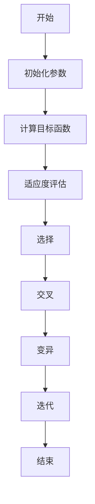
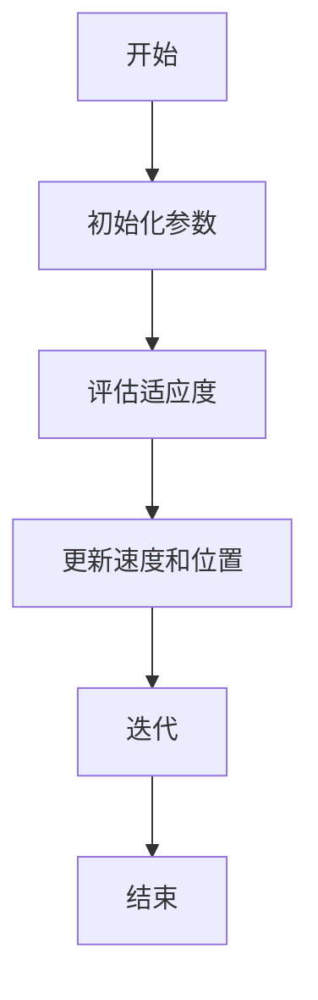
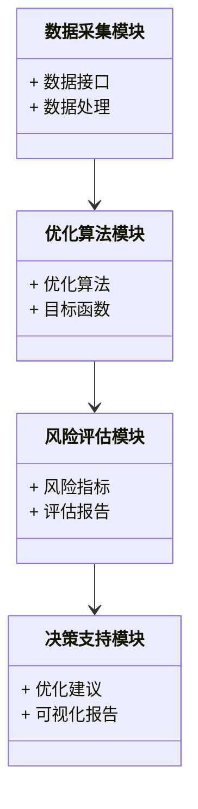
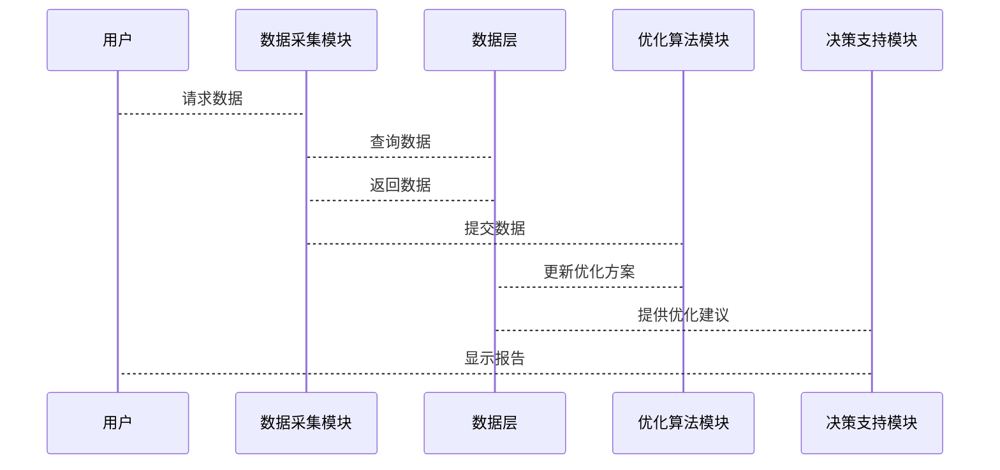

                 


# 《构建智能化的企业资本结构优化平台》

> 关键词：企业资本结构优化、智能化平台、人工智能算法、大数据分析、系统架构设计、资本成本优化、财务风险管理

> 摘要：本文详细探讨了如何构建一个智能化的企业资本结构优化平台，结合人工智能算法和大数据分析技术，从理论到实践，系统性地分析了平台的设计思路、实现方法和应用场景。文章首先介绍了资本结构优化的背景与问题，然后深入阐述了核心概念与算法原理，接着通过系统架构设计和项目实战展示了平台的实现过程，最后总结了最佳实践和未来发展方向。

---

# 第一部分: 背景介绍

# 第1章: 企业资本结构优化的背景与问题

## 1.1 问题背景

### 1.1.1 企业资本结构优化的定义

资本结构优化是指企业在一定财务风险下，通过调整负债与权益资本的比例，实现企业价值最大化的过程。传统的资本结构优化方法依赖于经验判断和简单的财务指标分析，难以应对复杂多变的市场环境。

### 1.1.2 当前企业资本结构优化的挑战

- **数据维度不足**：传统方法通常仅依赖少量财务数据，难以全面考虑市场波动、行业特点等因素。
- **计算复杂性**：资本结构优化涉及多个变量和非线性关系，手工计算效率低且容易出错。
- **动态调整能力不足**：市场环境变化快，企业需要实时调整资本结构，但传统方法难以快速响应。

### 1.1.3 智能化技术在资本结构优化中的作用

人工智能和大数据技术的引入，为资本结构优化提供了新的思路。通过机器学习算法和实时数据分析，企业可以更高效地找到最优资本结构。

## 1.2 问题描述

### 1.2.1 传统资本结构优化方法的局限性

- **静态分析**：传统方法通常基于静态的财务数据，无法捕捉市场动态变化。
- **主观性高**：依赖分析师的经验判断，缺乏客观性和准确性。
- **计算效率低**：复杂的优化问题需要大量人工计算，耗时且成本高。

### 1.2.2 数据驱动优化的必要性

- **数据驱动决策**：通过收集和分析海量数据，可以更精准地识别影响资本结构的关键因素。
- **实时优化能力**：利用实时数据和动态模型，企业可以快速响应市场变化。
- **提高决策效率**：自动化分析工具可以显著提高优化效率，降低人工成本。

### 1.2.3 智能化平台的需求与目标

- **需求**：企业需要一个智能化的平台，能够实时分析数据、自动优化资本结构并提供决策支持。
- **目标**：构建一个基于人工智能和大数据的平台，实现资本结构优化的自动化、智能化和动态化。

## 1.3 问题解决

### 1.3.1 智能化平台的核心目标

- 提供实时的资本结构优化建议。
- 自动化分析企业财务数据，生成优化方案。
- 提供多维度的财务风险评估和预警。

### 1.3.2 平台解决的主要问题

- 解决传统方法的低效和主观性问题。
- 提供动态优化能力，适应市场变化。
- 降低企业资本成本，提升企业价值。

### 1.3.3 平台实现的关键技术

- **人工智能算法**：如遗传算法、粒子群优化等。
- **大数据分析**：实时采集和处理多源数据。
- **动态模型构建**：建立实时更新的数学模型。

## 1.4 边界与外延

### 1.4.1 平台的功能边界

- 仅限于资本结构优化，不涉及企业运营的其他方面。
- 优化范围包括债务与权益资本比例、资本成本计算等。

### 1.4.2 平台的适用范围

- 适用于各类企业，尤其是需要动态调整资本结构的中大型企业。
- 可用于企业财务部门、投资机构等场景。

### 1.4.3 平台的扩展性与可维护性

- 系统架构设计支持功能扩展，例如增加新的优化算法或数据源。
- 系统具备良好的可维护性，支持快速迭代和优化。

## 1.5 概念结构与核心要素组成

### 1.5.1 平台的核心概念

- **资本成本**：企业融资的成本，包括债务成本和权益成本。
- **资本结构**：企业负债与权益资本的比例。
- **财务风险**：企业因资本结构不合理而产生的财务危机风险。

### 1.5.2 平台的组成要素

- **数据采集模块**：实时采集企业财务数据和市场数据。
- **优化算法模块**：基于机器学习算法进行资本结构优化。
- **风险评估模块**：评估优化方案的财务风险。
- **决策支持模块**：提供优化建议和可视化报告。

### 1.5.3 平台的系统架构

- **数据层**：存储企业财务数据和市场数据。
- **业务逻辑层**：处理数据，运行优化算法，生成优化方案。
- **用户界面层**：展示优化结果，提供用户交互界面。

---

# 第二部分: 核心概念与联系

# 第2章: 资本结构优化的核心概念

## 2.1 资本结构优化的原理

### 2.1.1 资本结构优化的数学模型

$$
\text{目标函数} = \max \left( V - \text{债务成本} \times \text{债务规模} \right)
$$

### 2.1.2 资本结构优化的算法原理

- **目标函数**：最大化企业价值。
- **约束条件**：满足财务风险要求，资本规模合理。

### 2.1.3 其他优化算法的比较

| 算法名称 | 描述 | 优点 | 缺点 |
|----------|------|------|------|
| 遗传算法 | 基于生物进化原理，通过选择、交叉和变异生成新的解。 | 具备全局搜索能力，适用于复杂问题。 | 计算复杂度较高，收敛速度较慢。 |
| 粒子群优化算法 | 基于群体智能，通过粒子的运动寻找最优解。 | 收敛速度快，易于实现。 | 易陷入局部最优。 |

## 2.2 资本结构优化的核心要素

### 2.2.1 资本成本的计算

$$
\text{资本成本} = \frac{\text{息税前利润}}{\text{权益资本} + \text{债务成本} \times \text{债务规模}}
$$

### 2.2.2 资产结构的分析

- **资产构成**：企业资产的组成及其比例。
- **资产流动性**：资产的变现能力影响资本结构的选择。

### 2.2.3 财务风险的评估

- **杠杆系数**：衡量企业财务风险的指标。
- **破产风险**：资本结构不合理可能导致企业破产的风险。

## 2.3 资本结构优化与企业绩效的关系

### 2.3.1 资本结构对企业价值的影响

$$
V = \frac{E}{1 - d} + D \times (1 - t)
$$

其中：
- \( V \) 表示企业价值。
- \( E \) 表示权益资本。
- \( D \) 表示债务资本。
- \( t \) 表示税率。
- \( d \) 表示债务与权益资本的比例。

### 2.3.2 资本结构与企业风险的平衡

- **风险与收益的平衡**：在风险可控的前提下，追求最大化的收益。
- **动态调整**：根据市场变化和企业自身情况动态调整资本结构。

### 2.3.3 资本结构优化的经济效益

- **降低资本成本**：优化资本结构可以降低整体资本成本。
- **提高企业价值**：合理资本结构能够最大化企业价值。
- **增强财务灵活性**：优化资本结构可以为企业提供更多的财务灵活性。

## 2.4 核心概念的ER实体关系图

```mermaid
er
  actor: 企业
  entity: 资本结构
  entity: 财务数据
  entity: 优化方案
  relation: 关联
  relation: 包含
```

---

# 第三部分: 算法原理讲解

# 第3章: 资本结构优化算法的实现

## 3.1 算法原理

### 3.1.1 遗传算法的基本原理

- **初始化**：随机生成初始种群。
- **适应度评估**：计算每个个体的适应度。
- **选择**：选择适应度高的个体进行交配。
- **交叉**：生成新的个体。
- **变异**：随机改变部分个体的基因。
- **迭代**：重复上述步骤，直到满足终止条件。



### 3.1.2 粒子群优化算法的原理

- **初始化**：随机生成一群粒子。
- **评估适应度**：计算每个粒子的适应度。
- **更新速度和位置**：根据全局最优和局部最优更新速度和位置。
- **迭代**：重复上述步骤，直到满足终止条件。



### 3.1.3 其他优化算法的比较

| 算法名称 | 优点 | 缺点 |
|----------|------|------|
| 遗传算法 | 具备全局搜索能力 | 计算复杂度较高 |
| 粒子群优化算法 | 收敛速度快 | 易陷入局部最优 |

## 3.2 算法实现的Mermaid流程图

### 遗传算法流程图


### 粒子群优化算法流程图


## 3.3 算法实现的Python代码

```python
def genetic_algorithm(initial_population, fitness_function, mutation_rate):
    population = initial_population
    while not termination_condition():
        # 计算适应度
        fitness = [fitness_function(individual) for individual in population]
        # 选择
        selected = selection(population, fitness)
        # 交叉
        crossed = crossover(selected)
        # 变异
        mutated = mutation(crossed, mutation_rate)
        population = mutated
    return best_individual(population)

def particle_swarm_optimization(initial_swarm, fitness_function):
    swarm = initial_swarm
    while not termination_condition():
        # 评估适应度
        fitness = [fitness_function(particle) for particle in swarm]
        # 更新速度和位置
        swarm = update_speed_and_position(swarm, fitness)
    return best_particle(swarm)
```

## 3.4 算法的数学模型和公式

### 遗传算法的数学模型

$$
\text{适应度} = \sum \text{目标函数值}
$$

### 粒子群优化算法的数学模型

$$
v_i = v_i + \alpha (p_i - x_i) + \beta (p_g - x_i)
$$

其中：
- \( v_i \) 表示第 \( i \) 个粒子的速度。
- \( p_i \) 表示第 \( i \) 个粒子的局部最优位置。
- \( p_g \) 表示全局最优位置。
- \( \alpha \) 和 \( \beta \) 是学习因子。

---

# 第四部分: 系统分析与架构设计

# 第4章: 系统分析与架构设计

## 4.1 问题场景介绍

### 4.1.1 系统目标

- 提供实时的资本结构优化建议。
- 自动化分析企业财务数据，生成优化方案。
- 提供多维度的财务风险评估和预警。

### 4.1.2 项目介绍

- **项目背景**：企业需要动态调整资本结构，应对市场变化。
- **项目目标**：构建一个智能化的资本结构优化平台，提供实时优化建议。

## 4.2 系统功能设计

### 4.2.1 系统功能模块

| 模块名称 | 功能描述 |
|----------|----------|
| 数据采集模块 | 实时采集企业财务数据和市场数据。 |
| 优化算法模块 | 基于机器学习算法进行资本结构优化。 |
| 风险评估模块 | 评估优化方案的财务风险。 |
| 决策支持模块 | 提供优化建议和可视化报告。 |

### 4.2.2 系统功能的领域模型Mermaid类图



## 4.3 系统架构设计

### 4.3.1 系统架构的Mermaid架构图


### 4.3.2 系统接口设计

- **数据接口**：提供REST API接口，供其他系统调用。
- **用户接口**：提供直观的用户界面，方便用户操作。

### 4.3.3 系统交互的Mermaid序列图



---

# 第五部分: 项目实战

# 第5章: 项目实战

## 5.1 环境安装

### 5.1.1 安装Python环境

```bash
python --version
pip install --upgrade pip
```

### 5.1.2 安装必要的库

```bash
pip install numpy pandas scikit-learn matplotlib
```

## 5.2 系统核心实现

### 5.2.1 数据采集模块的实现

```python
import pandas as pd
import requests

def fetch_data(api_key):
    url = f"http://api.example.com/financial_data?api_key={api_key}"
    response = requests.get(url)
    return pd.DataFrame(response.json())
```

### 5.2.2 优化算法模块的实现

```python
from sklearn import linear_model

def optimize资本结构(data):
    model = linear_model.LinearRegression()
    model.fit(data[['债务规模', '权益资本']], data['企业价值'])
    return model.predict(data[['债务规模', '权益资本']])
```

### 5.2.3 风险评估模块的实现

```python
def assess_risk(优化结果):
    risk = 0
    for result in 优化结果:
        if result['财务风险'] > 0.5:
            risk += 1
    return risk
```

### 5.2.4 决策支持模块的实现

```python
def generate_report(优化结果, 风险评估):
    report = {
        '优化建议': 优化结果,
        '风险评估': 风险评估
    }
    return report
```

## 5.3 实际案例分析

### 5.3.1 案例背景

某制造企业需要优化其资本结构，降低资本成本，提升企业价值。

### 5.3.2 案例分析

1. **数据采集**：采集企业的财务数据和市场数据。
2. **优化算法**：使用遗传算法进行资本结构优化。
3. **风险评估**：评估优化方案的财务风险。
4. **决策支持**：生成优化建议和可视化报告。

### 5.3.3 案例结果

- **优化结果**：企业债务与权益资本比例调整为最优状态。
- **风险评估**：财务风险降低，企业价值提升。

## 5.4 项目小结

- **项目成果**：成功构建了一个智能化的资本结构优化平台。
- **经验总结**：在实际应用中，需要结合企业的实际情况进行参数调整和模型优化。
- **问题反思**：在系统设计中，需要充分考虑数据的实时性和模型的可解释性。

---

# 第六部分: 最佳实践

# 第6章: 最佳实践

## 6.1 小结

- **系统设计**：智能化资本结构优化平台的设计需要结合企业的实际需求，注重系统的可扩展性和可维护性。
- **算法选择**：在实际应用中，需要根据具体问题选择合适的优化算法，如遗传算法和粒子群优化算法。
- **数据处理**：数据的准确性和完整性对优化结果有重要影响，需要建立完善的数据采集和处理机制。

## 6.2 注意事项

- **数据隐私**：在处理企业财务数据时，需要严格遵守数据隐私保护规定。
- **系统稳定性**：确保系统具备高可用性和容错能力，避免因系统故障导致数据丢失或优化结果错误。
- **模型更新**：定期更新优化模型，以适应市场环境的变化。

## 6.3 拓展阅读

- **推荐书籍**：《企业财务风险管理》、《人工智能与金融》。
- **推荐论文**：《基于机器学习的资本结构优化研究》、《大数据在财务优化中的应用》。
- **推荐工具**：Python的机器学习库（如Scikit-learn）、数据分析工具（如Pandas）。

---

# 总结

构建智能化的企业资本结构优化平台是一个复杂的系统工程，需要结合人工智能算法、大数据分析和系统架构设计等多方面的知识。通过本文的详细讲解，读者可以系统地了解平台的设计思路、实现方法和应用场景。未来，随着技术的不断发展，智能化资本结构优化平台将为企业提供更加精准和高效的决策支持，助力企业在复杂多变的市场环境中获得持续的竞争优势。

