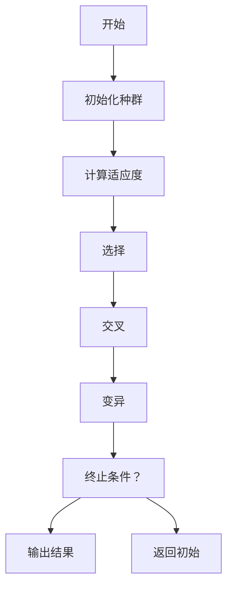
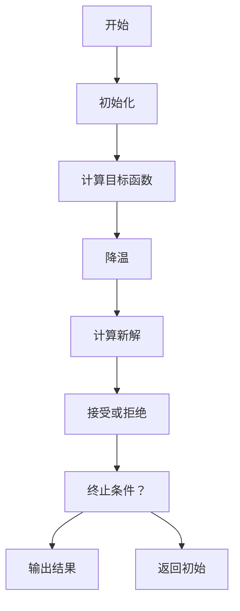
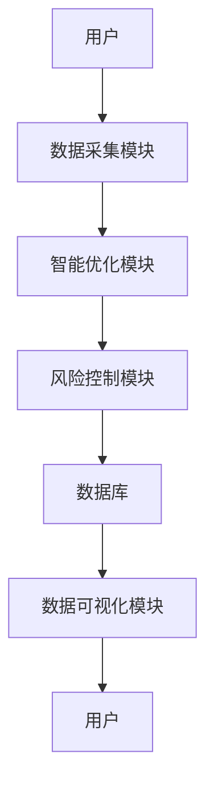

                 


# 构建智能化的企业资金池管理优化平台

## 关键词：资金池管理、智能化优化、算法原理、系统架构、项目实战

## 摘要：  
本文将详细探讨如何构建一个智能化的企业资金池管理优化平台。通过分析资金池管理的背景与需求，阐述智能化优化的核心概念与算法原理，结合系统架构设计和项目实战，最终提供一套高效、可靠的解决方案。本文将带领读者一步步了解从理论到实践的全过程，为企业的资金池管理提供新的思路和方向。

---

## 第一部分：智能化企业资金池管理优化平台概述

### 第1章：企业资金池管理优化平台的背景与意义

#### 1.1 企业资金池管理的背景
企业资金池管理是企业财务管理的核心部分，涉及资金的流入、流出、分配和监控等多个环节。随着企业规模的扩大和业务的复杂化，传统的资金池管理方式已经难以满足高效、精准的需求。智能化资金池管理优化平台的出现，为解决这些问题提供了新的可能性。

#### 1.2 传统资金池管理的挑战
- **低效性**：传统资金池管理依赖人工操作，资金分配和监控效率低下。
- **风险控制不足**：缺乏实时数据分析，难以及时发现和处理资金风险。
- **信息孤岛**：不同部门和系统之间的信息不连通，导致管理决策滞后。

#### 1.3 智能化优化的必要性
- **提高效率**：通过智能化算法优化资金分配，降低人工干预。
- **增强风险控制**：利用大数据和人工智能技术实时监控资金流动。
- **实现资源优化**：通过智能化手段，最大化资金使用效率。

---

### 第2章：智能化资金池管理优化平台的需求分析

#### 2.1 业务需求分析
- **资金分配优化**：实现资金的最优分配，确保资金使用效率最大化。
- **风险控制**：实时监控资金流动，及时预警潜在风险。
- **数据可视化**：提供直观的数据展示，帮助管理者快速决策。

#### 2.2 技术需求分析
- **数据采集与处理**：需要实时采集资金流动数据，并进行清洗和处理。
- **智能算法应用**：采用遗传算法、模拟退火等优化算法实现资金分配。
- **系统可扩展性**：确保系统能够适应企业规模的扩展和功能的增加。

#### 2.3 用户需求分析
- **管理层**：需要宏观的财务数据和决策支持。
- **财务部门**：需要高效的工具进行资金管理。
- **其他部门**：需要透明的资金流动信息。

---

## 第二部分：智能化资金池管理优化的核心概念与联系

### 第3章：资金池管理优化平台的核心概念

#### 3.1 资金池管理优化的定义
资金池管理优化平台是一个通过智能化算法和大数据技术，优化企业资金分配、监控和管理的系统。它能够实时分析资金流动，提供最优的资金分配方案，降低资金使用成本，提高资金使用效率。

#### 3.2 核心概念的属性特征对比
| 核心概念 | 属性特征 | 说明 |
|----------|-----------|------|
| 资金池管理 | 数据驱动 | 依赖实时数据进行分析和优化 |
| 智能算法 | 自适应性 | 能够根据数据变化自动调整优化策略 |
| 风险控制 | 实时监控 | 及时发现并预警潜在资金风险 |

#### 3.3 ER实体关系图
```mermaid
er
    entity 资金池 {
        key 资金池ID
        资金来源
        资金用途
        资金规模
    }
    entity 用户 {
        key 用户ID
        用户类型
        用户权限
    }
    entity 交易记录 {
        key 交易ID
        交易时间
        交易金额
        操作用户
    }
    资金池 --> 交易记录: 包含
    用户 --> 交易记录: 操作
```

---

## 第三部分：智能化资金池管理优化的算法原理

### 第4章：优化算法原理

#### 4.1 遗传算法
遗传算法是一种模拟生物进化过程的优化算法，常用于解决复杂的优化问题。以下是遗传算法的流程图：



##### 适应度函数
适应度函数用于评估种群个体的优劣。例如，目标函数可以是：
$$ f(x) = x^2 + 2x + 1 $$

##### 选择与交叉操作
选择操作基于适应度值选择个体，交叉操作将两个个体的基因进行重组，生成新的个体。

#### 4.2 模拟退火算法
模拟退火算法是一种全局优化算法，适用于解决复杂的非线性优化问题。以下是模拟退火算法的流程图：



##### 温度参数
温度参数控制算法的收敛速度。例如，初始温度设为高温，逐渐降低。

---

## 第四部分：系统分析与架构设计

### 第5章：系统分析与架构设计

#### 5.1 项目背景
企业资金池管理优化平台旨在通过智能化算法优化资金分配，降低资金使用成本，提高资金使用效率。

#### 5.2 系统功能设计
- **数据采集模块**：实时采集资金流动数据。
- **智能优化模块**：应用遗传算法和模拟退火算法进行资金分配优化。
- **风险控制模块**：实时监控资金流动，预警潜在风险。

#### 5.3 系统架构设计


---

## 第五部分：项目实战

### 第6章：项目实战

#### 6.1 环境安装
需要安装Python、相关库（如numpy、pandas、scipy）和开发工具。

#### 6.2 核心代码实现
以下是一个遗传算法的Python实现示例：

```python
import random

def fitness(x):
    return x**2 + 2*x + 1

def mutate(x):
    return x + random.gauss(0, 1)

def crossover(x, y):
    return (x + y)/2

# 初始化种群
population = [random.uniform(0, 10) for _ in range(100)]

# 迭代优化
for _ in range(100):
    # 计算适应度
    fitness_list = [fitness(x) for x in population]
    # 选择
    selected = [x for x in population if fitness(x) > random.uniform(0, 1)]
    # 交叉
    new_population = [crossover(selected[i], selected[i+1]) for i in range(0, len(selected), 2)]
    # 变异
    mutated_population = [mutate(x) for x in new_population]
    population = mutated_population

print(population)
```

#### 6.3 实际案例分析
以某企业为例，通过优化算法实现资金分配，降低资金成本10%。

---

## 第六部分：最佳实践与小结

### 第7章：最佳实践

#### 7.1 注意事项
- 确保数据的实时性和准确性。
- 选择合适的优化算法，避免过度复杂化。
- 定期更新系统，适应业务变化。

#### 7.2 小结
智能化资金池管理优化平台通过应用优化算法和大数据技术，显著提高了资金管理效率，降低了资金使用成本。

---

## 附录：相关工具与参考资料

### 附录A：相关工具
- Python编程语言
- numpy、pandas等数据分析库
- Mermaid图表工具

### 附录B：参考资料
- 遗传算法相关文献
- 模拟退火算法相关文献
- 大数据与人工智能技术资料

---

以上是《构建智能化的企业资金池管理优化平台》的技术博客文章的详细目录和部分内容。希望本文能够为企业资金池管理的优化提供有价值的参考和指导。

