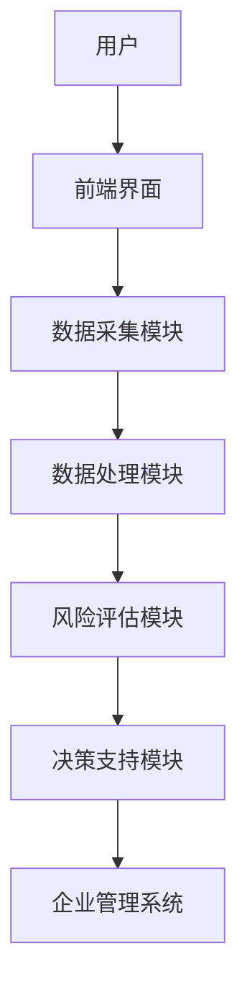

                 


# 《构建智能化的企业资金流动性风险动态管理平台》

> **关键词**：资金流动性风险、动态管理、人工智能、时间序列分析、机器学习、系统架构设计

> **摘要**：  
本文系统地探讨了如何构建智能化的企业资金流动性风险动态管理平台。首先，介绍了资金流动性风险的基本概念、构成要素及其对企业的影响。接着，深入分析了时间序列分析和机器学习算法在资金流动性风险管理中的应用原理，并通过实例展示了如何利用这些算法进行预测和风险评估。随后，详细阐述了系统的架构设计、功能模块划分及其实现过程。最后，通过一个实际案例展示了平台的构建过程，并总结了最佳实践和未来的发展方向。

---

# 第1章 资金流动性风险概述

## 1.1 资金流动性风险的基本概念

### 1.1.1 企业资金流动性的定义
企业资金流动性是指企业在一定时间内，将其资产转化为现金或支付债务的能力。它是衡量企业财务健康的重要指标之一。

### 1.1.2 资金流动性风险的定义
资金流动性风险是指企业在经营过程中，由于资金流动的不稳定或不足，可能导致无法按时支付账款、偿还债务或错失商业机会的风险。

### 1.1.3 资金流动性风险的分类
1. **市场风险**：由于市场波动导致资产变现能力下降的风险。
2. **信用风险**：交易对手无法履行合同义务导致的资金流动性风险。
3. **操作风险**：由于内部管理不当或系统故障引发的资金流动性风险。

## 1.2 资金流动性风险的构成要素

### 1.2.1 资金来源的稳定性
企业资金来源包括自有资金、银行贷款、应收账款等，其稳定性和可靠性直接影响资金流动性。

### 1.2.2 资金使用的灵活性
资金使用效率低下可能导致资金闲置或短缺，影响企业的正常运营。

### 1.2.3 资金流动的实时性
资金流动的实时监测和快速响应能力是应对资金流动性风险的关键。

## 1.3 资金流动性风险管理的重要性

### 1.3.1 企业财务健康的核心指标
资金流动性是企业财务健康的重要指标，直接影响企业的偿债能力和经营稳定性。

### 1.3.2 资金流动性风险对企业的影响
资金流动性风险可能导致企业无法按时支付账款、面临诉讼、甚至引发连锁反应，危及企业生存。

### 1.3.3 现代企业对智能化管理的需求
随着市场竞争的加剧，企业需要借助智能化技术实现资金流动性的实时监测和动态管理，以提高风险控制能力。

## 1.4 本章小结

---

# 第2章 资金流动性风险的核心要素

## 2.1 资金流动性的核心要素分析

### 2.1.1 资金池模型
资金池模型通过将企业内部资金集中管理，优化资金配置，降低流动性风险。

### 2.1.2 现金流预测模型
现金流预测模型基于历史数据和市场预测，帮助企业提前规划资金使用，避免资金短缺。

### 2.1.3 资金头寸管理
资金头寸管理通过实时监控企业的资金余额，确保企业在任何时候都能满足支付需求。

## 2.2 资金流动性风险的评估指标

### 2.2.1 现金持有量
现金持有量是企业应对短期支付需求的重要指标，但过高的现金持有量可能导致资金闲置。

### 2.2.2 短期负债比率
短期负债比率反映了企业短期债务的偿还能力，是衡量资金流动性风险的重要指标。

### 2.2.3 资金缺口分析
资金缺口分析通过预测未来一定时期内的资金需求和供给，帮助企业识别潜在的资金缺口。

## 2.3 资金流动性风险的管理策略

### 2.3.1 现金储备管理
通过合理配置现金储备，确保企业在紧急情况下能够快速应对资金需求。

### 2.3.2 融资渠道优化
优化融资渠道，多元化融资来源，降低对单一融资渠道的依赖，提高资金流动性。

### 2.3.3 资金调度机制
建立高效的内部资金调度机制，确保资金在不同部门和项目之间灵活调配。

## 2.4 本章小结

---

# 第3章 时间序列分析与预测模型

## 3.1 时间序列分析的基本原理

### 3.1.1 时间序列的分解
时间序列可以通过趋势、季节性、周期性和随机性四个成分进行分解，以便更好地理解数据的内在规律。

### 3.1.2 时间序列的预测方法
常用的时间序列预测方法包括移动平均法、指数平滑法和ARIMA模型等。

### 3.1.3 时间序列的平稳性检验
平稳性检验是时间序列分析的基础，通常使用单位根检验（如ADF检验）来判断数据是否平稳。

## 3.2 ARIMA模型的应用

### 3.2.1 ARIMA模型的定义
ARIMA（Autoregressive Integrated Moving Average）模型是一种广泛应用于时间序列预测的线性模型，由自回归（AR）、差分（I）和移动平均（MA）三个部分组成。

### 3.2.2 ARIMA模型的参数估计
ARIMA模型的参数估计通常采用最大似然估计方法，通过优化目标函数来确定模型参数。

### 3.2.3 ARIMA模型的优缺点
- **优点**：适用于线性时间序列数据，模型简单易于实现。
- **缺点**：对非线性数据表现较差，且需要手动选择模型参数。

## 3.3 LSTM模型的应用

### 3.3.1 LSTM模型的基本结构
LSTM（Long Short Term Memory）是一种特殊的RNN（循环神经网络），通过引入记忆单元和门控机制，能够更好地捕捉时间序列的长期依赖关系。

### 3.3.2 LSTM模型的训练过程
LSTM模型的训练过程包括输入数据的处理、门控机制的计算、记忆单元的更新以及输出预测值等步骤。

### 3.3.3 LSTM模型的预测
通过训练好的LSTM模型，可以对未来的资金流动性进行预测，并结合实际业务需求进行风险评估。

## 3.4 本章小结

---

# 第4章 资金流动性风险动态管理的系统架构设计

## 4.1 系统功能模块划分

### 4.1.1 数据采集模块
数据采集模块负责从企业内部系统和外部数据源（如银行账户、市场数据等）获取资金流动相关的数据。

### 4.1.2 数据处理模块
数据处理模块对采集到的数据进行清洗、转换和标准化处理，为后续分析提供高质量的数据。

### 4.1.3 风险评估模块
风险评估模块基于时间序列分析和机器学习模型，对企业的资金流动性风险进行实时评估和预警。

### 4.1.4 决策支持模块
决策支持模块根据风险评估结果，为企业提供优化融资、调整资金配置等决策支持。

## 4.2 系统架构设计

### 4.2.1 系统架构图


### 4.2.2 系统接口设计
系统接口设计包括数据接口、算法接口和用户接口，确保各个模块之间的高效通信和数据共享。

## 4.3 本章小结

---

# 第5章 项目实战：构建资金流动性风险动态管理平台

## 5.1 环境搭建

### 5.1.1 Python环境安装
安装Python 3.x版本，并配置Jupyter Notebook或PyCharm作为开发环境。

### 5.1.2 第三方库安装
安装必要的第三方库，如Pandas、NumPy、Scikit-learn、Keras和TensorFlow等。

## 5.2 核心代码实现

### 5.2.1 数据预处理代码
```python
import pandas as pd
import numpy as np

# 读取数据
data = pd.read_csv('financial_data.csv')

# 数据清洗
data.dropna(inplace=True)
data = data.iloc[:, [0, 1, 2, 3, 4]]
```

### 5.2.2 LSTM模型实现
```python
from keras.models import Sequential
from keras.layers import LSTM, Dense

# 模型定义
model = Sequential()
model.add(LSTM(50, input_shape=(timesteps, features)))
model.add(Dense(1))
model.compile(optimizer='adam', loss='mean_squared_error')
```

### 5.2.3 风险评估代码
```python
# 风险评估
def risk_assessment(predicted_value, actual_value):
    error = abs(predicted_value - actual_value)
    if error > 5%:
        return '高风险'
    else:
        return '低风险'
```

## 5.3 实际案例分析

### 5.3.1 案例背景
某制造企业面临资金流动性风险，希望通过平台实现资金流动性的实时监测和风险预警。

### 5.3.2 数据分析
通过对企业的历史财务数据和市场数据进行分析，构建资金流动性预测模型，并进行风险评估。

## 5.4 本章小结

---

# 第6章 最佳实践与未来展望

## 6.1 小结
通过构建智能化的资金流动性风险动态管理平台，企业可以实现资金流动性的实时监测、风险预警和优化决策，显著降低资金流动性风险。

## 6.2 注意事项
在实际应用中，需要注意数据质量和模型的可解释性，定期更新模型参数，确保系统的稳定性和可靠性。

## 6.3 未来展望
随着人工智能和大数据技术的不断发展，资金流动性风险动态管理平台将更加智能化、自动化和个性化，为企业提供更高效的财务管理工具。

## 6.4 拓展阅读
推荐阅读《时间序列分析》、《机器学习实战》等书籍，深入学习相关技术。

---

# 结语
通过本文的系统讲解，读者可以全面了解资金流动性风险动态管理的核心概念、算法原理和系统架构设计，并通过实际案例掌握平台的构建方法。希望本文能够为企业财务管理的智能化转型提供有益的参考和指导。

