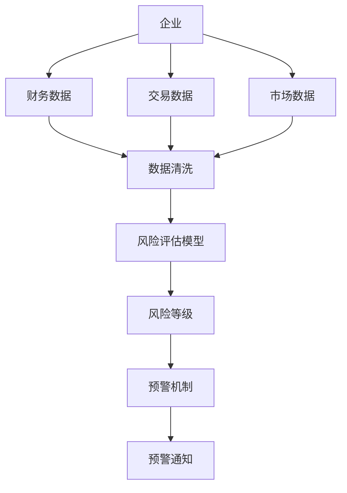
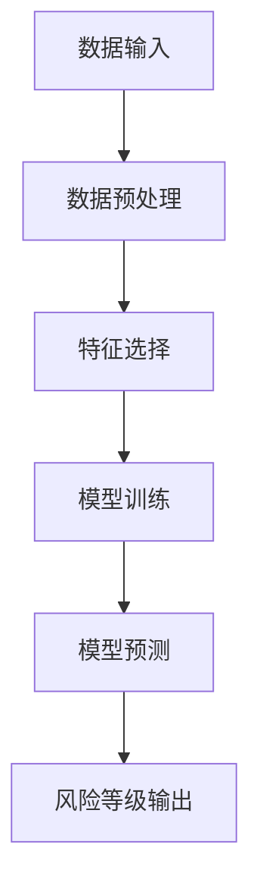
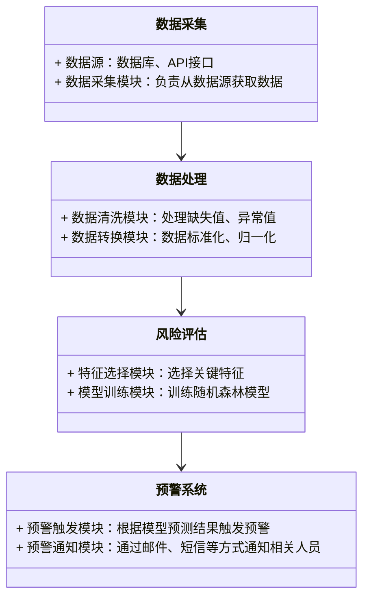
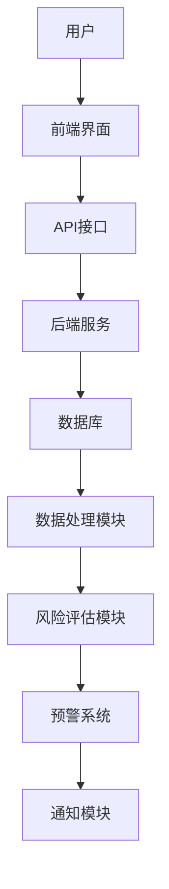

                 


# 构建智能化的企业资金流动性风险预警平台

## 关键词：
企业资金流动性风险、预警平台、机器学习、系统架构、项目实战

## 摘要：
本文详细介绍了构建智能化企业资金流动性风险预警平台的全过程，涵盖背景分析、核心概念、算法原理、系统架构、项目实战及最佳实践。通过理论与实践结合，帮助读者理解如何利用先进技术手段实时监控和预测资金风险，确保企业资金链的安全与稳定。

---

## 第1章: 资金流动性风险预警平台的背景介绍

### 1.1 问题背景

#### 1.1.1 企业资金流动性风险的定义
资金流动性风险是指企业在一定时期内无法以合理成本获得足够的资金来偿还债务或满足业务发展的需求。这种风险可能导致企业资金链断裂，进而引发严重的财务危机。

#### 1.1.2 资金流动性风险对企业的影响
- 影响企业的正常运营，可能导致订单延迟、员工工资拖欠等问题。
- 增加企业的融资成本，降低市场竞争力。
- 可能引发连锁反应，影响整个供应链的稳定性。

#### 1.1.3 传统资金管理的局限性
传统资金管理方式依赖人工操作，存在以下问题：
- 数据收集和处理效率低，难以实时监控资金流动情况。
- 风险预测准确性差，难以提前发现潜在问题。
- 缺乏智能化手段，无法根据市场变化动态调整资金策略。

### 1.2 问题描述

#### 1.2.1 资金流动性风险的主要来源
- 市场波动：经济下行、行业政策变化等外部因素可能影响企业的资金流动。
- 内部管理：资金分配不合理、应收账款回收不及时等内部问题可能导致资金链紧张。
- 供应链风险：上下游企业的资金问题可能波及整个供应链的资金流动。

#### 1.2.2 企业资金链断裂的典型案例
近年来，许多企业因资金链断裂而面临破产，例如：
- 某知名汽车制造公司因供应链中断导致资金链断裂。
- 某大型科技公司因市场环境变化导致流动性不足。

#### 1.2.3 资金流动性风险的传播机制
资金流动性风险可能通过供应链、金融市场和企业内部管理渠道传播，导致连锁反应。

### 1.3 问题解决

#### 1.3.1 构建智能化预警平台的目标
- 实现实时监控：通过自动化数据采集和处理，实时跟踪企业的资金流动情况。
- 提供风险预警：利用机器学习算法，预测潜在的资金流动性风险。
- 支持决策：为管理层提供数据支持和决策建议，优化资金管理策略。

#### 1.3.2 平台的核心功能与价值
- 实时监控：对企业资金流动的实时情况进行监控，及时发现异常。
- 风险预警：基于历史数据和机器学习模型，预测未来可能出现的资金流动性风险。
- 决策支持：提供可视化分析和数据报告，帮助管理层制定优化资金管理的策略。

#### 1.3.3 平台的边界与外延
- 边界：平台专注于资金流动性风险的监控和预警，不涉及企业的日常财务管理。
- 外延：平台可以与企业的其他管理系统（如ERP、CRM）集成，形成完整的资金管理解决方案。

### 1.4 概念结构与核心要素组成

#### 1.4.1 平台的整体架构
平台的整体架构包括数据采集、数据处理、风险评估、预警触发和用户界面五个部分。

#### 1.4.2 核心要素的定义与作用
- 数据源：包括企业的财务数据、交易数据和市场数据。
- 风险评估模型：用于评估企业的资金流动性风险。
- 预警机制：根据风险评估结果触发预警通知。
- 用户界面：供用户查看预警信息和进行相关操作。

---

## 第2章: 资金流动性风险预警的核心概念与联系

### 2.1 核心概念原理

#### 2.1.1 风险评估模型的构建
风险评估模型基于企业的财务数据、市场数据和交易数据，通过机器学习算法进行建模，评估企业的资金流动性风险。

#### 2.1.2 数据特征分析的方法
- 数据清洗：处理缺失值、异常值和重复值。
- 数据转换：对数据进行标准化、归一化处理，使其适合模型输入。
- 数据特征选择：通过特征重要性分析，选择对风险评估影响较大的特征。

#### 2.1.3 预警机制的实现原理
- 预警阈值设置：根据历史数据和业务需求，设置预警触发条件。
- 预警触发：当模型预测的风险等级超过阈值时，触发预警通知。

### 2.2 核心概念属性对比表

| 概念       | 属性1         | 属性2         | 属性3         |
|------------|---------------|---------------|---------------|
| 数据源     | 来源          | 数据类型      | 更新频率      |
| 风险评估模型 | 模型类型      | 模型参数      | 模型性能      |
| 预警机制   | 触发条件      | 预警等级      | 通知方式      |

### 2.3 实体关系图



---

## 第3章: 算法原理讲解

### 3.1 算法选择与原理

#### 3.1.1 算法选择
选择随机森林算法进行风险评估，因为其适合处理高维数据且具有较强的抗过拟合能力。

#### 3.1.2 算法原理
随机森林是一种基于决策树的集成学习算法，通过构建多个决策树并进行投票或平均，提高模型的准确性和稳定性。

### 3.2 算法实现流程



### 3.3 算法实现代码

```python
import pandas as pd
from sklearn.ensemble import RandomForestClassifier
from sklearn.metrics import accuracy_score

# 数据加载
data = pd.read_csv('financial_data.csv')

# 特征选择
features = ['revenue', 'net_profit', 'cash_flow']
target = 'risk_level'

X = data[features]
y = data[target]

# 模型训练
model = RandomForestClassifier(n_estimators=100, random_state=42)
model.fit(X, y)

# 模型预测
y_pred = model.predict(X)

# 模型评估
print(f'Accuracy: {accuracy_score(y, y_pred)}')
```

### 3.4 数学模型与公式

#### 3.4.1 风险评分模型
$$
\text{risk\_score} = \alpha \cdot \text{revenue} + \beta \cdot \text{net\_profit} + \gamma \cdot \text{cash\_flow}
$$

其中，$\alpha$、$\beta$、$\gamma$为模型的系数，通过训练数据确定。

#### 3.4.2 风险等级划分
$$
\text{risk\_level} = 
\begin{cases}
0 & \text{低风险} \\
1 & \text{中风险} \\
2 & \text{高风险}
\end{cases}
$$

---

## 第4章: 系统分析与架构设计方案

### 4.1 问题场景介绍

#### 4.1.1 项目介绍
本项目旨在开发一个智能化的资金流动性风险预警平台，帮助企业管理资金流动风险，确保资金链的安全与稳定。

### 4.2 系统功能设计

#### 4.2.1 领域模型


### 4.3 系统架构设计

#### 4.3.1 系统架构图


### 4.4 系统接口设计

#### 4.4.1 API接口
- 数据接口：用于获取企业的财务数据、交易数据和市场数据。
- 预警接口：用于查询当前的风险等级和预警信息。

### 4.5 系统交互流程

#### 4.5.1 用户登录流程
```mermaid
sequenceDiagram
    participant 用户
    participant 系统
    用户->系统: 提供用户名和密码
    系统->用户: 验证结果
    如果验证成功：
        用户->系统: 登录成功
    否则：
        用户->系统: 登录失败
```

---

## 第5章: 项目实战

### 5.1 环境安装

#### 5.1.1 安装Python
下载并安装Python 3.8及以上版本，建议使用虚拟环境管理依赖。

#### 5.1.2 安装依赖
使用以下命令安装所需的Python库：
```bash
pip install pandas sklearn scikit-learn matplotlib
```

### 5.2 系统核心实现源代码

#### 5.2.1 数据处理代码
```python
import pandas as pd
import numpy as np

# 数据加载
data = pd.read_csv('financial_data.csv')

# 数据清洗
data.dropna(inplace=True)

# 数据转换
from sklearn.preprocessing import StandardScaler
scaler = StandardScaler()
scaled_features = scaler.fit_transform(data[['revenue', 'net_profit', 'cash_flow']])
```

#### 5.2.2 模型训练代码
```python
from sklearn.ensemble import RandomForestClassifier
from sklearn.metrics import classification_report

# 特征选择
features = ['revenue', 'net_profit', 'cash_flow']
target = 'risk_level'

X = scaled_features
y = data[target]

# 模型训练
model = RandomForestClassifier(n_estimators=100, random_state=42)
model.fit(X, y)

# 模型评估
y_pred = model.predict(X)
print(classification_report(y, y_pred))
```

### 5.3 代码应用解读与分析

#### 5.3.1 数据预处理
通过数据清洗和标准化处理，确保数据质量，提高模型的预测精度。

#### 5.3.2 模型训练
使用随机森林算法训练模型，选择关键特征，提高模型的泛化能力。

### 5.4 实际案例分析

#### 5.4.1 案例分析
某制造企业最近的财务数据如下：
- 营业收入：1000万元
- 净利润：100万元
- 现金流：500万元

模型预测该企业的风险等级为中风险。

### 5.5 项目小结

#### 5.5.1 项目总结
通过构建智能化的资金流动性风险预警平台，帮助企业实时监控资金流动情况，提前发现潜在风险，优化资金管理策略。

---

## 第6章: 最佳实践与小结

### 6.1 最佳实践

#### 6.1.1 数据质量管理
- 确保数据的完整性、准确性和及时性。
- 定期更新数据，保持数据的鲜活性。

#### 6.1.2 模型调优
- 通过网格搜索优化模型参数，提高模型的预测精度。
- 定期重新训练模型，适应市场变化。

#### 6.1.3 系统监控
- 实时监控系统的运行状态，及时发现和解决问题。
- 定期备份数据，防止数据丢失。

### 6.2 小结

#### 6.2.1 全文总结
本文详细介绍了构建智能化企业资金流动性风险预警平台的全过程，包括背景分析、核心概念、算法原理、系统架构、项目实战及最佳实践。

#### 6.2.2 未来展望
随着人工智能技术的不断发展，资金流动性风险预警平台将更加智能化、自动化，为企业提供更精准的风险评估和预警服务。

---

## 附录

### 附录A: 常用工具与库

- Python
- Pandas、NumPy、Scikit-learn、RandomForestClassifier
- Mermaid、Python代码示例

### 附录B: 参考文献

- 《机器学习实战》
- 《数据挖掘导论》
- 《系统架构设计》

---

通过本文的详细讲解，读者可以系统地掌握构建智能化企业资金流动性风险预警平台的关键技术与实践方法，为企业资金管理提供有力支持。

