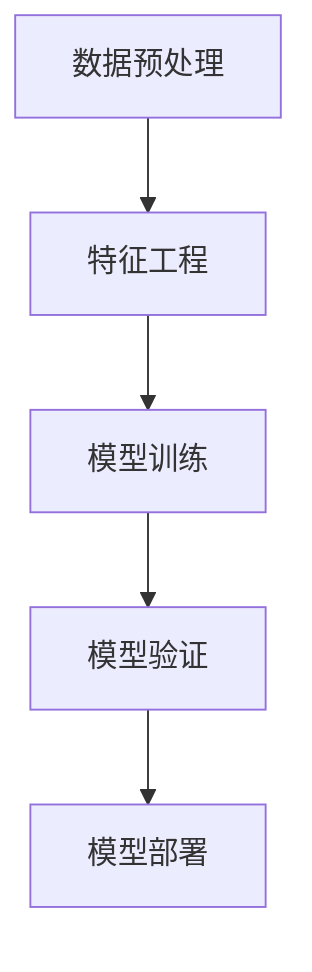

                 


# 《构建智能化的资产证券化定价模型》

---

## 关键词：
资产证券化、定价模型、人工智能、机器学习、金融建模

---

## 摘要：
本书详细探讨了如何利用人工智能和机器学习技术构建智能化的资产证券化定价模型。通过分析资产证券化的核心概念、算法原理和系统架构，结合实际案例，提供了一套从理论到实践的完整解决方案，帮助读者理解并应用智能化定价模型。

---

# 第一部分：资产证券化定价模型的背景与核心概念

# 第1章：资产证券化定价模型的背景介绍

## 1.1 资产证券化的定义与特点
### 1.1.1 资产证券化的定义
资产证券化是指将流动性较低的资产转化为可在市场上流通的证券的过程。其核心在于将资产的未来现金流进行分割和重组，以满足不同投资者的需求。

### 1.1.2 资产证券化的核心特点
- **分散风险**：将单一资产的风险分散到多个证券中。
- **提高流动性**：通过证券化，原本流动性较低的资产可以快速变现。
- **结构化产品**：根据投资者的风险偏好设计不同的证券层次。

### 1.1.3 资产证券化与传统金融工具的区别
- 传统金融工具（如债券、股票）的发行主体是企业或政府。
- 资产证券化的发行主体是特定的资产池，其价值直接来源于资产池的现金流。

## 1.2 资产证券化定价模型的必要性
### 1.2.1 传统定价方法的局限性
- 传统定价方法依赖于历史数据和线性假设，难以捕捉复杂市场环境中的非线性关系。
- 无法有效处理大数据和实时变化的市场信息。

### 1.2.2 智能化定价模型的优势
- 利用机器学习算法，能够自动提取数据特征，发现传统方法难以察觉的模式。
- 可以实时更新模型，适应市场的快速变化。

### 1.2.3 资产证券化定价模型的应用场景
- **ABS（资产支持证券）定价**：预测ABS的市场价格。
- **MBS（抵押贷款支持证券）定价**：评估MBS的内在价值。
- **风险管理**：通过模型预测违约风险，优化资产组合。

## 1.3 问题背景与问题描述
### 1.3.1 资产证券化定价的核心问题
- 如何准确预测资产池的未来现金流？
- 如何量化和定价其中的信用风险？

### 1.3.2 传统定价方法的不足
- 假设过于简化，无法反映实际市场情况。
- 缺乏对复杂市场环境的适应性。

### 1.3.3 智能化定价模型的解决方案
- 引入机器学习算法，提高模型的拟合能力和预测精度。
- 利用大数据分析，捕捉市场中的潜在规律。

## 1.4 边界与外延
### 1.4.1 资产证券化定价模型的边界
- 模型仅适用于特定类型的资产池。
- 模型的预测能力受限于数据质量和数量。

### 1.4.2 模型的外延与应用场景
- 可应用于不同类型的资产证券化产品。
- 可结合其他金融工具进行综合定价。

### 1.4.3 模型的限制与注意事项
- 数据不足可能导致模型预测不准。
- 市场环境的变化可能影响模型的有效性。

## 1.5 核心要素与概念结构
### 1.5.1 核心要素的定义
- **资产池**：一组具有相似风险和收益特征的资产。
- **现金流**：资产在未来各个时间点的预期现金流。
- **信用风险**：资产池中资产可能发生的违约风险。

### 1.5.2 概念结构的分析
资产池的现金流是定价的核心，信用风险影响现金流的分布，而市场波动则影响现金流的贴现率。

### 1.5.3 核心要素的相互关系
- 资产池的结构影响现金流的分布。
- 信用风险影响现金流的预期值。
- 市场波动影响现金流的贴现率。

## 1.6 本章小结
### 1.6.1 本章内容总结
本章介绍了资产证券化的定义、特点及其定价模型的必要性，分析了传统定价方法的局限性和智能化定价模型的优势。

### 1.6.2 下一章的预览
下一章将深入探讨资产证券化定价模型的核心概念，包括现金流预测、信用评估和市场波动分析等。

---

# 第2章：资产证券化定价模型的核心概念与联系

## 2.1 核心概念原理
### 2.1.1 资产现金流预测
- **定义**：预测资产在未来各时间点的现金流。
- **方法**：利用时间序列分析和机器学习模型进行预测。

### 2.1.2 信用风险评估
- **定义**：评估资产池中资产的违约风险。
- **方法**：使用信用评分模型和违约概率模型。

### 2.1.3 市场波动分析
- **定义**：分析市场环境的波动对资产价格的影响。
- **方法**：利用波动率模型和市场因子分析。

## 2.2 核心概念属性对比
### 2.2.1 不同概念的特征对比
| 概念         | 特征                   |
|--------------|------------------------|
| 资产现金流预测 | 数据依赖性高，预测精度要求高 |
| 信用风险评估 | 需要考虑多种风险因素，模型复杂度高 |
| 市场波动分析 | 需要实时数据，模型需要动态调整 |

### 2.2.2 比较表格展示
以下表格展示了现金流预测、信用风险评估和市场波动分析的核心要素对比：

| 概念         | 输入数据        | 输出结果         | 主要方法           |
|--------------|-----------------|------------------|--------------------|
| 现金流预测    | 历史现金流数据   | 未来现金流预测   | 时间序列分析，机器学习模型 |
| 信用风险评估 | 债务人信用记录   | 违约概率          | 信用评分模型，违约概率模型 |
| 市场波动分析  | 市场指数，波动率数据 | 市场波动预测      | 波动率模型，主成分分析 |

## 2.3 ER实体关系图
### 2.3.1 实体关系的Mermaid图
以下是一个简化的ER图，展示了资产证券化定价模型中的主要实体及其关系：

```mermaid
erd
    资产池
        债务人
            债务人ID: Integer, 唯一标识符
            债务人名称: String, 债务人名称
            信用评分: Integer, 信用评分等级
        资产
            资产ID: Integer, 唯一标识符
            资产类型: String, 资产类型
            资产价值: Float, 资产价值
        证券化机构
            机构ID: Integer, 唯一标识符
            机构名称: String, 机构名称
            授权范围: String, 授权范围描述
    投资者
        投资者ID: Integer, 唯一标识符
        投资者名称: String, 投资者名称
        投资金额: Float, 投资金额
```

---

## 2.4 核心概念的相互关系
### 2.4.1 现金流预测与信用风险评估的关系
现金流预测是信用风险评估的基础，而信用风险评估的结果会影响现金流的预测精度。

### 2.4.2 市场波动分析与资产定价的关系
市场波动分析为资产定价提供了动态调整的依据，帮助模型更好地适应市场环境的变化。

### 2.4.3 综合模型的构建
通过综合考虑现金流预测、信用风险评估和市场波动分析，构建一个全面的资产证券化定价模型。

---

## 2.5 本章小结
### 2.5.1 本章内容总结
本章详细探讨了资产证券化定价模型中的核心概念，包括现金流预测、信用风险评估和市场波动分析，并通过表格和ER图展示了这些概念的特征和相互关系。

### 2.5.2 下一章的预览
下一章将介绍资产证券化定价模型的算法原理，包括机器学习模型的实现和数学公式的推导。

---

# 第3章：资产证券化定价模型的算法原理

## 3.1 算法原理概述
### 3.1.1 算法选择
根据资产证券化定价的具体需求，选择合适的算法，如随机森林、梯度提升树和神经网络等。

### 3.1.2 算法实现步骤
1. 数据预处理：清洗数据，处理缺失值和异常值。
2. 特征工程：提取关键特征，构建特征向量。
3. 模型训练：利用训练数据训练模型。
4. 模型验证：通过交叉验证评估模型性能。
5. 模型部署：将模型应用于实际数据，进行预测。

## 3.2 算法实现细节
### 3.2.1 算法流程图
以下是一个机器学习模型的通用流程图：



### 3.2.2 代码实现
以下是使用Python实现的随机森林模型代码示例：

```python
import pandas as pd
from sklearn.ensemble import RandomForestRegressor
from sklearn.metrics import mean_squared_error
from sklearn.model_selection import train_test_split

# 加载数据
data = pd.read_csv('asset_data.csv')

# 数据预处理
data.dropna(inplace=True)

# 特征工程
features = data.columns.drop(['target'])
X = data[features]
y = data['target']

# 模型训练
X_train, X_test, y_train, y_test = train_test_split(X, y, test_size=0.2, random_state=42)

model = RandomForestRegressor(n_estimators=100, random_state=42)
model.fit(X_train, y_train)

# 模型验证
y_pred = model.predict(X_test)
print(mean_squared_error(y_test, y_pred))
```

---

## 3.3 数学模型与公式
### 3.3.1 现金流贴现模型
资产的价值可以通过未来现金流的现值来计算，公式如下：

$$ V = \sum_{t=1}^{n} \frac{CF_t}{(1 + r)^t} $$

其中，\( CF_t \) 是第 \( t \) 期的现金流，\( r \) 是贴现率。

### 3.3.2 蒙特卡洛模拟
通过模拟市场波动，评估资产价格的可能分布：

$$ P_{simulated} = \sum_{i=1}^{m} \frac{CF_i}{(1 + r_i)^t} $$

其中，\( r_i \) 是第 \( i \) 次模拟的贴现率。

---

## 3.4 算法的优缺点
### 3.4.1 优点
- 能够捕捉复杂的非线性关系。
- 可以处理高维数据和大数据量。

### 3.4.2 缺点
- 对数据质量和数量要求较高。
- 模型的解释性较差。

---

## 3.5 本章小结
### 3.5.1 本章内容总结
本章详细讲解了资产证券化定价模型的算法原理，包括数据预处理、特征工程、模型训练和验证等步骤，并通过代码示例和数学公式展示了具体实现方法。

### 3.5.2 下一章的预览
下一章将介绍资产证券化定价模型的系统架构设计，包括系统功能设计、架构设计和接口设计等内容。

---

# 第4章：资产证券化定价模型的系统架构设计

## 4.1 系统功能设计
### 4.1.1 数据采集模块
- **功能**：从多个数据源获取资产数据、市场数据等。
- **实现**：使用API接口或数据库查询。

### 4.1.2 模型训练模块
- **功能**：对数据进行特征工程和模型训练。
- **实现**：使用机器学习框架（如TensorFlow、PyTorch）进行模型训练。

### 4.1.3 定价计算模块
- **功能**：根据训练好的模型计算资产的定价。
- **实现**：将模型部署为API服务，实时接收输入数据并返回定价结果。

### 4.1.4 报告生成模块
- **功能**：生成定价报告，包括定价结果、模型评估和风险提示。
- **实现**：使用报告生成工具（如Python的ReportLab库）生成PDF报告。

## 4.2 系统架构设计
### 4.2.1 分层架构
- **数据层**：负责数据的存储和管理。
- **业务逻辑层**：负责核心业务逻辑的实现。
- **用户接口层**：负责与用户的交互。

### 4.2.2 前后端分离架构
- **前端**：负责用户界面的展示。
- **后端**：负责业务逻辑和数据处理。

## 4.3 接口设计
### 4.3.1 数据接口
- **输入**：资产数据、市场数据。
- **输出**：处理后的数据，如特征向量、模型预测结果。

### 4.3.2 模型接口
- **输入**：特征向量。
- **输出**：定价结果。

## 4.4 交互流程
### 4.4.1 用户输入资产数据
- 用户通过前端界面上传资产数据。
- 数据经过数据预处理后存入数据库。

### 4.4.2 模型训练与预测
- 后端接收数据，启动模型训练。
- 训练好的模型对数据进行预测，返回定价结果。

### 4.4.3 结果展示
- 前端展示定价结果和报告。

---

## 4.5 本章小结
### 4.5.1 本章内容总结
本章详细介绍了资产证券化定价模型的系统架构设计，包括功能模块、系统架构和交互流程。

### 4.5.2 下一章的预览
下一章将通过一个实际案例，详细介绍资产证券化定价模型的实现过程。

---

# 第5章：资产证券化定价模型的项目实战

## 5.1 项目介绍
### 5.1.1 项目目标
构建一个智能化的资产证券化定价模型，实现对ABS产品的定价。

### 5.1.2 数据来源
使用公开的ABS数据和相关市场数据。

## 5.2 系统核心实现
### 5.2.1 环境安装
- **Python**：安装Python 3.8及以上版本。
- **库依赖**：安装numpy、pandas、scikit-learn、tensorflow等库。

### 5.2.2 核心代码实现
以下是一个ABS定价模型的代码示例：

```python
import pandas as pd
import numpy as np
from sklearn.ensemble import RandomForestRegressor
from sklearn.metrics import mean_squared_error
from sklearn.model_selection import train_test_split

# 加载数据
data = pd.read_csv('abs_data.csv')

# 数据预处理
data.dropna(inplace=True)

# 特征工程
features = data.columns.drop(['target'])
X = data[features]
y = data['target']

# 模型训练
X_train, X_test, y_train, y_test = train_test_split(X, y, test_size=0.2, random_state=42)

model = RandomForestRegressor(n_estimators=100, random_state=42)
model.fit(X_train, y_train)

# 模型验证
y_pred = model.predict(X_test)
print(mean_squared_error(y_test, y_pred))

# 模型部署
import joblib

joblib.dump(model, 'abs_model.pkl')
```

---

## 5.3 代码应用解读与分析
### 5.3.1 数据预处理
- 处理缺失值和异常值，确保数据质量。
- 对特征进行标准化或归一化处理。

### 5.3.2 模型训练
- 选择合适的算法，进行参数调优。
- 使用交叉验证评估模型性能。

### 5.3.3 模型部署
- 将训练好的模型保存为可部署的格式（如pkl文件）。
- 部署为API服务，实时接收请求并返回结果。

---

## 5.4 实际案例分析
### 5.4.1 案例背景
某ABS产品由一组住宅抵押贷款组成，需要对其市场价格进行定价。

### 5.4.2 数据准备
- 资产池信息：包括贷款余额、还款期限、借款人信用评分等。
- 市场数据：包括利率、市场指数等。

### 5.4.3 模型实现
使用随机森林模型对ABS产品的市场价格进行预测。

### 5.4.4 结果分析
- 模型预测的定价与市场实际价格进行对比。
- 评估模型的准确性和稳定性。

---

## 5.5 项目小结
### 5.5.1 项目成果
成功构建了一个智能化的ABS定价模型，能够准确预测市场价格。

### 5.5.2 经验总结
- 数据预处理和特征工程是模型性能的关键。
- 模型选择和调优对结果有重要影响。
- 模型部署和应用是实现价值的重要环节。

---

# 第6章：最佳实践、小结与注意事项

## 6.1 最佳实践
### 6.1.1 数据质量的重要性
- 数据的完整性和准确性直接影响模型性能。
- 需要定期更新和维护数据。

### 6.1.2 模型选择与调优
- 根据具体问题选择合适的算法。
- 进行参数调优和模型验证，确保最佳性能。

### 6.1.3 模型部署与维护
- 将模型部署为可扩展的服务。
- 定期监控模型性能，及时更新和优化。

---

## 6.2 小结
### 6.2.1 本书内容总结
本书详细讲解了资产证券化定价模型的背景、核心概念、算法原理、系统架构和项目实战，提供了一套完整的解决方案。

### 6.2.2 读者收获
读者能够掌握智能化资产证券化定价模型的构建方法，能够在实际工作中应用相关技术。

---

## 6.3 注意事项
### 6.3.1 数据隐私与合规性
- 确保数据的合法性和合规性。
- 遵守相关法律法规，保护数据隐私。

### 6.3.2 模型的可解释性
- 在实际应用中，模型的可解释性可能影响决策的透明度。
- 需要进行模型解释性分析，确保决策的合理性。

### 6.3.3 模型的实时性
- 需要实时更新模型，以适应市场的快速变化。
- 确保系统的实时性和高效性。

---

## 6.4 拓展阅读
### 6.4.1 推荐书籍
- 《机器学习实战》
- 《金融风险管理》

### 6.4.2 推荐在线资源
- TensorFlow和PyTorch的官方文档
- Kaggle上的相关数据集和竞赛

---

# 附录：完整代码与数据集

## 附录A：完整代码
### A.1 数据预处理代码
```python
import pandas as pd
import numpy as np

# 加载数据
data = pd.read_csv('abs_data.csv')

# 删除缺失值
data.dropna(inplace=True)

# 处理异常值
data = data[(data['loan_balance'] >= 0) & (data['credit_score'] >= 300)]
```

### A.2 特征工程代码
```python
from sklearn.preprocessing import StandardScaler

# 标准化处理
scaler = StandardScaler()
X = scaler.fit_transform(X)
```

### A.3 模型训练代码
```python
from sklearn.ensemble import RandomForestRegressor

# 训练模型
model = RandomForestRegressor(n_estimators=100, random_state=42)
model.fit(X_train, y_train)
```

## 附录B：数据集
### B.1 数据集描述
数据集包含ABS产品的相关信息，如贷款余额、信用评分、还款期限等。

### B.2 数据集下载链接
提供数据集的下载链接，方便读者获取和实验。

---

# 参考文献
1. 《机器学习实战》
2. 《金融风险管理》
3. TensorFlow官方文档
4. PyTorch官方文档
5. 相关学术论文和研究报告

---

# 结语
通过本书的学习，读者将能够掌握构建智能化资产证券化定价模型的核心技术，提升在金融领域的数据分析和建模能力。希望本书能够为读者在实际工作中提供有价值的参考和指导。

--- 

# END

