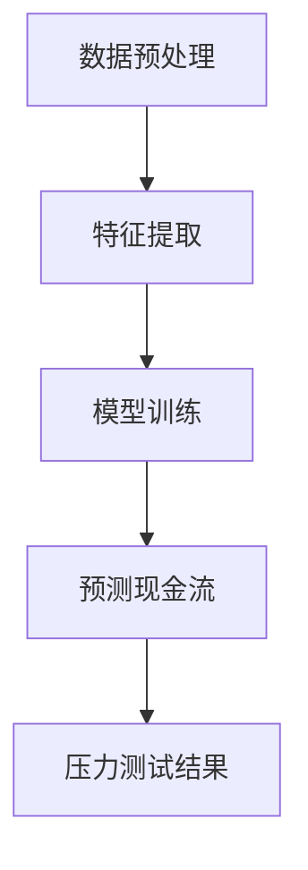
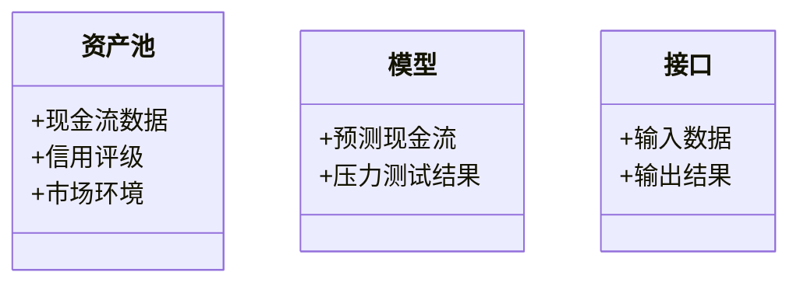
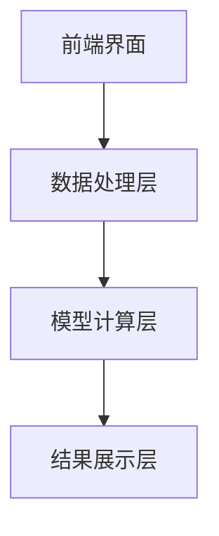

                 


```markdown
# 构建智能化的资产证券化现金流压力测试模型

> 关键词：资产证券化，现金流压力测试，机器学习，系统架构，项目实战

> 摘要：本文详细介绍了如何构建智能化的资产证券化现金流压力测试模型，结合金融知识和机器学习技术，从背景介绍、核心概念、算法原理、系统架构设计到项目实战，逐步分析并实现这一模型。通过本文的学习，读者将能够理解现金流压力测试的重要性，掌握模型构建的关键步骤，并能够在实际项目中应用这些方法。

---

## 第一部分: 资产证券化现金流压力测试模型背景介绍

### 第1章: 资产证券化与现金流压力测试概述

#### 1.1 资产证券化的基本概念
- 资产证券化的定义
- 资产证券化的基本流程
- 资产证券化在金融领域的应用

#### 1.2 现金流压力测试的定义与作用
- 现金流压力测试的定义
- 现金流压力测试的目的
- 现金流压力测试在资产证券化中的重要性

#### 1.3 资产证券化现金流压力测试的背景
- 金融市场风险的加剧
- 现金流预测的复杂性
- 智能化模型的需求

---

## 第二部分: 资产证券化现金流压力测试的核心概念

### 第2章: 资产证券化现金流压力测试的核心要素

#### 2.1 资产证券化现金流模型的构建
- 资产池的现金流预测
- 资产池的信用风险评估
- 资产池的市场风险评估

#### 2.2 现金流压力测试的关键指标
- 不同压力情景下的现金流预测
- 现金流波动性分析
- 现金流压力测试的阈值设定

#### 2.3 资产证券化现金流压力测试的边界与外延
- 模型的适用范围
- 模型的局限性
- 模型的可扩展性

---

## 第三部分: 资产证券化现金流压力测试模型的核心要素

### 第3章: 数据来源与特征

#### 3.1 数据预处理
- 数据清洗与标准化
- 数据特征提取与选择

#### 3.2 数据特征对比
- 信用特征与市场特征的对比
- 历史数据与预测数据的关联分析

#### 3.3 数据特征表格
| 特征类型 | 描述 | 示例 |
|----------|------|------|
| 信用特征 | 资产池的信用评级 | AAA, AA, A |
| 市场特征 | 市场利率变化 | 上涨，下跌，持平 |

### 第4章: 模型构建的核心要素

#### 4.1 模型选择
- 机器学习算法的选择（如XGBoost、神经网络等）
- 模型的数学公式推导

#### 4.2 模型参数优化
- 超参数调优
- 模型性能评估

#### 4.3 模型输出与结果分析
- 现金流压力测试结果的解读
- 模型的准确性评估

---

## 第四部分: 算法原理讲解

### 第5章: 算法原理

#### 5.1 算法流程
- 使用Mermaid绘制算法流程图



#### 5.2 算法数学模型
- 使用Latex公式详细推导
- 例如：使用XGBoost的损失函数

$$
\text{损失函数} = \sum_{i=1}^{n} (y_i - \hat{y}_i)^2
$$

---

## 第五部分: 系统架构设计

### 第6章: 系统分析与架构设计方案

#### 6.1 问题场景介绍
- 现金流压力测试的复杂性
- 模型的实时性要求

#### 6.2 系统功能设计
- 使用Mermaid绘制领域模型类图



#### 6.3 系统架构设计
- 使用Mermaid绘制系统架构图



---

## 第六部分: 项目实战

### 第7章: 环境安装与系统实现

#### 7.1 环境配置
- 安装Python和相关库（如XGBoost、TensorFlow）
- 安装Jupyter Notebook

#### 7.2 系统核心实现源代码
- 现金流预测代码示例

```python
import xgboost as xgb

# 数据预处理
def preprocess(data):
    # 数据清洗和特征选择
    return processed_data

# 模型训练
def train_model(X_train, y_train):
    model = xgb.XGBRegressor()
    model.fit(X_train, y_train)
    return model

# 预测现金流
def predict_cash_flow(model, X_test):
    return model.predict(X_test)
```

#### 7.3 代码应用解读与分析
- 代码功能解读
- 模型性能分析

---

## 第七部分: 总结与扩展

### 第8章: 总结

#### 8.1 最佳实践
- 数据质量管理的重要性
- 模型选择与调优的技巧

#### 8.2 小结
- 本文的核心内容回顾
- 未来研究方向的展望

### 第9章: 注意事项与拓展阅读

#### 9.1 注意事项
- 数据隐私保护
- 模型的可解释性

#### 9.2 拓展阅读
- 推荐相关书籍和论文
- 提供在线资源链接

---

## 结语

通过本文的系统介绍和详细分析，读者可以全面理解并掌握构建智能化的资产证券化现金流压力测试模型的关键步骤和技术细节。希望本文能够为金融从业者和数据科学家提供有价值的参考，帮助他们在实际项目中有效应用这些方法。
```

