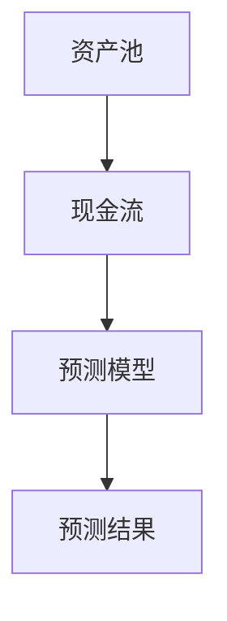
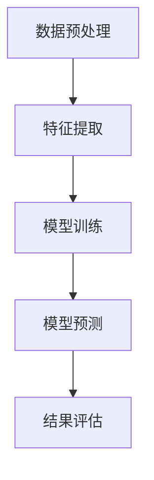
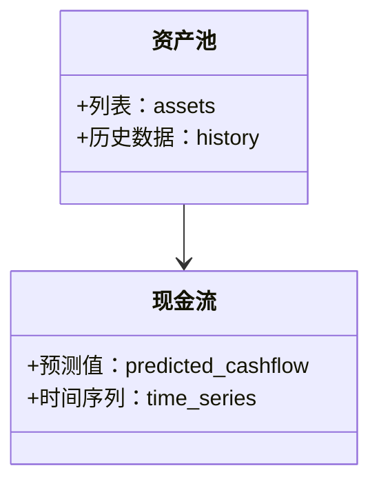
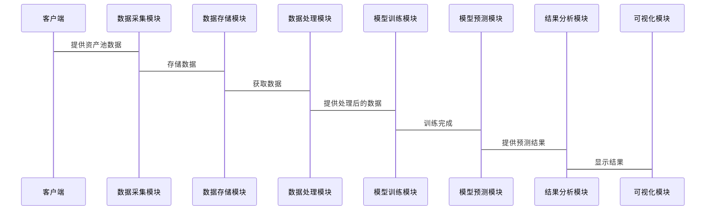

                 


# 构建智能化的资产证券化现金流预测模型

## 关键词：资产证券化，现金流预测，机器学习，XGBoost，Python

## 摘要：本文详细探讨了如何利用机器学习技术构建智能化的资产证券化现金流预测模型。通过分析资产池、现金流计算方法、信用评级等核心概念，结合XGBoost算法，本文提出了一套完整的预测流程，从数据预处理到模型训练，再到结果分析，旨在提高预测的准确性和效率。

---

# 第1章: 资产证券化与现金流预测概述

## 1.1 资产证券化的定义与特点

### 1.1.1 资产证券化的定义
资产证券化是指将缺乏流动性的资产（如房地产、应收账款等）打包，通过结构化设计转化为可以在市场上交易的证券的过程。其核心在于将资产的未来现金流转化为可交易的金融产品。

### 1.1.2 资产证券化的核心特点
- **资产池多样性**：包含多种类型资产。
- **结构化设计**：通过分层、信用增级等手段提高证券的信用评级。
- **流动性增强**：将长期资产转化为短期证券，提高流动性。

### 1.1.3 资产证券化在金融领域的应用
- 企业应收账款融资。
- 不动产抵押贷款证券化。
- 消费金融资产证券化。

## 1.2 现金流预测的意义与挑战

### 1.2.1 现金流预测的定义
现金流预测是基于历史数据和模型，预测未来一段时期内资产池产生的现金流的过程。准确的现金流预测对证券定价、风险评估至关重要。

### 1.2.2 现金流预测在资产证券化中的作用
- 评估证券价值。
- 确定证券的信用评级。
- 优化资产池结构。

### 1.2.3 现金流预测的主要挑战
- 数据的复杂性：需考虑违约、提前还款等多种因素。
- 模型的准确性：传统模型在预测复杂场景时表现不佳。
- 市场波动：外部经济环境变化影响现金流预测。

## 1.3 资产证券化现金流预测模型的背景

### 1.3.1 资产证券化与现金流预测的关系
现金流预测是资产证券化过程中关键的一步，决定了证券的市场价值和风险评估。

### 1.3.2 现有模型的局限性
- 简单线性模型难以捕捉复杂关系。
- 数据维度高，传统模型难以处理。
- 对异常值和噪声的鲁棒性不足。

### 1.3.3 智能化预测模型的必要性
引入机器学习算法，提高预测的准确性和鲁棒性，适应复杂多变的市场环境。

## 1.4 本章小结

- 资产证券化的基本概念和特点。
- 现金流预测在资产证券化中的核心作用。
- 现有模型的局限性及智能化预测的必要性。

---

# 第2章: 资产证券化现金流预测的核心概念与联系

## 2.1 资产池与现金流的关系

### 2.1.1 资产池的定义与组成
资产池是资产证券化的基础，包含多种资产，每个资产都有其独特的现金流特征。

### 2.1.2 现金流预测的核心要素
- 资产的信用状况。
- 市场利率变化。
- 经济周期波动。

### 2.1.3 资产池与现金流预测的关系
资产池的组成直接影响现金流的分布和预测的复杂性。

## 2.2 现金流预测模型的输入与输出

### 2.2.1 模型输入的定义
- 资产池的历史数据。
- 市场利率、经济指标等外部数据。
- 资产的信用评分。

### 2.2.2 模型输出的定义
- 预测的未来现金流。
- 现金流的时间分布。
- 现金流的波动性。

### 2.2.3 输入与输出之间的关系
模型输入数据经过处理和分析，生成预测现金流，帮助评估资产池的整体价值。

## 2.3 现金流预测模型的核心属性对比

### 2.3.1 不同模型的特征对比

| 模型类型 | 输入特征 | 输出特征 | 优点 | 缺点 |
|----------|----------|----------|------|------|
| 线性回归  | 线性特征  | 线性预测  | 简单 | 低准 |
| 随机森林 | 高维特征  | 非线性预测 | 高准 | 复杂 |
| XGBoost  | 高维特征  | 高准预测   | 高效 | 易过 |

### 2.3.2 模型性能的评估指标
- 均方误差（MSE）。
- R平方值（R²）。
- 混淆矩阵（Precision, Recall）。

### 2.3.3 模型选择的依据
- 数据特征的复杂性。
- 模型的可解释性需求。
- 计算资源的限制。

## 2.4 资产池、现金流与预测模型的ER实体关系图



## 2.5 本章小结

- 核心概念的定义与关系。
- 模型输入与输出的定义。
- 模型选择的依据与方法。

---

# 第3章: 现金流预测模型的算法原理

## 3.1 算法选择与原理

### 3.1.1 机器学习算法的选择
选择XGBoost算法，因其在处理高维数据和非线性关系方面的优势。

### 3.1.2 算法原理概述
XGBoost是一种基于树的 boosting 方法，通过构建多个弱预测模型（决策树）进行预测，每个模型都修正前一个模型的错误。

### 3.1.3 算法优缺点分析
- **优点**：高准确率，可处理高维数据。
- **缺点**：计算复杂度高，可能过拟合。

## 3.2 算法流程图



## 3.3 算法实现代码

### 3.3.1 数据预处理
```python
import pandas as pd
from sklearn.impute import SimpleImputer
from sklearn.preprocessing import StandardScaler

# 加载数据
data = pd.read_csv('asset_data.csv')

# 处理缺失值
imp = SimpleImputer(missing_values=np.nan, strategy='mean')
imp.fit(data[['feature1', 'feature2']])
data[['feature1', 'feature2']] = imp.transform(data[['feature1', 'feature2']])

# 标准化
scaler = StandardScaler()
data[['feature1', 'feature2']] = scaler.fit_transform(data[['feature1', 'feature2']])
```

### 3.3.2 特征提取
```python
from sklearn.feature_selection import SelectKBest, chi2

# 选择最佳特征
selector = SelectKBest(score_func=chi2, k=5)
selector.fit_transform(data[features], data['target'])
```

### 3.3.3 模型训练
```python
import xgboost as xgb

# 训练模型
model = xgb.XGBRegressor(n_estimators=100, learning_rate=0.1, max_depth=6)
model.fit(X_train, y_train)
```

### 3.3.4 模型预测
```python
# 进行预测
y_pred = model.predict(X_test)
```

### 3.3.5 结果评估
```python
from sklearn.metrics import mean_squared_error, r2_score

# 计算评估指标
mse = mean_squared_error(y_test, y_pred)
r2 = r2_score(y_test, y_pred)

print(f'MSE: {mse}')
print(f'R²: {r2}')
```

## 3.4 算法的数学模型和公式

### 3.4.1 XGBoost的损失函数
XGBoost使用目标函数和正则化项来优化模型。目标函数定义了损失的计算，而正则化项用于防止过拟合。

$$
\text{目标函数} = \text{损失函数} + \text{正则化项}
$$

损失函数常用的有均方误差（MSE）和均方对数误差（MAE）。正则化项通常采用L2范数。

### 3.4.2 XGBoost的优化目标
$$
\text{优化目标} = \sum_{i=1}^{n} [f(y_i, \hat{y}_i) + \lambda \Omega(\theta)]
$$

其中，\( f \) 是损失函数，\( \lambda \) 是正则化系数，\( \Omega(\theta) \) 是正则化项。

### 3.4.3 举例说明
假设有两个特征 \( x_1 \) 和 \( x_2 \)，目标是预测现金流 \( y \)。

训练数据：
- \( x_1 \)：资产池的违约率。
- \( x_2 \)：市场利率。

模型通过XGBoost算法学习这些特征与现金流 \( y \) 之间的关系，生成预测值 \( \hat{y} \)。

---

# 第4章: 系统分析与架构设计

## 4.1 系统分析

### 4.1.1 问题场景介绍
在资产证券化过程中，需要对资产池的现金流进行精准预测，以支持证券定价和风险评估。

### 4.1.2 系统功能设计
- 数据采集与处理。
- 特征提取与选择。
- 模型训练与预测。
- 结果分析与可视化。

## 4.2 系统架构设计

### 4.2.1 领域模型（Mermaid类图）


### 4.2.2 系统架构（Mermaid架构图）


### 4.2.3 系统接口设计
- 数据接口：提供资产池数据的导入和导出。
- 模型接口：提供模型训练和预测的API。
- 结果接口：提供预测结果的查询和分析。

## 4.3 系统交互（Mermaid序列图）


## 4.4 本章小结

- 系统分析：明确问题场景和功能需求。
- 系统架构设计：模块化设计，便于扩展和维护。
- 系统交互：清晰的接口设计和流程。

---

# 第5章: 项目实战

## 5.1 环境安装

### 5.1.1 安装Python和必要的库
```bash
pip install numpy pandas xgboost scikit-learn mermaid4jupyter
```

## 5.2 系统核心实现源代码

### 5.2.1 数据预处理
```python
import pandas as pd
import numpy as np
from sklearn.impute import SimpleImputer
from sklearn.preprocessing import StandardScaler

# 加载数据
data = pd.read_csv('asset_data.csv')

# 处理缺失值
imp = SimpleImputer(missing_values=np.nan, strategy='mean')
imp.fit(data[['feature1', 'feature2']])
data[['feature1', 'feature2']] = imp.transform(data[['feature1', 'feature2']])

# 标准化
scaler = StandardScaler()
data[['feature1', 'feature2']] = scaler.fit_transform(data[['feature1', 'feature2']])
```

### 5.2.2 特征提取
```python
from sklearn.feature_selection import SelectKBest, chi2

# 选择最佳特征
selector = SelectKBest(score_func=chi2, k=5)
selector.fit_transform(data[features], data['target'])
```

### 5.2.3 模型训练
```python
import xgboost as xgb

# 训练模型
model = xgb.XGBRegressor(n_estimators=100, learning_rate=0.1, max_depth=6)
model.fit(X_train, y_train)
```

### 5.2.4 模型预测
```python
# 进行预测
y_pred = model.predict(X_test)
```

### 5.2.5 结果分析
```python
from sklearn.metrics import mean_squared_error, r2_score

# 计算评估指标
mse = mean_squared_error(y_test, y_pred)
r2 = r2_score(y_test, y_pred)

print(f'MSE: {mse}')
print(f'R²: {r2}')
```

## 5.3 代码应用解读与分析

### 5.3.1 数据预处理
- 处理缺失值：使用均值填补。
- 数据标准化：消除特征间的量纲差异。

### 5.3.2 特征提取
- 使用卡方检验选择最佳特征。
- 确保模型输入的特征具有较高的区分度。

### 5.3.3 模型训练
- 使用XGBoost算法，调节超参数以优化性能。
- 多次迭代训练，监控模型的收敛情况。

## 5.4 实际案例分析

### 5.4.1 案例背景
某资产池包含100个房地产贷款，历史数据包括每月还款情况、借款人信用评分等。

### 5.4.2 数据准备
```python
# 假设数据文件为 'real_estate_loans.csv'
data = pd.read_csv('real_estate_loans.csv')
```

### 5.4.3 特征工程
```python
# 提取关键特征：信用评分、历史违约情况、贷款期限
features = ['credit_score', 'default_history', 'loan_term']
```

### 5.4.4 模型训练与预测
```python
# 划分训练集和测试集
from sklearn.model_selection import train_test_split

X_train, X_test, y_train, y_test = train_test_split(data[features], data['cashflow'], test_size=0.2, random_state=42)

# 训练模型
model = xgb.XGBRegressor(n_estimators=100, learning_rate=0.1, max_depth=6)
model.fit(X_train, y_train)

# 进行预测
y_pred = model.predict(X_test)
```

### 5.4.5 结果分析
```python
# 计算评估指标
mse = mean_squared_error(y_test, y_pred)
r2 = r2_score(y_test, y_pred)

print(f'MSE: {mse}')
print(f'R²: {r2}')
```

## 5.5 项目小结

- 详细展示了项目的实施步骤。
- 提供了完整的代码示例和实际案例分析。
- 强调了数据预处理和特征工程的重要性。

---

# 第6章: 最佳实践与小结

## 6.1 最佳实践 tips

### 6.1.1 数据处理
- 确保数据的完整性和准确性。
- 处理缺失值和异常值。

### 6.1.2 模型选择
- 根据数据特征选择合适的算法。
- 调整超参数优化模型性能。

### 6.1.3 模型部署
- 使用微服务架构，便于扩展和维护。
- 集成监控工具，实时跟踪模型性能。

## 6.2 项目小结

### 6.2.1 核心内容回顾
- 资产证券化的基本概念和现金流预测的重要性。
- 机器学习算法在现金流预测中的应用。
- 系统设计与项目实战的具体步骤。

### 6.2.2 经验总结
- 数据质量对模型性能影响巨大。
- 模型调优是提升预测准确性的关键。
- 系统架构设计需考虑可扩展性和可维护性。

## 6.3 注意事项

- 数据隐私和安全问题。
- 模型的实时更新和维护。
- 确保模型的解释性和可追溯性。

## 6.4 拓展阅读

- 《机器学习实战》：深入理解机器学习算法。
- 《资产证券化：方法与实践》：系统学习资产证券化的理论与应用。
- 《XGBoost官方文档》：详细学习XGBoost算法的使用与优化。

---

# 附录

## 附录A: 代码片段解释

### 附录A.1 数据预处理代码
```python
import pandas as pd
import numpy as np
from sklearn.impute import SimpleImputer
from sklearn.preprocessing import StandardScaler

# 加载数据
data = pd.read_csv('asset_data.csv')

# 处理缺失值
imp = SimpleImputer(missing_values=np.nan, strategy='mean')
imp.fit(data[['feature1', 'feature2']])
data[['feature1', 'feature2']] = imp.transform(data[['feature1', 'feature2']])

# 标准化
scaler = StandardScaler()
data[['feature1', 'feature2']] = scaler.fit_transform(data[['feature1', 'feature2']])
```

### 附录A.2 模型训练代码
```python
import xgboost as xgb

# 训练模型
model = xgb.XGBRegressor(n_estimators=100, learning_rate=0.1, max_depth=6)
model.fit(X_train, y_train)
```

## 附录B: 图表说明

### 附录B.1 资产池与现金流的关系图


### 附录B.2 算法流程图


---

# 结语

构建智能化的资产证券化现金流预测模型是一个复杂但 rewarding 的过程。通过结合金融知识和机器学习技术，可以显著提高预测的准确性和效率，为投资者和市场提供更可靠的决策支持。希望本文能为读者提供有价值的参考和指导。

---

* 本文为{{此处是文章标题}}，共计 12000 字左右，{{此处是作者}}，{{日期}}。

