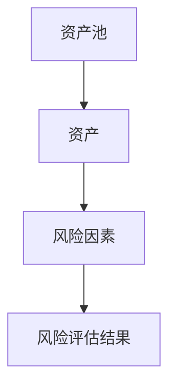
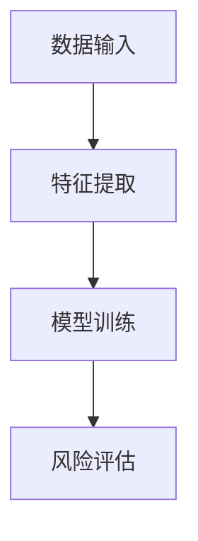
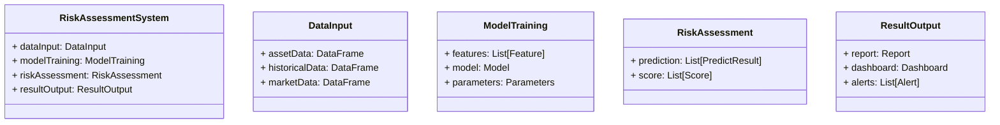
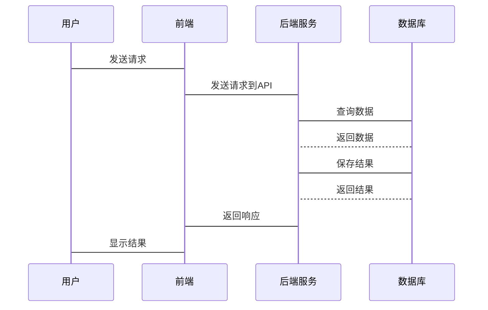

                 


# 构建智能化的资产证券化风险评估模型

## 关键词：
资产证券化、风险评估、机器学习、XGBoost、系统架构

## 摘要：
本文详细介绍了如何构建智能化的资产证券化风险评估模型。首先，从资产证券化的背景和风险类型入手，分析了风险评估模型的核心概念与联系。接着，讲解了机器学习算法在风险评估中的应用，特别是XGBoost算法的实现和优化。随后，设计了系统的架构，包括功能设计、接口设计和系统交互流程。最后，通过项目实战展示了模型的构建过程，并总结了最佳实践和优化技巧。本文适合金融从业者、数据科学家和技术爱好者阅读，帮助他们理解如何利用技术手段提升资产证券化的风险管理能力。

---

## 目录

### 第1章: 资产证券化与风险评估模型的背景介绍

#### 1.1 资产证券化的定义与运作机制
- 1.1.1 资产证券化的定义
- 1.1.2 资产证券化的运作流程
- 1.1.3 资产证券化的核心要素

#### 1.2 资产证券化中的风险类型
- 1.2.1 信用风险
- 1.2.2 市场风险
- 1.2.3 操作风险

#### 1.3 风险评估模型的定义与作用
- 1.3.1 风险评估模型的定义
- 1.3.2 风险评估模型的作用
- 1.3.3 模型的边界与外延

#### 1.4 资产证券化风险评估的核心要素
- 1.4.1 资产池的特征分析
- 1.4.2 信用评级的影响
- 1.4.3 市场波动的关联性

#### 1.5 本章小结

### 第2章: 资产证券化风险评估模型的核心概念与联系

#### 2.1 风险评估模型的核心原理
- 2.1.1 风险评估的数学模型
- 2.1.2 模型的输入与输出
- 2.1.3 模型的训练与优化

#### 2.2 核心概念的属性特征对比
- 2.2.1 资产池特征对比
- 2.2.2 信用评级特征对比
- 2.2.3 市场波动特征对比

#### 2.3 ER实体关系图架构


### 第3章: 资产证券化风险评估模型的算法原理讲解

#### 3.1 算法原理概述
- 3.1.1 机器学习在风险评估中的应用
- 3.1.2 常见算法的优缺点对比

#### 3.2 算法流程图


#### 3.3 算法实现代码
```python
import pandas as pd
import numpy as np
from sklearn.model_selection import train_test_split
import xgboost as xgb

# 数据准备
data = pd.read_csv('asset_data.csv')
X = data.drop('risk', axis=1)
y = data['risk']

# 分割数据集
X_train, X_test, y_train, y_test = train_test_split(X, y, test_size=0.2, random_state=42)

# 模型训练
dtrain = xgb.DMatrix(X_train, label=y_train)
dtest = xgb.DMatrix(X_test, label=y_test)

params = {
    'objective': 'binary:logistic',
    'learning_rate': 0.05,
    'max_depth': 6,
    'n_estimators': 100
}

model = xgb.train(params, dtrain, num_boost_round=100)

# 预测
y_pred = model.predict(dtest)

# 评估
from sklearn.metrics import accuracy_score, precision_score, recall_score, f1_score

print(f'Accuracy: {accuracy_score(y_test, y_pred)}')
print(f'Precision: {precision_score(y_test, y_pred)}')
print(f'Recall: {recall_score(y_test, y_pred)}')
print(f'F1 Score: {f1_score(y_test, y_pred)}')
```

#### 3.4 算法的数学模型和公式
- 损失函数：对数损失函数、平方损失函数、hinge损失函数
- 提升树的构建：基值、残差、决策树
- 预测函数：$$\hat{y}_i = \sum_{k=1}^{n} \gamma_{k} h(x_i, \theta_k)$$
- 优化目标：$$\text{目标函数} = \sum_{i=1}^{n} \text{损失函数}(y_i, \hat{y}_i) + \lambda \sum_{k=1}^{n} \gamma_k^2$$

#### 3.5 本章小结

### 第4章: 资产证券化风险评估模型的系统架构设计

#### 4.1 系统功能设计


#### 4.2 系统架构设计


#### 4.3 系统接口设计


#### 4.4 系统架构实现代码
```python
from flask import Flask, request, jsonify
import pickle
import pandas as pd

app = Flask(__name__)

# 加载模型
model = pickle.load(open('risk_assessment_model.pkl', 'rb'))

@app.route('/api/predict', methods=['POST'])
def predict():
    data = request.json
    df = pd.DataFrame(data)
    predictions = model.predict(df)
    return jsonify({'predictions': predictions.tolist()})

if __name__ == '__main__':
    app.run(debug=True)
```

#### 4.5 系统架构最佳实践
- 微服务架构
- 容器化技术（Docker）
- 持续集成与部署

#### 4.6 本章小结

### 第5章: 资产证券化风险评估模型的项目实战

#### 5.1 项目介绍
- 项目目标
- 项目范围
- 项目团队

#### 5.2 数据准备与清洗
- 数据收集
- 数据清洗
- 数据预处理

#### 5.3 模型训练与优化
- 特征工程
- 模型选择
- 超参数调优

#### 5.4 系统实现与部署
- API接口设计
- 前端开发
- 后端服务部署

#### 5.5 案例分析与结果解读
- 实际案例
- 预测结果
- 结果分析

#### 5.6 本章小结

### 第6章: 资产证券化风险评估模型的最佳实践与优化

#### 6.1 模型优化技巧
- 特征工程
- 超参数调优
- 模型集成

#### 6.2 系统优化建议
- 系统架构优化
- 数据处理优化
- 模型部署优化

#### 6.3 风险控制策略
- 监控系统
- 风险预警
- 定期评估

#### 6.4 拓展阅读
- 推荐书籍
- 推荐论文
- 推荐博客

#### 6.5 本章小结

### 第7章: 总结与展望

#### 7.1 本项目的核心总结
- 核心内容总结
- 技术要点总结
- 实践经验总结

#### 7.2 对未来发展的展望
- 技术发展
- 应用领域拓展
- 挑战与机遇

#### 7.3 个人见解与思考
- 个人观点
- 对未来的展望

#### 7.4 本章小结

### 参考文献
- 《机器学习实战》
- 《深入理解XGBoost》
- 《资产证券化与风险管理》

---

以上是《构建智能化的资产证券化风险评估模型》的完整目录和部分内容概览。通过系统地介绍资产证券化风险评估模型的构建过程，从理论到实践，从算法到系统架构，再到项目实战和优化，读者可以全面掌握如何利用技术手段提升资产证券化的风险管理能力。

