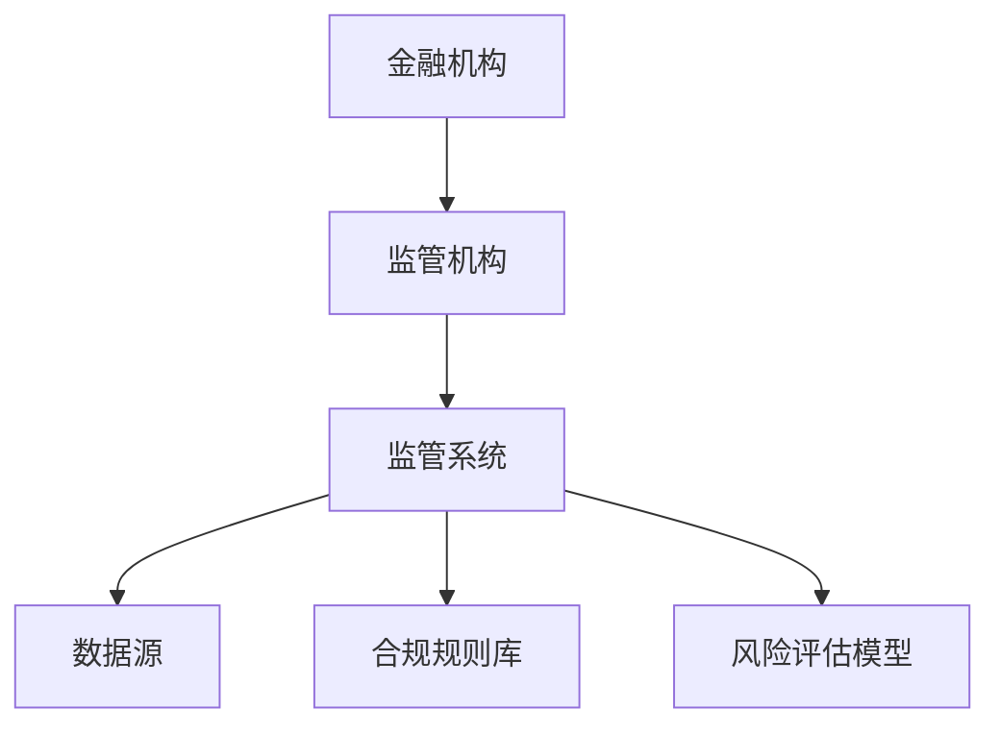
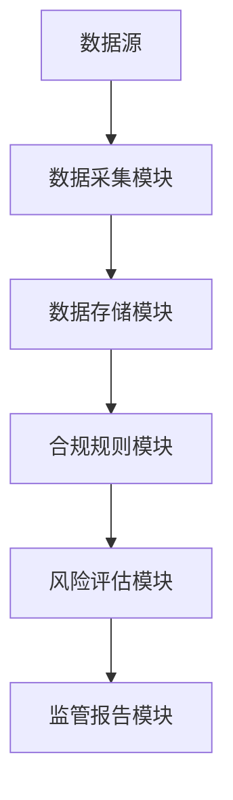

                 


# 构建智能化的金融监管合规系统

> 关键词：智能化、金融监管、合规系统、AI大模型、RegTech、监管科技

> 摘要：随着金融市场的快速发展，传统的监管方式已经难以应对日益复杂的合规要求。通过引入人工智能技术，特别是大语言模型（LLM），构建智能化的金融监管合规系统成为趋势。本文从系统架构、算法原理、项目实战等角度，详细阐述如何利用AI技术提升金融监管的效率与准确性，打造智能化的监管合规体系。

---

# 第一部分: 金融监管合规系统背景与需求

## 第1章: 金融监管的现状与挑战

### 1.1 传统金融监管的痛点

传统的金融监管方式依赖人工审核和静态规则，存在以下主要问题：

- **低效性**：人工处理大量金融数据耗时长、成本高。
- **信息孤岛**：不同机构和系统之间的数据难以互联互通。
- **规则僵化**：静态规则难以适应金融市场的动态变化。
- **风险滞后**：传统监管往往事后发现风险，难以实时预警。

### 1.2 金融监管智能化的必要性

随着金融市场复杂性增加，智能化监管成为必然选择：

- **技术驱动**：AI、大数据等技术为监管创新提供了新工具。
- **效率提升**：智能化系统能够快速处理海量数据，实时监控风险。
- **精准监管**：通过AI分析，监管机构可以实现精准执法，降低误判率。

### 1.3 合规系统的建设目标

构建智能化金融监管合规系统的三大目标：

1. **提升监管效率**：通过自动化处理减少人工干预，提高处理速度。
2. **降低合规成本**：优化流程，减少金融机构的合规支出。
3. **增强风险预警**：通过AI分析提前识别潜在风险，防患于未然。

---

## 第2章: 金融监管合规系统的核心要素

### 2.1 金融监管的核心概念

- **金融监管**：指对金融机构和市场的行为进行监督和管理，确保市场稳定运行。
- **合规性评估**：通过检查金融机构是否遵守相关法律法规，评估其合规性。
- **监管数据**：包括金融机构的交易数据、财务报表、业务流程等。

### 2.2 金融监管合规系统的属性特征对比

| 属性 | 特征 |
|------|------|
| 数据来源 | 结构化数据（如交易记录）、非结构化数据（如文档、报告） |
| 处理方式 | 实时处理（动态监控）、批次处理（定期分析） |
| 监管范围 | 全面监管（覆盖所有业务） vs 重点监管（聚焦高风险领域） |

### 2.3 实体关系图

以下为金融监管合规系统的实体关系图：



---

## 第3章: 金融监管合规系统的边界与外延

### 3.1 系统边界

- **数据采集**：仅采集与合规相关的数据，避免过多冗余信息。
- **监管对象**：主要针对金融机构及其业务行为，不涉及个人隐私数据。
- **系统功能**：聚焦于合规评估、风险预警和监管报告，不包括其他辅助功能。

### 3.2 核心概念的外延

- **监管数据**：包括实时交易数据、历史数据、市场数据等。
- **合规规则**：涵盖法律法规、行业标准、内部政策等多个层面。
- **风险评估**：不仅包括单一风险，还考虑系统性风险。

### 3.3 核心要素组成

- **数据层**：数据采集、清洗和存储。
- **规则层**：合规规则的定义、更新和执行。
- **模型层**：风险评估模型的构建、训练和部署。

---

# 第二部分: 智能化金融监管合规系统的构建

## 第4章: AI大模型在金融监管中的应用

### 4.1 AI大模型的技术原理

AI大模型（如GPT）通过深度学习技术，从海量数据中学习语言规律，能够理解和生成自然语言文本。其技术优势包括：

- **自然语言处理（NLP）**：能够理解金融领域的复杂文本，如合同、报告等。
- **知识图谱**：构建金融领域的知识网络，帮助识别关联关系。
- **上下文理解**：能够捕捉文本中的上下文信息，提高分析准确性。

### 4.2 AI大模型在金融监管中的应用场景

#### 4.2.1 文本分析与风险预警

- **合同审查**：通过NLP分析合同条款，识别潜在法律风险。
- **新闻 sentiment 分析**：实时监测市场情绪，预警潜在风险。

#### 4.2.2 实体识别与关联分析

- **识别非法关联交易**：通过实体识别技术，发现关联方交易中的异常行为。
- **构建知识图谱**：将金融机构、交易行为、法律条文等信息关联起来，便于风险分析。

#### 4.2.3 自动化合规报告生成

- **自动生成合规报告**：基于AI分析结果，自动生成合规报告，减少人工劳动。
- **动态更新规则**：根据市场变化，自动调整合规规则。

### 4.3 AI大模型的优劣势分析

- **优势**：
  - 高准确性：通过大量数据训练，模型能够识别复杂的模式。
  - 高效率：自动化处理能力显著提升监管效率。
- **劣势**：
  - 数据依赖：模型性能高度依赖训练数据的质量和数量。
  - 黑箱问题：模型决策过程难以解释，增加了监管的透明度挑战。

---

## 第5章: 金融监管合规系统的架构设计

### 5.1 系统核心模块

- **数据采集模块**：负责采集金融机构的交易数据、财务报表等。
- **合规规则模块**：存储和管理相关法律法规和合规规则。
- **风险评估模块**：基于AI模型，评估潜在风险并生成预警信息。
- **监管报告模块**：生成监管报告，记录监管过程和结果。

### 5.2 系统架构设计

以下是系统的总体架构图：



### 5.3 交互流程

监管流程的详细步骤如下：

1. **数据采集**：从金融机构获取交易数据、财务报表等。
2. **数据存储**：将采集到的数据存储到数据库中。
3. **规则匹配**：将数据与合规规则进行匹配，识别异常行为。
4. **风险评估**：基于AI模型，评估潜在风险并生成预警信息。
5. **生成报告**：根据评估结果，生成监管报告并发送给监管机构。

---

## 第6章: 项目实战——构建智能化合规监控系统

### 6.1 项目背景

随着金融市场的复杂化，监管机构需要一种高效的合规监控系统，能够实时监控金融机构的交易行为，识别潜在风险。

### 6.2 系统核心实现

#### 6.2.1 环境安装

- **Python版本**：Python 3.8+
- **依赖库**：Pandas、NumPy、Scikit-learn、TensorFlow、PyTorch
- **开发工具**：Jupyter Notebook、VS Code

#### 6.2.2 核心代码实现

以下是系统的核心代码示例：

```python
import pandas as pd
from sklearn.model import LinearSVC
from sklearn.feature import TfidfVectorizer

# 数据加载
data = pd.read_csv('financial_data.csv')

# 特征提取
vectorizer = TfidfVectorizer()
X = vectorizer.fit_transform(data['text'])

# 模型训练
model = LinearSVC()
model.fit(X, data['label'])

# 预测
test_data = pd.read_csv('test_data.csv')
X_test = vectorizer.transform(test_data['text'])
predictions = model.predict(X_test)
```

#### 6.2.3 代码应用解读

- **数据加载**：读取金融机构的交易数据。
- **特征提取**：使用TF-IDF提取文本特征。
- **模型训练**：训练分类模型，识别合规风险。
- **预测**：对测试数据进行预测，生成预警信息。

### 6.3 案例分析

以某银行的交易数据为例，系统能够识别出异常交易行为，提前预警潜在的洗钱风险。

### 6.4 项目小结

通过构建智能化合规监控系统，监管机构能够实时监控金融机构的交易行为，提升监管效率和准确性。

---

## 第7章: 优化与安全

### 7.1 模型优化

- **优化方法**：使用网格搜索（Grid Search）优化模型参数。
- **性能提升**：通过并行计算加速模型训练。

### 7.2 系统安全性

- **数据加密**：对敏感数据进行加密处理。
- **访问控制**：采用多级权限管理，确保数据安全。

### 7.3 合规性评估

- **评估指标**：准确率、召回率、F1值。
- **合规报告**：详细记录监管过程，确保透明性和可追溯性。

---

## 第8章: 总结与展望

### 8.1 总结

智能化的金融监管合规系统通过引入AI技术，显著提升了监管效率和准确性。系统架构设计合理，功能模块清晰，能够满足金融机构的合规需求。

### 8.2 展望

未来的智能化监管将朝着以下方向发展：

1. **智能化升级**：进一步优化AI模型，提升监管的精准度。
2. **数据共享**：推动金融机构之间的数据互联互通，构建更高效的监管网络。
3. **技术创新**：探索区块链、边缘计算等新技术，进一步提升监管能力。

---

# 结语

构建智能化的金融监管合规系统是一项复杂的系统工程，需要技术、业务和管理的深度结合。通过本文的详细阐述，希望能够为监管机构和金融机构提供有益的参考，推动金融监管的智能化转型，实现更高效、更精准的监管目标。

