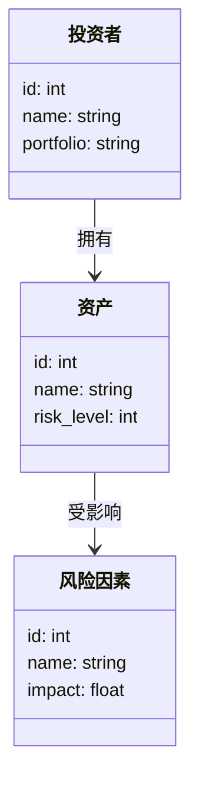
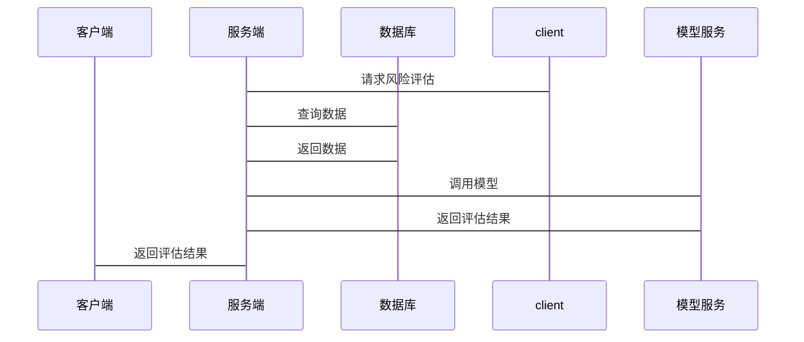

                 


# 构建精准的投资风险评估模型

> 关键词：投资风险评估模型、金融数据分析、机器学习算法、风险管理、精准预测

> 摘要：本文将详细介绍如何构建一个精准的投资风险评估模型，从背景分析到算法实现，从系统架构到项目实战，全面解析投资风险评估的核心概念、方法和实践技巧。通过本文的学习，读者可以掌握如何利用数据分析和机器学习技术，精准评估投资风险，优化投资决策。

---

## 第三章: 投资风险评估模型的算法原理

### 3.3 算法实现与数学模型

#### 3.3.1 算法流程与代码实现

##### 数据预处理与特征选择
在进行模型训练之前，首先需要对数据进行预处理。这一步骤包括数据清洗、标准化处理以及特征选择。

```python
import pandas as pd
import numpy as np
from sklearn.preprocessing import StandardScaler

# 加载数据
data = pd.read_csv('investment_data.csv')

# 删除缺失值
data.dropna(inplace=True)

# 标准化处理
scaler = StandardScaler()
data_normalized = scaler.fit_transform(data)

# 特征选择（基于特征重要性）
from sklearn.ensemble import RandomForestRegressor
model = RandomForestRegressor()
model.fit(data_normalized, target)
importances = model.feature_importances_
selected_features = data.columns[importances > np.quantile(importances, 0.75)]
```

##### 模型训练与优化

```python
from sklearn.model_selection import train_test_split
from sklearn.metrics import mean_squared_error

# 数据划分
X_train, X_test, y_train, y_test = train_test_split(data_normalized, target, test_size=0.2)

# 模型训练
from sklearn.ensemble import GradientBoostingRegressor
model = GradientBoostingRegressor(n_estimators=100, learning_rate=0.1, max_depth=3)
model.fit(X_train, y_train)

# 模型预测与评估
y_pred = model.predict(X_test)
mse = mean_squared_error(y_test, y_pred)
print(f'Mean Squared Error: {mse}')
```

##### 模型调优与评估

```python
from sklearn.model_selection import GridSearchCV

# 参数调优
param_grid = {
    'n_estimators': [50, 100, 150],
    'learning_rate': [0.1, 0.05, 0.01],
    'max_depth': [2, 3, 4]
}

grid_search = GridSearchCV(estimator=model, param_grid=param_grid, cv=5)
grid_search.fit(X_train, y_train)
best_model = grid_search.best_estimator_
print(f'Best Parameters: {grid_search.best_params_}')
```

#### 3.3.2 数学模型与公式推导

##### 风险价值（VaR）计算公式

$$
\text{VaR}(\alpha) = \min\{R | P(R \leq R_{\alpha}) \geq \alpha\}
$$

其中，$\alpha$ 是置信水平，$R$ 是可能的收益或损失。

##### 信用风险模型（如Merton模型）的核心公式

$$
P(K, T, r) = S_0 N(d_1) + K e^{-rT} N(d_2)
$$

其中，
$$
d_1 = \frac{\ln\left(\frac{S_0}{K}\right) + \left(r + \frac{\sigma^2}{2}\right)T}{\sigma \sqrt{T}}
$$
$$
d_2 = d_1 - \sigma \sqrt{T}
$$

---

## 第四章: 系统分析与架构设计方案

### 4.1 项目背景与目标

#### 4.1.1 项目背景
- 随着金融市场的复杂化，投资风险的评估需要更加精准和自动化。
- 通过构建模型，可以帮助投资者做出科学的投资决策。

#### 4.1.2 项目目标
- 实现一个基于机器学习的投资风险评估系统。
- 提供实时风险评估和风险预警功能。

### 4.2 系统功能设计

#### 4.2.1 领域模型



#### 4.2.2 系统架构设计


#### 4.2.3 接口设计与交互流程



---

## 第五章: 项目实战与实现

### 5.1 环境搭建与数据准备

#### 5.1.1 环境安装

```bash
pip install pandas numpy scikit-learn matplotlib
```

#### 5.1.2 数据准备

```python
import pandas as pd
import numpy as np

# 生成模拟数据
data = {
    '资产名称': ['资产1', '资产2', '资产3', '资产4'],
    '收益率': [0.05, 0.03, 0.07, 0.02],
    '波动率': [0.1, 0.15, 0.08, 0.12],
    '行业风险': [0.2, 0.3, 0.1, 0.4]
}
df = pd.DataFrame(data)
```

### 5.2 核心代码实现

#### 5.2.1 数据分析与可视化

```python
import matplotlib.pyplot as plt

# 绘制资产收益率分布图
plt.hist(df['收益率'], bins=5, alpha=0.7)
plt.title('资产收益率分布')
plt.xlabel('收益率')
plt.ylabel('频数')
plt.show()
```

#### 5.2.2 模型训练与评估

```python
from sklearn.ensemble import RandomForestRegressor
from sklearn.metrics import mean_squared_error

# 数据划分
X = df[['收益率', '波动率', '行业风险']]
y = df['总风险评分']

from sklearn.model_selection import train_test_split
X_train, X_test, y_train, y_test = train_test_split(X, y, test_size=0.2)

# 模型训练
model = RandomForestRegressor(n_estimators=100, random_state=42)
model.fit(X_train, y_train)

# 模型预测
y_pred = model.predict(X_test)
print('均方误差:', mean_squared_error(y_test, y_pred))
```

### 5.3 实际案例分析与解读

#### 5.3.1 案例分析

假设我们有一个包含多个资产的投资组合，我们需要评估其整体风险。

```python
# 示例投资组合
portfolio = pd.DataFrame({
    '资产名称': ['资产1', '资产2', '资产3'],
    '权重': [0.4, 0.3, 0.3]
})

# 计算组合风险
portfolio_risk = model.predict(portfolio.merge(X, on='资产名称')[['权重', '收益率', '波动率', '行业风险']])
print('组合风险:', portfolio_risk.mean())
```

---

## 第六章: 最佳实践与总结

### 6.1 小结与收获

通过构建投资风险评估模型，我们掌握了以下关键点：
- 数据预处理与特征选择的重要性
- 机器学习算法在金融领域的应用
- 系统架构设计与实现的流程

### 6.2 注意事项与建议

- 数据质量是模型准确性的基础，需谨慎处理缺失值和异常值。
- 模型调优需要结合业务背景，避免过拟合。
- 风险评估结果需与实际投资策略结合，才能发挥最大价值。

### 6.3 拓展阅读与学习方向

- 深入学习其他风险评估模型（如蒙特卡洛模拟）。
- 研究金融市场实时数据的获取与处理。
- 探索更复杂的深度学习模型在风险评估中的应用。

---

## 附录: 参考文献与工具

- 《Python机器学习实战》
- scikit-learn官方文档
- pandas与numpy官方文档
- 《投资学基础》

---

通过本文的详细讲解，读者可以系统地掌握构建精准投资风险评估模型的方法和技巧，从理论到实践，从算法到系统设计，全面了解投资风险管理的核心内容。

