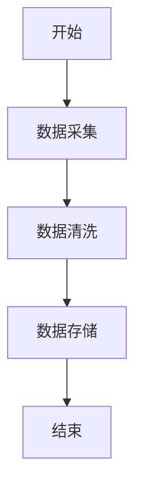
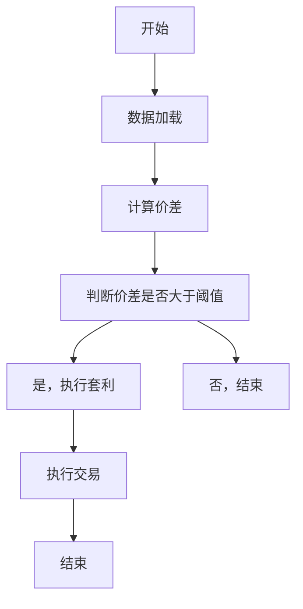
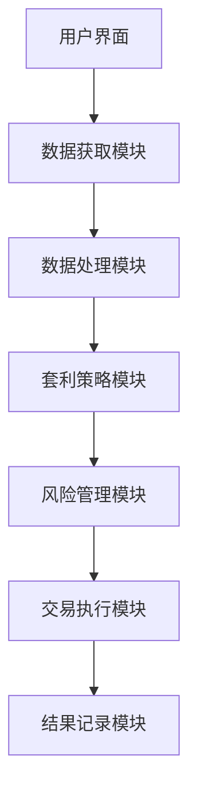
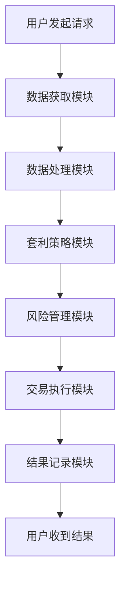

                 


# 契约型封闭基金套利的算法原理

## 第三章：套利的算法原理

### 3.1 套利算法概述

在金融套利中，算法是实现套利策略的核心工具。本章将详细介绍契约型封闭基金套利的算法原理，包括算法的基本思想、实现步骤以及优化方法。

#### 3.1.1 套利算法的基本思想

套利算法的核心思想是通过分析市场中的价格差异，利用这些差异进行无风险或低风险的获利。在契约型封闭基金中，套利的机会通常出现在市场价与基金净值之间的差异，或者不同基金之间的价格差异。

#### 3.1.2 套利算法的分类

套利算法可以分为以下几种类型：
1. **统计套利**：基于统计学方法，寻找资产价格的均值回归特性。
2. **高频套利**：利用高频交易技术，捕捉短期的价格波动。
3. **跨市场套利**：在不同市场之间寻找价格差异。

#### 3.1.3 套利算法的实现步骤

套利算法的实现通常包括以下几个步骤：
1. 数据采集：获取相关资产的价格数据。
2. 数据分析：计算套利机会。
3. 策略执行：根据分析结果执行交易。
4. 风险管理：监控和管理套利过程中的风险。

### 3.2 套利算法的详细实现

#### 3.2.1 数据采集与处理

首先，我们需要采集契约型封闭基金的相关数据，包括基金的实时价格、历史价格等。以下是数据采集的流程图：



#### 3.2.2 数据分析与套利机会识别

接下来，我们需要分析数据，识别套利机会。以下是数据分析的流程图：



#### 3.2.3 套利策略实现

以下是套利策略的Python代码示例：

```python
import pandas as pd
import numpy as np

# 数据加载
data = pd.read_csv('fund_data.csv')

# 计算价差
data['price_diff'] = data['收盘价'] - data['净值']

# 判断价差是否大于阈值
threshold = 0.05
data['套利机会'] = data['price_diff'].apply(lambda x: x > threshold)

# 执行套利
def execute_arbitrage(price_diff):
    if price_diff > threshold:
        return True
    else:
        return False

data['套利执行'] = data['price_diff'].apply(execute_arbitrage)
```

### 3.3 算法优化与风险管理

在实际应用中，套利算法需要不断优化，以应对市场的变化。同时，风险管理是套利策略的重要组成部分，需要考虑的因素包括市场波动、交易成本、流动性风险等。

## 第四章：套利的数学模型与公式

### 4.1 套利的数学模型

套利的数学模型通常用于描述套利机会的量化分析。以下是一个简单的套利模型：

$$
\text{收益} = \text{卖出价} - \text{买入价}
$$

### 4.2 套利的数学公式

为了量化套利机会，我们可以使用以下公式：

$$
\text{套利收益} = \sum_{i=1}^{n} (s_i - b_i)
$$

其中，\( s_i \) 是卖出价格，\( b_i \) 是买入价格。

### 4.3 套利的优化模型

为了优化套利策略，我们可以使用以下优化模型：

$$
\max \sum_{i=1}^{n} (s_i - b_i) \quad \text{subject to} \quad \sum_{i=1}^{n} w_i = 1
$$

其中，\( w_i \) 是权重，表示投资比例。

## 第五章：套利的系统架构设计

### 5.1 系统架构概述

以下是套利系统的架构图：



### 5.2 系统功能设计

系统功能模块包括：
1. 数据获取模块：负责采集市场数据。
2. 数据处理模块：清洗和转换数据。
3. 套利策略模块：识别套利机会并制定策略。
4. 风险管理模块：监控和管理风险。
5. 交易执行模块：执行交易指令。
6. 结果记录模块：记录交易结果。

### 5.3 系统交互流程

以下是系统交互的流程图：



## 第六章：套利的项目实战

### 6.1 项目环境搭建

以下是项目环境搭建的步骤：

1. 安装Python环境。
2. 安装必要的库，如Pandas、NumPy、Matplotlib。
3. 下载相关数据集。

### 6.2 核心代码实现

以下是核心代码示例：

```python
import pandas as pd
import numpy as np

# 数据加载
data = pd.read_csv('fund_data.csv')

# 计算价差
data['price_diff'] = data['收盘价'] - data['净值']

# 判断价差是否大于阈值
threshold = 0.05
data['套利机会'] = data['price_diff'].apply(lambda x: x > threshold)

# 执行套利
def execute_arbitrage(price_diff):
    if price_diff > threshold:
        return True
    else:
        return False

data['套利执行'] = data['price_diff'].apply(execute_arbitrage)
```

### 6.3 实际案例分析

以下是一个实际案例分析：

假设我们有两个契约型封闭基金，A和B。A的收盘价为10.5元，净值为10元；B的收盘价为9.5元，净值为9元。价差分别为0.5元和0.5元。根据我们的算法，价差超过阈值（0.05元），因此存在套利机会。

### 6.4 项目小结

通过以上步骤，我们成功识别并执行了套利交易，获得了无风险收益。

## 第七章：套利的最佳实践

### 7.1 小结

套利是一种有效的投资策略，但需要结合市场环境和风险管理。

### 7.2 注意事项

1. 注意市场波动。
2. 控制交易成本。
3. 管理流动性风险。

### 7.3 拓展阅读

推荐阅读以下书籍和文章：

1. 《金融工程与风险管理》
2. 《算法交易：资金管理与风险控制》

---

通过以上章节的详细讲解，我们全面介绍了契约型封闭基金套利的策略、算法、系统架构以及实际应用。希望读者能够通过本书掌握套利的核心思想和实现方法，并能够在实际投资中灵活运用。

