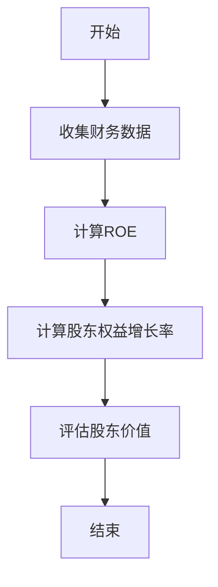
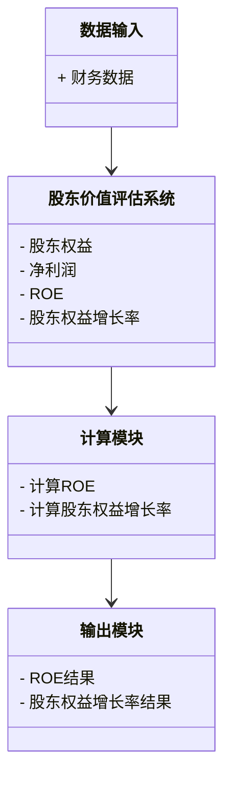
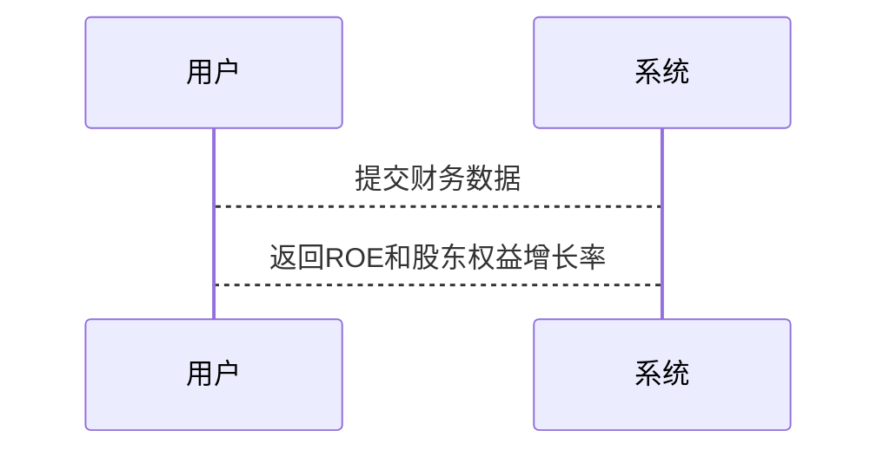

                 


```markdown
# 查尔斯·布兰登的所有者盈利：股东视角的价值评估

> 关键词：股东价值、所有者盈利、财务分析、公司治理、ROE、EPS、股东权益

> 摘要：本文从股东视角出发，详细分析了所有者盈利的核心概念、财务指标和评估方法。通过数学模型和系统架构的设计，探讨了如何从技术角度实现股东价值的最大化。结合实际案例，提供了详细的项目实现和最佳实践建议。

---

## 第一部分: 所有者盈利的背景与概念

### 第1章: 所有者盈利的基本概念

#### 1.1 问题背景与描述
- 1.1.1 企业盈利的核心问题
  - 企业的盈利是生存和发展的基础。
  - 股东作为所有者，关注的是投资回报。
  - 盈利的可持续性是股东价值的关键。

- 1.1.2 股东视角的独特性
  - 股东是企业财务的主要受益者。
  - 股东权益的增减直接反映企业的盈利状况。
  - 股东关注的不仅是利润，还包括风险和回报的平衡。

- 1.1.3 所有者盈利的边界与外延
  - 盈利的边界：股东权益的增长与企业风险的平衡。
  - 盈利的外延：从短期盈利到长期价值的构建。

#### 1.2 核心概念与要素
- 1.2.1 所有者盈利的定义
  - 所有者盈利：企业在一定时期内为股东创造的净收益。
  - 包括净利润、股东权益的增加和分红等。

- 1.2.2 盈利能力的核心要素
  - 净利润：企业的最终盈利指标。
  - 股东权益：企业的净资产价值。
  - 股东分红：利润分配给股东的方式。

- 1.2.3 股东权益与企业价值的关系
  - 股东权益是企业价值的重要组成部分。
  - 股东权益的增长反映了企业的盈利能力和资本积累。

### 第2章: 股东视角的财务分析

#### 2.1 财务报表基础
- 2.1.1 利润表分析
  - 收入与成本：利润的来源和构成。
  - 净利润：企业最终的盈利结果。

- 2.1.2 资产负债表解读
  - 资产与负债：企业的财务健康状况。
  - 股东权益：净资产的价值。

- 2.1.3 现金流量表的重要性
  - 现金流入与流出：企业的流动性管理。
  - 现金流量与股东权益的关系。

#### 2.2 股东权益的关键指标
- 2.2.1 净资产收益率（ROE）
  - 公式：$$ ROE = \frac{净利润}{股东权益} $$
  - 指标解读：ROE越高，股东权益的回报率越高。

- 2.2.2 每股收益（EPS）
  - 公式：$$ EPS = \frac{净利润}{普通股股数} $$
  - 指标解读：EPS反映了每股的盈利能力。

- 2.2.3 股东权益增长率
  - 公式：$$ 股东权益增长率 = \frac{期末股东权益 - 期初股东权益}{期初股东权益} \times 100\% $$
  - 指标解读：增长率为正，说明股东权益在增加。

### 第3章: 公司治理与股东权益

#### 3.1 公司治理结构
- 3.1.1 股东、董事会与管理层的关系
  - 股东是所有者，董事会是决策层，管理层是执行层。
  - 股东通过董事会影响管理层的决策。

- 3.1.2 股东权利与义务
  - 股东权利：投票权、分红权、剩余资产分配权。
  - 股东义务：遵守公司章程，承担有限责任。

- 3.1.3 股东大会的作用
  - 股东大会是最高权力机构。
  - 审议和决策重大事项，如利润分配、资本增加等。

#### 3.2 股权结构与控制权
- 3.2.1 股权分配的常见模式
  - 集中型：控股股东占多数股权。
  - 分散型：无单一控股股东。

- 3.2.2 控股股东与中小股东的平衡
  - 控股股东的责任：维护中小股东利益。
  - 中小股东的权益保护：通过法律和制度保障。

- 3.2.3 股权激励机制
  - 激励对象：董事、高管和核心员工。
  - 激励方式：股票期权、限制性股票等。

---

## 第二部分: 股东价值评估的数学模型

### 第4章: 股东价值评估的数学模型

#### 4.1 股东价值的基本公式
- $$ 股东价值 = 股东权益 - 股东债务 $$
  - 股东权益：企业的净资产。
  - 股东债务：股东承担的债务。

#### 4.2 净资产收益率（ROE）模型
- $$ ROE = \frac{净利润}{股东权益} $$
  - ROE越高，股东权益的回报率越高。

#### 4.3 股东权益增长率模型
- $$ 股东权益增长率 = \frac{期末股东权益 - 期初股东权益}{期初股东权益} \times 100\% $$
  - 正增长：股东权益增加。
  - 负增长：股东权益减少。

### 第5章: 股东价值评估的算法原理

#### 5.1 股东价值评估的流程图


#### 5.2 净资产收益率（ROE）算法
```python
def calculate_roe(net_profit, equity):
    return net_profit / equity

# 示例
net_profit = 1000000  # 净利润
equity = 5000000      # 股东权益
roe = calculate_roe(net_profit, equity)
print(f"ROE = {roe:.2f}")
```

#### 5.3 股东权益增长率算法
```python
def calculate_equity_growth(ending_equity, beginning_equity):
    return ((ending_equity - beginning_equity) / beginning_equity) * 100

# 示例
beginning_equity = 4000000  # 期初股东权益
ending_equity = 5000000     # 期末股东权益
growth_rate = calculate_equity_growth(ending_equity, beginning_equity)
print(f"股东权益增长率 = {growth_rate:.2f}%")
```

---

## 第三部分: 系统分析与架构设计方案

### 第6章: 系统分析与架构设计

#### 6.1 问题场景介绍
- 系统目标：实现股东价值评估的自动化。
- 适用场景：企业财务分析、投资决策支持。

#### 6.2 系统功能设计


#### 6.3 系统架构设计


#### 6.4 系统接口设计
- 输入接口：接收财务数据。
- 输出接口：返回ROE和股东权益增长率。

#### 6.5 系统交互流程


---

## 第四部分: 项目实战

### 第7章: 项目实战

#### 7.1 环境安装
- 安装Python和必要的库（pandas、numpy）。

#### 7.2 核心代码实现
```python
import pandas as pd

# 示例数据
data = {
    '净利润': [1000000],
    '股东权益': [5000000]
}

df = pd.DataFrame(data)

# 计算ROE
roe = df['净利润'] / df['股东权益']

# 计算股东权益增长率（假设期初权益为4000000）
growth_rate = (5000000 - 4000000) / 4000000 * 100

print(f"ROE = {roe.iloc[0]:.2f}")
print(f"股东权益增长率 = {growth_rate:.2f}%")
```

#### 7.3 案例分析
- 案例：某公司净利润100万元，股东权益500万元，期初股东权益400万元。
- 计算结果：ROE=20%，股东权益增长率=25%。

---

## 第五部分: 最佳实践与小结

### 第8章: 最佳实践

#### 8.1 小结
- 股东盈利的核心是ROE和股东权益增长率。
- 通过系统架构设计，可以实现自动化评估。

#### 8.2 注意事项
- 数据的准确性和完整性。
- 模型的适用性和局限性。

#### 8.3 拓展阅读
- 《财务报表分析》
- 《公司治理》
- 《股东价值创造》

---

通过以上步骤，我们可以系统地从股东视角评估企业的盈利能力，并通过技术手段实现自动化分析和优化。
```

