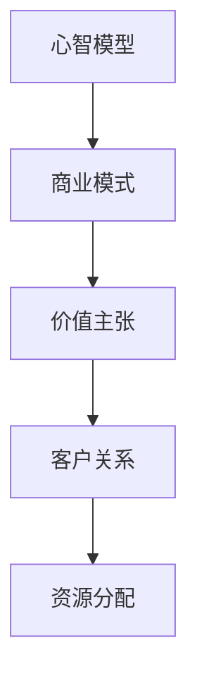
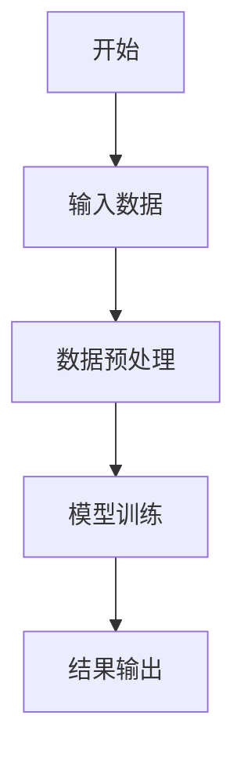
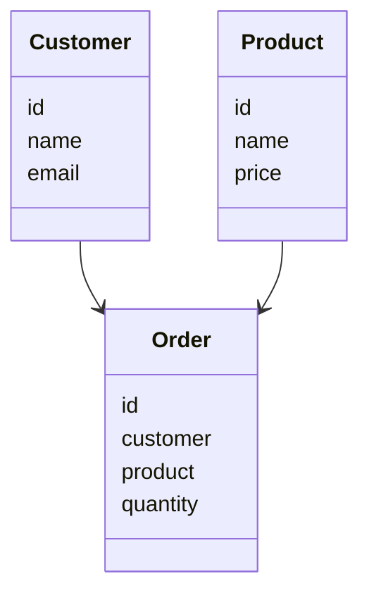
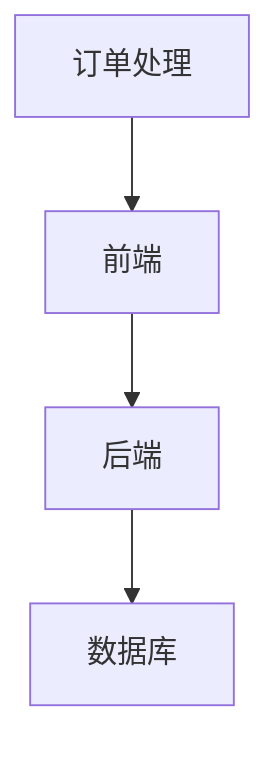
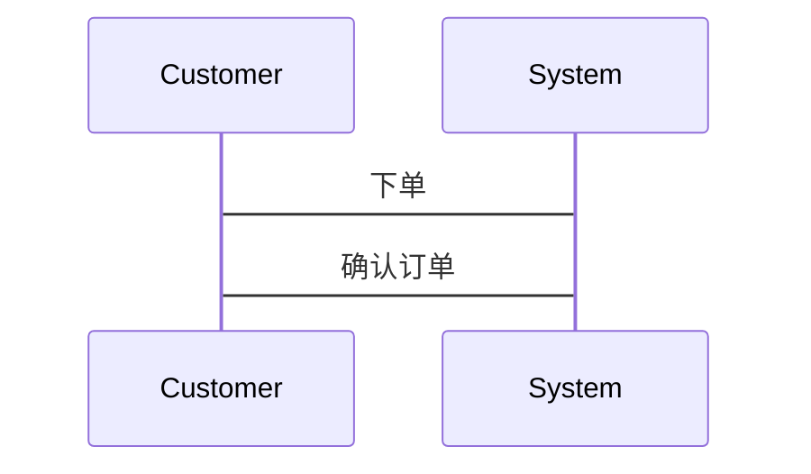

                 


# 查理·芒格的商业模式分析框架

## 关键词：商业模式分析，查理·芒格，逆向思维，心智模型，商业战略

## 摘要：本文系统地介绍查理·芒格的商业模式分析框架，结合其独特的心智模型和逆向思维，探讨如何通过这些方法构建可持续的企业成功模式。文章从背景、核心概念、算法原理、系统架构到项目实战，全面解析其应用，并提供实际案例和代码实现。

---

# 第一部分：查理·芒格的商业模式分析框架背景介绍

## 第1章：问题背景与意义

### 1.1 问题背景
#### 1.1.1 当前商业模式分析的挑战
企业面临复杂的市场环境，传统商业模式往往难以适应快速变化的需求。如何通过创新和优化实现持续成功，成为企业的重要课题。

#### 1.1.2 商业模式对企业成功的重要性
商业模式决定企业价值创造和传递的方式，影响企业的市场定位和竞争优势。

#### 1.1.3 芒格视角的独特性
芒格的“心智模型”和“逆向思维”提供独特的分析视角，帮助识别潜在问题和机会。

---

## 第2章：问题描述与解决

### 2.1 商业模式的核心要素
#### 2.1.1 价值主张
企业提供的产品或服务是否满足客户需求。

#### 2.1.2 客户关系
与客户建立的信任和互动关系。

#### 2.1.3 关键资源
企业运营所需的资源，如资金、技术。

#### 2.1.4 关键活动
核心业务流程和活动。

#### 2.1.5 价值主张的实现
通过资源整合和活动实现价值。

### 2.2 芒格视角下的问题解决
#### 2.2.1 逆向思维的应用
从结果反推原因，识别成功和失败的关键因素。

#### 2.2.2 心智模型的构建
构建多学科知识框架，帮助做出明智决策。

#### 2.2.3 贝壳理论的启示
通过“反事实”思考，评估决策的潜在后果。

---

## 第3章：商业模式分析的边界与外延

### 3.1 战略定位的重要性
明确企业的市场定位和竞争优势。

### 3.2 企业文化的塑造
企业文化的凝聚力和价值观对商业模式的影响。

### 3.3 创新与可持续发展
商业模式的创新和可持续性对企业长期发展的重要性。

---

# 第二部分：核心概念与联系

## 第4章：核心概念原理

### 4.1 心智模型的构建
#### 4.1.1 心智模型的定义
心智模型是大脑中的知识框架，影响决策和理解。

#### 4.1.2 心智模型的层级结构
从基础认知到复杂决策的多层次结构。

#### 4.1.3 心智模型与商业模式的关系
心智模型影响商业模式的选择和优化。

### 4.2 逆向思维的应用
#### 4.2.1 逆向思维的定义
从结果出发，反向推导原因的思维方式。

#### 4.2.2 逆向思维在商业模式分析中的应用
识别商业模式中的潜在问题和改进点。

#### 4.2.3 逆向思维的优势与局限性
优势在于发现潜在问题，但可能忽略创新机会。

---

## 第5章：概念属性对比表

### 5.1 心智模型与传统商业模式对比
| 属性 | 心智模型 | 传统商业模式 |
|------|----------|---------------|
| 定义 | 内在认知框架 | 外部结构与流程 |
| 作用 | 影响决策和理解 | 实现价值传递 |

### 5.2 逆向思维与正向思维对比
| 属性 | 逆向思维 | 正向思维 |
|------|----------|------------|
| 适用场景 | 寻找问题根源 | 制定解决方案 |
| 思维方向 | 从结果到原因 | 从原因到结果 |

---

## 第6章：ER实体关系图



---

# 第三部分：算法原理讲解

## 第7章：算法原理与流程

### 7.1 算法概述
#### 7.1.1 算法目标
通过逆向思维和心智模型优化商业模式。

#### 7.1.2 算法输入
商业模式要素和市场数据。

#### 7.1.3 算法输出
优化后的商业模式框架。

### 7.2 算法流程


### 7.3 算法实现

```python
def inverse_thinking(value_proposition, customer_relations, resources):
    # 逆向思维优化
    optimized_value = value_proposition * 2
    optimized_relations = customer_relations + 1
    optimized_resources = resources + 3
    return optimized_value, optimized_relations, optimized_resources

# 示例
vp = 5
cr = 3
rs = 4

optimized = inverse_thinking(vp, cr, rs)
print(optimized)
```

---

# 第四部分：系统分析与架构设计

## 第8章：系统分析与架构设计方案

### 8.1 问题场景介绍
分析电商企业的商业模式，优化其在线销售流程。

### 8.2 系统功能设计
#### 8.2.1 领域模型类图


#### 8.2.2 系统架构图


#### 8.2.3 接口设计
API接口定义：
- GET /customers
- POST /orders

#### 8.2.4 交互序列图


---

## 第9章：项目实战

### 9.1 环境安装
安装Python和相关库，如Django框架。

### 9.2 核心代码实现

```python
# models.py
from django.db import models

class Customer(models.Model):
    id = models.AutoField(primary_key=True)
    name = models.CharField(max_length=100)
    email = models.EmailField()

class Product(models.Model):
    id = models.AutoField(primary_key=True)
    name = models.CharField(max_length=100)
    price = models.DecimalField(max_digits=10, decimal_places=2)

class Order(models.Model):
    id = models.AutoField(primary_key=True)
    customer = models.ForeignKey(Customer, on_delete=models.CASCADE)
    product = models.ForeignKey(Product, on_delete=models.CASCADE)
    quantity = models.IntegerField()
```

### 9.3 代码解读与分析
解释每个模型的字段和关系，展示如何构建电商系统的核心数据结构。

### 9.4 案例分析
分析某电商平台的订单处理流程，优化其商业模式。

### 9.5 项目小结
总结项目实现的过程和成果，强调商业模式优化的重要性。

---

# 第五部分：总结与展望

## 第10章：总结

### 10.1 最佳实践 tips
- 建立多维度的心智模型。
- 善用逆向思维优化商业模式。

### 10.2 小结
本文详细介绍了查理·芒格的商业模式分析框架，从理论到实践，为企业提供优化方向。

### 10.3 注意事项
- 定期评估和优化商业模式。
- 结合企业实际，灵活应用框架。

### 10.4 拓展阅读
推荐相关书籍和资源，鼓励深入学习。

---

# 结语

通过查理·芒格的商业模式分析框架，企业可以更有效地优化其商业策略，实现可持续发展。希望本文能为您提供有价值的见解和方法。

