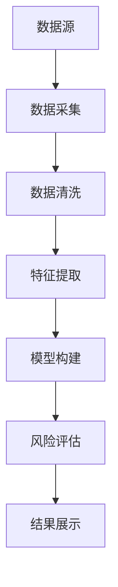

                 


```markdown
# 查理·芒格的多元思维模型在投资中的运用

> 关键词：多元思维模型, 投资分析, 芒格思想, 风险管理, 价值投资

> 摘要：本文系统阐述了查理·芒格的多元思维模型在投资决策中的应用，从基本原理、数学模型、系统架构到实战案例，全面分析了多元思维模型的优势及其在投资中的具体运用。文章通过详细讲解和实例分析，展示了如何利用多元思维模型提升投资分析的深度和广度，帮助投资者做出更明智的决策。

---

## 第三章: 投资的基本原理与数学模型

### 3.1 投资的基本原理

#### 3.1.1 投资的定义与分类
- **投资的定义**: 将资金投入某个项目或资产，期望在未来获得收益或资本增值。
- **投资的分类**: 包括股票、债券、房地产、外汇等多种形式。
- **投资的基本目标**: 实现财富增值，分散风险，追求收益与风险的最佳平衡。

#### 3.1.2 投资的收益与风险
- **收益**: 包括资本增值和分红收益。
- **风险**: 包括市场风险、流动性风险、信用风险等。
- **收益与风险的关系**: 高风险可能带来高收益，但同时也可能带来更大的损失。

#### 3.1.3 投资的基本数学公式
- **预期收益**: $$ E(r) = \sum (P_i \times r_i) $$
  其中，\( P_i \) 是第 \( i \) 种情况发生的概率，\( r_i \) 是第 \( i \) 种情况下的收益。
- **方差与标准差**: 用于衡量资产收益的波动性。
  $$ \sigma = \sqrt{\sum (P_i \times (r_i - E(r))^2)} $$

### 3.2 多元思维模型的数学模型

#### 3.2.1 多元回归模型
- **多元回归模型**: 用于预测多个自变量对因变量的影响。
  $$ y = \beta_0 + \beta_1x_1 + \beta_2x_2 + \dots + \beta_nx_n + \epsilon $$
  其中，\( \epsilon \) 是误差项。
- **应用**: 预测股票价格受多种因素（如 GDP 增长率、利率、企业盈利等）的影响。

#### 3.2.2 马科维茨投资组合理论
- **现代投资组合理论**: 通过优化投资组合来最大化收益，最小化风险。
- **公式**: 在给定风险下，选择收益最大的组合；或在给定收益下，选择风险最小的组合。
- **应用**: 通过多元思维模型优化投资组合配置，平衡风险与收益。

#### 3.2.3 代码实现
```python
import numpy as np
import pandas as pd
from sklearn.linear_model import LinearRegression

# 示例数据：股票价格与相关因素
data = {
    'GDP增长率': [3.5, 4.2, 3.8, 4.0],
    '利率': [2.5, 3.0, 2.8, 3.2],
    '企业盈利': [10, 15, 12, 18],
    '股票价格': [50, 60, 55, 65]
}
df = pd.DataFrame(data)

# 多元回归模型
model = LinearRegression()
X = df[['GDP增长率', '利率', '企业盈利']]
y = df['股票价格']
model.fit(X, y)

# 预测股票价格
new_data = {
    'GDP增长率': [4.5],
    '利率': [3.5],
    '企业盈利': [16]
}
new_df = pd.DataFrame(new_data)
predicted_price = model.predict(new_df)
print("预测股票价格:", predicted_price)
```

### 3.3 系统架构设计

#### 3.3.1 系统功能模块
- 数据采集与处理模块: 收集市场数据，清洗和转换数据。
- 模型构建模块: 构建多元回归模型和马科维茨投资组合理论模型。
- 风险评估模块: 评估投资组合的风险，如 VaR 和 CVaR。
- 结果展示模块: 可视化分析结果，提供决策支持。

#### 3.3.2 系统架构图


#### 3.3.3 接口设计
- 数据接口: REST API 接收市场数据。
- 模型接口: API 提供预测结果和风险评估。
- 用户接口: Web 界面展示分析结果。

### 3.4 实战案例分析

#### 3.4.1 案例背景
某投资者计划投资于科技公司，考虑 GDP 增长率、利率、企业盈利等多个因素。

#### 3.4.2 数据分析与模型应用
使用多元回归模型预测股票价格，并结合马科维茨理论优化投资组合，选择最优配置。

#### 3.4.3 结果解读
通过模型预测，确定最佳投资时机和资产配置，降低投资风险，提高收益。

---

## 第四章: 多元思维模型在股票分析中的应用

### 4.1 股票分析的基本步骤
1. 基本面分析: 财务报表分析、行业分析、竞争对手分析。
2. 技术分析: K线图、趋势线、技术指标（如 MACD、RSI）。

### 4.2 多元思维模型的应用
#### 4.2.1 经济模型
- 使用 GDP 增长率预测整体市场趋势。
- 考虑利率变化对企业盈利的影响。

#### 4.2.2 心理学模型
- 分析投资者心理，避免情绪化决策。
- 应用行为金融学理论，识别市场泡沫。

#### 4.2.3 金融模型
- 利用资本资产定价模型（CAPM）评估股票的合理价格。
- 应用套利定价理论（APT）分析资产定价。

### 4.3 案例分析: 科技公司投资决策

#### 4.3.1 数据收集
收集科技公司过去5年的财务数据、行业趋势、市场情绪等。

#### 4.3.2 模型应用
应用多元回归模型预测股票价格，结合马科维茨理论优化投资组合。

#### 4.3.3 结果分析
通过模型预测，投资者做出投资决策，优化资产配置，降低风险。

---

## 第五章: 构建系统化的投资策略

### 5.1 系统化投资策略的基本概念
- 量化分析: 通过数据和模型进行投资决策。
- 算法交易: 使用算法自动执行交易指令。

### 5.2 多元思维模型的系统化应用

#### 5.2.1 系统架构设计
- 数据采集模块: 收集市场数据。
- 信号生成模块: 通过模型生成买入或卖出信号。
- 风险控制模块: 实时监控和管理风险。
- 执行模块: 执行交易指令。

#### 5.2.2 接口设计
- 数据接口: 从第三方数据源获取实时数据。
- 模型接口: 使用 REST API 调用预测模型。
- 用户接口: 提供可视化界面供投资者查看信号和结果。

#### 5.2.3 实现代码
```python
import requests
import json

# 示例 API 请求
url = "https://api.example.com/stock_predictions"
payload = {
    "symbol": "AAPL",
    "time_frame": "1D"
}
response = requests.post(url, json=payload)
data = json.loads(response.text)
print("预测信号:", data['signal'])
```

### 5.3 系统优化与扩展
- 系统优化: 提升模型的准确性和运行效率。
- 模型扩展: 引入更多的因素和模型，增强分析的深度和广度。

---

## 第六章: 实战案例与风险控制

### 6.1 案例分析: 某科技公司投资

#### 6.1.1 案例背景
投资者计划投资于一家科技公司，目标是通过多元思维模型进行分析，做出投资决策。

#### 6.1.2 数据分析
收集公司财务数据、行业趋势、市场情绪等，构建多元回归模型进行预测。

#### 6.1.3 模型应用
应用多元思维模型进行多维度分析，评估公司的内在价值和市场风险。

#### 6.1.4 结果分析
根据模型预测结果，制定投资策略，优化资产配置，控制投资风险。

### 6.2 风险控制策略

#### 6.2.1 风险评估
- 使用 VaR 和 CVaR 等风险指标评估投资组合的风险。
- 分析潜在风险因素，如市场波动、政策变化等。

#### 6.2.2 风险管理
- 设定止损点，控制单个资产的风险敞口。
- 通过分散投资降低非系统性风险。

#### 6.2.3 实时监控
- 监控市场动态，及时调整投资组合。
- 定期回顾和评估投资策略的有效性。

---

## 第七章: 持续学习与模型优化

### 7.1 持续学习的重要性
- 金融市场变化快，需要不断更新知识和模型。
- 多元思维模型的可扩展性和适应性使其能够不断优化。

### 7.2 模型优化策略
- 引入新的数据源和模型，提升分析的深度和广度。
- 根据市场反馈调整模型参数，优化预测准确性。

### 7.3 实际应用中的建议
- 保持对市场的敏感性，及时捕捉新的投资机会。
- 定期评估和优化投资组合，确保风险与收益的最佳平衡。

---

## 第八章: 总结与展望

### 8.1 总结
查理·芒格的多元思维模型为投资者提供了一种系统化、多维度的投资分析方法。通过将多个学科的知识整合到投资决策中，投资者能够更全面地评估资产的价值和风险，做出更明智的投资决策。

### 8.2 展望
随着人工智能和大数据技术的不断发展，多元思维模型在投资中的应用将更加广泛和深入。未来，投资者可以利用更多的数据和更复杂的模型，进一步提升投资分析的准确性和效率。

---

## 关键词
多元思维模型, 投资分析, 芒格思想, 风险管理, 价值投资

## 摘要
本文系统阐述了查理·芒格的多元思维模型在投资决策中的应用，从基本原理、数学模型、系统架构到实战案例，全面分析了多元思维模型的优势及其在投资中的具体运用。文章通过详细讲解和实例分析，展示了如何利用多元思维模型提升投资分析的深度和广度，帮助投资者做出更明智的决策。
```

